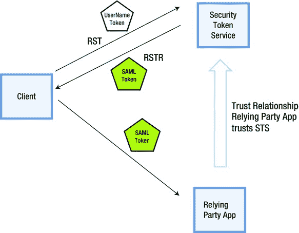
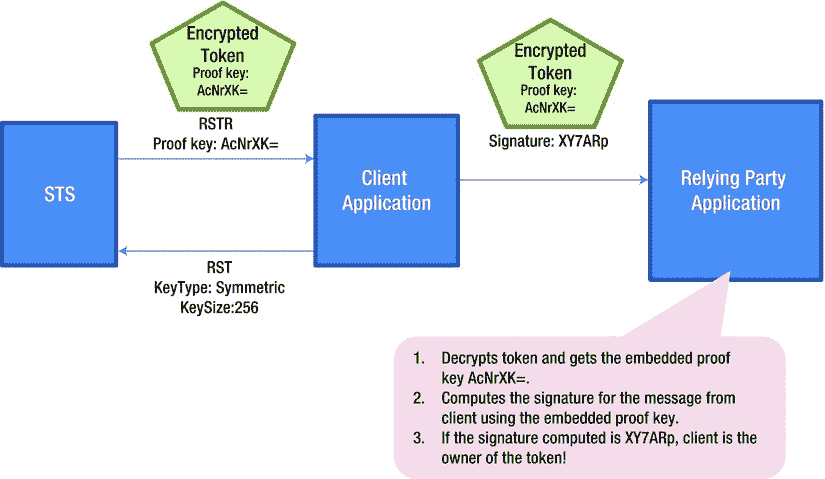
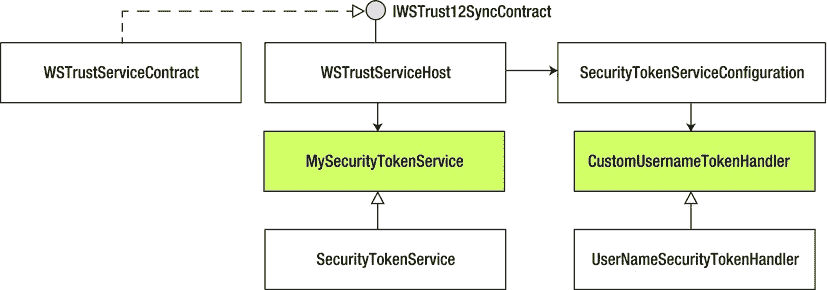

# 七、通过 WIF 自定义 STS

安全令牌服务(STS)是一个发布安全令牌的 web 服务。STS 的概念是在名为 WS-Trust 的 web 服务规范中定义的，该规范规定了必须如何请求和颁发安全令牌。从头开始创建一个 STS 需要相当多的工作。Windows Identity Foundation (WIF)是微软的一个框架，它通过抽象出 WS-Trust 的具体细节，并在构建 STS 时为您提供一个良好的 API 界面，来为您完成所有工作。

在典型的企业中，构建定制 STS 的业务驱动因素非常少，如果有的话。因为 STS 是一个纯粹的安全基础设施，一个典型的企业倾向于将它的 IT 资源集中在提供具有商业价值的 IT 解决方案上，而不是使用那些资源来构建一个生产级的 STS。

从技术角度来看，WS-Trust 定义的机制是基于 SOAP 的。ASP.NET Web API 所在的世界与这些机制无关。即便如此，在这本关于 ASP.NET Web API 的书中涵盖 STS 和 WS-Trust 主题也是值得的。在一个已经投资了基于 STS 的基础设施的企业中，利用现有的投资可能会成为涉及 ASP.NET Web API 的 REST 风格架构的技术要求。这种基于 STS 的基础设施的一个很好的例子是 Active Directory 联合服务(AD FS) 2.0。AD FS 2.0 是 Windows Server 的一部分，是一个使用 Active Directory 作为身份提供者的 STS。AD FS 2.0 颁发安全声明标记语言(SAML)令牌。

在本章中，我将向您展示如何创建一个定制的 STS，这纯粹是从增强您对 STS 和定义它的 WS-Trust 规范的理解的角度出发。创建生产级 STS 超出了本书的范围。在第 9 章中，我将 SAML 令牌作为安全性的所有权因素，我使用相同的自定义 STS 来创建 SAML 令牌供 ASP.NET Web API 使用。

但是，如果您打算创建一个生产级 STS，那么在推出您自己的实现之前，请查看 Thinktecture。身份服务器 v2 ( `https://github.com/thinktecture/Thinktecture.IdentityServer.v2`)。IdentityServer 是用。NET 4.5、MVC 4、Web API 和 WCF。它支持多种协议(WS-Trust 和 OAuth 2.0，WS-Trust 和 OAuth 2.0 分别在第十一章、[十二章](12.html)和[十三章](13.html)中介绍)。IdentityServer 可以创建不同格式(SAML 1.1/2.0，JWT)的令牌，并与 ASP.NET 会员资格、角色和配置文件集成。

从。NET 框架 4.5，WIF 已经完全集成到。NET 框架。因此，这里使用的术语 WIF 仅仅代表。与 WS-Trust 相关的. NET Framework 类。本书中的内容和代码针对。NET 框架 4.5。

WS-Trust

在 XML 和 SOAP 标准的基础上构建了各种 web 服务规范，以解决不同的领域，如安全性、可靠的消息传递和事务。这些规范统称为 WS-* (WS-STAR)。

WS-Security 就是这样一种规范，它是 SOAP 的扩展，用于保护 web 服务。WS-Security 描述了如何将签名和加密头以及安全令牌(包括 X.509 证书和 Kerberos 票据)附加到 SOAP 消息，以确保消息的真实性、完整性和机密性。另一个 WS-*规范 WS-Trust 定义了扩展，这些扩展构建在 WS-Security 之上，为请求、发布和验证安全令牌提供了一个框架。该协议的核心是 STS 和通过请求-响应消息对请求令牌的协议，该消息对由请求安全令牌(RST)和请求安全令牌响应(RSTR )组成。由 STS 发布的安全令牌的格式通常是 SAML 令牌。

信托经纪

**直接认证**是一种常见的安全模式，在这种模式下，客户端直接向服务提供其凭证。客户端和服务之间存在信任关系。在客户端和服务之间建立信任关系是在带外完成的。例如，在使用服务之前，用户向托管服务的实体注册，并使用在此过程中创建的凭据从客户端应用进行身份验证。直接身份验证是一种简单的模式，但是当客户端必须与之交互的服务数量增加时，整个过程就会变得非常复杂。每个服务都必须进行带外注册，并且还必须维护凭证。

**代理认证**，另一方面，是一种引入集中认证的实体的模式。即使在客户端和服务之间没有建立信任，在客户端和中央身份验证代理以及服务和代理之间也会建立信任关系。

如 WS-Trust 规范中所述，STS 构成了信任代理的基础。客户信任 sts。它向 STS 提供凭证并获取一个令牌。依赖方应用也信任 sts。如果客户端提供了它信任的 STS 中的令牌，只要依赖方应用认为该令牌有效，它就会接受该令牌。STS 使代理身份验证成为可能，并且是 WS-Trust 机制中的一个重要部分。[图 7-1](#Fig1) 展示了 WS-Trust 指定的通过 STS 实现的代理认证。



[图 7-1。](#_Fig1)WS-信任

RST 和 RSTR 的请求-响应对

WS-Trust 指定了一个使用 RST 和 RSTR 消息请求和返回安全令牌的框架。RST 提供了从 STS 请求安全令牌的方法。RSTR 包含请求的令牌和其他相关信息。对于 RST，有一个 RSTR，并且在信任消息交换中没有中间步骤。RST 消息体正好包含一个`<RequestSecurityToken>`元素，而 RSTR 消息正好包含一个`<RequestSecurityTokenResponse>`元素。

清单 7-1 有一个简单的 RST，其中一些元素被编辑以提高可读性。它是 XML，正如您在任何 WS-*协议中所期望的那样。`http://schemas.xmlsoap.org/ws/2005/02/trust`的 XML 名称空间表示 WS-Trust 1.2。清单 7-1 中的[所示 RST 的关键要素如下:](#list1)

1.  `<RequestType>`，在本例中为 Issue，表示请求 STS 发布新令牌。
2.  `<UsernameToken>`包含用户凭证。
3.  `<AppliesTo>`指示需要向其颁发令牌的依赖方应用。

[***清单 7-1。***](#_list1) 请求安全令牌(RST)

```cs
<t:RequestSecurityToken
        xmlns:t= http://schemas.xmlsoap.org/ws/2005/02/trust
        xmlns:wsse=" http://docs.oasis-open.org/wss/2004/01/oasis-200401-wss-wssecurity-secext-1.0.xsd "
        xmlns:wsu=" http://docs.oasis-open.org/wss/2004/01/oasis-200401-wss-wssecurity-utility-1.0.xsd ">
        <wsp:AppliesTo xmlns:wsp=" http://schemas.xmlsoap.org/ws/2004/09/policy ">
                <wsa:EndpointReference xmlns:wsa=" http://www.w3.org/2005/08/addressing ">
                        <wsa:Address> http://my-server.com/ </wsa:Address>
                </wsa:EndpointReference>
        </wsp:AppliesTo>
        <t:Base>
                <wsse:UsernameToken wsu:Id="SecurityToken-369f98c0a-234c-1568-abc1-f96512eb2628">
                        <wsse:Username>jqhuman</wsse:Username>
                        <wsse:Password Type="...#PasswordDigest">AC2jkCf6Tu456bufThXKlF=</wsse:Password>
                        <wsse:Nonce>5kMy6oS6yF98vweJPkeofs==</wsse:Nonce>
                        <wsu:Created>2012-10-10T11:03:10Z</wsu:Created>
                </wsse:UsernameToken>
        </t:Base>
        <t:RequestType> http://schemas.xmlsoap.org/ws/2005/02/trust/Issue </t:RequestType>
</t:RequestSecurityToken>
```

在接收到对安全令牌的请求时，STS 验证`<UsernameToken>`元素中的凭证并创建一个令牌(在本例中是 SAML 令牌),然后发回一个 RSTR。清单 7-2 显示了一个典型的响应，为简洁起见进行了编辑。RSTR 的一些关键要素如下:

1.  `<Lifetime>`包含令牌创建时间戳和令牌过期时间的元素。
2.  响应中的元素包含 SAML 令牌，而 SAML 令牌又包含声明和 STS 签名。为了可读性，清单 7-2 中显示的令牌没有加密。
3.  `<TokenType>`是令牌的类型，即 SAML 1.1。
4.  `<RequestType>`，即 Issue，与 request 相同。
5.  `<KeyType>`，对称密钥。
6.  `<RequestProofToken>`包含证明密钥的元素，客户端使用该元素向依赖方应用证明客户端是令牌的合法所有者。换句话说，它用于向依赖方应用证明客户端直接从颁发机构收到了令牌，并且没有窃取或在某个地方找到它！这个元素需要更多的讨论，将在下一小节中深入讨论。

[***清单 7-2。***](#_list2) 【安全令牌响应请求】(RSTR)

```cs
<t:RequestSecurityTokenResponse
     xmlns:t=" http://schemas.xmlsoap.org/ws/2005/02/trust "
     xmlns:wsu=" http://docs.oasis-open.org/wss/2004/01/oasis-200401-wss-wssecurity-utility-1.0.xsd ">
     <t:Lifetime>
          <wsu:Created>2012-10-10T09:39:49.400Z</wsu:Created>
          <wsu:Expires>2012-10-10T10:39:49.400Z</wsu:Expires>
     </t:Lifetime>
     <t:RequestedSecurityToken>
          <!-- SAML Token -->
          <saml:Assertion MajorVersion="1" MinorVersion="1"
               xmlns:saml="urn:oasis:names:tc:SAML:1.0:assertion">
               <saml:AttributeStatement>
                    <saml:Subject>
                         <saml:SubjectConfirmation>
                              <saml:ConfirmationMethod>
                                      urn:oasis:names:tc:SAML:1.0:cm:holder-of-key
                              </saml:ConfirmationMethod>
                              <KeyInfo FontName1">http://www.w3.org/2000/09/xmldsig# ">
                                   <trust:BinarySecret
                                        xmlns:trust=" http://docs.oasis-open.org/ws-sx/ws-trust/200512 ">
                                        AcNrXK+wW9Q0pynB/5uYHprtafX2S2ELbNimapbiygY=
                                   </trust:BinarySecret>
                              </KeyInfo>
                         </saml:SubjectConfirmation>
                    </saml:Subject>
               </saml:AttributeStatement>
               <!-- Rest of SAML Token contents -->
          </saml:Assertion>
     </t:RequestedSecurityToken>
     <t:RequestedProofToken>
          <t:BinarySecret> AcNrXK+wW9Q0pynB/5uYHprtafX2S2ELbNimapbiygY=</ t:BinarySecret>
     </t:RequestedProofToken>
     <t:TokenType>urn:oasis:names:tc:SAML:1.0:assertion</t:TokenType>
     <t:RequestType> http://schemas.xmlsoap.org/ws/2005/02/trust/Issue </t:RequestType>
     <t:KeyType> http://schemas.xmlsoap.org/ws/2005/02/trust/SymmetricKey </t:KeyType>
</t:RequestSecurityTokenResponse>
```

占有证明

STS 在对其凭证进行身份验证后向客户端颁发一个令牌，让客户端将该令牌提供给依赖方应用。除了真实性、完整性和保密性之外，还有所有权方面。证明密钥，或者更正式地说，拥有证明密钥，用于证明令牌所有权。

所有权是关于确保客户端提供给依赖方应用的令牌确实是由 STS 颁发给客户端的。换句话说，出示令牌的客户端是该令牌的合法所有者。基于所有权的考虑，令牌可以分为两类:无记名令牌和密钥持有者令牌。

不记名令牌就像现金一样是:发现者，保管者。一个**密钥持有者令牌** 包含实体的密码材料，该令牌被发给该实体以证明该令牌的所有权。这更像是一张信用卡，上面有你的名字和签名。

为了证明所有权，我使用了我在第 6 章中使用的相同的签名和加密技术；然而，在这一章中，我向你展示了如何使用 proof key 来实现目标的方法是不同的，这个过程有点复杂。

当客户端向 STS 发送 RST 时，请求中的一个元素是`<KeyType>`。为了保持示例请求简单，清单 7-1 中没有显示它。此外，它是一个可选元素。该元素有三个可能的值。

1.  **公钥:** 非对称公钥被用作证明密钥。证明密钥可以来自 X.509 证书，也可以是临时生成的 RSA 公钥。
2.  **对称密钥:** 使用对称密钥作为证明密钥。当请求中未指定密钥类型时，这是默认选项。
3.  **持票人:**没有证明密钥。不记名令牌不包含证明密钥，原因很明显，持有令牌的实体被认为是所有者，不需要证明所有权。当客户端不需要向依赖方应用证明拥有该令牌时，它会要求使用该令牌。

在公钥和对称密钥类型的情况下，STS 返回的 SAML 令牌的主题确认类型为**密钥持有者**、，如[清单 7-2](#list2) 中的粗体所示。对于不记名密钥类型，SAML 令牌具有不记名的主题确认。现在让我们看看如何使用对称证明密钥来建立令牌所有权。以下步骤显示了检查令牌拥有证明的过程。

1.  STS 在为具有对称密钥`<KeyType>`的 RST 创建令牌时，生成一个对称密钥作为证明密钥。客户端可以在 RST 中指定一个`<KeySize>`(以比特为单位),指示需要生成的对称密钥的大小。如果未指定，STS 将生成一个 256 位对称密钥。
2.  STS 将生成的密钥填充到 SAML 令牌中，并用依赖方的公钥加密该令牌。因为客户端无法获得依赖方的私钥，所以客户端不知道 SAML 中的证明密钥。
3.  STS 用其私钥对 SAML 令牌进行签名。
4.  STS 在`<RequestedProofToken>`元素的 RSTR 中包含了证明密钥，如粗体显示的[清单 7-2](#list2) 所示。如您所见，SAML 令牌内的证明密钥和`<RequestedProofToken>`元素中的证明密钥完全相同。非常重要的一点是要明白，客户端不能获得令牌内的密钥。因此，使用对称密钥类型请求的 SAML 令牌必须始终使用依赖方的公钥进行加密。
5.  客户机接收加密和签名的 SAML 令牌和`<RequestedProofToken>`元素。它为依赖方应用创建一个包含 SAML 令牌的新消息，用来自`<RequestedProofToken>`的密钥对该消息进行签名，然后发送它。证明密钥绝不会在消息中发送给依赖方。仅发送带有加密和签名的 SAML 令牌的消息以及客户端使用`<RequestedProofToken>`中的证明密钥创建的签名。
6.  依赖方应用接收消息，并从消息有效负载中检索 SAML 令牌。
7.  依赖方应用使用 STS 的公钥验证 SAML 令牌中的 STS 签名。一旦对 SAML 令牌的完整性和真实性感到满意，它就使用自己的私钥对令牌进行解密，因为 STS 已经用相应的公钥对令牌进行了加密。如果到目前为止没有失败，令牌被认为是可信的。它在中间没有被任何人篡改，并且令牌内容是保密的。
8.  依赖方应用从 SAML 令牌内部获取证明密钥。
9.  依赖方应用使用从 SAML 令牌中检索的这个证明密钥来计算来自客户端的消息的签名。
10.  将如此创建的签名与客户端发送的签名进行比较。如果它们匹配，则向依赖方应用证明提供令牌的客户端应用是令牌的所有者。

[图 7-2](#Fig2) 展示了这个所有权验证的过程。



[图 7-2。](#_Fig2)用于确认令牌所有权的证明密钥

对于非对称密钥，涉及的步骤与前面的步骤类似。然而，主要的区别在于，在非对称密钥的情况下使用的证明密钥是由客户端提供给 STS 的公钥。只有客户端可以访问相应的私钥。STS 创建 SAML 令牌，嵌入公钥而不是我们在前面的场景中看到的对称密钥，并在 RSTR 中发送令牌。客户端用这个令牌向依赖方创建一个消息，并用私钥对其进行签名，私钥对应的公钥就是证明令牌。依赖方应用在接收到 SAML 令牌时，可以使用嵌入在 SAML 令牌中的公钥作为证明密钥来直接验证客户端签名。因为 SAML 令牌内的证明密钥是公钥，所以 SAML 令牌的加密不是强制性的。

WS-FEDERATION

WS-Federation 是另一个 WS-*协议。它扩展了 WS-Trust 以支持跨信任域(通常是组织边界)的身份联合。WS-Federation 为 web 服务(SOAP 客户机)和 web 应用(浏览器)提供了一个执行联合身份操作的通用模型。SOAP 客户端通常能够执行 WS-Trust 所需的复杂加密操作。这样的客户端被定义为**主动客户端**，而不能使用的客户端，比如网络浏览器，被称为**被动客户端**。

WS-Federation 描述了如何使用 HTTP 中可用的机制(GET、POST、重定向、查询字符串、cookies 等。)来请求和获得令牌，将它们发送给依赖方，并且通常处理从 web 浏览器的登录、注销和类似操作。这就是 WS-Federation 广为人知的地方。通过开发人员的普遍使用，术语 WS-Federation 已经与被动情况联系在一起。在本书中，我将重点介绍一个客户端应用使用 WS-Trust 的 RST 和 RSTR 直接从 STS 请求并获取令牌，并将这样获得的 SAML 令牌呈现给 ASP.NET Web API 的依赖方应用。

构建自定义 STS

在这一节中，我将演示如何使用 WIF 类构建一个定制的 STS。我们的 STS 将是一个简单的控制台应用。在高层次上，构建一个定制的 STS 需要对 WIF 提供的抽象类`System.IdentityModel.SecurityTokenService`进行子类化，并使用 Windows 通信基金会(WCF)提供的`ServiceHost`来托管它。下面的步骤展示了如何构建 STS。

1.  创建一个名为`MySecurityTokenService`的`System.IdentityModel.SecurityTokenService`、的子类。在这个子类中，您将覆盖定制 STS 的 `GetScope()`和`GetOutputClaimsIdentity()`方法来发布令牌(在接下来的步骤中详细展示)。要续订、取消或验证令牌，必须覆盖和实现适当的方法。然而，我们只关注令牌发放部分。
2.  As shown in [Listing 7-3](#list3), use the Makecert tool to generate two X.509 certificates to be used with the custom STS: one for STS and one for the relying party application, named MySTS and RP, respectively.

    [***清单 7-3。***](#_list3) 通过 Makecert 生成证书

    ```cs
    makecert.exe -sr LocalMachine -ss My -a sha1 -n CN=MySTS -sky exchange -pe
    makecert.exe -sr LocalMachine -ss My -a sha1 -n CN=RP -sky exchange -pe
    ```

    我们在第 6 章中看到了 STS 和依赖方应用将如何使用这两个证书来加密/解密和签名/验证令牌。STS 使用 CN=RP 的公钥加密令牌，并使用 CN=MySTS 的私钥对令牌进行签名。RP 使用 CN=RP 的私钥解密令牌，并使用 CN=MySTS 的公钥验证令牌签名。因为我在同一台机器上运行 STS、客户机和依赖方应用，所以证书 CN=MySTS 和 CN=RP 在我的机器上都有私钥。在生产场景中，带有私钥的证书将严格由证书颁发给的实体拥有。

3.  In the `MySecurityTokenService` class, override the `GetScope` method, as shown in [Listing 7-4](#list4). `GetScope()` returns the configuration for RST, represented by the `Scope` class. Following are the steps.

    [***清单 7-4。***](#_list4) GetScope 方法

    ```cs
    public class MySecurityTokenService : SecurityTokenService
    {
           public MySecurityTokenService(SecurityTokenServiceConfiguration configuration)
               : base(configuration) { }

           protected override Scope GetScope(ClaimsPrincipal principal, RequestSecurityToken request)
           {
                   if (request.AppliesTo == null)
                           throw new InvalidRequestException("Specify RP in AppliesTo");

                   if (!request.AppliesTo.Uri.Equals(new Uri(" http://my-server.com ")))
                   {
                           Console.WriteLine("Invalid Relying party Address ");
                           throw new InvalidRequestException("Invalid Relying party Address ");
                   }

                   var encryptingCredentials = new X509EncryptingCredentials("CN=RP".ToCertificate());

                   Scope scope = new Scope(request.AppliesTo.Uri.AbsoluteUri,
    SecurityTokenServiceConfiguration.SigningCredentials,
    encryptingCredentials);

                   return scope;
           }

           // GetOutputClaimsIdentity goes here
    }
    ```

    *   a.首先，我对照依赖方应用的硬编码 URI 来验证`AppliesTo`。在本例中，只有一个依赖方，并且该依赖方的 URI 在检查中是硬编码的。
    *   b.我使用证书 CN=RP 创建了一个`X509EncryptingCredentials`的实例，并将其设置在作用域中。因为我们只有一个 RP，所以我只是创建一个新的实例。如果有多个 RP 应用，基于`AppliesTo`，我必须选择正确的证书来加密令牌。注意我在第 6 章的[中创建的扩展方法`ToCertificate`的用法。](06.html)
    *   c.我还将签名凭证传递给`Scope`构造函数，但我是从配置中获取的。这个用于签名的凭证是 STS 本身的凭证，不会因每个请求而改变。因此，我从配置中取出它。
4.  In the `MySecurityTokenService` class, override the `GetOutputClaimsIdentity` method, as shown in [Listing 7-5](#list5). `GetOutputClaimsIdentity()` creates and returns a new `ClaimsIdentity`. In this case, I use the name claim from the incoming principal and add an additional e-mail claim.

    [***清单 7-5。***T5【getoutputclaimidentity】方法](#_list5)

    ```cs
    protected override ClaimsIdentity GetOutputClaimsIdentity(ClaimsPrincipal principal,
    RequestSecurityToken request, Scope scope)
    {
                    string userName = principal.Identity.Name;
    string authenticationType = principal.Identity.AuthenticationType;

                    var outputIdentity = new ClaimsIdentity(authenticationType);

                    Claim nameClaim = new Claim(System.IdentityModel.Claims.ClaimTypes.Name, userName);
                    Claim emailClaim = new Claim(ClaimTypes.Email, userName + "@somewhere.com");

                    outputIdentity.AddClaim(nameClaim);
                    outputIdentity.AddClaim(emailClaim);

                    return outputIdentity;
    }
    ```

5.  Now, the question you might have is where this incoming principal gets the identity and the name claim. As shown in [Listing 7-6](#list6), `CustomUsernameTokenHandler`, which is a subclass of `UserNameSecurityTokenHandler`, performs that function of validating the credentials in the incoming `UserNameSecurityToken` and creating an identity corresponding to the credentials. In this example, I simply check that the user name and password are the same for the credentials to be considered authentic. Create a subclass and override the `CanValidateToken` method, also shown in [Listing 7-6](#list6).

    [***清单 7-6。***](#_list6)CustomUsernameTokenHandler

    ```cs
    public class CustomUsernameTokenHandler : UserNameSecurityTokenHandler
    {
            public override bool CanValidateToken { get { return true; } }

            public override ReadOnlyCollection<ClaimsIdentity> ValidateToken(SecurityToken token)
            {
                    UserNameSecurityToken userNameToken = token as UserNameSecurityToken;

                    if (!userNameToken.UserName.Equals(userNameToken.Password))
                            throw new SecurityTokenValidationException("Invalid credentials");

                    var claim = new Claim(System.IdentityModel.Claims.ClaimTypes.Name,
    userNameToken.UserName);
                    var identity = new ClaimsIdentity(new Claim[] { claim }, "NameToken");

                    return new ReadOnlyCollection<ClaimsIdentity>(
                                                                  new ClaimsIdentity[]
                                                                  {
                                                                          identity
                                                                  });
            }
    }
    ```

6.  I use WCF `ServiceHost` to host our custom STS. Let us first look at the app.config file (see [Listing 7-7](#list7)). There is nothing special here. It’s a configuration any WCF service will have. The key point to note is the service contract implementation. The implementation typically is provided by the developer, but in this example I use the `System.ServiceModel.Security.WSTrustServiceContract` object provided by the .NET Framework 4.5\. For the endpoint contract, I use the `IWSTrust12SyncContract` interface provided by the .NET Framework 4.5\. Message security is configured to be used with the credential type of the username. For service credentials, the CN=MySTS certificate that was generated was specified.

    [***清单 7-7。***](#_list7) 自定义 STS 控制台应用的 App.config 文件

    ```cs
    <?xml version="1.0" encoding="utf-8" ?>
    <configuration>
      <system.serviceModel>
        <services>
          <service name="System .ServiceModel.Security.WSTrustServiceContract "
                 behaviorConfiguration="myStsBehavior">
            <endpoint address=""
                    contract=" System.ServiceModel.Security.IWSTrust13SyncContract "
                    binding="ws2007HttpBinding"
                    bindingConfiguration="myStsBinding"/>
          </service>
        </services>
        <bindings>
          <ws2007HttpBinding>
            <binding name="myStsBinding">
              <security mode="Message">
                <message clientCredentialType="UserName"
                        establishSecurityContext="false"
                        negotiateServiceCredential="true"/>
              </security>
            </binding>
          </ws2007HttpBinding>
        </bindings>
        <behaviors>
          <serviceBehaviors>
            <behavior name="myStsBehavior">
              <serviceCredentials>
                <serviceCertificate findValue="CN=MySTS" storeLocation="LocalMachine"
                        storeName="My" x509FindType="FindBySubjectDistinguishedName"/>
              </serviceCredentials>
            </behavior>
          </serviceBehaviors>
        </behaviors>
      </system.serviceModel>
    </configuration>
    ```

7.  For the purpose of hosting, I use the `WSTrustServiceHost` class in the `System.ServiceModel.Security` namespace. The `WSTrustServiceHost` constructor expects an instance of `SecurityTokenServiceConfiguration`. The `SecurityTokenService` property of the configuration is where the type of our custom STS is set. Just like any self-hosted WCF, once the `Open()` method of the host instance is called, the service is ready to accept requests. In our case, the RST requests through the `IWSTrust12SyncContract` endpoint. [Listing 7-8](#list8) shows the `Main` method, the entry point of the console application we have been building hosting the STS. The logic of the code in the `Main` method can be broken down into the following steps.

    [***清单 7-8。***](#_list8) 主要方法

    ```cs
    class Program
    {
       static void Main(string[] args)
       {
           SigningCredentials signingCreds = new X509SigningCredentials("CN=MySTS".ToCertificate());

           SecurityTokenServiceConfiguration config =
               new SecurityTokenServiceConfiguration(" http://MySTS ", signingCreds);

           config.SecurityTokenHandlers.AddOrReplace(new CustomUsernameTokenHandler());
           config.SecurityTokenService = typeof(MySecurityTokenService);

           // Create the WS-Trust service host with our STS configuration

           var host = new WSTrustServiceHost(config, new Uri(" http://localhost:6000/MySTS "));

           try
           {
               host.Open();
               Console.WriteLine("STS is ready to issue tokens... Press ENTER to shutdown");
               Console.ReadLine();
               host.Close();
           }
           finally
           {
               if (host.State != CommunicationState.Faulted)
                   host.Close();
               else
                   host.Abort();
           }
       }
    }
    ```

    *   a.通过将使用 STS 证书 CN=MySTS 创建的签名凭证传递到`SecurityTokenServiceConfiguration`构造函数中，创建一个类型为`SecurityTokenServiceConfiguration`的对象。传递的内容被设置为由我们的自定义 STS 的`GetScope`方法返回的每个`Scope`对象中的签名凭证。
    *   b.将`CustomUsernameTokenHandler`添加到配置对象的安全令牌处理程序集合中。接下来，将 config 对象的`SecurityTokenService`属性设置为自定义 STS 的类型。到目前为止，所有的单个作品都是用`Main`的方法组合在一起的。
    *   c.最后，创建一个传递这个 config 对象的主机实例，并调用`Open()`。STS 现在准备发行令牌！

[图 7-3](#Fig3) 显示了创建自定义 STS 所涉及的类。`MySecurityTokenService`和`CustomUsernameTokenHandler`是我们通过子类化 WIF 类创建的类。其他类按 WIF 原样使用。



[图 7-3。](#_Fig3)自定义 STS 类

向自定义 STS 请求令牌

在 WCF 的 soapy 世界中，配置为使用`ws2007FederationHttpBinding`的端点可以无缝地使用我们的定制 STS。几乎完全通过配置和几个支持类，WCF 服务可以在生成客户端代理时向客户端发送元数据，指示客户端如何从它信任的 STS 获取令牌。在将服务引用添加到此 WCF 服务时，客户端配置文件会使用所有必要的信息进行更新。但是我们生活在那个世界之外！

不用担心，通过一些标准的 C# 代码与我们的 STS 对话并让它发布一个令牌是非常容易的。以下步骤显示了如何完成这项任务。

1.  Create `WS2007HttpBinding` with message security. Of course, transport security can be used, but it involves HTTPS and hence more complexity in terms of the setup. I just use message security using user name client credentials, as shown in [Listing 7-9](#list9).

    [***清单 7-9。***](#_list9) 与消息安全绑定

    ```cs
    private static string GetToken()
    {
        var binding = new WS2007HttpBinding(SecurityMode.Message);

        binding.Security.Message.ClientCredentialType = MessageCredentialType.UserName;
        binding.Security.Message.NegotiateServiceCredential = true;
        binding.Security.Message.EstablishSecurityContext = false;

        // Rest of the code is covered in the following steps

    }
    ```

2.  Create an endpoint address with that of STS. Note that I use a certificate generated through Makecert, and I give a name that is not in line with the domain name of the STS address. So, I have to explicitly specify the DNS name to match the subject name of the STS certificate, as shown in [Listing 7-10](#list10).

    [***清单 7-10。***](#_list10) 端点创建

    ```cs
    var address = new EndpointAddress(new Uri(@" http://localhost:6000/MySTS "),
                                                        new DnsEndpointIdentity("MySTS"));
    ```

3.  Using the binding and the endpoint address, create a `WSTrustChannelFactory` instance and set the user credentials here, as shown in [Listing 7-11](#list11).

    [***清单 7-11。***](#_list11) 渠道工厂创建

    ```cs
    WSTrustChannelFactory factory = new WSTrustChannelFactory(binding, address);
    factory.TrustVersion = TrustVersion.WSTrust13;

    factory.Credentials.ServiceCertificate
            .Authentication.CertificateValidationMode = X509CertificateValidationMode.None;

    factory.Credentials.ServiceCertificate.Authentication.RevocationMode = X509RevocationMode.NoCheck;
    factory.Credentials.UserName.UserName = "jqhuman";
    factory.Credentials.UserName.Password = "jqhuman"; // got to be same as user name in our example
    ```

4.  As shown in [Listing 7-12](#list12), request the factory to create a channel for us and call the `Issue` method on the channel, passing in the RST. That returns our SAML token.

    [***清单 7-12。***](#_list12) 请求令牌

    ```cs
    WSTrustChannel channel = (WSTrustChannel)factory.CreateChannel();

    var request = new RequestSecurityToken(System.IdentityModel.Protocols.WSTrust.RequestTypes.Issue)
    {
        AppliesTo = new EndpointReference(" http://my-server.com ")
    };

    RequestSecurityTokenResponse response = null;
    var token = channel.Issue(request, out response) as GenericXmlSecurityToken;

    return token.TokenXml.OuterXml;
    ```

这样返回的令牌是一个 SAML 令牌。它只是字符串形式的 XML，可以与任何。NET 框架应用，包括 ASP.NET Web API。不幸的是，令牌都是加密的，很难让我们满意，但这没关系。我们将在第 9 章的[中看到，当我们将这个 SAML 令牌与 ASP.NET Web API 一起使用时，如何从这个加密的 blob 中提取声明。](09.html)

 **注意**客户端应用可以使用如下代码检索证明令牌:`response.RequestedProofToken.ProtectedKey.GetKeyBytes()`。在《T4》第 9 章中，我们使用证明密钥来验证令牌所有权。

摘要

在 XML 和 SOAP 标准的基础上构建了各种 web 服务规范，统称为 WS-*。WS-Security 就是这样一种规范，它是 SOAP 的扩展，用于保护 web 服务。WS-Trust 是另一个 WS-*规范，它定义了基于 WS-Security 的扩展，为请求、发布和验证安全令牌提供了一个框架。该协议的核心是 STS 和通过 RST 和 RSTR 的请求-响应消息对请求令牌的协议。

从头开始创建一个 STS 需要相当多的工作。WIF 是微软的一个框架，它通过抽象 WS-Trust 的具体细节为你做了所有的工作，并为你提供了帮助创建 STS 的类。使用 WIF 类创建 STS 有两个主要步骤:

1.  创建`System.IdentityModel.SecurityTokenService`的子类，覆盖`GetScope()`和`GetOutputClaimsIdentity()`方法。
2.  用托管 STS。NET Framework `System.ServiceModel.Security.WSTrustServiceContract`类作为服务契约实现，`IWSTrust12SyncContract`的接口作为端点契约。

我在本章中演示了 STS 的创建，以帮助您理解 STS 和 WS-Trust 规范。我在第 9 章中使用了我在这里创建的 STS，在这里我们看到了从 ASP.NET Web API 消费 SAML 令牌。已经投资了基于 STS 的基础设施(如 AD FS 2.0)的组织就是这种情况，在这种情况下，利用这样一个现有的基础设施将成为包括 ASP.NET Web API 的 REST 风格架构的一项技术要求。