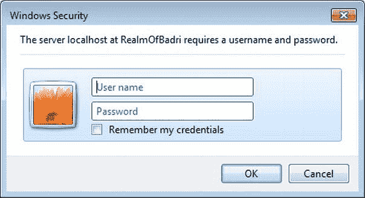

# 八、知识因素

在第 5 章中，我介绍了安全性的关键和基本方面之一:认证。身份验证是发现用户身份并通过向权威机构验证用户提供的凭据来验证用户身份的过程。凭证可以是基于用户所知道的内容的知识因素，如密码，或者是基于用户所拥有的内容的所有权因素，如安全令牌，或者是基于用户身份的固有因素，如指纹。本章的重点是知识因素。

RESTful 服务，例如使用 ASP.NET Web API 创建的服务，在身份验证机制的设计方面有独特的考虑。在 web 应用中，当用户开始使用应用时，就会进行身份验证。在随后建立的会话期间，不会再次对用户进行身份验证。REST 约束之一——我们在第 2 章中看到的无状态约束——禁止服务器上的任何客户端状态数据。这意味着在 RESTful 服务的每个服务调用中都需要进行身份验证。

在直接身份验证模式中，客户端信任服务，因此直接向服务提供凭据，凭据(如密码(或基于密码的哈希)将在每个请求中发送。在这个领域，HTTP 身份验证方案占主导地位。征求意见稿(RFC)2617“HTTP 认证:基本和摘要式访问认证”提供了 HTTP 认证框架的规范，最初的 **基本访问认证**方案，以及基于加密哈希的方案，称为 **摘要式访问认证**。基本身份验证方案基于这样一种模型，即客户端必须使用用户 ID 和密码对自己进行身份验证。与基本身份验证不同，在摘要式身份验证中，密码验证是通过根据密码创建的摘要或哈希来完成的。在本章中，我将深入介绍基本认证和摘要式认证。

在代理身份验证模式的情况下，我们在第 7 章中看到的 STS 这样的代理向客户端应用发出令牌，令牌在每个请求中都被发送。在这个领域，安全令牌占据主导地位。在[第五章](05.html)中，我们研究了三种主要格式——安全断言标记语言(SAML)、简单 Web 令牌(SWT)和 JSON Web 令牌(JWT)。我在第 9 章的[中深入讨论了 SAML，在第 10 章](09.html)的[中讨论了 web 令牌。在本章中，](10.html)我们来看一下 **Windows 身份验证**，这是一种使用微软 IIS 和 Internet Explorer 技术堆栈的方案，它使用 Kerberos/NTLM 协议，根据 Active Directory (AD)来验证用户的 Windows 帐户凭证。T13】

基本认证

基本身份验证是 HTTP 规范的一部分。顾名思义，这是一个基本或简单的方案，工作原理如下。

1.  客户端请求服务器中的资源。
2.  如果资源要求对客户端进行身份验证，服务器会在响应中发回一个 401 -未授权的状态码和响应头 **WWW-Authenticate: Basic** 。这个响应头还可以包含一个 realm，它是一个字符串，唯一地标识服务器中的一个区域，服务器需要一个有效的凭证来成功地处理该请求。
3.  客户端现在发送包含凭证的授权头**Authorization:Basic ymfkcmk 6 u 2 vjcmv 0 u 2 f1 y2 u =**。授权请求头值只是一个 base64 编码的用户 ID 和密码字符串，中间用冒号分隔，没有以任何方式加密。
4.  如果凭证有效，服务器发回响应和 200 - OK 状态码，如图[图 8-1](#Fig1) 所示。


[图 8-1。](#_Fig1)基本认证

在 ASP.NET Web API 中实现基本认证

当您开始实现基本身份验证时，您可能想知道在哪里实现返回 HTTP 状态代码、响应头和实际身份验证逻辑的逻辑。正如我们在第 3 章中看到的，有一些选项可用。最值得注意的是，您可以编写一个过滤器，它可能是一个定制的授权过滤器，或者您可以编写一个消息处理程序。

我们还在第 3 章中看到，与消息处理程序相比，过滤器在 ASP.NET Web API 管道中运行得更晚。因为基本身份验证建立身份，所以在管道中尽早建立身份是一个好的做法，这样可以对请求进行身份验证，并尽快拒绝不良或恶意的请求。

消息处理程序为每个请求运行，过滤器可以有选择地用于所需的操作方法。如果您的 web API 只要求对少数动作方法进行认证，那么过滤器就更有意义。然而，在大多数情况下，web API 会对大多数(如果不是全部)请求实施身份验证。对于这些情况，最好使用消息处理程序。

在本章中，我使用一个消息处理程序来执行认证。只有在授权请求标头中提供了凭据时，我们才进行身份验证。认证过程的输出是将`Thread.CurrentPrincipal`设置为一个带有已认证`ClaimsIdentity`的`ClaimsPrincipal`实例。我们将使用现成的`Authorize`过滤器来修饰我们想要强制认证的动作方法。

当调用带有 `Authorize`过滤器的动作方法而没有在请求中设置授权头时，消息处理程序不会设置`Thread.CurrentPrincipal`，因此`Authorize`过滤器将返回 401 -未授权响应。消息处理程序还必须做一些清理工作，因为过滤器没有设置 WWW-Authenticate 响应头。因此，我们的消息处理程序必须寻找 401 状态并添加响应头，向客户端指示基本方案。有了这个设计，让我们开始编写消息处理程序。我在[清单 8-1](#list1) 中给你展示了一个模板。

***[清单 8-1。](#_list1)*** 基本认证消息处理程序

```cs
public class AuthenticationHandler : DelegatingHandler
{
    private const string SCHEME = "Basic";

    protected async override Task<HttpResponseMessage> SendAsync(HttpRequestMessage request,
CancellationToken cancellationToken)
    {
        try
        {
            // Perform request processing here

            var response = await base.SendAsync(request, cancellationToken);

            // Perform response processing here

            return response;
        }
        catch (Exception)
        {
            // Perform error processing here
        }
    }
}
```

我们现在将代码添加到前面清单中的三个适当位置，以处理请求、响应和错误。T2】

1.  **Request processing:** Retrieve the user ID and password from the HTTP Authorization header and perform the authentication, as shown in [Listing 8-2](#list2). Following are the steps:

    ***[清单 8-2。](#_list2)*** 请求处理

    ```cs
    var headers = request.Headers;
    if (headers.Authorization != null && SCHEME.Equals(headers.Authorization.Scheme))
    {
           Encoding encoding = Encoding.GetEncoding("iso-8859-1");

           string credentials = encoding.GetString(Convert.FromBase64String(
                                                           headers.Authorization.Parameter));
           string[] parts = credentials.Split(':');
           string userId = parts[0].Trim();
           string password = parts[1].Trim();

           // TODO - Do authentication of userId and password against your credentials store here
           if (true)
           {
                   var claims = new List<Claim>
                   {
                           new Claim(ClaimTypes.Name, userId),
                           new Claim(ClaimTypes.AuthenticationMethod, AuthenticationMethods.Password)
                   };
                   var principal = new ClaimsPrincipal(
                                       new[] { new ClaimsIdentity(claims, SCHEME) });

                   Thread.CurrentPrincipal = principal;

                    if (HttpContext.Current != null)
                        HttpContext.Current.User = principal;
           }
    }
    ```

    *   a.如果 HTTP 授权请求标头存在，则获取该标头的有效负载。
    *   b.用分号分隔有效负载，将修剪后的第一部分作为用户 ID，将修剪后的第二部分作为密码。
    *   c.执行实际的身份验证。为了简洁起见，我在清单 8-2 中跳过了这一部分。在这里，您将向权威机构(如会员商店)验证凭证。
    *   d.收集声明，创建一个主体，并将其设置在`Thread.CurrentPrincipal`中。如果您是 web 主机，您还必须在`HttpContext.Current.User`中设置主体。
2.  **Response processing:**Check if the HTTP status code is 401 Unauthorized; if so, add the corresponding WWW-Authenticate header, as shown in [Listing 8-3](#list3). Per the HTTP specification, when a 401 status code is sent back to the client, the response must include the WWW-Authenticate header specifying the schemes the server supports for the client to authenticate itself. We accomplish the same as part of this step.

    ***[清单 8-3。](#_list3)*** 响应处理

    ```cs
    if (response.StatusCode == HttpStatusCode.Unauthorized)
    {
            response.Headers.WwwAuthenticate.Add(
                                new AuthenticationHeaderValue(SCHEME));
    }
    ```

3.  **Error processing:** If there is any exception in the message handler flow, set the status code to 401 Unauthorized and set the WWW-Authenticate header, just as in the previous step, and return the response short-circuiting the pipeline. See [Listing 8-4](#list4).

    ***[清单 8-4。](#_list4)*** 错误处理

    ```cs
    var response = request.CreateResponse(HttpStatusCode.Unauthorized);
    response.Headers.WwwAuthenticate.Add(new AuthenticationHeaderValue(SCHEME));

    return response;
    ```

 **注意**使用`ClaimsIdentity`并不是实现基本认证的强制要求，但从更干净的设计角度来看，强烈建议使用。使用`ClaimsAuthenticationManager`添加附加声明和使用`ClaimsAuthorizationManager`进行访问控制在[第 5 章](05.html)中介绍。

前面的代码是一个很好的例子，展示了消息处理程序的强大功能。HTTP 状态代码可以被管道中的任何组件设置为 401，包括`Authorize`过滤器。通过将`AuthenticationHandler`注册为在`HttpServer`之后执行的第一个处理程序，我们有机会尽可能晚地检查响应并添加必要的 WWW-Authenticate 头。

为了演示消息处理程序完全停止管道处理的能力，您可以丢弃到目前为止已经创建的任何响应，并发送一个新的响应。我正在捕捉这个异常，并用 401 未授权状态代码开始一个新的响应。当然，我也在这里设置了 WWW-Authenticate 响应头，以符合 HTTP 规范。开始一个新的响应不需要只发生在 catch 块内部。根据需要，在处理请求或响应的任何时候都可以这样做。

最后，`AuthenticationHandler`必须在 App_Start 文件夹下的 WebApiConfig 文件中注册，如清单 8-5 中的[所示。该处理程序注册为全路由处理程序，这对于处理身份验证的处理程序更有意义，因为身份验证通常是所有路由的一个公共方面。](#list5)

***[清单 8-5。](#_list5)*** 委托办理人注册

```cs
public static class WebApiConfig
{
    public static void Register(HttpConfiguration config)
    {
        config.Routes.MapHttpRoute(
            name: "DefaultApi",
            routeTemplate: "api/{controller}/{id}",
            defaults: new { id = RouteParameter.Optional }
        );

        config.MessageHandlers.Add(new AuthenticationHandler());
    }
}
```

 **注意**理解应用中委托处理程序的运行顺序很重要。该序列基于您如何在 Global.asax.cs 中配置处理程序。处理认证的处理程序通常在`HttpServer`之后立即运行，因为这是建立身份的地方。因此，这个处理程序必须是第一个处理程序，即使您必须在应用中注册多个处理程序。

这样，我们现在就有了一个基础设施来强制规定只有经过身份验证的用户才能发出特定的请求。当然，如果需要对所有请求强制执行经过身份验证的用户，这可以在处理程序本身中轻松完成。

因为我们决定有选择地实施，我们将使用现成的`Authorize`过滤器，如清单 8-6 中的[所示。我们使用过滤器而不指定任何角色。因此，它将只确保身份是经过验证的身份。`Authorize`过滤器也可以在控制器级别。另一点需要注意的是，可以子类化`Authorize`过滤器并添加更多功能，如第 3 章](#list6)中的[所述。](03.html)

***[清单 8-6。](#_list6)*** 授权过滤

```cs
public class EmployeesController : ApiController
{
    [Authorize]
    public Employee Get(int id)
    {
        return new Employee()
        {
            Id = id,
            Name = "John Q Human"
        };
    }

    [Authorize]
    public Employee Post(Employee human)
    {
        human.Id = 12345;
        return human;
    }
}
```

测试基本认证

我们可以编写一个简单的 C# 程序来测试实现基本身份验证的 ASP.NET Web API。我们只需要准备一个由冒号分隔的 base64 编码的用户 ID 和密码字符串，并在向 web API 发出请求之前放入 Authorize 请求头，如清单 8-7 所示。我们在这个例子中使用`System.Net.Http.HttpClient`。

***[清单 8-7。](#_list7)*** 通过 C# 客户端测试基本认证

```cs
class Program
{
    static void Main(string[] args)
    {
        // Testing Basic Authentication
        using (HttpClient client = new HttpClient())
        {
            string creds = String.Format("{0}:{1}", "badri", "badri");
            byte[] bytes = Encoding.ASCII.GetBytes(creds);
            var header = new AuthenticationHeaderValue("Basic", Convert.ToBase64String(bytes));
            client.DefaultRequestHeaders.Authorization = header;

            var postData = new List<KeyValuePair<string, string>>();
            postData.Add(new KeyValuePair<string, string>("Name", "John Q Human"));

            HttpContent content = new FormUrlEncodedContent(postData);

            string response = String.Empty;
            var responseMessage = client.PostAsync(" http://localhost:29724/api/employees/12345 ", content)
                                    .Result;

            if(responseMessage.IsSuccessStatusCode)
                response = responseMessage.Content.ReadAsStringAsync().Result;
        }
    }
}
```

我将传递该清单中的用户凭证。如果您事先知道该服务支持基本身份验证，则可以主动传递凭证。或者可以根据 401 未授权响应的 WWW-Authenticate 报头中指定的支持方案，被动地将凭证发送给服务。因为基本身份验证是 HTTP 标准，所以 web 浏览器知道如何打包 Authorize 头，并在收到 401 Unauthorized 时将其放入请求中。当浏览器(如 Internet Explorer)向我们的 web API 发出请求时，它首先得到一个带有 WWW-Authenticate: Basic 头的 401 响应。

没有人比网络浏览器更了解 HTTP！web 浏览器现在知道它必须使用基本认证方案在 HTTP 请求头中发送凭证。首先，网页浏览器弹出一个对话框，如图[图 8-2](#Fig2) 所示。


[图 8-2。](#_Fig2)浏览器对话框框进行基本认证

接下来，web 浏览器获取凭证，以正确的格式将其打包，并将其发送给 web API。因为在我的例子中我没有使用 HTTPS，所以 web 浏览器警告说用户名和密码将以不安全的方式发送。

WWW-Authenticate 标头不包含领域，Internet Explorer 在其位置显示 null。如果我继续，输入凭证并单击 OK，它将提交凭证，我们的消息处理程序将获得预期格式的凭证。无需编写一行代码，我们就可以使用浏览器作为测试工具。

基本认证的优缺点

基本身份验证的最大优点是简单。这可能是保护 ASP.NET Web API 最简单、最轻量级的方法。没什么特别要求。不需要散列、加密或任何复杂的东西。基本身份验证只需要将 base64 编码的值放入标准 HTTP 请求头中。

基本身份验证的另一个优点是它是一个标准的 HTTP 方案。HTTP 标准对你能想象到的任何平台上的设备和客户端都有很大的帮助。

另一方面，对于大多数生产场景来说，这太简单了。首先，它需要传输安全性，以确保传输的凭证不会暴露给那些怀有恶意的人。这意味着使用服务的客户端必须能够使用 HTTPS 进行通信。尽管这种方案降低了消息的复杂性，但增加了传输的复杂性。

幸运的是，HTTPS 是一个标准。能够通过一些底层的帮助机制处理传输中的复杂性，但是不能处理诸如散列、加密和签名之类的加密事情的客户端可以自己利用这个方案。

基本身份验证的最大缺点是，在您关闭浏览器之前，浏览器会缓存凭据。如果您向已经通过身份验证的 URI 发出请求，浏览器会在 Authorize 标头中发送凭据，从而使其容易受到跨站点请求伪造(CSRF)攻击。阅读第 15 章的[CSRF 部分了解更多详情。](15.html)

 **注意**不要使用没有 SSL/TLS 的基本认证。HTTPS 是这个计划的一个必须，没有它，任何人都可以嗅探流量并获得凭证。

摘要式认证

摘要式身份验证是 HTTP 规范的一部分，就像基本身份验证一样。与基本身份验证不同，摘要式身份验证与普通 HTTP 一起使用相对更安全。关于摘要式身份验证，需要注意的重要一点是，实际的密码不会发送到服务器。仅发送 MD5 散列或摘要。

技术选择都是关于取舍的。天下没有免费的午餐！摘要式身份验证将传输复杂性转移到了消息上。与基本身份验证不同，摘要式身份验证更复杂，并且需要客户端和最终用户的支持，以使该方案有效工作。客户端需要为每个请求增加一个 nonce 计数器，以防止重放攻击。这意味着客户端需要跟踪发出的请求。此外，客户端需要有能力创建 MD5 散列。最后，整个方案的有效性取决于用户选择的密码的强度。

螺母和螺栓

摘要式身份验证稍微复杂一些。在下面的步骤中，我将向您展示摘要式身份验证过程。这将为您了解实现摘要式身份验证所需的细节做好准备，这对于我们大多数人来说是非常困难的！

1.  Server responds with a 401 Unauthorized response on finding that the credentials are invalid or missing, as shown in [Listing 8-8](#list8).

    ***[清单 8-8。](#_list8)*** 越权响应

    ```cs
    HTTP/1.1 401 Unauthorized
    WWW-Authenticate: Digest realm="RealmOfBadri", nonce="dcd98b7102dd2f0e8b11d0f600bfb0c093", qop="auth"
    ```

2.  在 WWW-Authenticate 报头中，服务器指示所涉及的方案，即摘要方案，并发送一个随机生成的数字，称为 nonce。随机数是使用一次的数字。它不完全是用了就扔。相同的 nonce 在后续请求中传递，直到 nonce 过期。此时，服务器发回一个 401 响应和一个新的随机数。设置随机数的到期时间是为了防止重放攻击。但是，恶意用户有可能在过期时间内获取并发送随机数。例如，如果过期时间是一分钟，恶意用户可以在该分钟内发送随机数，服务器将接受该随机数。幸运的是，有其他机制来防止这些攻击。主要的一点是，一个有明确生存期的随机数比一个永远有效的随机数要好。出于这个例子的目的，假设随机数是**DCD 98 b 7102 D2 f 0e 8 b 11d 0f 600 BF B0 c 093**。
3.  除了随机数之外，发送的另一个参数是保护质量(QOP)值。我之前提到过，散列或摘要被发送到服务器。QOP 基本上是烹饪杂烩的食谱。它决定了如何组合和散列其他参数以获得最终的摘要值。我将讨论限制在“ **auth** ”上，这仅表示身份验证。另一个值是“ **auth-int** ”，表示具有完整性保护的认证。
4.  当 QOP 值为“auth”时，客户端随机数 **cnonce** 和客户端随机数计数器 **nc** 出现。就像由服务器发送给客户端的服务器随机数一样，cnonce 是由客户端生成并发送给服务器的随机数。nc 是通常以 00000001 开始的计数器。来自同一客户端的下一个请求将具有相同的服务器随机数和客户端随机数，但是现在 nc 将是 00000002。它不需要总是递增 1，但是它必须大于前一个 nc。
5.  在接收到 WWW-Authenticate 报头时，客户端根据 QOP 值知道它必须如何创建散列。因为在我们的例子中它是“auth”，所以它生成一个 cnonce，比如说**0 a4 f13 b**。第一次使用了 **00000001** 的 nc。对于“auth”的 QOP，通过以下步骤计算散列。为了简洁起见，此图中的哈希值都被截断了。
    *   a.计算`username:realm:password`的 MD5 哈希。例如:字符串`jqhuman:RealmOfBadri:abracadabra`的 MD5 散列。姑且称之为 HA1，说它是 **aa71f01f351** 。
    *   b.计算`method:uri`的 MD5 哈希。例如:字符串`GET:/api/employees`的 MD5 散列。姑且称之为 HA2，说它是 **939e7552ac** 。
    *   c.计算`HA1:nonce:nc:cnonce:qop:HA2`的 MD5 哈希。比如说，`aa71f01f351:dcd98b7102dd2f0e8b11d0f600bfb0c093:0a4f113b:auth:939e7552ac`的哈希是**6629 FAE 49393 a 05397450978507 c4ef 1**。
6.  The final MD5 hash or the digest calculated in Step 5c is sent by the client in the response field of the authorization header, as shown in [Listing 8-9](#list9).

    ***[清单 8-9。](#_list9)*** 摘要标题

    ```cs
    Authorization: Digest username="jqhuman", realm="RealmOfBadri", nonce="dcd98b7102dd2f0e8b11d0f600bfb0c093", uri="/api/employees", qop=auth, nc=00000001, cnonce="0a4f113b", response="6629fae49393a05397450978507c4ef1"
    ```

7.  The server receives all these values and gets the user name from the request header value. It pulls up the password for this user name from the credentials store. The server then proceeds to cook up the MD5 digest by itself, exactly along the same lines of how the client created it, using the same exact ingredients or the values through the same exact well-known recipe. If the client has put in the right password or, in other words, used the authentic credentials, the digest cooked up and sent by the client must exactly match the digest the server has just cooked up. If the incoming digest and generated digest are the same, the user is deemed an authentic user. That is the essence of digest authentication, as illustrated in [Figure 8-3](#Fig3).

    

    [图 8-3。](#_Fig3)摘要认证

 **注意**基本认证绝对需要传输安全。摘要式身份验证不需要传输安全性——主要是！这里有一句忠告。尽管根本没有发送密码，只发送了一个摘要，但是用户名确实在请求头中以纯文本形式发送，正如您在[清单 8-9](#list9) 中看到的。对于恶意用户知道用户名就等于失败了一半或者更糟的情况，基于普通 HTTP 的摘要式身份验证可能并不合适。

安全防御

摘要式身份验证设计用于在没有 HTTPS 保护的开放环境中生存。由于这个原因，在 HTTP 上运行的受摘要认证保护的服务是中间人(MITM)攻击的好目标。MITM 是一种主动窃听的形式，攻击者与受害者保持两个独立的连接，并在他们之间传递消息，使他们相信他们正在直接交谈。在这种情况下，攻击者可以将消息从一个受害者传递到另一个受害者，根据自己的喜好对其进行篡改，或者用自己的消息完全替换原始消息，并完全控制消息的交换。

为了抵消 MITM 威胁，在摘要式身份验证方案中内置了几项检查。在接收到清单 8-9 中[所示的授权头时，服务器运行以下检查。](#list9)

1.  第一个也是最基本的验证是通过查看服务器维护的随机数存储来检查随机数是否是服务器在最近生成的。
2.  如果随机数存在于存储中，则它对照随机数存储中存储的到期日期来检查随机数的新鲜度。如果 nonce 已经过期，服务器会立即发回 401 和一个新的 nonce，供客户端再次重新启动摘要式身份验证过程。
3.  如果随机数是新的，则服务器获取它上次接收到的对应于该服务器随机数的 nc，该 NC 也存储在随机数存储中，与服务器随机数相对应。如果这个请求中的 nc 小于或等于它在记录中的值，那么这个请求将被 401 拒绝。
4.  如果没有，服务器从某个地方(比如数据库)获取用户(在本例中是 jqhuman)的密码，并按照我们在上一节中看到的三个步骤计算 MD5 散列。
5.  如果客户端发送了正确的密码，服务器刚刚计算的 MD5 哈希将与客户端在响应字段中发送的哈希完全匹配。如果有任何差异，哈希将不匹配，服务器会再次用 401 拒绝请求。

假设恶意用户的密码原型 Mallory 从[清单 8-9](#list9) 中获得了摘要头。这里列出了 Mallory 拥有的选项和 digest 机制拥有的相应防御。

1.  第一个也是最重要的选择是让 Mallory 重放旧的请求。如果服务器随机数到期时间到了，服务器将拒绝请求并发送一个新的随机数。Mallory 不能使用新的 nonce 来创建有效的请求，因为她不知道密码。
2.  到期前，Mallory 必须使用大于当前值的客户端计数器。添加一个新的更容易，但是这个值是 MD5 摘要的一部分。因此，如果不知道密码，就无法正确计算散列值，服务器将拒绝该请求。
3.  Mallory 可以通过向客户端提供她喜欢的服务器随机数来发起选择的纯文本攻击，以使密码分析更容易，但是客户端随机数是由客户端随机生成的，因此它允许客户端以攻击者无法确定的方式改变散列过程的输入。因此，客户端随机数和计数器的目的是防止重放和选择的纯文本攻击。
4.  马洛里最后的选择是使用蛮力攻击；也就是说，做服务器所做的事情，按照以下三个步骤计算 MD5 散列。当然，口令是不可用的，但是通过一个接一个地使用口令，Mallory 可以计算散列并将其与报头的响应字段中的值进行比较来猜测口令。首先，马洛里尝试所有的单个字母，然后组合。如果哈希匹配任何组合，那就是密码。这种技术被称为暴力攻击。字典也可以用来猜测密码，因为大多数时候人类更喜欢用单词或单词序列作为密码。当然，如果用户使用大小写字母、数字和特殊字符的组合，密码会更强。苹果的一个密码相比 [P0larbe@RinDFr 都可以轻易破解！dg](mailto:P0larbe@RinDFr!dg) 3。即便如此，一个有决心有资源的黑客也能猜出密码。确切地说，密码是最薄弱的一环。因此，摘要式身份验证不是绝对可靠的，但它是比 HTTP 上的基本身份验证更好的替代方法。

 **注意**从纯粹无状态的角度来看，摘要认证是否适合用于基于 REST 的服务取决于设计者的 REST 关联。首先，服务必须跟踪它生成的服务器随机数。更糟糕的是，它必须跟踪客户机最后使用的 nonce 计数器，以防止重放攻击。

实施摘要式认证

与基本认证类似，我们将使用消息处理程序`AuthenticationHandler`通过 ASP.NET Web API 实现摘要认证，因为它在 ASP.NET Web API 管道中运行较早，并且是实现认证逻辑的合适位置。让认证逻辑在管道中尽可能早地运行是一个很好的实践，以便尽快拒绝不良请求。实现中涉及到四个类。[表 8-1](#Tab1) 提供了对这些类的快速介绍。

[表 8-1。](#_Tab1)摘要式认证实现中的类

| 班级 | 目的 |
| --- | --- |
| `AuthenticationHandler` | 实现身份验证逻辑的消息处理程序。它使用`Header`类读取 Authorize 请求头，并通过使用`Nonce`类生成 nonce 来设置 WWW-Authenticate 响应头。 |
| `Header` | 摘要式身份验证中 HTTP Authorize 请求标头的 CLR 表示形式。通过将 Authorize 头有效载荷传递给构造函数，可以创建一个新的`Header`对象。通过调用`ToString`方法，可以将一个`Header`实例序列化回授权头有效负载。 |
| `Nonce` | 可以生成随机数并验证客户端发送的随机数的类。 |
| `HashHelper` | byte[]类型的扩展，创建相应 MD5 散列的字节数组。 |

实施概述

在[表 8-1](#Tab1) 中列出的类中的不同方法在认证过程的不同时间点被调用。在我们开始实现之前，让我们看一下展示不同步骤功能的序列概述。

1.  客户端发送一个没有授权头的请求。
2.  `AuthenticationHandler`作为请求处理的一部分，检查请求的授权头。因为它不存在，所以它不能建立一个经过验证的身份。
3.  因为`ApiController`的动作方法是用`Authorize`属性修饰的，所以它检查所建立的身份是否是经过认证的身份。如果不是这样，`Authorize`属性将响应状态代码设置为 401——未授权，并中断操作方法的执行。
4.  `AuthenticationHandler`作为响应处理的一部分，检查响应状态代码。因为它是 401，所以它继续设置 WWW-Authenticate 响应报头。
5.  `AuthenticationHandler`调用`Nonce.Generate()`来创建一个新的随机数。与 QOP 和领域一起，它在 WWW-Authenticate 响应头中设置 nonce。
6.  客户端从 WWW-Authenticate 头中读取服务器随机数，并使用包含所有必要字段的授权头重新提交请求。
7.  `AuthenticationHandler`作为请求处理的一部分，检查请求的授权头。这次它找到了标题。消息处理程序通过传入 authorize 头有效载荷来创建一个`Header`类的实例。
8.  `AuthenticationHandler`继续请求处理，调用`Nonce.IsValid()`，通过`Header`对象传入从授权头中检索到的随机数值和随机数计数器。如果 nonce 有效，处理程序将计算 MD5 哈希，并将其与客户端发送的哈希进行比较。如果匹配，处理程序创建一个主体并将其设置在`Thread.CurrentPrincipal`中。

实施细节

最后，您可以看到一些代码！流动触及不同类别的不同点。按照流程顺序，我只显示了每个步骤下的相关代码。如果您需要将单个类作为一个整体，您可以在 Apress 网站的源代码/下载区域(`www.apress.com` `)`)找到本章的代码示例。此外，前面概述部分中的步骤与本部分中显示的详细实现中的步骤并不完全对应。顺序是相同的，但不是一一对应的。

1.  Steps 1 and 2 in the preceding overview happen implicitly with our code. We start off with the process outlined in Step 3, which is done in the response handling portion of the message handler, as shown in [Listing 8-10](#list10).

    ***[清单 8-10。](#_list10)*** 未授权状态码生成

    ```cs
    public class AuthenticationHandler : DelegatingHandler
    {
        protected async override Task<HttpResponseMessage> SendAsync(HttpRequestMessage request,
    CancellationToken cancellationToken)
        {
            try
            {
                // Request handling goes here

                var response = await base.SendAsync(request, cancellationToken);

                if (response.StatusCode == HttpStatusCode.Unauthorized)
                {
                    response.Headers.WwwAuthenticate.Add(new AuthenticationHeaderValue("Digest",
    Header.UnauthorizedResponseHeader.ToString()));
                }

                return response;
            }
            catch (Exception)
            {
                var response = request.CreateResponse(HttpStatusCode.Unauthorized);
                response.Headers.WwwAuthenticate.Add(new AuthenticationHeaderValue("Digest",
    Header.UnauthorizedResponseHeader.ToString()));

                return response;
            }
        }
    }
    ```

2.  The message handler calls the static property `UnauthorizedResponseHeader` of the `Header` class, which returns an instance of `Header` that corresponds to the WWW-Authenticate header payload in a 401 Unauthorized response. See [Listing 8-11](#list11).

    ***[清单 8-11。](#_list11)*** 未授权响应报头生成

    ```cs
    public static Header UnauthorizedResponseHeader
    {
            get
            {
                return new Header()
                {
                     Realm = "RealmOfBadri",
                     Nonce = <Put your namespace here>.Nonce.Generate()
                };
            }
    }
    ```

3.  The static method `Generate` of the Nonce class, shown in [Listing 8-12](#list12), gets called. This method uses the `RNGCryptoServiceProvider` class provided by the .NET Framework to generate a byte array of size 16 and creates an MD5 hash of the same. The nonce thus produced is added to a `ConcurrentDictionary` before being returned to the caller. I use `ConcurrentDictionary` for illustration. In reality, this will most likely be a table in a database. Because the dictionary is in the application domain, this logic will not work in case of a pure stateless web farm that does not implement sticky sessions. Also, the `Nonce` class keeps adding nonces to the dictionary. There is no code to purge the stale nonces out of the dictionary in the example.

    ***[清单 8-12。](#_list12)*** 临时生成

    ```cs
    public class Nonce
    {
            private static ConcurrentDictionary<string, Tuple<int, DateTime>>
            nonces = new ConcurrentDictionary<string, Tuple<int, DateTime>>();

            public static string Generate()
            {
                    byte[] bytes = new byte[16];

                    using (var rngProvider = new RNGCryptoServiceProvider())
                    {
                        rngProvider.GetBytes(bytes);
                    }

                    string nonce = bytes.ToMD5Hash();

                    nonces.TryAdd(nonce, new Tuple<int, DateTime>(0, DateTime.Now.AddMinutes(10)));

                    return nonce;
            }

            // IsValid method removed for brevity
    }
    ```

4.  [Listing 8-13](#list13) shows the extension method that creates the MD5 hash. I use the .NET Framework class of `MD5` to create the MD5 hash. It is important to note that the byte array returned by the `ComputeHash` method of `MD5` is converted to a hex string before getting returned by the method.

    ***[清单 8-13。](#_list13)*** MD5 哈希创建

    ```cs
    public static class HashHelper
    {
        public static string ToMD5Hash(this byte[] bytes)
        {
            StringBuilder hash = new StringBuilder();
            MD5 md5 = MD5.Create();

            md5.ComputeHash(bytes)
                  .ToList()
                          .ForEach(b => hash.AppendFormat("{0:x2}", b));

            return hash.ToString();
        }

        public static string ToMD5Hash(this string inputString)
        {
            return Encoding.UTF8.GetBytes(inputString).ToMD5Hash();
        }
    }
    ```

5.  At this point, the WWW-Authenticate header gets sent back with the nonce and the QOP of auth. [Listing 8-14](#list14) shows the `ToString` method of the `Header` class that serializes the `Header` object into a string representation that can be stuffed into the WWW-Authenticate header.

    ***[清单 8-14。](#_list14)*** 表头类的 ToString 方法

    ```cs
    public override string ToString()
    {
            StringBuilder header = new StringBuilder();
            header.AppendFormat("realm=\"{0}\"", Realm);
            header.AppendFormat(", nonce=\"{0}\"", Nonce);
            header.AppendFormat(", qop=\"{0}\"", "auth");
            return header.ToString();
    }
    ```

6.  The client reads the response header, gets the nonce and the QOP, formats a proper Authenticate header containing all the necessary data, and resubmits the request. One such example request is shown in [Listing 8-15](#list15).

    ***[清单 8-15。](#_list15)*** 示例授权头

    ```cs
     Authorization: Digest username="aaa", realm="RealmOfBadri", nonce="5039c371d8eed05f0166d61e629e9e40", uri="/api/employees", cnonce="0a4f113b., nc=00000001, response="6629fae49393a05397450978507c4ef1", qop="auth"
    ```

7.  The request from the previous step comes to the request handling portion of the message handler, shown in [Listing 8-16](#list16).

    ***[清单 8-16。](#_list16)*** 消息处理器请求处理

    ```cs
    var headers = request.Headers;
    if (headers.Authorization != null)
    {
           Header header = new Header(request.Headers.Authorization.Parameter,
                                                                    request.Method.Method);
           if (Nonce.IsValid(header.Nonce, header.NounceCounter))
           {
                   // Just assuming password is same as username for the purpose of illustration
                   string password = header.UserName;

                   string ha1 = String.Format("{0}:{1}:{2}", header.UserName, header.Realm,
                                                                    password).ToMD5Hash();

                   string ha2 = String.Format("{0}:{1}", header.Method, header.Uri).ToMD5Hash();

                   string computedResponse = String
                                       .Format("{0}:{1}:{2}:{3}:{4}:{5}",
                                           ha1, header.Nonce, header.NounceCounter,
    header.Cnonce, "auth", ha2).ToMD5Hash();
                   if (String.CompareOrdinal(header.Response, computedResponse) == 0)
                   {
                           // digest computed matches the value sent by client in the response field.
                           // Looks like an authentic client! Create a principal.
                           var claims = new List<Claim>
                           {
                                       new Claim(ClaimTypes.Name, header.UserName),
                                       new Claim(ClaimTypes.AuthenticationMethod, AuthenticationMethods.Password)
                           };

                           var principal = new ClaimsPrincipal(
    new[] { new ClaimsIdentity(claims, "Digest") });

                           Thread.CurrentPrincipal = principal;
                            if (HttpContext.Current != null)                            
                               HttpContext.Current.User = principal;
                   }
           }
    }
    ```

    *   a.通过将头有效负载传递给构造函数，Authorize 请求头有效负载被转换为 CLR 对象`Header`。
    *   b.通过传递 nonce 和 nonce 计数器来调用`Nonce`类的`IsValid`静态方法。
    *   c.如果有效，则计算 ha1 和 ha2，并基于此计算摘要，正如我们在上一节中所讨论的。实际上，此时将从成员资格存储中检索实际的密码。为了简洁起见，我没有展示任何与数据库访问相关的代码，只是认为密码与用户 ID 相同。
    *   d.如果计算出的摘要与客户端发送的摘要相匹配，则认证被认为是成功的，并且用`ClaimsPrincipal`的实例来设置`Thread.CurrentPrincipal`。
8.  [Listing 8-17](#list17) shows the `Header` class with the properties and the constructor that sets these properties based on the header payload passes into the constructor. The header payload is split by a comma and each token is parsed as a key–value pair based on the '=' character. Based on the key, the corresponding property of the `Header` object is set.

    ***[清单 8-17。](#_list17)*** 表头构造器

    ```cs
    public class Header
    {
        public Header() { }

        public Header(string header, string method)
        {
            string keyValuePairs = header.Replace("\"", String.Empty);

            foreach (string keyValuePair in keyValuePairs.Split(','))
            {
                int index = keyValuePair.IndexOf("=");
                string key = keyValuePair.Substring(0, index);
                string value = keyValuePair.Substring(index + 1);

                switch (key)
                {
                    case "username": this.UserName = value; break;
                    case "realm": this.Realm = value; break;
                    case "nonce": this.Nonce = value; break;
                    case "uri": this.Uri = value; break;
                    case "nc": this.NounceCounter = value; break;
                    case "cnonce": this.Cnonce = value; break;
                    case "response": this.Response = value; break;
                    case "method": this.Method = value; break;
                }
            }

            if (String.IsNullOrEmpty(this.Method))
                this.Method = method;
        }

        public string Cnonce { get; private set; }
        public string Nonce { get; private set; }
        public string Realm { get; private set; }
        public string UserName { get; private set; }
        public string Uri { get; private set; }
        public string Response { get; private set; }
        public string Method { get; private set; }
        public string NounceCounter { get; private set; }

    }
    ```

9.  The message handler uses the properties of the `Header` object to retrieve the nonce and nonce counter, which are passed to the `IsValid` static method of the `Nonce` class (see [Listing 8-18](#list18)). The `IsValid` method returns true if the nonce is found in the store, which is a `ConcurrentDictionary`, if the nonce is fresh, and if the corresponding client nonce counter is greater than the value in the store.

    ***[清单 8-18。](#_list18)*** 随机数验证

    ```cs
    public class Nonce
    {
          // Generate method goes here

          public static bool IsValid(string nonce, string nonceCount)
          {
                Tuple<int, DateTime> cachedNonce = null;
                nonces.TryGetValue(nonce, out cachedNonce);

                if (cachedNonce != null) // nonce is found
                {
                      // nonce count is greater than the one in record
                      if (Int32.Parse(nonceCount) > cachedNonce.Item1)
                      {
                            // nonce has not expired yet
                            if (cachedNonce.Item2 > DateTime.Now)
                            {
                                  // update the dictionary to reflect the nonce // count just received in this request
                                  nonces[nonce] = new Tuple<int, DateTime>(Int32.Parse(nonceCount),
    cachedNonce.Item2);

                                  // Every thing looks ok - server nonce is fresh // and nonce count seems to be
                                  // incremented. Does not look like replay.
                                  return true;
                            }
                      }
                }

                return false;
          }
    }
    ```

测试摘要认证

与我们为基本身份验证编写的测试工具相比，编写用于测试摘要式身份验证的 C# 测试工具是一个稍微复杂一些的过程。主要原因是客户端必须生成客户端随机数，并为每个请求递增随机数计数器。

我们将使用 Internet Explorer 作为测试工具，而不是经历这些麻烦，尽管任何现代浏览器都可以用于此目的。网络浏览器将为我们做所有繁重的工作。就像基本身份验证一样，摘要式身份验证是 HTTP 规范的一部分，因此浏览器从收到 401 -未授权状态代码和带有摘要式方案的 WWW-Authenticate 标头的那一刻起，就确切地知道需要做什么。

Internet Explorer 弹出一个窗口以获取用户名和密码(参见[图 8-4](#Fig4) )。



[图 8-4。](#_Fig4) Internet Explorer 弹出框

因为我们已经在 WWW-Authenticate 头中发送了一个领域，所以这次它在弹出框中正确地显示了领域名称。从用户处收到凭证后，Internet Explorer 使用服务器 nonce，并严格遵循使用确切成分和配方的所有步骤来编写 MD5 摘要，然后将其放入 Authorize 标头中。

对于后续请求，Internet Explorer 继续使用相同的服务器 nonce，但每次发送新请求时都会增加 nonce 计数。太棒了！你可以启动我们在[第 4 章](04.html)中讨论过的 Fiddler 工具来检查所有在 Internet Explorer 和 ASP.NET Web API 之间来回的请求。

您可以通过键入 URI 直接从浏览器向 web API 发出 GET 请求，也可以让 JQuery `getJSON()`点击一个按钮，就像我们在前面章节中所做的那样。

摘要认证 的优缺点

摘要式身份验证的最大优点是密码不以任何形式传输。此外，在大多数情况下，摘要式身份验证不需要传输安全性。能够创建 MD5 哈希的客户端，即使没有启用 HTTPS，也可以使用摘要式身份验证以安全的方式与 web API 对话。

摘要式身份验证稍微复杂一些，需要客户端和人类用户的支持才能使该方案有效工作。客户端需要为每个请求增加一个 nonce 计数器，这意味着客户端需要跟踪发出的请求。

摘要式身份验证采用基于随机数的散列法，随机数是作为第一次请求的一部分生成的，因此彩虹表是无用的。彩虹表是一个预先计算的表，用于破解哈希。它本质上是一个预先计算的散列和相应的密码的字典。通过预先计算和存储散列，彩虹表通过权衡空间或存储效率来实现时间效率。生成的随机数用于计算哈希，因此不能使用彩虹表；预计算变成了一个争论点。

然而，任何人都有可能获得服务器随机数并开始创建摘要，然后通过暴力攻击与客户端发送的摘要进行比较。通过这种暴力攻击可以很容易地找回弱密码。我们将在下一节深入探讨暴力攻击。

就此而言，ASP.NET Web API 或任何 HTTP 服务可以同时支持基本身份验证和摘要式身份验证。这完全是关于谈判的。诸如浏览器之类的智能软件在接收到作为 401 -未授权响应的一部分的 WWW-Authenticate: Basic 和 WWW-Authenticate: Digest 时，将选择 Digest 身份验证，因为它相对更强。当然，不能参与摘要式身份验证的客户端可以使用基本身份验证。自由选择的一个可能的问题是，中间人可以删除 WWW-Authenticate: Digest 报头，欺骗客户端发送基本方案中的凭证，并从报头中提取相同的凭证。

试图破解摘要式认证

摘要式身份验证提供随机数计数器来抵御重放攻击。为了测试这一点，让我们通过 Fiddler 重放一个先前成功的请求。启动 Fiddler，获取 ASP.NET Web API 的流量。

现在，在设法捕获了一些请求之后，在左侧的 web sessions 窗格中选择一个带有 200 OK 响应的成功的 ASP.NET Web API 请求。右键重放>无条件补发(见[图 8-5](#Fig5) )。


[图 8-5。](#_Fig5)通过提琴手重放请求

如果您这样做，您将不会得到另一个 200 - OK，而是 401 - Unauthorized，以及一个新的服务器 nonce。阻止重放的是我们用 nonce 计数器进行的检查，以查看它是否应该总是大于前一个。当然，您可以将请求复制并粘贴到“Composer”中，编辑 nc 以增加值，然后重新提交。同样，这将是一个 401。这一次，通过修改 nc，我们确保了计算出的散列与响应字段中的散列不匹配。

让我们把注意力转移到用暴力攻击摘要式认证上。在授权头的响应字段中，客户端发送摘要或 MD5 哈希。我们无法从摘要中恢复密码，但我们可以假设密码是一个字母“a ”,并计算 MD5 哈希。如果这样计算出的散列与响应字段匹配，我们就有赢家了！如果没有，我们不会失去信心，继续下一个字母，“b”。一旦我们到达“z”，我们就从“aa”开始，然后是“ab”，等等，直到哈希匹配，或者换句话说，我们知道密码。

在我们继续之前，我想重申彩虹表对摘要式身份验证没有任何用处。使用服务器随机数和客户端随机数来计算摘要。不可能预先计算哈希值并创建一个字典来查找。因此，让我们尝试使用强大的 CPU 能力来摆脱摘要式身份验证。首先，我们需要一种生成字母组合的方法。为了简单起见，让我们只基于小写字母(a 到 z)生成密码，如清单 8-19 中的[所示。](#list19)

***[清单 8-19。](#_list19)*** 密码生成器

```cs
static IEnumerable<string> GeneratePassword(IEnumerable<string> input = null)
{
    // ASCII a is 97 and I need the next 26 letters for a - z
    var range = Enumerable.Range(97, 26);

    input = input ?? range.Select(n => char.ConvertFromUtf32(n));

    foreach (var password in input)
        yield return password;

    var appendedList = input.SelectMany(x => range.Select(n => x + char.ConvertFromUtf32(n)));

    foreach (var password in GeneratePassword(appendedList))
        yield return password;
}
```

接下来，我们需要一个方法来计算散列值(参见[清单 8-20](#list20) )。这与处理程序中的逻辑非常相似。需要注意的一点是，ha2 不需要每次都计算。因为它只基于 HTTP 方法和 URI，所以可以计算一次并重用。所以，我在[清单 8-20](#list20) 中为 GET 和 URI 硬编码了它。传递给`IsMatch()`的`Header`类可以只是属性的集合，如[清单 8-21](#list21) 所示。

***[清单 8-20。](#_list20)*** 哈希计算器

```cs
static bool IsMatch(Header header, string password)
{
    string ha1 = String.Format("{0}:{1}:{2}",
        header.UserName,
        header.Realm,
        password).ToMD5Hash();

    string ha2 = "347c9fe6471afafd1ac2c5551ada479f";

    string computedResponse = String.Format("{0}:{1}:{2}:{3}:{4}:{5}",
        ha1,
        header.Nonce,
        header.NounceCounter,
        header.Cnonce,
        "auth",
        ha2).ToMD5Hash();

    return (String.CompareOrdinal(header.Response, computedResponse) == 0);
}
```

***[清单 8-21。](#_list21)*** 表头类

```cs
class Header
{
    public string Cnonce { get; set; }
    public string Nonce { get; set; }
    public string Realm { get; set; }
    public string UserName { get; set; }
    public string Uri { get; set; }
    public string Response { get; set; }
    public string Method { get; set; }
    public string NounceCounter { get; set; }
}
```

就这样，我们差不多准备好了。假设我们有能力嗅探网络，我们捕捉到一个带有有效授权头的请求，如清单 8-22 所示。

***[清单 8-22。](#_list22)*** 授权表头

```cs
Authorization: Digest username="john", realm="RealmOfBadri", nonce="932444f708e9c1e5391aad0e849ea201", uri="/api/values", cnonce="968ffba69bfc304eabaebffc10d56a0a", nc=00000001, response="4d0b1211f1024ec616d55ac8312f5f46", qop="auth"

```

让我们创建一个标题实例，并将标题中的值加载到属性中。我在一个循环中调用`IsMatch()`(PLINQ)并且当有匹配时，我在打印密码后出来。我只是使用`DateTime`来计时，虽然我也可以使用`StopWatch`(见[清单 8-23](#list23) )。

***[清单 8-23。](#_list23)*** 蛮力攻击者

```cs
static void Main(string[] args)
{
    Header header = new Header()
    {
        UserName = "john",
        Realm = "RealmOfBadri",
        Nonce = "932444f708e9c1e5391aad0e849ea201",
        Uri = "/api/values",
        Cnonce = "968ffba69bfc304eabaebffc10d56a0a",
        NounceCounter = "00000001",
        Response = "4d0b1211f1024ec616d55ac8312f5f46",
        Method = "GET"
    };

    DateTime start = DateTime.Now;

    Parallel.ForEach<string>(GeneratePassword(), (password, loopState) =>
    {
        if (IsMatch(header, password))
        {
            Console.WriteLine("Gotcha ---> " + password);
            loopState.Break();
        }
    });

    DateTime end = DateTime.Now;
    Console.WriteLine((end - start).TotalSeconds + " seconds");

}
```

我使用的笔记本电脑有两个 2.26 GHz 的内核和 2 GB 的 RAM。它不是特别强大，但即使这样，我也能在大约 46 秒内猜出苹果的密码。但是如果密码很强(换句话说，更长并且混合使用大写字母、数字和特殊字符)，并且不是直接来自英语词典，那么破解起来将会非常困难！

正如他们所说，任何安全机制都可能被攻破。这只是时间-资源的交换。时间因素很重要。10 年后如果有人拿到你现在的网银密码有什么危害？到那时你已经改了 100 多次了。

Windows 认证

集成的 Windows 身份验证(IWA) ，更广为人知的名字是 Windows 身份验证，它肯定没有基本身份验证或摘要式身份验证的影响深远。与基本身份验证和摘要式身份验证不同，基本身份验证和摘要式身份验证受 HTTP 规范支持，因此可以在任何支持 HTTP 的平台上工作，而 Windows 身份验证依赖于特定的技术体系。顾名思义，Windows 身份验证是关于 Windows 平台的。该术语通常用于表示使用 Windows 帐户和相关 Microsoft 技术的身份验证方案，如 Active Directory (AD)、Internet 信息服务(IIS)和 Internet Explorer (IE)。

但是，Windows 身份验证在网络内部的情况下确实有作用。想象一下，拥有 Windows AD 帐户的用户在 Windows 工作站上使用 Internet Explorer 访问在 IIS 中运行的 intranet web 应用。这是企业中常见的情况，Windows 身份验证与这种情况非常相关。

从开发人员的角度来看，Windows 身份验证甚至比基本身份验证更容易实现。假设您可以接受使用 AD 进行身份验证和使用 IIS 托管 web API，无需编写任何代码就可以建立用户身份。带有`WindowsIdentity`的 `WindowsPrincipal`对象是通过 IIS、ASP.NET 和 Internet Explorer 的协作自动为您创建的，有时不需要最终用户输入他们的凭据。

配置 Windows 认证

我们需要做两个主要的配置更改来实现 Windows 身份验证。

1.  将<authentication>元素添加到 Web.config 文件。</authentication>
2.  通过 IIS 管理器配置 ASP.NET 应用使用 Windows 身份验证。

第一个变化是 ASP.NET 管道引入了在`Thread.CurrentPrincipal`中建立`WindowsPrincipal`对象的两个模块:`WindowsAuthenticationModule`和`DefaultAuthenticationModule`。第二个变化是 IIS 从 Internet Explorer 获取令牌。Web.config 非常简单。我们需要简单地在 system.web 下添加一个元素，如[清单 8-24](#list24) 所示。

***[清单 8-24。](#_list24)*** Web.config 修改

```cs
<system.web>
   ...
    <authentication mode="Windows" />
   ...
<system.web>
```

要在 IIS 中更改 ASP.NET 应用，请打开互联网信息服务(IIS)管理器(`InetMgr.exe`)。

在 Windows 7 中，您只需在开始弹出框中的搜索程序和文件文本框中键入 **iis** 即可进入 iis 管理器。在左树中找到应用，双击认证图标，进入[图 8-6](#Fig6) 所示的认证界面。

右键单击 Windows 身份验证项目，并在弹出菜单中选择启用以启用 Windows 身份验证。同样，以同样的方式禁用匿名身份验证。这是为了确保所建立的身份是经过认证的身份；换句话说，客户端必须提供有效的凭证来访问这个 web 应用。


[图 8-6。](#_Fig6) IIS 管理器更改

运行中的 Windows 身份验证

现在，我们的 web API 受到 Windows 身份验证的保护，托管在 IIS 中，由我们的 web API 托管的资源的 URI 是`http://server.com/api/Employees/12345`。假设用户在 Internet Explorer 地址栏中键入这个 URI，然后按 Enter 键。对于大多数用户来说，这不是一个可能的动作，但是让我们假设我们的用户是一个开发人员，他想要直接访问 web API 来查看动作展开时的步骤顺序。

1.  用户使用 IE 从与 server.com 位于同一本地网络的工作站发出 GET 请求。用户已使用其 Windows 网络凭据登录到工作站。
2.  IIS 是第一个接收请求的。因为 web 应用是为 Windows 身份验证设置的，所以 IIS 知道如何处理这个请求:它向 IE 请求身份验证凭证。
3.  通常，浏览器不会在初始 GET 请求中显示凭证，因此会返回 401 - Unauthorized。与任何其他方案的情况一样，WWW-Authenticate 报头被发送。在这种情况下，会发回两个这样的头:WWW-Authenticate: Negotiate 和 WWW-Authenticate: NTLM。
4.  就像 IE 在用基本或摘要方案接收 WWW-Authenticate 头时表现得很聪明一样，它现在开始做服务器需要的事情。IE 发送代表用户的 Windows 用户帐户的令牌。与基本身份验证和摘要身份验证相比，IE 必须提示用户在弹出框中输入凭据，IE 在这种情况下表现得更加智能。它已经在一个 Windows 帐户下运行，它会自动发送该帐户的令牌，而不会打扰用户。如果 IIS 出于某种原因对凭证不满意，就会弹出一个与前面类似的窗口，提示用户输入凭证。
5.  IE 不会将用户名或密码直接发送给 IIS。它使用 Kerberos 或 NTLM 身份验证，具体取决于服务器和客户机的功能。Windows 身份验证的两个可用选项是 NTLM 和协商。NTLM 只是使用 NTLM 认证。有了协商，就有了间接性。首先尝试 Kerberos，只有当不可能使用 Kerberos 时，才选择 NTML。所以，这很像 NTLM 或者 Kerberos，Kerberos 是首选。
6.  在 NTLM 的例子中，IE 让 AD 将认证信息发送给 IIS。对于 Kerberos，IE 从 AD 获得一张票，并将其发送给 IIS。Kerberos 是为在工作站和 IIS 上运行的 Windows 2000 或更高版本选择的，两台机器在同一个域中。这是当今企业网络的典型情况。如果条件不满足，则选择 NTLM。
7.  最终，IIS 收到的令牌被传递到 ASP.NET。作为 ASP.NET 流水线处理的一部分，令牌被转换成一个`WindowsPrincipal`对象，并由两个模块通过`User`属性或`Thread.CurrentPrincipal`提供给 API 控制器。
    *   a.第一个模块 `WindowsAuthenticationModule`是由 Web.config 文件中的元素`<authentication mode="Windows"/>`激活的，它创建`WindowsPrincipal`和`WindowsIdentity`对象来表示经过身份验证的用户，并将主体附加到当前的 Web 请求。
    *   b.`DefaultAuthenticationModule`确保 `Thread.CurrentPrincipal`设置相同的本金，由`ApiController`的`User`属性返回。最棒的是，这些模块建立的身份包含了准备从这些广告组中运行 RBAC 的广告组信息，如果这足以满足 web API 业务需求的话。

对于一本专门讨论 ASP.NET Web API 安全性的书来说，深入 NTLM 或 Kerberos 的细节是不现实的。这些主题值得专门的书籍，而不仅仅是一章中的章节。但是我在[清单 8-25](#list25) 中展示了与典型协商方案相关的 HTTP 事务(协商的结果是选择了 Kerberos)。当然，出于简洁的原因，这些消息被润色了。

***[清单 8-25。](#_list25)*** Windows 认证:HTTP 交易

```cs
Transaction 1
GET http://server.com/api/employees/12345 HTTP/1.1
User-Agent: Mozilla/5.0 (compatible; MSIE 9.0; Windows NT 6.1; Trident/5.0)

HTTP/1.1 401 Unauthorized
WWW-Authenticate: Negotiate
WWW-Authenticate: NTLM

Transaction 2
GET http://server.com/api/employees/12345 HTTP/1.1
User-Agent: Mozilla/5.0 (compatible; MSIE 9.0; Windows NT 6.1; Trident/5.0)
Authorization: Negotiate YHUGBisGAQUFAqBrMGmgMDAuBgorBgEEAYI3AgIKBgkqhkiC9xIBAgIGCSqGSIb3EgEC
AgYKKwYBBAGCNwICHqI1BDNOVExNU1NQAAEAAACXsgjiAwADADAAAAAIAAgAKAAAAAYBsB0AAAAPTFQwMDYxODlDVFM=

HTTP/1.1 401 Unauthorized
WWW-Authenticate: Negotiate oYHQMIHNoAMKAQGhDAYKKwYBBAGCNwICCqKBtwSBtE5UTE1TU1AAAgAAAAYABg
A4AAAAFcKJ4oz7beEq6PhxAIFyAQAAAAB2AHYAPgAAAAYBsB0AAAAPQwBUAFMAAgAGAEMAVABTAAEAEABMAFQAMAAw
ADYAMQA4ADkABAAOAGMAdABzAC4AYwBvAG0AAwAgAEwAVAAwADAANgAxADgAOQAuAGMAdABzAC4AYwBvAG0ABQAO
AGMAdABzAC4AYwBvAG0ABwAIAPp2snlKqc0BAAAAAA==

Transaction 3
GET http://server.com/api/employees/12345 HTTP/1.1
User-Agent: Mozilla/5.0 (compatible; MSIE 9.0; Windows NT 6.1; Trident/5.0)
Authorization: Negotiate oXcwdaADCgEBoloEWE5UTE1TU1AAAwAAAAAAAABYAAAAAAAAAFgAAAAAAAAAWAAAAAAAA
ABYAAAAAAAAAFgAAAAAAAAAWAAAABXCiOIGAbAdAAAAD2MaSBcRsZyiME2Njmbv/ISjEgQQAQAAAPUXp1AtIpqEAAAAAA==

HTTP/1.1 200 OK
Persistent-Auth: true
WWW-Authenticate: Negotiate oRswGaADCgEAoxIEEAEAAABDh+CIwTbjqQAAAAA=
```

这种消息交换是按照 SPNEGO(简单和受保护的 GSS-API 协商)机制完成的，发音为 *spen-go，*，它定义了 IE 和 IIS 如何在 web 事务中使用 Kerberos。SPNEGO 备忘录的网址是`http://tools.ietf.org/html/rfc4559`。

冒名顶替

一般来说，模拟是线程在不同于拥有该线程的进程上下文的安全上下文中执行的能力。当一个 ASP.NET Web API 被 Windows 认证保护时，对应于运行 IE 的 Windows 用户帐户的`WindowsPrincipal`对象被设置为控制器的`Thread.CurrentPrincipal`或`User`属性。这主要是从认证和授权的角度来看。也就是说，我们现在知道了以下内容:(1)用户身份是什么，(2)该身份是否是经认证的身份，以及(3)用户所属的广告组。如果 web API 授权是基于广告组的，那么最后一点很重要。

Windows 身份验证带来了一个重要的安全层面，这在其他方法中是不可能的。在基本身份验证或摘要式身份验证中，我们从身份中获取用户名。但这个用户只是应用级用户。从 Windows 操作系统(OS)的角度来看，用户不是 Windows 帐户或 OS 级别的用户。因此，Windows 权限检查(例如，检查用户是否可以访问目录或修改文件等)无法应用。然而，在 Windows 身份验证的情况下，经过身份验证的用户对 Windows 操作系统来说确实有意义。用户是一个 Windows 帐户，拥有执行某些操作的权限，反之亦然。使用 Windows 身份验证，可以让服务于 web API 请求的线程假定用户的 Windows 帐户的上下文，并代表用户的帐户执行操作。

这对企业来说是一件大事。例如，任何本地资源都可以通过公司域中现有的 AD 组进行访问控制。现在，如果我们可以简单地让运行我们的 web API 的线程继承用户的特权，我们就不需要以编程方式执行任何访问控制检查。如果用户不在有权访问资源的 AD 组中，那么访问资源的请求将会因为缺少权限而失败。我们只需要处理失败。资源的例子有本地文件或 X.509 证书的私钥。如果用户 SomeDomain\jqhuman 没有访问特定证书的权限，当 web API 代码在 SomeDomain\jqhuman 的上下文中运行时，代码执行将自动失败。

为了启用模拟，除了认证模式之外，我们只需要在 Web.config 中添加另一行，如清单 8-26 所示。

***[清单 8-26。](#_list26)*** 冒充

```cs
<system.web>
   ...
      <authentication mode="Windows" />
      <identity impersonate="true" />
   ...
<system.web>
```

使用这种配置，ASP.NET 将模拟经过身份验证的用户，并且所有资源访问都是在经过身份验证的用户的安全上下文中执行的。有些情况下，您希望根据具体情况进行模拟，而不是一概而论。对于那些情况，我们可以暂时模拟用户，如清单 8-27 中的[所示。我想让你注意我在第 5 章](#list27)中提到的模仿的概念。这里几乎完全相同，但有一点不同，那就是我模拟了设置在`Thread.CurrentPrincipal`中的`WindowsIdentity`。在第五章第八章中，我向你展示了如何假冒一个我从 T2 那里得到的令牌创建的身份。

***[清单 8-27。](#_list27)*** 临时冒充

```cs
WindowsIdentity id = (WindowsIdentity)User.Identity;
using (WindowsImpersonationContext impersonatedUser = id.Impersonate())
{
        // WindowsIdentity.GetCurrent().Name will be that of the user
        // All actions executed here will be under the context of the Windows account of the user

        impersonatedUser.Undo(); // Undo the impersonation, once done
}

// At this point, we are back to executing under the context of default ASP.NET process account
```

 **注意**模拟只能访问本地资源。如果我们必须扩展这种能力来访问网络资源，比如文件共享，那么委派就是答案。Kerberos 身份验证允许我们使用 Kerberos 委托来传递用户的身份以访问网络资源。委托可以是受约束的；管理员可以指定其他服务器或域帐户在模拟时可以访问的资源。

测试 Windows 认证

使用 Internet Explorer 测试受 Windows 身份验证保护的 web API 是最方便的方法。所有的重活都是我干的。实际上，没有人会直接从 IE 访问 web API。然而，在另一个使用我们的 web API 的 ASP.NET Web 应用的情况下，如果 Web 应用也受到 Windows 身份验证的保护，那么 web API 将被传递相同的令牌，并因此获得相同的`WindowsPrincipal`，即使 AJAX 通过 JQuery 访问时也是如此。这里要注意的一点是同源政策。只要 web API 和 web 应用被认为是同源的，JQuery 就没有什么可抱怨的。

如果我们必须通过非浏览器客户端测试 web API，该怎么办？一个简单的 C# 控制台应用可以与我们的 web API 通信。[清单 8-28](#list28) 显示了 C# 代码，使用`System.Net.Http.HttpClient`与我们的 API 通信。虽然我使用了`HttpClient`，但是。NET 框架如`WebClient`也可以。

***[清单 8-28。](#_list28)*** Windows 认证 Web API 测试客户端

```cs
using (var handler = new HttpClientHandler() { Credentials = CredentialCache.DefaultCredentials })
{
       using (var httpClient = new HttpClient(handler))
       {
               var result = httpClient.GetStringAsync(" http://localhost/webapi/api/employees/12345 ").Result;
       }
}
```

Windows 认证的优缺点

使用 Windows 身份验证的首要优势是获取由。NET 框架，而无需编写一行代码。IIS、ASP.NET、AD 和 IE 完成了所有繁重的工作，并给你一个经过认证的`WindowsPrincipal`来一起工作。

从 IT 管理的角度来看，用户管理在内部外包给管理用户帐户的 Windows 管理团队。Windows 身份验证使用 AD 中的 Windows 帐户，因此应用减轻了用户管理的负担—不仅仅是创建用户 id 的初始开销，还包括持续的任务，如在用户忘记密码时重置密码等。搭乘公司广告也有安全上的好处。一旦 Windows 帐户被停用，应用访问也将自动撤销。此外，使用 Windows 身份验证的应用会自动继承强制密码强度和重置的企业级安全策略。

另一个值得一提的优势是模拟功能。在某些情况下，如果我们需要在每个用户帐户的上下文中严格执行，这将是一个巨大的优势。如果我们获得了单个用户的 Windows 帐户凭据，在没有 Windows 身份验证的情况下，技术上仍然可以进行模拟。但是，从实际意义上来说，除非您愿意忍受在系统中维护和保护 Windows 凭据的噩梦，否则这是不可能的。对于大多数企业级生产系统，Windows 身份验证是实现模拟的唯一方式。

主要的缺点是过于依赖微软的技术体系，特别是考虑到 ASP.NET Web API 支持 HTTP 的特性，HTTP 是一种跨平台的标准。使用 Windows 身份验证与 reach 方向相反。

客户端必须使用 Windows，用户需要有 Windows 帐户。Kerberos 要求客户端直接连接到域控制器，这通常只适用于 intranet。NTLM 通常被代理服务器阻止。由于这些原因，Windows 身份验证最适合 intranet 使用。

除了技术堆栈之外，应用的性质也会限制 Windows 身份验证的选择。例如，虽然为一个新员工创建一个广告帐户是有意义的，但为每个申请该职位的潜在候选人创建一个广告帐户可能没有同样的意义。在某些情况下，与创建 Windows 帐户相关的安全策略可能会禁止为整个用户群创建帐户。

就像基本身份验证和基于 cookies 的机制(如表单身份验证)一样，浏览器倾向于缓存经过身份验证的凭据，从而使 Windows 身份验证容易受到 CSRF 的影响。

摘要

身份验证是发现用户身份并通过向权威机构验证用户提供的凭据来验证用户身份的过程。凭证可以是用户知道的知识因素，例如密码。它也可以是用户拥有的所有权因素或用户的固有因素。

RFC 2617，“HTTP 认证:基本和摘要式访问认证”提供了 HTTP 认证框架的规范，包括基本访问认证和摘要式访问认证。这两种机制都是基于密码的。在基本身份验证中，密码以明文形式发送，而在摘要式身份验证中，仅发送基于密码创建的哈希。

基本身份验证的最大优点是简单，而以明文形式发送密码是其最大的缺点。因此，必须始终使用 HTTPS 实现基本身份验证。基本身份验证容易受到 CSRF 攻击，因为每当浏览器对同一服务器和领域组合发出后续请求时，web 浏览器都会缓存已验证的凭据并自动将其发送到服务器。

摘要式身份验证与普通 HTTP 一起使用相对更安全。另一方面，摘要式身份验证很复杂，需要客户端和人类用户的支持才能使该方案有效工作。

IWA 或 Windows 身份验证是另一种基于密码的身份验证机制，它依赖于 Windows 基础架构。它主要适用于内部网场景。从开发人员的角度来看，Windows 身份验证实现起来非常简单，但是它不是平台无关的。它也有类似于基本认证的 CSRF 风险。