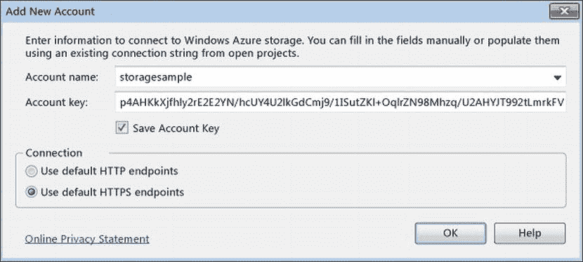
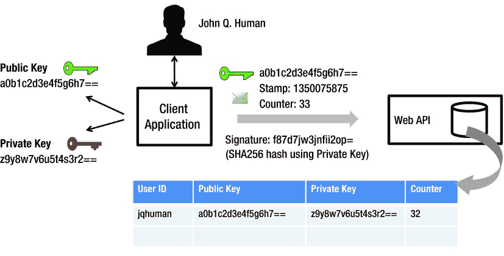
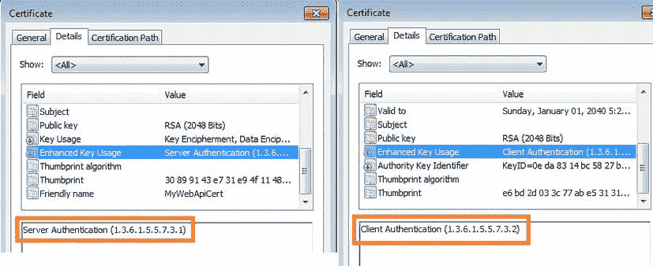
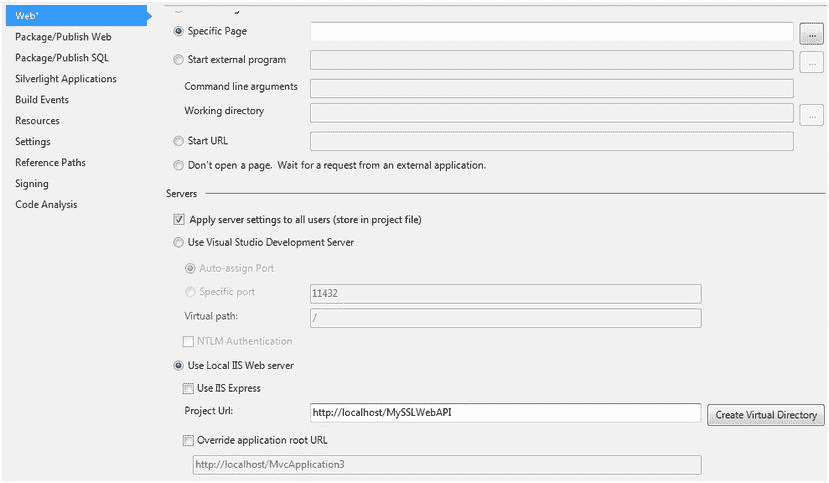
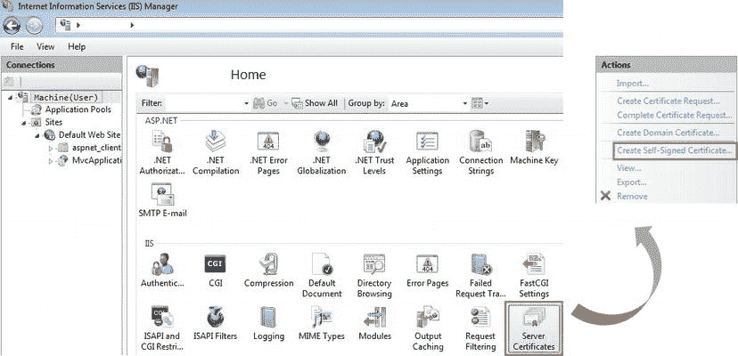
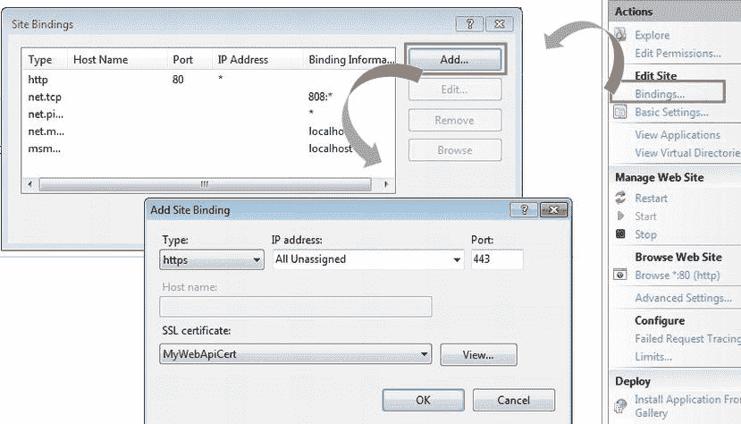
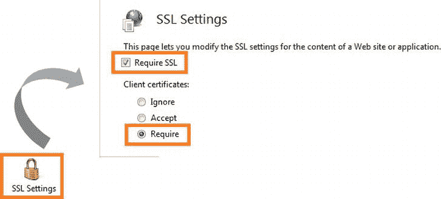
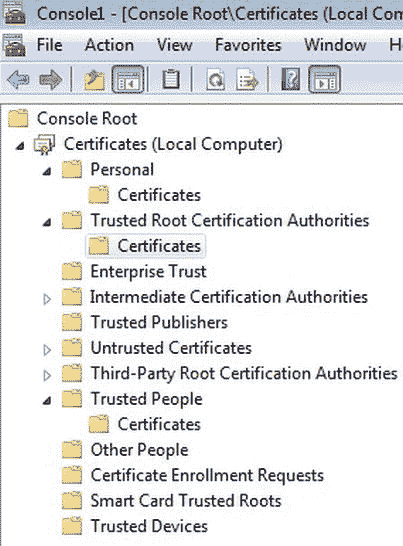
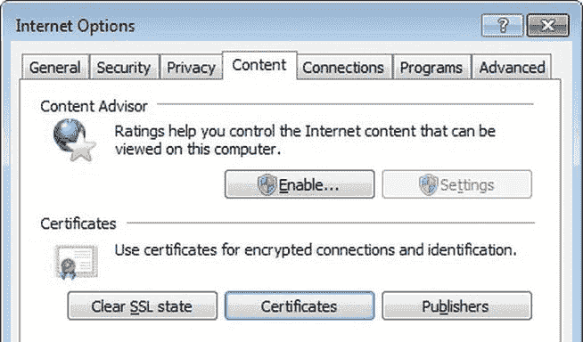
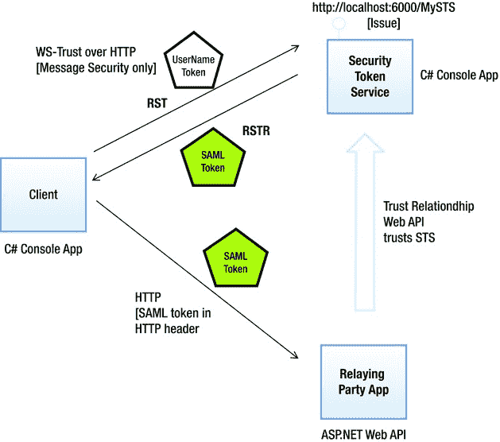

# 九、所有权因素

正如您在[第 5 章](05.html)中看到的，认证是安全性的一个基本方面，包括验证用户提供的凭证，以便在应用中为用户建立身份。凭证可以是用户知道的知识因素、用户拥有的所有权因素或用户的固有因素。我在[第八章](08.html)中讲述了知识因素。在这一章中，我着重讨论所有权因素。

所有权因素是用户拥有或占有的元素，如密钥、证书或令牌。与知识因素不同，知识因素可以很容易地、有意或无意地传递给他人，而所有权因素则很难共享。员工可以与同事共享知识因素，如他的密码，并要求她提交他在周五晚上忘记提交的时间表，尽管这违反了他公司的政策。更糟糕的是，员工可以把自己的密码写在便利贴上，放在键盘旁边。所有权因素(如安装在机器证书存储中的 X.509 客户端证书)要安全得多，并且导出它通常超出了大多数典型商业用户的技术能力。此外，基于 Windows 的权限可以用来使共享变得更加困难甚至不可能。

在本章中，我们将通过所有权因素(如预共享密钥、X.509 客户端证书和 SAML 令牌)来保护 ASP.NET Web API。我将在下一章专门讨论 web 令牌，这是另一种所有权因素。Web 令牌非常适合 RESTful 服务。具体来说，我将介绍简单的 Web 令牌(SWT)和 JSON Web 令牌(JWT)。

预共享密钥

预共享密钥(PSK)，也称为 API 密钥，是双方在实际使用之前在带外共享的秘密。带外共享通常发生在比实际消息通信随后将要发生的通道更安全的通道上。基于 PSKs 的安全性通常使用对称密钥加密算法，类似于我们在第 6 章中看到的算法。

在基本层面上，PSK 可以像秘密握手或 shibboleth 一样使用。如果一个客户端发送“PSK ”,当然，这是所有应该使用该服务的人所共有的，则该请求被服务。如果没有，则发送回状态代码 401 -未授权响应。

对于这种基本方案，传输安全是必须的。否则，任何能够嗅到流量的人都可能获得密钥并使用您的 web API。您可能想知道这种安全安排是否有真实的用例。诸如物联网(IOT)设备之类的设备需要通过 HTTP 与诸如 web API 之类的中央服务器通信。这些设备可能没有存储单个密钥的资源。在生产这些设备时(通常是批量生产)，它们被给予一个公共的共享密钥，这个密钥在当时可能是不可更改的。这比完全没有安全性要好。web API 至少可以查找制造时烧录的这些密钥之一，以查看请求是否来自合法设备之一。

下一层是能够发送单个 PSK 的客户端。优点是 web API 现在可以单独识别客户端。假设我嗅到了流量，收到了一堆请求。接下来，我使用在流量捕获中获得的共享密钥创建了一个自己的请求。web API 将处理我的请求，因为它无法区分真正的请求和虚假的请求。在这种情况下，和前面的情况一样，传输安全是必须的。

这种机制是否类似于基本身份验证，或者是它的简化版本，只发送用户名而不发送密码？差不多，但不完全一样。用户名和密码是知识因素。这基本上意味着你认识他们。你可以记住它们，或者看一张便条纸，然后把上面写的内容输入系统。更糟糕的是，你可以告诉你的朋友你的用户名和密码，她可以输入并冒充你。

所有权因素，如 PSK，则不同。PSK 通常是一大串以 base64 编码格式出现的字节，或者是一个十六进制字符串，即使是最聪明的人也不可能记住。这不仅仅是关于能够记忆，也是关于如何使用它。PSK 通常保存在系统中的某个地方。该密钥由代表用户的应用在交易中使用，不需要用户手动输入密钥。

这种类型的 PSK 的一个很好的例子是通过 Windows Azure Tools for Microsoft Visual Studio 创建的密钥。您可以使用服务器资源管理器中的 Windows Azure 存储节点来查看来自您的 Windows Azure 存储帐户的 blob 和表数据。当您将存储帐户添加到服务器资源管理器时，应用会创建一个很长的密钥作为输入。Visual Studio 使用此密钥与 web 服务通信。



图 9-1。使用 Visual Studio 和 Azure 的 PSK 示例

设计预共享密钥安全机制

最简单形式的 PSK 是一个密钥，它在两方之间进行带外交换，发送方使用消息中的共享密钥作为凭证。出于这个原因，HTTPS 通常是 PSK 的必选之作。如果没有传输安全的帮助，恶意用户很容易获得 PSK 并在恶意请求中使用它，就像合法请求一样。

PSK 的最大优点是它是带外交换的。在摘要认证中，我在第 8 章中提到过，服务器随机数是动态生成的，并作为事务的一部分与客户机共享。这意味着恶意用户可以看到随机数。尽管如此，与服务器随机数相关联的优势在于，恶意用户无法预测随机数并在交易之前为其做准备，因为随机数是在交易发起时随机生成的。但是有了 PSK，我们的地位更强了。恶意用户不会知道 PSK。然而，我们需要意识到可能的安全弱点，并防范这些弱点。我们在下面几节中分析最常见的安全风险。在本章的后面，我们将建立一个不需要 HTTPS 的安全 PSK 机制。

防御重放攻击

假设我们设计我们的安全机制，不是以纯文本的形式传输凭证，而是使用 PSK 加密。加密的凭据在消息中发送，通常在 HTTP 请求头中发送。恶意用户无法解密标头并提取凭证，但可以按原样重放先前的请求。更糟糕的是，恶意用户可以构造一个新的请求，并且只使用包含前一个成功请求的有效凭据的头值。

这种类型的重放攻击是一种攻击形式，在这种攻击中，先前成功的有效消息交换被恶意重复，或者被篡改的消息体保留了包含凭据的位。假设您使用加密的凭证发出服务请求，要求服务从您的银行账户向一家公用事业公司转账 500 美元。恶意用户不需要解密密文就可以获得您的密码。他可以像您之前的请求一样简单地提交请求，但是将收件人详细信息更改为他的帐户，并将金额更改为$50，000。该服务将接受该请求，因为解密的头值包含可信的凭证。

我们需要承认这样一个事实，即建立在 PSK 上的安全机制将容易受到重放攻击，并对此加以防范。例如，时间戳是防御重放攻击的一种相对有效的方法。可以将时间戳添加到消息中，并与消息内容的其余部分一起加密。服务可以在解密消息后检索时间戳，如果时间戳对于已经商定的阈值来说太旧，则请求失败。这减少了重放请求的机会。

然而，时间戳方法有一个小小的缺点。为了让时间戳起作用，客户机的时钟和服务器的时钟必须在合理的范围内保持同步。如果我们将时间窗口设置为 3 秒，那么在这段时间内，请求必须由 web API 处理。如果时钟不完全同步，三秒的窗口可能会进一步缩小，甚至使真正的请求失败，或者增长并适应恶意的重放请求。

时间戳的替代方法是计数器，如我们在摘要式身份验证中看到的 nonce 计数器。有了计数器，我们就不需要担心时钟之间的偏差。但是，客户端必须实现一个计数器，以确保在请求中发送的计数至少比前一个请求中的计数大 1，并且服务器必须保留上一次收到的计数器的记录。当然，必须对消息进行签名，这样恶意用户就不会递增计数器并重放请求的其余部分。

防止标识符滥用

最简单的形式是，PSK 既是用户标识符又是凭证。因此，PSK 必须是独一无二的。给定一个密钥，应用必须能够毫不含糊地识别相应的用户。我们工作的基本前提是避免 HTTPS。因此，PSK 不能按原样传输。

我们需要两个密钥:一个作为用户的身份，另一个作为凭证。我称前者为公钥，后者为私钥，类似于我们在[第 6 章](06.html)中看到的非对称算法的密钥。然而，这些键在数学上没有联系。此外，用于在发送者端签名的同一密钥也用于在接收者端验证签名；因此，这只是一个对称共享密钥。但是类似于公钥加密，只有私钥必须受到保护。

正如我们在第 8 章中看到的，在摘要式认证中，虽然不发送密码，但会传输用户名。相反，当我们使用两个密钥时，不会传输用户名或用户 ID。仅发送标识符密钥。通过使标识符也成为一个键，我们加强了机制，并防止共享 ID 的用户滥用标识符。用户必须“拥有”公钥(标识符)和私钥(凭证)，而不仅仅是知道它们，才能访问 web API。

防御中间人攻击

没有 HTTPS，中间人(MITM)攻击是最大的威胁之一。确保消息数据完整性的主要机制是基于哈希的消息认证码(HMAC)。HMAC 只是通过加密哈希算法和共享密钥创建的一段数据。在本节中，我将向您展示如何使用 SHA256 算法创建 HMAC。出于实现的目的，我忽略了保密要求。但是，如果为了保密需要对消息进行加密，您可以使用我们用于 HMAC 的相同私钥轻松添加该功能，或者您可以引入一个专门用于加密的新密钥。

当用户发送请求时，它包括三个重要的参数。

1.  公钥，即与用户相关联的密钥。传输的是公共 PSK，而不是实际的标识符或用户名。
2.  计数器，它与我们在第 8 章中看到的摘要认证的 nonce 计数器相同。这只是一个数字，客户端应用会随着每个请求而不断增加。
3.  时间戳或简称为戳，用一个数字表示自 UTC 1970 年 1 月 1 日午夜以来经过的秒数，也称为 UNIX 时间。

除了参数之外，该请求还包括一个签名，以确保没有任何参数被篡改。如果目标是确保请求中没有任何内容被修改，那么不仅可以基于这三个参数，还可以基于请求的整个主体来创建签名。

为了确保没有人篡改参数，我们可以包含所有三个值的 HMAC-SHA256，加上请求 URI 和 HTTP 方法。清单 9-1 显示了一个由 PSK 机制保护的 HTTP 请求。[图 9-2](#Fig2) 显示了 PSK 的设计。

[***清单 9-1。***](#_list1) HTTP 请求报文

```cs
GET http://localhost.:12536/api/values/7 HTTP/1.1
X-PSK: DpLMCOihcYI2i6DaMbso9Dzo1miy70G/3+UibTccoKaen3Fecywdf7DrkcfkG3KjeMbZ6djBihD/4A==
X-Counter: 33
X-Stamp: 1350214768
X-Signature: 9D2rq7KuFh9KxvibgT3bLNIFAm3HFWLD1Adn/KyagIY=
Host: server.com
```



[图 9-2。](#_Fig2) PSK 对

[表 9-1](#Tab1) 显示了我们使用的自定义标题，并描述了如何在验证中使用标题中的值来抵抗重放和 MITM 攻击。

[表 9-1](#_Tab1) 。自定义标题

| 自定义标题 | 目的 |
| --- | --- |
| X-PSK | 用作用户标识符的公共共享密钥。 |
| x 签名 | 如果客户端应用在 X-Signature 中发送的值与 X-PSK、X-Counter、X-Stamp、请求 URI 和 HTTP 方法的值的 HMAC-SHA256 相匹配，我们可以有把握地得出结论，在传输过程中没有任何东西被更改。 |
| x 型邮票 | 比较客户端发送的值和当前时间的 UNIX 时间。如果这两者之间的偏差在允许的容限内，则请求不是重放。UNIX 时间是自协调世界时(UTC)1970 年 1 月 1 日午夜以来经过的秒数。 |
| x 计数器 | 如果客户端发送的值大于服务器保存的记录中最后接收的计数器，则请求不是重播。尽管我在本章的实现示例中同时使用了时间戳和计数器，但根据您的需要，通常一个就足够了。如果时钟时间合理地同步，时间戳是最好的方法，因为在 web API 端存储计数器或在客户端递增计数器没有开销。 |

实施预共享密钥设计

在这一节中，我将向您展示如何在 ASP.NET Web API 中实现基于 PSK 的身份验证。我从在客户端实现我的设计开始。首先，我需要一种生成密钥的机制。我使用我在第 6 章的[中使用的涉及`RNGCryptoServiceProvider`的相同机制来生成共享密钥(参见](06.html)[清单 9-2](#list2) )。我在这里使用 64 字节的密钥大小。

[***清单 9-2。***](#_list2) 共享密钥生成

```cs
using (var provider = new RNGCryptoServiceProvider())
{
    byte[] secretKeyBytes = new byte[64];
    provider.GetBytes(secretKeyBytes);

    Console.WriteLine(Convert.ToBase64String(secretKeyBytes));
}
```

显而易见的原因是，我在这里使用 PSKs 建立了自己的安全机制，我不会从开箱即用的浏览器中获得任何帮助。以下步骤显示了如何用 C# 创建控制台应用。

1.  I start with a typical console application with a `Program` class containing a `Main` method. For the purpose of illustration, I hard-code a public and a private key. The public and private keys are cut in half and then joined together in the code listing for cosmetic reasons because the keys are too long to fit into a single line (see [Listing 9-3](#list3)).

    [***清单 9-3。***](#_list3) PSK 客户端:控制台应用

    ```cs
    class Program
    {
        static void Main(string[] args)
        {
            string publicKey = "DpLMCOihcYI2i6DaMbso9Dzo1miy70G/3+UibTttjLSiJ3cco";
            publicKey += "Kaen3Fecywdf7DrkcfkG3KjeMbZ6djBihD/4A==";

            string privateKey = "W9cE42m+fmBXXvTpYDa2CXIme7DQmk3FcwX0zqR7fmj";
            privateKey += "D6PHHliwdtRb5cOUaxpPyh+3C6Y5Z34uGb2DWD/Awiw==";

            // The code to use HttpClient to make a web API request goes here

            Console.Read();
        }
    }
    ```

2.  I use `HttpClient` to set the headers and make a GET request (see [Listing 9-4](#list4)).

    [***清单 9-4。***](#_list4) 客户端:控制台应用

    ```cs
    using (HttpClient client = new HttpClient())
    {
               // Step 2-a
               int counter = 33;
               Uri uri = new Uri(" http://localhost:54400/api/employees/12345 ");

               client.DefaultRequestHeaders.Add("X-PSK", publicKey);
               client.DefaultRequestHeaders.Add("X-Counter", String.Format("{0}", counter));

               // Step 2-b
               DateTime epochStart = new DateTime(1970, 01, 01, 0, 0, 0, 0, DateTimeKind.Utc);
               TimeSpan ts = DateTime.UtcNow - epochStart;
               string stamp = Convert.ToUInt64(ts.TotalSeconds).ToString();
               client.DefaultRequestHeaders.Add("X-Stamp", stamp);

               string data = String.Format("{0}{1}{2}{3}{4}", publicKey, counter, stamp, uri.ToString(), "GET");

               // Step 2-c
               byte[] signature = Encoding.UTF8.GetBytes(data);
               using (HMACSHA256 hmac = new HMACSHA256(Convert.FromBase64String(privateKey)))
               {
                       byte[] signatureBytes = hmac.ComputeHash(signature);
                       client.DefaultRequestHeaders.Add("X-Signature", Convert.ToBase64String(signatureBytes));
               }

               var httpMessage = client.GetAsync(uri).Result;
               if(httpMessage.IsSuccessStatusCode)
                   Console.WriteLine(httpMessage.Content.ReadAsStringAsync().Result);
    }
    ```

    *   a.我在这里硬编码了一个计数器，并没有随着每个请求而递增，只是为了保持示例代码简单。计数器值在 X-Counter 标头中发送。
    *   b.对于 UNIX 时间，我创建了一个新的 UTC 类型的`DateTime`对象，对应于 1970 年 1 月 1 日。我使用`DateTime.UtcNow`获得 UTC 的当前时间，并以秒为单位计算这两个日期之间的差值。那是 UNIX 时代。
    *   c.签名或 HMAC 是为公钥、两个标头以及资源 URI 和 HTTP 方法计算的，它们连接成一个字符串，没有分隔符。最后，我使用`HMACSHA256`来计算签名，它被填充到 X-Signature 头中。我只是按照惯例使用 X 前缀来表示这些是我们自己的自定义头。

在服务器端，通常是 ASP.NET Web API，我写了一个消息处理程序来检查 PSK(见清单 9-5 )。

[***清单 9-5。***T5【PSK】推让处理程序](#_list5)

```cs
public class PskHandler : DelegatingHandler
{
    protected override async Task<HttpResponseMessage> SendAsync(HttpRequestMessage request,
CancellationToken cancellationToken)
    {
        string privateKey = "W9cE42m+fmBXXvTpYDa2CXIme7DQmk3FcwX0zqR7fmj";
        privateKey += "D6PHHliwdtRb5cOUaxpPyh+3C6Y5Z34uGb2DWD/Awiw==";

        var headers = request.Headers;

        if (headers.Contains("X-PSK") && headers.Contains("X-Counter") &&
                headers.Contains("X-Stamp") && headers.Contains("X-Signature"))
        {
            string publicKey = headers.GetValues("X-PSK").First();
            string counter = headers.GetValues("X-Counter").First();
            ulong stamp = Convert.ToUInt64(headers.GetValues("X-Stamp").First());
            string incomingSignature = headers.GetValues("X-Signature").First();

            string data = String.Format("{0}{1}{2}{3}{4}", publicKey, counter, stamp,
                                                                        request.RequestUri.ToString(),
                                                                        request.Method.Method);

            byte[] signature = Encoding.UTF8.GetBytes(data);
            using (HMACSHA256 hmac = new HMACSHA256(Convert.FromBase64String(privateKey)))
            {
                byte[] signatureBytes = hmac.ComputeHash(signature);
                if (incomingSignature.Equals(
                                        Convert.ToBase64String(signatureBytes), StringComparison.Ordinal))
                {
                    DateTime epochStart = new DateTime(1970, 01, 01, 0, 0, 0, 0, DateTimeKind.Utc);
                    TimeSpan ts = DateTime.UtcNow - epochStart;

                    if (Convert.ToUInt64(ts.TotalSeconds) - stamp <= 3)
                        return await base.SendAsync(request, cancellationToken);
                }
            }
        }

        return request.CreateResponse(HttpStatusCode.Unauthorized);
    }
}
```

签名计算与客户端所做的相同。毕竟是这个想法。如果验证中有任何问题，我会发回一个 401 -未授权响应。

为了保持这个代码示例简洁，我有意跳过消息处理程序中的以下步骤。

1.  我没有检查计数器是否从之前的请求开始增加，因此我没有维护计数器的记录。如果你想看这个实现，请参考第 8 章中的摘要认证，在那里我展示了 nonce 计数器是如何被存储和检查的。
2.  我不检索对应于公钥的私钥。我只是将我在客户端(控制台应用)中使用的私钥硬编码。
3.  我没有创建一个类型为`IPrincipal`的对象，并将其设置为`Thread.CurrentPrincipal`以供管道中的其他组件使用。当您使用来自持久性存储(如数据库)的备份来实现这种机制时，在从数据存储中检索传入公钥的私钥时，您也可以检索相应的用户名。基于此，可以构建诸如用户名声明和其他相关声明之类的声明，并创建主体。

在前面的代码中，我通过查看时间戳来检查请求的新鲜度。如果时间戳仅在 3 秒钟之前，我接受请求。对于某些场景来说，这可能太接近了，并且它确实要求客户端和服务器时钟紧密同步。然而，它在防止重放方面做得很好。

你可以通过使用 Fiddler 工具来测试这一点，这个工具与我们在第 4 章中使用的工具相同。启动 Fiddler 并确保它正在捕获“所有进程”从控制台应用，提出请求，并确保您得到 200 - OK。当您看到左侧窗格的 web 会话列表中的结果列从破折号变为 200 时，右键单击并从快捷菜单中选择重放无条件重新发布。您应该得到一个 401 -未授权状态代码。

预共享密钥的优缺点

如果我们通过使用密钥对来实现 PSK，我们可以确保 PSK 不会在交换的消息中发送。因为不发送密钥，所以我们可以使用 HTTP。因为我们实现的是消息安全而不是传输安全，所以不需要服务器端的 X.509 证书。由于这个原因，基于消息安全的 PSK 相对来说是有成本效益的。当然，我们自己生成随机密钥来用作对称 PSK。基于消息安全性的机制通常被认为优于传输安全性，因为尽管存在中介，消息安全性也能保证安全性。

另一方面，PSK 基于这样一个假设，即参与的双方都将保证密钥的安全。如果在一端妥协，对双方都有影响。此外，消息安全机制实现起来有点复杂。即便如此，与实施交通安全的成本相比，这是一个较小的代价。PSK 的另一个缺点是，它们会导致 IT 部门的开销，因为密钥需要定期轮换，以应对双方必须对共享密钥保密所带来的安全风险。

X.509 客户端证书

数字 X.509 证书在用作向服务验证实体的凭据时，称为 X.509 客户端证书。向其颁发证书的实体可以是应用或最终用户。与颁发给公司等实体的服务器证书不同，客户端证书可以颁发给个人最终用户，用作他们在应用中进行身份验证的凭据。在 web 应用的上下文中，用户代理(web 浏览器)可以自动从本地存储中获取客户端证书，并将其作为用户的凭证提供给服务器，它代表用户与服务器进行交易。

数字证书将一个身份绑定到一对可用于加密和签名数据的密钥上。在[第 6 章](06.html)中，我们看到了使用来自数字证书的公钥和私钥对以及没有证书的加密和签名。显然，数字证书存在的唯一目的不是为公钥加密提供公钥-私钥对。不仅如此，因为数字证书确保证书中包含的公钥属于证书所颁发给的实体。数字证书是一种身份。在本节中，我们特别关注客户端证书，它是颁发给最终用户的数字证书，用作身份验证的凭证。

数字证书由证书颁发机构(CA)颁发。证书通常包含以下项目:

*   公开密钥
*   向其颁发证书的实体的名称
*   终止日期
*   颁发证书的 CA
*   与证书关联的序列号
*   使用 CA 的私钥创建的数字签名
*   用于创建签名的算法

最广泛接受的数字证书格式由 CCITT X.509 国际标准定义。当有人提到数字证书时，他通常指的是 X.509 证书。有时，人们确实用“SSL 证书”这个名称来指代证书，因为 X.509 证书主要用于 SSL/TLS 协议。

服务器证书与客户端证书

服务器用作凭据向最终用户(或用户使用的用户代理)证明其身份的 X.509 证书称为服务器证书。最终用户通过用户代理向服务器证明其身份的 X.509 证书称为客户端证书。

作为证明个人身份的凭证的 X.509 证书与涉及传输层安全性(TLS)的通信相关。在我们的例子中，它是带 HTTP 的 TLS，通常被称为 HTTPS。我们在第 4 章中看到了当使用 HTTPS 时，浏览器如何使用和检查颁发给服务器的 X.509 证书。在 TLS 握手过程中，web 服务器向用户代理(web 浏览器)发送 X.509 证书(仅带有公钥)，该证书颁发给拥有网站的实体。该证书称为服务器证书。浏览器根据它信任的 ca 列表对其进行验证。如果证书在受信任的 CA 列表中，并且证书是颁发给浏览器当前连接的网站的，则 web 浏览器确信服务器的身份。到目前为止，这种检查是从确定 web 服务器身份真实性的角度进行的。换句话说，服务器证书是向最终用户证明服务器身份的手段。当然，最终用户在 TLS 握手期间不会检查证书。用户代理或 web 浏览器代表用户执行此操作。

TLS 允许相互验证。就像 web 浏览器验证服务器凭证的真实性一样，服务器也可以验证用户凭证的真实性。可以将浏览器配置为在通过 TLS 握手建立安全连接时向 web 服务器发送最终用户的 X.509 证书。这样的 X.509 证书由浏览器发送到 web 服务器，作为向服务器证明最终用户身份的一种手段，它被称为客户端证书(不是用户证书，尽管它基本上是用户凭证)。客户端证书通常是发给用户的。

X.509 证书既可以用作服务器证书，也可以用作客户端证书。真正区分证书的是使用它的通信信道的末端。扩展密钥用法表示证书应该如何使用，如[图 9-3](#Fig3) 所示。当服务器证书被配置为用作客户端证书时，它将永远不起作用，反之亦然。



[图 9-3。](#_Fig3)服务器证书与客户端证书

在 ASP.NET Web API 中使用客户端证书进行身份验证

在本节中，我使用 X.509 客户端证书在 ASP.NET Web API 中实现了身份验证。有几个步骤，其中大部分是与配置相关的步骤，我需要执行这些步骤来在 ASP.NET Web API 中实现基于客户端证书的安全性。为此，我使用网络托管的 ASP.NET Web API，它使用 IIS。对于客户端，我使用 Internet Explorer。但是我确实向您展示了如何通过 C# 控制台应用在浏览器之外使用 web API。以下是在 ASP.NET Web API 中实现基于客户端证书的身份验证的步骤概述。

1.  在 IIS 中启用 HTTPS。尽管在生产中您必须使用 CA 颁发的证书来实现这一目的，但我使用的是自签名证书。在 IIS 中强制使用 HTTPS 和客户端证书。
2.  创建一个自签名证书用作客户端证书，并使用 PVK2PFX 工具对其进行打包以进行分发。在 Internet Explorer 中配置此证书。
3.  在 ASP.NET Web API 中实现一个消息处理程序，从请求中检索客户端证书，验证该证书，并设置主体对象。

自签名证书

自签名证书由它所代表的同一实体签名。自签名证书是用自己的私钥签名的！简而言之，这类似于我认证自己。在现实世界中，除非你是一个其他人都信任的人，否则没有人会相信你给自己的证书。需要第一方和第二方都信任的第三方来完成信任圈。在数字证书的世界中，可信的第三方是证书颁发机构(CA ),如 VeriSign。由 CA 颁发的证书受到所有人的信任，但是它确实要花钱。自签名证书，比如我们在第 6 章中看到的由 Makecert 工具创建的证书，不需要花费任何成本，但是没有人信任它。它只能用于测试目的。

通过自签名证书在 IIS 中启用 HTTPS

为了在 IIS 中启用 HTTPS，我使用 Visual Studio 2012 在 IIS 中创建应用，并使用 IIS Manager(InetMgr.exe)来完成其余工作。以下步骤显示了该过程。

1.  以管理员身份启动 Visual Studio an。
2.  Create a new ASP.NET MVC 4.0 project with the Web API template. In Solution Explorer, double-click the Properties node under the project (see [Figure 9-4](#Fig4)).

    

    [图 9-4。](#_Fig4)在 IIS 中运行 web API 应用

3.  选择“使用本地 IIS Web 服务器”,并确保清除“使用 IIS Express”复选框。单击“创建虚拟目录”，以便 Visual Studio 为您创建一个虚拟目录，作为默认网站的一部分。
4.  Next, use IIS Manager to generate a server certificate, as shown in [Figure 9-5](#Fig5). I use IIS 7.5\. Depending on the version you use, what you see on your machine could be different from the screenshots. Click on the root machine node in tree view in the left pane and double-click the Server Certificates icon in the right pane. On the resulting screen, click the Create Self-Signed Certificate. . . link. Enter a friendly name such as MyWebApiCert in the pop-up and click OK to complete the server certificate generation.

    

    [图 9-5](#_Fig5) 。IIS 管理器:证书生成

5.  Now that we have the server certificate, we need to let IIS use it. Click the Default Web Site node of the tree view in the left pane. In the Actions pane on the right, click Bindings. . . . Click Add (see [Figure 9-6](#Fig6)). In the Add Site Binding dialog box, select https as Type and select the certificate we just generated, which is MyWebApiCert. Click OK to finish creating the binding.

    

    [图 9-6。](#_Fig6) IIS 管理器:配置 HTTPS 绑定

6.  现在我们已经准备好使用 HTTPS 调用我们的 web API 了。当我们直接通过浏览器这样做时，IIS 会将我们刚刚生成的自签名服务器证书的公钥发送到浏览器。因为这是一个自签名证书，浏览器会不高兴，并会显示一个警告，表明该证书不是它信任的证书。但是很管用！
7.  We will now configure IIS to mandate a client certificate. It is just a configuration change. Click the virtual directory of the tree view in the left pane. As shown in [Figure 9-7](#Fig7), double-click SSL Settings, select the Require SSL check box, and select the Require radio button. That completes the configuration changes we need to make in IIS.

    

    [图 9-7](#_Fig7) 。IIS 管理器:配置强制客户端证书

创建和配置客户端证书

IIS 7.0 帮助我们生成服务器端证书，但当涉及到客户端证书时，我们只能靠自己。当然，我们可以使用 Makecert 工具来创建自签名证书。以下是使用 Makecert 生成客户端证书、使用 PVK2PFX 打包证书以及在 Internet Explorer 中配置证书的步骤。

1.  Before we generate the client certificate, we need a root certificate on which we will base our client certificate. In an ideal world, this will be a CA like VeriSign. In this scenario, though, we will create the root certificate using Makecert, as shown in [Listing 9-6](#list6). The command-line parameter of `cy` is what makes this certificate a special CA certificate.

    [***清单 9-6。***](#_list6) Makecert 命令创建根证书

    ```cs
    makecert.exe -r -n "CN=WebApiCA" -pe -sv WebApiCA.pvk -a sha256  -cy authority WebApiCA.cer
    ```

     **注意**要运行 Makecert 命令，使用 Visual Studio 2012 的开发者命令提示符，可在所有程序微软 Visual Studio  Visual Studio 工具下获得。如果使用 Visual Studio 2010，它将是一个 Visual Studio 命令提示符。无论哪种情况，您都必须以管理员身份运行提示。

2.  出现提示时，键入密码。一旦 Makecert 成功完成执行，您将创建两个文件。
    *   a.包含证书私钥的 PVK 文件。因为该文件包含私钥，所以必须妥善保护该文件。
    *   b.包含公钥的 CER 文件。
3.  In [Chapter 6](06.html), we used Makecert to generate and add the certificate to the local store directly. In this case, it just generates the certificate files. Because we plan to use this certificate as the root certificate for the client certificates, this certificate needs to be sent to the users and ultimately get added to the certificate store on their machines. We need to add this certificate to the Trusted Root CA in both IIS and the machine where the client will run. We can use the Microsoft Management Console (MMC) for this purpose.
    *   a.MMC 对应的可执行文件是`C:\Windows\System32\mmc.exe`。您也可以通过在运行框中键入 **mmc** 来运行 MMC。
    *   b.一旦 MMC 启动，选择文件添加/删除管理单元或按 Ctrl+M 调出添加或删除管理单元。
    *   c.从左侧的可用管理单元列表视图中选择证书，然后单击添加。
    *   d.在出现的对话框中，选择计算机帐户单选按钮，单击下一步，选择本地计算机，然后单击完成。
    *   e.  Finally, click OK to see the certificates on your computer, as shown in [Figure 9-8](#Fig8).

        

        [图 9-8](#_Fig8) 。Microsoft 管理控制台

    *   f.展开左侧的树视图，然后转到受信任的根证书颁发机构。右键单击证书文件夹并选择所有任务。。。导入。选择 WebApiCA。CER，并完成将证书添加到受信任的根 CA 的过程。

    您只需要在 IIS(服务器)中执行这些步骤。当然，您也可以在客户端机器上做同样的事情，但是在创建和打包客户端证书时还需要一个额外的步骤。

4.  Next, we need to create the client certificate. We will use the same Makecert command that we used to create the root certificate. The command to run is shown in [Listing 9-7](#list7).

    [***清单 9-7。***](#_list7) Makecert 命令创建客户端证书

    ```cs
    makecert.exe -iv WebApiCA.pvk -ic WebApiCA.cer -n "CN=jqhuman" -pe -sv jqhuman.pvk -a sha256 -sky exchange jqhuman.cer -eku 1.3.6.1.5.5.7.3.2
    ```

5.  Makecert 再次创建两个文件:公钥和私钥各一个。作为一般规则，必须安全地保存所有私钥，并且只能分发公钥。客户端证书 CN=jqhuman 是由 WebApiCA 颁发的。`eku`的参数是使该证书成为客户端证书的原因。如果您计划从浏览器使用 web API，比方说 JQuery 调用 web API，除非证书被特别标记为客户端证书，否则浏览器不会将证书发送到 IIS。基本上是行不通的！
6.  A client certificate has been created, but the certificate needs packaging for delivery. PVK2PFX is another command-line tool we will use to package the certificate (public and private keys) into a Personal Information Exchange (.pfx) file. See [Listing 9-8](#list8) for the command to use to create the .pfx file.

    [***清单 9-8。***](#_list8) PVK2PFX 命令行工具

    ```cs
    pvk2pfx.exe -pvk jqhuman.pvk -spc jqhuman.cer -pfx jqhuman.pfx -po p@ssw0rd!
    ```

7.  现在，我们可以将两个文件`jqhuman.pfx`和`WebApiCA.cer`发送给用户 John Q. Human，分别安装到个人证书存储和可信根 CA 中。John 只需双击文件并提供密码 p@ssw0rd！当提示完成安装时。请注意，此密码用于。pfx 文件，并且可以不同于 Makecert 生成证书时输入的密码。
8.  为了验证客户端证书安装成功，John 可以打开 Internet Explorer，转到 Tools  Options，点击 Content 选项卡，然后点击 Certificates 按钮确认证书安装成功，如图 9-9 所示。



[图 9-9](#_Fig9) 。微软公司出品的 web 浏览器

设置完成后，如果您直接从 Internet Explorer 访问一个 API，比如/api/employees，似乎没有发生什么特别的事情。但是，Internet Explorer 正在悄悄地挑选证书 CN=jqhuman 并将其发送到 IIS。

我们将 IIS 配置为需要此证书，因此如果没有客户端证书，所有请求都将失败。收到证书后，它会验证证书的颁发者是否在运行 IIS 的服务器上的可信 CA 列表中。如果一切正常，请求将通过我们的 web API 管道。

这里是我们已经完成的设置的快速总结。

1.  我们使用 IIS 管理器创建了一个自签名服务器证书，并使用它创建了一个 HTTPS 绑定。
2.  我们在 IIS 中强制使用 HTTPS 和客户端证书。
3.  然后我们使用 Makecert 创建了一个根证书。
4.  使用这个根证书，我们创建了一个客户端证书。
5.  我们使用 PVK2PFX 工具来打包客户端证书以便分发。

最终，最终用户机器的可信 CA 和服务器(在本例中，运行 IIS 的机器具有可信 CA 列表)必须包含我们的根证书，这样整个工作才能正常进行。此外，在客户端，浏览器必须配置客户端证书。如果双击。pfx 文件，Windows 会自动为您配置客户端证书。

如果您能够控制可以添加到客户端计算机上的可信 CA 列表中的内容，那么您可以使用 Makecert 生成自己的客户端证书，甚至可以用于生产。虽然使用由 CA 颁发的证书来满足所有生产需求是一种好的做法，但是我们的自签名证书也可以很好地用于客户端证书。通过向用户提供单独的证书，我们增强了安全性。因为证书是一个所有权因素，所以您可以限制只能从安装了证书的机器上访问 web API。这是基于所有权因素的安全性与基于知识因素的安全性的最大区别点。

在 ASP.NET Web API 中使用 X.509 证书

最后，我们要写一些代码来使用我们得到的客户端证书。真正由我们决定的是进行适当的验证，以及随后的基于证书建立身份的过程。我用代表某种标识符的通用名称 jqhuman 生成了客户端证书，jq Human 代表用户 John Q. Human。首先，我需要一个数据库或存储来跟踪我已经颁发的证书，当客户端证书出现在请求中时，我可以根据它来验证客户端证书。其次，我可以去其他商店获取与这个用户身份相关联的声明或角色。有了这两个，我就可以建立一个经过身份验证的身份，它具有可用于访问控制的角色或声明。我在这里使用了一个消息处理程序(见清单 9-9 )，正如我在前面的章节中所演示的那样。

[***清单 9-9。***](#_list9) X.509 客户端证书消息处理程序

```cs
public class X509ClientCertificateHandler : DelegatingHandler
{
    protected override async Task<HttpResponseMessage> SendAsync(HttpRequestMessage request,
                                                                CancellationToken cancellationToken)
    {
        var cert = request.GetClientCertificate();

        X509Chain chain = new X509Chain();
        chain.ChainPolicy.RevocationMode = X509RevocationMode.NoCheck;

        if (chain.Build(cert) && cert.Issuer.Equals("CN=WebApiCA"))
        {
            var claims = new List<Claim>
            {
                    new Claim(ClaimTypes.Name, cert.Subject.Substring(3)), // ignoring CN=
            };

            var principal = new ClaimsPrincipal(new[] { new ClaimsIdentity(claims, "X509") });
Thread.CurrentPrincipal = principal;
if (HttpContext.Current != null)
HttpContext.Current.User = principal;

            return await base.SendAsync(request, cancellationToken);
        }

        return request.CreateResponse(HttpStatusCode.Unauthorized);
    }
}
```

使用`GetClientCertificate()`方法从请求中提取客户端证书。`X509Chain`类用于通过构建链来验证证书。在这个例子中，我忽略了撤销列表，但是在生产中，如果有一个合适的列表，那一行可以被注释掉。我还要确保客户机证书的颁发者是 CN=WebApiCA。

测试我们的 ASP.NET Web API

如果 web API 是从 JQuery 或在浏览器环境下运行的类似程序中使用的，浏览器会将客户端证书发送给 I is。

清单 9-10 显示了一个非浏览器场景的 C# 代码。需要注意的重要一点是，我必须为服务器证书验证设置回调，并简单地返回 true 以使其工作。主要原因是服务器返回我们的自签名证书。**这是生产的大忌**。需要由 CA 颁发的证书。

[***清单 9-10。***](#_list10)ASP.NET Web API 的 C# 客户端

```cs
ServicePointManager.ServerCertificateValidationCallback =
(object sender, X509Certificate cer, X509Chain chain, SslPolicyErrors error) =>
{
    return true; // This is done because we are using a self-signed certificate in the server side, not production strength
};

var client = WebRequest.Create(" https://server.com/api/employees/12345 ") as HttpWebRequest;
var cert = new X509Certificate2(File.ReadAllBytes(@"C:\Users\Me\Certs\TestCert.pfx"), "p@ssw0rd!");
client.ClientCertificates.Add(cert);

string response = new StreamReader(client.GetResponse().GetResponseStream()).ReadToEnd();
```

 **注意**可以将其他身份验证方法(如基本身份验证，这是一种基于知识因素的身份验证)与客户端证书(这是一种基于所有权因素的身份验证)相结合，使其成为一种强双因素身份验证。因为客户端证书是基于 HTTPS 的，所以按照基本身份验证的需要，以明文形式发送凭据不会带来任何安全问题。[第 14 章](14.html)包含了一个二元认证(TFA)实现的例子。

客户端证书机制的优缺点

基于客户端证书的身份验证是一种可靠的用户身份验证方式。与基于密码的机制相比，当与 Windows 特权结合使用时，证书不能与其他人共享，并且可以防止滥用。没有人能阻止你把你的用户名和密码写在便笺条上并交给别人，但是证书可以被 it 系统严密保护，因为它是一个文件。

客户端证书机制可以与其他身份验证机制(如基本身份验证)结合使用，以实现双因素身份验证来增强安全性。

在从机器上调用 web API 之前，需要在该机器上安装证书。这是一把双刃剑。如果您打算限制必须访问 web API 的机器，这可能对您有利。另一方面，它会变得非常令人窒息，限制用户只能从那些有客户端证书的机器上使用 web API。根据需要，客户端证书的质量可能对您有利，也可能对您不利。另一方面，建立和维护支持客户端证书的基础设施的过程有点复杂，需要 it 运营和管理团队的支持。此外，客户端证书依赖于 HTTPS，因此 HTTPS 是实现基于客户端证书的身份验证所必需的。

 **注意**可以将客户端证书映射到活动目录帐户。如果实施，则只需要客户端证书来建立所有 Active Directory 组作为角色的身份。这个主题与 IT 管理有关，而不是编程，而编程正是这本书的全部内容。出于这个原因，除了这个简短的提及，将不会有任何详细的报道。

收集标记 t1

任何安全令牌都是所有权因素。令牌可能在计算机内存中，或者一直在网络流中循环，不像证书可以作为文件保存到文件系统中。我们在第 5 章中回顾了安全令牌的三种主要格式，即安全断言标记语言(SAML)令牌、简单 Web 令牌(SWT)和 JSON Web 令牌(JWT)。SAML 是基于 XML 的，具有 SOAP 亲和性。通常，它作为 SOAP web 服务有效负载的一部分，而不是在 HTTP 头或 RESTful 服务消息体中传输。

在第 7 章的[中，我们构建了一个定制的安全令牌服务(STS ),其 WS-Trust 端点能够发布 SAML 令牌。在这一章中，我们从 STS 获得一个 SAML 令牌，并将在 ASP.NET Web API 中使用它。当一个 RESTful 服务与安全基础设施一起被从头开始构建时，像 SWT 或 JWT 这样的 RESTful 友好令牌很可能会被使用。不过，这并不是一个硬性规定。](07.html)

已经投资 SAML 令牌发放基础设施的组织将希望利用现有的基础设施和新的 RESTful 服务，他们希望使用伟大的 ASP.NET Web API 框架来构建这些服务。这就是我提供这一节关于在 ASP.NET Web API 中使用 SAML 令牌的原因。我们将在下一章专门讨论 SWT 和 JWT 的网络令牌。

[图 9-10](#Fig10) 显示了整体设置。本章使用的 STS 将直接来自[第 7 章](07.html)。它公开了一个 WS-Trust 端点，该端点在 RSTR 响应中为传入的 RST 请求颁发一个令牌。STS 既支持被动客户端的 WS-Federation，也支持主动客户端的 WS-Trust。在我们的案例中，我们不与被动客户打交道；因此，我们创建的 STS 将只支持 WS-Trust，更确切地说，只支持令牌颁发。



[图 9-10。](#_Fig10)通过 ASP.NET Web API 使用 SAML 令牌

在本书中，我不打算讨论构建生产强度 STS 的主题。覆盖范围仅限于构建一个基本的 STS，客户端(控制台应用)可以从该 STS 请求一个令牌，并最终作为凭证提供给 ASP.NET Web API。这里假设您的 IT 安全基础设施已经有了等效的东西，比如您过去可能已经购买的 Active Directory 联合身份验证服务端点或自定义 STS。

实施客户端控制台应用

为了实现客户端控制台应用，我构建了第 7 章中的代码，它向 STS 发出 RST 请求，并从 RSTR 响应中获取 SAML 令牌。在第 7 章的[中的“向自定义 STS 请求令牌”一节中描述的`GetToken()`方法可以做到这一点，并将令牌作为字符串返回。我修改了该方法，以返回 SAML 令牌的一个`Tuple`和证明密钥。我使用`System.Net.Http.HttpClient`向我们的 web API 发出 GET 请求，如](07.html)[清单 9-11](#list11) 所示。在这个请求中，我将 Saml 令牌作为 base64 编码的字符串放在授权请求头中，使用我命名为 SAML 的自定义方案。我使用 proof key 对 SAML 令牌进行签名，并在另一个名为 X-ProofSignature 的头中单独发送签名。

[***清单 9-11。***](#_list11) 对 GetToken 法的修改

```cs
private static Tuple<string, byte[]> GetToken()
{
    var binding = new WS2007HttpBinding(SecurityMode.Message);

    binding.Security.Message.ClientCredentialType = MessageCredentialType.UserName;
    binding.Security.Message.NegotiateServiceCredential = true;
    binding.Security.Message.EstablishSecurityContext = false;

    var address = new EndpointAddress(new Uri(@" http://localhost:6000/MySTS "),
                                                    new DnsEndpointIdentity("MySTS"));

    WSTrustChannelFactory factory = new WSTrustChannelFactory(binding, address);
    factory.TrustVersion = TrustVersion.WSTrust13;

    factory.Credentials.ServiceCertificate.Authentication.CertificateValidationMode = X509CertificateValidationMode.None;
    factory.Credentials.ServiceCertificate.Authentication.RevocationMode = X509RevocationMode.NoCheck;
    factory.Credentials.UserName.UserName = "jqhuman";
    factory.Credentials.UserName.Password = "jqhuman"; // has to be the same as username in our example

    WSTrustChannel channel = (WSTrustChannel)factory.CreateChannel();

    var request = new RequestSecurityToken(System.IdentityModel.Protocols.WSTrust.RequestTypes.Issue)
    {
        AppliesTo = new EndpointReference(" http://my-server.com ")
    };

    RequestSecurityTokenResponse response = null;
    var token = channel.Issue(request, out response) as GenericXmlSecurityToken;

    var proofKey = response.RequestedProofToken.ProtectedKey.GetKeyBytes();

    return new Tuple<string,byte[]>(token.TokenXml.OuterXml, proofKey);
}
```

使用证明密钥检查 SAML 令牌所有权的概念是 WS-Trust 规范的一部分，它是针对 SOAP 的。在基于 REST 的服务中，当必须使用 SAML 令牌时，它通常被用作承载令牌，而不是密钥持有者令牌。然而，并没有硬性规定，持有密钥的令牌不能与 ASP.NET Web API 一起使用。这个过程稍微复杂一些，并且必须通过使用 X-ProofSignature 定制 HTTP 头进行定制，但是我决定包括 proof key 验证。如果你打算只处理不记名令牌，这是很容易放弃的。如果您希望 STS 发布一个不记名令牌，那么在发布 RST 时，通过指定`KeyTypes.Bearer`的`KeyType`来明确地请求它。以下步骤显示了如何完成客户端应用实现。

1.  修改[第 7 章](07.html)中的`GetToken`方法，在`Tuple`中返回字符串形式的 SAML 令牌(XML)和字节数组形式的证明密钥。参见[清单 9-11](#list11) 。修改以粗体显示。
2.  Call the `GetToken` method from the `Main` method and receive the SAML token as XML and the proof key as a byte array, as shown in [Listing 9-12](#list12).

    [***清单 9-12。***](#_list12) 客户端应用

    ```cs
    static void Main(string[] args)
    {
        Tuple<string, byte[]> token = GetToken();

        string saml = token.Item1;
        byte[] proofKey = token.Item2;

        // Code to use HttpClient goes here
    }
    ```

3.  Use `HttpClient` to make an HTTP GET to ASP.NET Web API, passing the SAML token in the Authorization header (using a custom scheme that I call Saml). See [Listing 9-13](#list13). Using the proof key returned by the `GetToken` method call, create an HMAC using the SHA256 algorithm for the SAML token XML and stuff it in the X-ProofSignature header before the call to ASP.NET Web API.

    [***清单 9-13。***](#_list13) 调用 ASP.NET Web API

    ```cs
    using (HttpClient client = new HttpClient())
    {
        byte[] bytes = Encoding.UTF8.GetBytes(saml);
        var header = new AuthenticationHeaderValue("Saml", Convert.ToBase64String(bytes));
        client.DefaultRequestHeaders.Authorization = header;

        using (HMACSHA256 hmac = new HMACSHA256(proofKey))
        {
            byte[] signatureBytes = hmac.ComputeHash(bytes);
            client.DefaultRequestHeaders.Add("X-ProofSignature", Convert.ToBase64String(signatureBytes));
        }

        var httpMessage = client.GetAsync(" http://localhost:54400/api/employees/12345 ")
                                .Result;
        if (httpMessage.IsSuccessStatusCode)
            Console.WriteLine(httpMessage.Content.ReadAsStringAsync().Result);
    }
    ```

 **注意**此时，客户端控制台应用看不到 SAML 令牌内的证明密钥，因为令牌是加密的。HMAC 是使用在 RSTR 中从 STS 接收到的证明密钥创建的。另外，请注意，客户端应用计算 SAML XML 的 HMAC，并且只在 X-ProofSignature 头中发送 HMAC。证明密钥永远不会发送给依赖方(ASP.NET Web API)。

在 ASP.NET Web API 中接受 SAML 令牌

客户端应用，在本例中是一个控制台应用，从我们的自定义 sts 请求一个 SAML 令牌，分别在授权和自定义头中填充它使用证明密钥计算的令牌和签名，并调用 ASP.NET Web API。以下步骤显示了如何在 ASP.NET Web API 中实现代码，以接受 SAML 令牌作为客户端凭据，验证它，提取声明，并建立用户身份。

1.  In the ASP.NET Web API side, we use a message handler as shown in [Listing 9-14](#list14) to read, validate the token, extract the claims out, and use the same to build a principal and set it in `Thread.CurrentPrincipal`. If there is no authorization header or the scheme does not match the name Saml, we don’t send an unauthorized response. We simply do not set the `Thread.CurrentPrincipal` and any access control down the line depending on this will fail. This handler can short-circuit the pipeline and send an unauthorized response, if that is what is desired.

    [***清单 9-14。***](#_list14) 消息处理程序读取 SAML 令牌

    ```cs
    public class AuthenticationHandler : DelegatingHandler
    {
        protected override async Task<HttpResponseMessage> SendAsync(HttpRequestMessage request,
    CancellationToken cancellationToken)
        {
            var encoding = Encoding.GetEncoding("iso-8859-1");
            var headers = request.Headers;

            if (headers.Authorization != null && headers.Authorization.Scheme.Equals("Saml"))
            {
                string token = encoding.GetString(
                                            Convert.FromBase64String(headers.Authorization.Parameter));

                // Code to use the token goes here
            }

            return await base.SendAsync(request, cancellationToken);
        }
    }
    ```

2.  It is possible to parse the SAML just like any other XML, but there is a better alternative. We can use a security token handler to read and validate the token. Of course, we need to specify the X.509 certificate used by the STS as encrypting credentials so that the token handler can decrypt it correctly. In [Listing 9-15](#list15), I use the certificate CN=RP. On a machine running STS, this certificate will contain only the public key. The machine running the web API must have the certificate with the private key. I reuse the extension method `ToCertificate` that we created in [Chapter 6](06.html) here to read the certificates.

    [***清单 9-15。***](#_list15) 读取 SAML 令牌

    ```cs
    using (var stringReader = new StringReader(token))
    {
            using (var samlReader = XmlReader.Create(stringReader))
            {
                var tokenHandlers = SecurityTokenHandlerCollection
    .CreateDefaultSecurityTokenHandlerCollection();
                SecurityTokenHandlerConfiguration config = tokenHandlers.Configuration;

                var securityTokens = new List<SecurityToken>()
                {
                    new X509SecurityToken("CN=RP".ToCertificate())
                };

                config.ServiceTokenResolver = SecurityTokenResolver.CreateDefaultSecurityTokenResolver(
                                                                    securityTokens.AsReadOnly(), false);
                config.CertificateValidator = X509CertificateValidator.None; // See the following caution
                config.IssuerTokenResolver = new X509CertificateStoreTokenResolver (StoreName.My,
                                                                    StoreLocation.LocalMachine);
                config.IssuerNameRegistry = new TrustedIssuerNameRegistry();
                config.AudienceRestriction.AllowedAudienceUris.Add(new Uri(" http://my-server.com "));

                SecurityToken samlToken = tokenHandlers.ReadToken(samlReader);

                // Proof checking logic goes here

            }
    }
    ```

     **注意**在我这里的例子中，我对 STS 和依赖方(ASP.NET Web API)都使用自签名证书。为了确保它们有效，我绕过了检查，就像我在其他地方做的那样。下面一行绕过证书验证。

    ```cs
    config.CertificateValidator = X509CertificateValidator.None;
    ```

    在大多数情况下，它不是生产优势，在设计安全机制时，应该考虑小心使用它。

3.  To check the token ownership using the proof key, compute HMAC-SHA256 just like the client and compare the HMAC thus computed with the one sent by the client. If they match, the client is the rightful owner of the token. Note the proof key used to compute the HMAC is retrieved from the token. The client application uses the proof key from the RSTR, as sent by STS. So, if this client is the entity that received the token directly from STS, it will have received the same proof key that is baked into the SAML token. That is the basis for the ownership checking. After ensuring the token ownership, validate the token and extract out the identity, as defined by the claims contained in the token. Create a principal object for this identity and set it in `Thread.CurrentPrincipal` (see [Listing 9-16](#list16)).

    [***清单 9-16。***](#_list16) 凭证核对

    ```cs
    bool isOwnershipValid = false;
    if (headers.Contains("X-ProofSignature"))
    {
        string incomingSignature = headers.GetValues("X-ProofSignature").First();

        var proofKey = (samlToken.SecurityKeys.First()as InMemorySymmetricSecurityKey)
                                                                                  .GetSymmetricKey();

        using (HMACSHA256 hmac = new HMACSHA256(proofKey))
        {
            byte[] signatureBytes = hmac.ComputeHash(Encoding.UTF8.GetBytes(token));

            isOwnershipValid = incomingSignature
                                                   .Equals(
                                                       Convert.ToBase64String(signatureBytes),
                                                           StringComparison.Ordinal);
        }
    }

    if (isOwnershipValid)
    {
        var identity = tokenHandlers.ValidateToken(samlToken).FirstOrDefault();

        var principal = new ClaimsPrincipal(new[] { Identity });
    Thread.CurrentPrincipal = principal;

    if (HttpContext.Current != null)
    HttpContext.Current.User = principal;
    }
    ```

4.  As the last step, we use the `TrustedIssuerNameRegistry` class that we used in [Listing 9-15](#list15). The most fundamental element of brokered authentication is the trust. ASP.NET Web API, which is the replying party application, trusts our custom STS and hence the tokens issued by the same STS. When a token is presented to ASP.NET Web API, it must ensure the token is minted by our custom STS. This logic is implemented in the class `TrustedIssuerNameRegistry`, which inherits `IssuerNameRegistry`. The logic just looks at the subject name of the X.509 certificate to ensure the token is issued by our custom STS. See [Listing 9-17](#list17).

    [***清单 9-17。***](#_list17)trustedisusernameregistry

    ```cs
    public class TrustedIssuerNameRegistry : IssuerNameRegistry
    {
        private const string THE_ONLY_TRUSTED_ISSUER = "CN=MySTS";

        public override string GetIssuerName(SecurityToken securityToken)
        {
            using (X509SecurityToken x509Token = (X509SecurityToken)securityToken)
            {
                string name = x509Token.Certificate.SubjectName.Name;

                return name.Equals(THE_ONLY_TRUSTED_ISSUER) ? name : String.Empty;
            }
        }
    }
    ```

活动目录联合服务

活动目录联合服务(AD FS) 旨在简化跨安全领域对系统和应用的访问。假设公司 A 的一名员工在公司 A 的 AD 中拥有一个 Windows 帐户，如果这名员工想要访问合作伙伴公司 B 的一个应用，这就变成了一个信任问题。B 公司中的应用仅信任 B 公司的 AD。A 公司的员工仅在 A 公司的 AD 中拥有 AD 凭据。

AD FS 帮助我们跨越组织边界解决此类问题。使用 AD FS，公司 A 的员工可以使用其公司 A 的 Active Directory 凭据无缝访问公司 B 中的应用，只要他被授权这样做。

AD FS 通常使用 AD 作为身份提供者，并颁发 SAML 令牌。如您所知，令牌都是关于声明的。ADFS 颁发包含声明的令牌，应用使用这些令牌对用户进行身份验证和授权。

AD FS 不仅仅是跨组织边界的联合。即使在联合功能之外，也可以简单地设置一个 AD FS 端点，为组织边界内的传入 Windows 凭据颁发令牌。通过开发依赖于 AD FS 颁发的令牌声明的应用，可以在组织内使用基于浏览器的应用实现单点登录(SSO)。

我们处理 ASP.NET Web API，这是所有关于积极的客户。假设一个投资了 AD FS 的组织也想利用 AD FS 发行的令牌和 web API。AD FS 2.0 支持 WS-Trust 端点，与我们的自定义 STS 完全相同。我们的定制 STS 发布一个只有名称声明的令牌。但是 AD FS 2.0 可以发布 SAML 令牌，其中声明表示与 AD 帐户相关的任何内容，例如用户所属的 AD 组，这取决于声明映射在 AD FS 中的配置方式。

[清单 9-18](#list18) 显示了从 AD FS 2.0 WS-Trust 端点获取 SAML 令牌的代码。

[***清单 9-18。***](#_list18) 来自 AD FS 2.0 WS-Trust 的 SAML 令牌

```cs
private static string GetTokenFromAdfs20()
{

    var binding = new WS2007HttpBinding( SecurityMode.TransportWithMessageCredential );

    binding.Security.Message.ClientCredentialType = MessageCredentialType.UserName;
    binding.Security.Message.NegotiateServiceCredential = true;
    binding.Security.Message.EstablishSecurityContext = false;

    var address = new EndpointAddress(new Uri
(@" https://yourserver.com/adfs/services/trust/13/usernamemixed "));

    WSTrustChannelFactory factory = new WSTrustChannelFactory(binding, address);
    factory.TrustVersion = TrustVersion.WSTrust13;

    factory.Credentials.UserName.UserName = "You Active Directory User Id";
    factory.Credentials.UserName.Password = "Corresponding password";

    WSTrustChannel channel = (WSTrustChannel)factory.CreateChannel();

    var request = new RequestSecurityToken(System.IdentityModel.Protocols.WSTrust.RequestTypes.Issue)
    {
        AppliesTo = new EndpointReference(" https://relyingparty "),
        KeyType = KeyTypes.Bearer
    };

    RequestSecurityTokenResponse response = null;
    var token = channel.Issue(request, out response) as GenericXmlSecurityToken;

    return token.TokenXml.OuterXml;
}
```

清单 9-18 中的代码与我们用来从自定义 STS 中获取令牌的代码几乎相同。相似的原因是我们处理的是同一个规范，即 WS-Trust。但是，AD FS 的使用方式有两个不同之处。

1.  我使用 HTTPS，因此在创建`ws2007HttpBinding`时在安全模式中指定了相同的内容。
2.  配置此 AD FS 终结点时，未提供任何加密证书。因此，颁发的令牌不能是密钥持有者令牌，而只能是无记名令牌。`KeyType`(RST 的请求)反映了这一事实。

关于 AD FS 的这一部分只是为了证明，使用我们已经完成的工作，您将能够从您组织内现有的 AD FS 获得 SAML 令牌，并使用相同的令牌来保护 ASP.NET Web API。web API 不会关心您如何创建 SAML 令牌，无论是从自定义 STS 还是从 AD FS 2.0 端点创建，只要它被设置为正确地依赖这些服务中的一个，并且所有加密附件都完好无损地验证签名和解密令牌。

SAML 令牌的优缺点

使用 SAML 令牌来保护 ASP.NET Web API 的主要优点是，它提供了重用现有令牌颁发基础结构(如 AD FS)的机会。Windows Identity Foundation (WIF)类支持通过 WS-Trust 获取 SAML 令牌以及解析和验证 SAML 令牌，所有这些都是现成的。与。在. NET Framework 4.5 中，WIF 类已经被吸收到核心命名空间中。

使用 WS-Trust 基础设施使用 SAML 令牌的主要缺点是，这一步迫使您向相反的方向发展，采用 HTTP 之类的技术，这种技术几乎在任何平台上都得到支持。SAML 是一个标准，WS-Trust 也是，它是用于请求 SAML 令牌的典型协议。

然而，强制客户端与 WS-Trust 端点对话以获取 SAML 令牌会降低 web API 的影响力。一个不能使用 WS-Trust 协议的客户端将很难使用我们的 web API。重用现有的 WS-Trust 端点是使用 SAML 令牌的主要动机。但是，如果有大量缺乏 WS-Trust 功能的客户端，最好使用 web 令牌格式，如 SWT 或 JWT，而不是创建一个能够在 WS-Trust 之外颁发 SAML 令牌的令牌颁发机构。

此外，SAML 是 XML，因此 SAML 标记往往会变得更重。像 SWT 或 JWT 这样的 web 标记比 SAML 更适合 RESTful 服务。

摘要

身份验证是发现用户身份并通过向权威机构验证用户提供的凭据来验证用户身份的过程。凭证可以是用户知道的知识因素、用户拥有的所有权因素(如令牌或 X.509 证书)或用户的固有因素。我在本章中讨论了三个所有权因素:PSK(也称为 API 密钥)、X.509 客户端证书和 SAML 令牌。

不像知识因素可以很容易地有意或无意地传递给其他人，所有权因素就比较难做到这一点。例如，安装在机器证书库中的 X.509 客户端证书要安全得多，导出它通常超出了典型商业用户的技术能力。此外，基于 Windows 的权限可以用来使共享更加困难或不可能。

PSK 最基本的实现包括在请求中发送密钥。在这种情况下，密钥充当标识符和凭证。这种实现需要传输级安全性。基本实现的替代方案是使用两个密钥，一个公钥和一个私钥。公钥在请求中发送，充当用户的标识符。不发送私钥；相反，使用私钥为请求的一些关键元素计算的 HMAC 被发送，以证明拥有服务的私有 PSK 的用户的真实性。因为私钥不在消息中发送，所以使用密钥对的 PSK 实现不需要 HTTPS。

X.509 证书是一种身份。当 web 服务器将 X.509 证书的公钥作为 the TLS 握手的一部分发送给客户端时，它被用作服务器凭据。TLS 允许客户端(如 web 浏览器)向服务器发送 X.509 证书，以证明使用客户端的用户的身份。使用 X.509 证书作为在 IIS 中运行的 web 托管 ASP.NET Web API 的客户端凭据主要是为了配置 IIS 以使用 HTTPS 并要求客户端证书。如果配置正确，web 浏览器会自动将用户的 X.509 证书发送到 web API。作为开发人员，一旦证书在 ASP.NET Web API 管道的请求对象中可用，您就需要对其进行验证，并建立与客户端证书对应的主体。

安全令牌也是一个所有权因素。有三种主要格式:SAML、SWT 和 JWT。我在本章中介绍了 SAML。第 7 章中的自定义 STS 被用作令牌发放者，以在 ASP.NET Web API 中实现基于 SAML 令牌的安全性。对称证明密钥用于证明令牌所有权。因为自定义 STS 和 AD FS 的 STS 端点都可以使用 WS-Trust 协议，所以我在本章的最后展示了如何请求和获取 SAML 令牌，类似于自定义 STS 的例子。

web 令牌 just 和 JWT——也是所有权因素，就像任何其他安全令牌一样。但是 web 令牌更适合 RESTful 服务。为此，我将第 10 章献给他们。