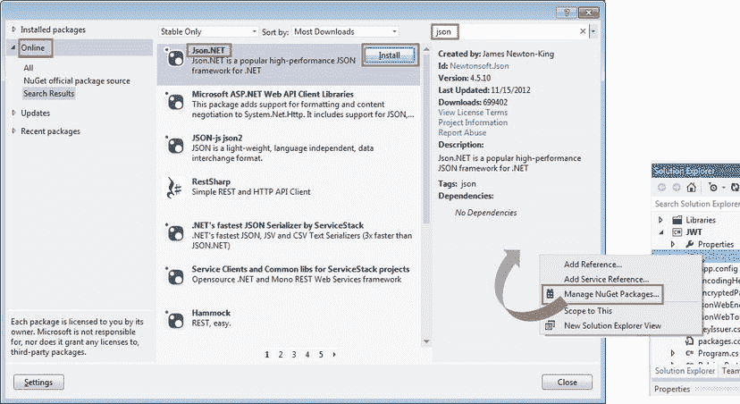
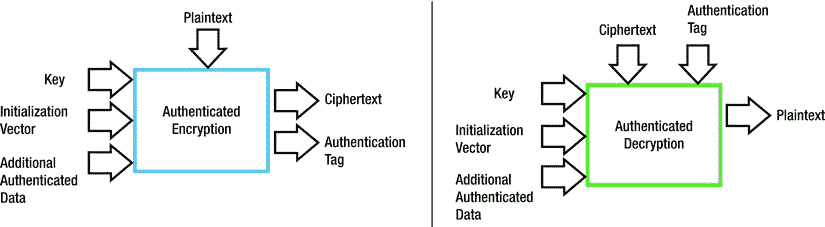

# 十、Web 令牌

安全令牌是为了在网络上安全传输而打包的声明容器。作为声明的载体，安全令牌在第 5 章中的基于声明的安全模型中扮演着重要的角色。令牌发放机构在认证用户凭证之后向客户端应用发放令牌。然后，客户端应用将该令牌作为用户凭证提供给依赖方(RP) 应用。RP 应用验证令牌，并根据令牌中包含的声明为用户建立身份。

与预共享密钥或 X.509 证书等其他所有权因素相比，安全令牌通常是短暂的。然而，这是一个所有权因素，因为客户端应用必须拥有令牌，才能将其提交给 RP 应用进行身份验证和授权。因此，本章是上一章基于所有权因素的安全性的延伸。

安全令牌基本上是一堆字节，但根据格式，有三种主要类型:安全标记断言语言(SAML) 令牌、简单 Web 令牌(SWT) 和 JSON Web 令牌(JWT) 。我在前一章介绍的 SAML 令牌是基于 XML 的，与 SOAP 和 WS-*协议密切相关。WS-Trust 规范中定义的令牌颁发机构的端点是安全令牌服务(STS)。根据 WS-Trust 规范，需要来自 STS 的令牌的客户端向 STS 发出安全令牌请求(RST ),并在安全令牌响应请求(RSTR)中取回令牌。我在[的第 7 章](07.html)中谈到了 WS-Trust 和 STS。

SWT(发音为 *swot* )只是一组 HTML 格式编码的名称-值对，而 JWT 是基于 JSON 的。它们都是 web 令牌，因为它们是为 web 设计的(阅读 HTTP)。与基于 XML 的 SAML 相比，这些标记更紧凑，因此更适合在 HTTP 头中传输。因此，在 ASP.NET web API 所在的 REST 世界中，Web 令牌比 SAML 令牌更受青睐。将 web 令牌与 SAML 令牌区分开来的另一个重要特征是，web 令牌是承载令牌，通常通过承载方案在 HTTP 授权头中使用。

WS-Trust 在 REST 世界中大致相当于 OAuth 2.0，这是一种通常用于请求和获取 web 令牌的协议。OAuth 2.0 不强制要求将 SWT 或 JWT 用作令牌格式。然而，在实践中，当使用 OAuth 2.0 规范时，所使用的令牌通常是 web 令牌。我将在接下来的三章中介绍 OAuth 2.0。由于 web 令牌与 REST 世界的密切关系，我在本章中专门讨论了它们。

简单 Web 令牌

简单的 Web 令牌:名字说明了一切。它是一个令牌，它是用于 web 的(读 HTTP)，它很简单！由于简单和紧凑，对于 ASP.NET Web API 来说，SWT 是一个很好的选择。使用 OAuth 2.0，客户端应用可以请求 SWT，并使用作为承载令牌发布的令牌向 ASP.NET Web API 进行身份验证。通过承载方案在 HTTP 授权报头中发送承载令牌。使用承载方案的 HTTP 授权报头的一个例子是`Authorization: Bearer <base64 encoded token bytes>`

.

剖析一个 SWT

在这一节，我着重解释一下 SWT 的剖析。然而，剖析是不需要的，因为 SWT 的内部是有目共睹的。毕竟，这是一个简单的令牌！

SWT 只是 HTML 形式编码的名称-值对。令牌发放者和 RP 决定确切的名称和值。但是，有几个名称-值对令牌的功能非常重要:颁发者、受众和 ExpiresOn。见[清单 10-1](#list1) 中的 SWT 样本。

[***清单 10-1。***](#_list1) 样 SWT

```cs
Audience%3Dhttp%3A%2F%2Fserver.com%2Fapi%26ExpiresOn%3D1255913549%26Issuer%3Dhttps%3A%2F%2Fmyservice.accesscontrol.windows.net%2F%26role%3DAdmin%2CUser%26HMACSHA256%3DsT7Hr9z%2B3t1oDFLpq5GOToVsu6Dyxpq7hHsSAznmwnI%3D
```

清单 10-1 中的 SWT 看起来不太顺眼，因为它是编码的，但它基本上是一串名称-值对。[清单 10-2](#list2) 显示了我解码后的样子，突出显示字段名称，并将每个名称-值对放在一个新行上。

[***清单 10-2。***](#_list2)【SWT】解码内容

```cs
Audience = http://server.com/api &
ExpiresOn =1255913549&
Issuer = https://myservice.accesscontrol.windows.net/ &
role =Admin,User&
HMACSHA256 =sT7Hr9z+3t1oDFLpq5GOToVsu6Dyxpq7hHsSAznmwnI=
```

以下列表详细解释了清单 10-2 中的每个字段。

1.  受众是 RP 应用。当您将 SWT 与 ASP.NET Web API 一起使用时，受众字段将表示您的 ASP.NET Web API。令牌发放机构可以为多个 RP 发放令牌。RP 应用将只接受专门颁发给它的令牌。
2.  ExpiresOn 是令牌过期时间戳。出于显而易见的原因，令牌不会永远存在，而且有一个到期日期和时间。一些国家有夏令时。当为此目的调整时间时，它会影响就在时间更改之前发布的令牌的生命周期。此外，不同的国家遵循不同的格式。例如，02/06 在某些国家是 6 月 2 日，而在其他国家是 2 月 6 日。为了避免混淆和简化表示，我们使用 UNIX 时间，这是从 1970 年 1 月 1 日午夜开始的秒数。
3.  Issuer 是令牌颁发机构。如果令牌来自 RP 应用不信任的发行者，那么令牌及其包含的声明就没有面值。如果发行者被认为是可信的，那么令牌就有价值，就像纸币一样。一张纸币可能只是一张皱巴巴、脏兮兮的纸，但它有能力购买东西，因为它是由人们信任的人发行的。这里需要特别注意的是，只有当 SWT 是由它信任的发行者发行并且令牌是专门为它发行的，RP 才必须兑现它。对于第一个检查，发布者字段很重要，而对于第二个检查，受众字段很重要。
4.  清单 10-2 中的角色是一个自定义的名称-值对。它指示用户所属的角色，最有可能在访问控制中使用。声明也是名称-值对，因此将字段的名称映射到声明类型，将值映射到声明值非常方便。可以有多个自定义名称-值对。
5.  HMACSHA256 是最重要的名称-值对。根据 SWT 规范的定义，这始终是姓氏-值对，并且是唯一必需的名称-值对。此名称-值对的值是令牌中所有其他名称-值对的 HMAC。HMAC 基本上是通过散列消息和密钥的组合而生成的代码。在 SWT 的情况下，令牌中除 HMACSHA256 之外的名称-值对用于创建 HMAC。HMAC 生成中使用的密钥是一个共享的对称密钥，只有颁发者和 RP 应用知道。HMACSHA256 名称-值对的目的是确保令牌的完整性和真实性。当 RP 应用收到令牌时，它会计算 HMAC 代码，并将其与 HMACSHA256 名称-值对的值进行比较。匹配值意味着令牌在传输过程中没有被篡改。唯一能够创建与 RP 应用相同的 HMAC 的实体是持有相同密钥的实体，即令牌发放者。这种方式也确保了令牌的真实性。然而，SWT 不能确保令牌内容的机密性。毫无疑问，SWT 可以被加密，但这不是 SWT 规范所定义的。

 **注意**令牌的发行者和被发行者共享一个 256 位的密钥。因为密钥是共享的，换句话说，在两端使用相同的密钥，所以它是对称密钥。因为对称密钥对双方都是已知的，所以它被泄露的风险要高一倍。因此，通过在特定时间段后丢弃一个密钥并生成一个新密钥来轮换对称密钥是很重要的。

在控制台应用中使用 SWT

如果你正在阅读这本关于 ASP.NET Web API 安全的书，很可能你对保护 ASP.NET Web API 感兴趣。然而，我使用控制台应用演示了一个 SWT。控制台应用 编写、运行、调试和理解更快。此外，我不相信在不同的上下文中重复书中相同的代码。在第 5 章的[中，“实现基于声明的 ASP.NET Web API”一节清楚地说明了如何在 ASP.NET Web API 中使用 Windows Identity Foundation (WIF)类来使用声明。这里没有实现的是处理令牌和提取声明的代码。在这一节中，我将介绍这一缺失的部分，当然是从 SWT 的角度。因此，为了将重点放在 SWT 上，这是这里讨论的核心主题，我使用了一个控制台应用。令牌发放者和 RP 都被建模为简单的 C# 类。实际上，这些实体将是应用而不是类，这是显而易见的。以下是我在本节中涉及的四个类。](05.html)

1.  使用`Main`方法作为客户端应用的`Program`类。
2.  `TokenIssuer`用发出 SWT 的`GetToken`方法类，它只是一个字符串。
3.  `RelyingParty`类有两个方法。
    *   a.接受令牌并根据令牌中的声明建立身份的`Authenticate`方法。
    *   b.`TheMethodRequiringAuthZ`方法，顾名思义，是一种访问控制的方法。根据令牌中的声明，允许或拒绝客户端应用调用此方法。
4.  `SimpleWebToken`类，实现了 SWT 规范。

程序类

控制台应用的`Program`类的`Main`方法充当客户端应用。它在`TokenIssuer`对象上调用`GetToken`方法，将令牌呈现给`RelyingParty`对象并调用`TheMethodRequiringAuthZ`方法，如[清单 10-3](#list3) 所示。

[***清单 10-3。***](#_list3) 客户端应用

```cs
class Program
{
    static void Main(string[] args)
    {
        // Token issuer
        TokenIssuer issuer = new TokenIssuer();

        // Relying party app
        RelyingParty app = new RelyingParty();

        // A client of the relying party app gets the token
        string token = issuer.GetToken("MyRelyingPartApp", "jqhuman:opensesame");

        // With the token, client now presents the token to Authenticate()
        // and calls the access protected method
        app.Authenticate(token);
        app.TheMethodRequiringAuthZ();
    }
}
```

TokenIssuer 类

`TokenIssuer`类中有两个方法:一个是`GetToken`，返回一个 SWT，第二个是`GenerateKey`，生成一个 256 位的密钥，可以作为`TokenIssuer`和`RelyingParty`的共享密钥。清单 10-4 显示了`GenerateKey`方法。在这里的示例中，我没有使用这种方法；我只是用一个硬编码的键来代替。为了完整起见，我展示了密钥生成的代码。

`GenerateKey()`方法使用`RNGCryptoServiceProvider`生成并返回一个 256 位的密钥。在实践中，发行者必须针对受众存储生成的密钥，以便稍后用于对生成的令牌进行签名，但是我在这里没有这样做，因为我使用了硬编码的密钥进行说明。

[***清单 10-4。***](#_list4) 生成密钥方法

```cs
public class TokenIssuer
{
    public string GenerateKey(string audience)
    {
        using (var provider = new RNGCryptoServiceProvider())
        {
            byte[] secretKeyBytes = new Byte[32];
            provider.GetBytes(secretKeyBytes);

            return Convert.ToBase64String(secretKeyBytes);
        }
    }
}
```

 **注意**没有强制要求令牌发放机构也必须发放共享密钥。它可以是 RP 应用之外的某个其他实体。在涉及 X.509 证书的非对称密钥的情况下，证书由 CA 颁发，CA 不同于 RP，也不同于颁发机构。在 SWT 的情况下，密钥是共享的对称密钥。从第三方获得它没有太多价值，因此发行机构通常生成一个。

接下来是`GetToken`方法，如[清单 10-5](#list5) 所示。它接受两个参数:受众和凭证。需要受众或 RP，以便挑选出对应于 RP 的正确共享密钥来对令牌进行签名。传入凭据的原因很明显。只有当传入的凭据是可信的时，才会颁发令牌。然而，出于这个例子的目的，我完全忽略了这两个参数，并使用了硬编码的键。`GetToken()`方法创建一个新的 SWT，添加一些硬编码的声明，并发回令牌的字符串表示。

[***清单 10-5。***](#_list5) TokenIssuer GetToken 方法

```cs
public class TokenIssuer
{
    public string GetToken(string audience, string credentials)
    {
        // TODO - Authenticate credentials here
        // TODO - Based on the audience passed in, pick the shared key from key store
        // Just hard-coding a key here
        string key = "qqO5yXcbijtAdYmS2Otyzeze2XQedqy+Tp37wQ3sgTQ=";
        SimpleWebToken token = new SimpleWebToken(key)
                                     { Issuer = "TokenIssuer" };
        token.AddClaim(ClaimTypes.Name, "jqhuman");
        token.AddClaim(ClaimTypes.Email, "jqhuman@somewhere.world");
        token.AddClaim(ClaimTypes.Role, "Developer");
        token.AddClaim(ClaimTypes.Role, "Administrator");

        return token.ToString();
    }
}
```

RelyingParty 类

`RelyingParty`接受令牌作为认证凭证。它通过`Authenticate()`方法接受令牌。它对字符串形式的令牌做的第一件事是调用静态方法`Parse()`。如果解析一切顺利，这个字符串就会生成一个 SWT。令牌中包含的声明用于创建一个`ClaimsIdentity`和一个`ClaimsPrincipal`，后者被设置为`Thread.CurrentPrincipal`。因此，作为调用`Authenticate()`方法的一部分，读取并验证一个 SWT，解析出声明，并基于这组声明建立一个身份。

`The RelyingParty`类有一个受访问控制的`TheMethodRequiringAuthZ()`方法。我使用`PrincipalPermission`来寻找开发人员的特定角色，这不如使用基于声明的访问控制，但将有助于保持代码精简，并将注意力集中在 SWT 的核心主题上。参见清单 10-6 。

[***清单 10-6。***](#_list6)relying 党类

```cs
public class RelyingParty
{
    // RelyingParty and TokenIssuer share the secret key (symmetric key)
    private string key = "qqO5yXcbijtAdYmS2Otyzeze2XQedqy+Tp37wQ3sgTQ=";

    public void Authenticate(string token)
    {
        try
        {
            SimpleWebToken swt = SimpleWebToken.Parse(token, key);
            Console.WriteLine(swt.ToString());

            // Now, swt.Claims will have the list of claims
            swt.Claims.ToList().ForEach(c => Console.WriteLine("{0} ==> {1}", c.Type, c.Value));

            Thread.CurrentPrincipal = new ClaimsPrincipal(new[] { new ClaimsIdentity(swt.Claims, "SWT") });
        }
        catch (Exception ex)
        {
             Console.WriteLine(ex.Message);
        }
    }

    [PrincipalPermission(SecurityAction.Demand, Role = "Developer")]
    public void TheMethodRequiringAuthZ()
    {
        Console.WriteLine("Remember what uncle Ben said . . .");
        Console.WriteLine("With great power comes great responsibility");
    }
}
```

 **注意**在创建`ClaimsIdentity`的时候，“SWT”的第二个参数看似无关紧要，实际上在。NET 框架 4.5。如果没有这个，身份的`IsAuthenticated`属性仍然是假的，您的所有授权将会在没有明显原因的情况下失败。

SimpleWebToken 类

最后但同样重要的是，我向您展示了`SimpleWebToken`的代码。我有意避开与 WIF 相关的课程，以便专注于 SWT。前面的`TokenIssuer`类不是`SecurityTokenService`的子类。`SimpleWebToken`也不继承`SecurityToken`。除了标准化或统一性之外，没有其他真正的理由为此使用 WIF 类。`SimpleWebToken`是一个很大的类，很难在一个清单中显示所有的代码行。出于这个原因，我将这个类分为四个逻辑部分，如下所示。

1.  The properties of the `SimpleWebToken` class: `Issuer`, `Audience`, `ExpiresOn`, and `Signature`. `ExpiresOn` is not a timestamp but is the number of seconds since midnight of January 1, 1970 UTC for the token to expire. It adds two minutes to the current date and time and computes the UNIX time for the same. I use two minutes as the lifetime for our SWT. `Signature` is just the value of the HMACSHA256 name–value pair. The constructor takes in the 256-bit code shared key of the audience for which this token is being created. See [Listing 10-7](#list7).

    [***清单 10-7。***](#_list7) 简单 Web 令牌(部分):属性

    ```cs
    public class SimpleWebToken
    {
        private static readonly TimeSpan lifeTime = new TimeSpan(0, 2, 0);
        private static readonly DateTime epochStart = new DateTime(1970, 01, 01, 0, 0, 0, 0, DateTimeKind.Utc);
        private NameValueCollection nameValuePairs;
        private byte[] keyBytes = null;

        public SimpleWebToken(string key)
        {
            TimeSpan ts = DateTime.UtcNow - epochStart + lifeTime;
            this.ExpiresOn = Convert.ToUInt64(ts.TotalSeconds);
            this.nameValuePairs = new NameValueCollection();

            keyBytes = Convert.FromBase64String(key);
        }

        public string Issuer { get; set; }
        public string Audience { get; set; }
        public byte[] Signature { get; set; }
        public ulong ExpiresOn { get; private set; }
    }
    ```

2.  Now, let’s get to the claims part. There is a method to add claims in the form of name–value pairs. There is a read-only property that returns the claims thus added in the form of `IList<Claim>` (see [Listing 10-8](#list8)). A little bit of complication here is that the property getter handles the case of multivalue claims such as role. There can be multiple claims with the same name; in such cases, the values for that name are grouped as comma-separated values. For example, role=role1&role=role2 will be role=role1,role2.

    [***清单 10-8。***](#_list8) 简单 Web 令牌(部分):Claims 属性和 AddClaim 方法

    ```cs
    public IList<Claim> Claims
    {
        get
        {
            return this.nameValuePairs.AllKeys
                     .SelectMany(key =>
                             this.nameValuePairs[key].Split(',')
                                    .Select(value => new Claim(key, value))
                                               ).ToList();
        }
    }

    public void AddClaim(string name, string value)
    {
        this.nameValuePairs.Add(name, value);
    }
    ```

3.  The `ToString()` method of `object` is overridden to return the string representation of the SWT or the serialized token, as shown in [Listing 10-9](#list9). Following are the steps.
    *   a.首先，在相应的字段中填入发行方。
    *   b.添加声明。声明只是一个名称-值对。因此，只需遍历添加到令牌中的声明集，并使用名称和值将每个声明添加到序列化表示中。
    *   c.添加过期戳和受众。
    *   d.最后，在 HMACSHA256 字段中添加签名。被散列的是除 HMACSHA256 字段之外的 SWT 的全部内容。换句话说，到目前为止添加到`StringBuilder`中的都是必须签名的数据。签名是数据的 HMAC-SHA256 散列，使用类`HMACSHA256`创建。

    [***清单 10-9。***](#_list9) 简单 Web 令牌(部分):ToString 方法

    ```cs
    public override string ToString()
    {
        StringBuilder content = new StringBuilder();

        content.Append("Issuer=").Append(this.Issuer);

        foreach (string key in this.nameValuePairs.AllKeys)
        {
            content.Append('&').Append(key).Append('=').Append(this.nameValuePairs[key]);
        }

        content.Append("&ExpiresOn=").Append(this.ExpiresOn);

        if (!string.IsNullOrWhiteSpace(this.Audience))
        {
            content.Append("&Audience=").Append(this.Audience);
        }

        using (HMACSHA256 hmac = new HMACSHA256(keyBytes))
        {
            byte[] signatureBytes = hmac.ComputeHash(Encoding.ASCII.GetBytes(content.ToString()));

            string signature = HttpUtility.UrlEncode(Convert.ToBase64String(signatureBytes));

            content.Append("&HMACSHA256=").Append(signature);
        }

        return content.ToString();
    }
    ```

4.  在`SimpleWebToken`类中，`Parse`方法从它的字符串表示中创建了一个 SWT 对象，同时验证签名和令牌过期。参见[清单 10-10](#list10) 。`Parse`方法将 SWT 从它的序列化表示中反序列化。它基本上是早期方法`ToString()`的一个逆转。
    *   a.使用`HttpUtility.ParseQueryString()`解码并提取名称-值对。
    *   b.遍历令牌中的所有名称。如果名称-值对是预定义的名称-值对，如受众、过期戳、颁发者或签名，则在返回的`SimpleWebToken`对象的相关属性中设置相应的值。如果名称-值对不是这些预定义的名称-值对之一，则创建一个声明对象，声明类型作为名称，声明值作为与名称对应的值。
    *   c.签名验证按如下方式完成。(1)作为名称循环的一部分，`Signature`属性被设置为名为 HMACSHA256 的字段的值。这是传入的签名。它需要与计算的签名进行比较。(2)通过重用已经在`ToString()`方法中实现的序列化逻辑来计算签名。我设置属性并调用`ToString()`，从而获得由`ToString()`方法返回的字符串中的计算签名。我简单地使用`HttpUtility.ParseQueryString()`提取出计算签名，生成名称-值对，并使用 HMACSHA256 名称获得计算签名。(3)将该计算的签名与保存在`Signature`属性中的输入签名进行比较。如果两个签名匹配，则令牌在传输过程中没有被篡改。
    *   d.在`Parse`方法中完成的另一个验证是到期检查，这是不言自明的。我计算当前日期和时间的 UNIX 时间，并将其与创建 SWT 时作为到期时间输入的 UNIX 时间进行比较。如果令牌已经过期，我就抛出一个`SecurityException`。
    *   e.与检查 RP 的受众和发布机构的发布者相关的验证留给读者做练习！这个步骤背后的基本思想是确保令牌是由 RP 信任的颁发机构创建的，并且令牌是专门为 RP 应用铸造的。

[***清单 10-10。***](#_list10) 简单 Web 令牌(部分):解析方法

```cs
public static SimpleWebToken Parse(string token, string secretKey)
{
    var items = HttpUtility.ParseQueryString(token);
    var swt = new SimpleWebToken(secretKey);

    foreach (string key in items.AllKeys)
    {
        string item = items[key];
        switch (key)
        {
            case "Issuer": swt.Issuer = item; break;
            case "Audience": swt.Audience = item; break;
            case "ExpiresOn": swt.ExpiresOn = ulong.Parse(item); break;
            case "HMACSHA256": swt.Signature =
                                  Convert.FromBase64String(item); break;
            default: swt.AddClaim(key, items[key]); break;
        }
    }

    string rawToken = swt.ToString(); // Computes HMAC inside ToString()
    string computedSignature = HttpUtility.ParseQueryString(rawToken)
                                                       ["HMACSHA256"];

    if (!computedSignature.Equals(Convert.ToBase64String(swt.Signature),
                                                StringComparison.Ordinal))
        throw new SecurityTokenValidationException("Signature is invalid");

    TimeSpan ts = DateTime.UtcNow - epochStart;

    if (swt.ExpiresOn < Convert.ToUInt64(ts.TotalSeconds))
        throw new SecurityTokenException("Token has expired");

    return swt;
}
```

因此，我们使用 SWT 向 RP 应用提供声明(角色声明)。我们没有遵循诸如 OAuth 2.0 之类的任何协议来请求和获得 SWT。令牌请求和随后向 RP 的呈现都是通过简单的方法调用来完成的。

当您使用 ASP.NET SWT Web API 时，RP 应用就是您的 Web API。令牌发放者可以是一个外部实体，比如 Azure Access Control Service(ACS)或者是内部可用的东西。如果你实现了自己的令牌发放者，它可以遵循[清单 10-5](#list5) 中的`TokenIssuer`类。在 ASP.NET Web API 中，您可以在消息处理程序中实现身份验证逻辑。消息处理程序将从承载方案中的授权请求报头中提取序列化令牌，并调用`SimpleWebToken`的`Parse`静态方法，传递从报头中检索到的序列化令牌。如果令牌是有效的，就可以提取声明并基于声明创建一个身份，如清单 10-6 所示。

JSON Web 令牌

JWT 是一个令牌，这意味着它存在的主要目的是将一组声明从颁发机构传递到请求者，以及从请求者传递到 RP。JWT(读作 *jot* )非常像 SWT，除了它是 JSON 格式。SWT 由 HTML 格式编码的名称-值对组成，但是 JWT 基于 JSON，对于基于 JavaScript 的应用来说，JSON 更容易使用。需要注意的一个重要区别是 SWT 不支持加密。没有什么可以阻止我们对 SWT 进行加密，但是它没有被定义为 SWT 规范的一部分。相比之下，JWT 有以下三种口味。

1.  纯文本 JWT:一种既没有完整性保护也没有加密的 JWT。
2.  签名 JWT:声明集受到 HMAC 或数字签名的保护，不会被篡改的 JWT，该数字签名根据 JSON Web 签名(JWS)使用公钥基础设施(PKI)。
3.  加密的 JWT:按照 JSON Web Encryption (JWE)的规定，声明集被加密以保证机密性的 JWT。

在下面的章节中，我将介绍签名的 JWT 和加密的 JWT。纯文本 JWT 只是签名 JWT(没有签名)的一个子集，因此我不专门讨论纯文本 JWT。

Base64 URL 编码

与基于 XML 的 SAML 不同，web 标记 REST 和 JWT——是紧凑的，因此更适合在基于 REST 的服务的 HTTP 头中使用。web 令牌甚至可以在 URL 的查询字符串部分发送。JWT 规范在定义用于 JWT 的编码方案时考虑了最后一部分。

标准做法是使用 base64 编码来传输二进制数据，例如加密的字节数组或数字签名，后者也是字节数组。当二进制数据必须作为文本数据的一部分传输时，例如，如果我们需要发送一个在 HTTP 头中包含签名的令牌，该令牌只接受文本或字符串数据，则使用 base64 编码来确保二进制数据在传输过程中不会损坏。

那个。NET Framework 有`Convert.ToBase64String(byte[])`和`Convert.FromBase64String(string)`将字节数组转换成 base64 编码的字符串，反之亦然。在 URL 中使用标准 base64 编码需要将标准 base64 编码创建的一些字符(如“+”、“/”或“=”字符)分别编码为特殊的编码序列“%2B”、“2F”和“%3D”。我们现在有三个字符，而不是一个。这使得有效负载更大，这违背了使有效负载尽可能紧凑的目标，以便在 HTTP 头或查询字符串中使用。

因此，JWT 规范指定使用 base64 URL 编码。Base 64 URL 编码是标准 Base 64 编码的一种变体，其中'+'和'/'字符分别被替换为'-'和' _ '，并且删除了填充的' = '字符，以便有效负载保持不变，而不管 URL 编码还是表单编码。

在我们深入研究 JWT 的内部机制之前，让我们花点时间回顾一下完成 base64 URL 编码的逻辑，这样我们以后就可以专心于核心主题了。

清单 10-11 显示了帮助我们在标准 base64 编码之上执行 base64 URL 编码的扩展方法。

[***清单 10-11。***](#_list11) Base64 URL 编码扩展

```cs
public static class EncodingHelper
{
    public static string ToBase64String(this byte[] bytes)
    {
        return Convert.ToBase64String(bytes).TrimEnd('=').Replace('+', '-').Replace('/', '_');
    }

    public static string ToBase64String(this string input)
    {
        return Convert.ToBase64String(Encoding.UTF8.GetBytes(input))
                        .TrimEnd('=').Replace('+', '-').Replace('/', '_');
    }

    public static byte[] ToByteArray(this string input)
    {
        input = input.Replace('-', '+').Replace('_', '/');

        int pad = 4 - (input.Length % 4);
        pad = pad > 2 ? 0 : pad;

        input = input.PadRight(input.Length + pad, '=');

        return Convert.FromBase64String(input);
    }
}
```

`ToBase64String()`方法不言自明。它只是使用`Convert.ToBase64String()`执行标准的 base64 编码。在结果字符串中，它用“-”替换“+”，用“-”替换“/”，并删除尾随的“=”。

`ToByteArray()`做解码，有点复杂。首先，它放回编码时替换的“+”和“/”。在放回结尾的“=”时的难题是放回多少。我们在编码时盲目地去掉了尾随的' = '。数学来拯救我们了。如果长度能被 4 整除，那么在标准的 base64 编码的字符串中就不会有任何尾随的“=”。有效的 base64 编码字符串将有一个尾随“=”或两个尾随“=”，如“==”。所以，我们得到 4 的模数，这是长度除以 4 的余数，然后从 4 中减去它，得到要填充的空白空间。如果它是合法的值 1 或 2，我们在字符串的末尾用那么多的' = '填充字符串。如果它是零或任何其他值，我们什么也不做。一旦应用了这个逻辑，我们就可以从 base64 URL 编码的字符串中获得标准的 base64 编码的字符串，我们只需使用。NET 框架。

随着 base64 网址编码的方式了，我们回到了 JWT 的主要议题。

解析签名的 JSON Web 令牌

一个已签名的 JWT 有它的有效载荷，即声明集，借助于签名来保护它不被篡改。这里的签名既代表 HMAC，也代表使用 PKI 私钥创建的签名。在本书中，我使用 HMAC-SHA256 作为签名，与使用 SWT 相同。

让我们从查看一个签名 JWT 的样本开始，如[清单 10-12](#list12) 所示。就可读性而言，它比 SWT 差。SWT 是表单编码的，这让它看起来很难看，但是 JWT 完全是胡言乱语，因为它是 base64 URL 编码的。[清单 10-12](#list12) 展示了我们在 C# 代码中处理 JWT 时得到的结果。

[***清单 10-12。***](#_list12) 样 JWT

```cs
eyJ0eXAiOiJKV1QiLCJhbGciOiJIUzI1NiJ9.eyJleHAiOiIxMzUwNzExNTI0IiwiaXNzIjoiVG9rZW5Jc3N1ZXIiLCJhdWQiOiJNeVJlbHlpbmdQYXJ0QXBwIiwiaHR0cDovL3Nja|GVtYXMueG1sc29hcC5vcmcvd3MvMjAwNS8wNS9pZGVudGl0eS9jbGFpbXMvbmFtZSI6ImpxaHVtYW4iLCJodHRwOi8vc2NoZW1hcy5taWNyb3NvZnQuY29tL3dzLzIwMDgvMDYvaWRlbnRpdHkvY2xhaW1zL3JvbGUiOiJEZXZlbG9wZXIsQWRtaW4ifQ.3_TI8aTLcKHW17bpkZL2_-sngnQ0uD86JQ-MtmZxeKM
```

清单 10-13 显示了一个更好看的解码 JWT。我不仅解码了内容，还把分隔点(。)以便您可以看到令牌的各个部分。

[***清单 10-13。***](#_list13) 解码 JWT 给你的阅读乐趣

```cs
{"typ":"JWT","alg":"HS256"}
.
{"exp":"1350711524","iss":"TokenIssuer","aud":"MyRelyingPartApp"," http://schemas.xmlsoap.org/ws/2005/05/identity/claims/name":"jqhuman","http://schemas.microsoft.com/ws/2008/06/identity/claims/role":"Developer,Admin "}
.
[Signature - HMAC SHA256]
```

清单 10-13 中有三个部分。

1.  首先是 JWT 头球。因为这是一个受使用 SHA256 创建的 HMAC 保护的令牌，所以算法字段反映了这条信息。头段在 JSON 中。
2.  第一个点之后的部分包含索赔集。这是实际有效载荷。我使用三个保留声明，即过期时间声明(exp)、发行者声明(iss)和受众声明(aud)。保留声明，顾名思义，是规范所保留的。这类似于编程语言为命名变量而保留的某些关键字。保留权利要求的目的是防止歧义。当在 JWT 有 iss 索赔时，你肯定知道它是发行人索赔。也有私人索赔。您可以将对您的应用有意义的声明放在这里。在前面的示例中，我使用了。NET Framework 声明类型和声明值。有效载荷段也在 JSON 中。
3.  因为我们看到的是签名的 JWT，它受到 HMAC 的保护，所以我展示了包含签名的第三段。我不能有意义地将签名解码成字符串，因此只显示一个占位符。

 **注意**如果这是一个纯文本的 JWT，那么头上会有“alg”:“none”，第三段就没有了。

在控制台应用 中使用签名的 JSON Web 令牌

与我演示 SWT 的方式类似，我在这里的控制台应用中使用了一个签名的 JWT。为了保持对 JWT 的关注，令牌发放者和 RP 被建模为简单的 C# 类。实际上，这些实体将是应用而不是类，这是显而易见的。以下是我在本节中涉及的四个类。

1.  具有作为客户端应用的`Main`方法的`Program`类。
2.  使用`GenerateSharedSymmetricKey`方法生成对称密钥的`KeyIssuer`类。
3.  带有发出 JWT 的`GetToken`方法的`TokenIssuer`类，它只是一个字符串。它还有一个`ShareKeyOutofBand`，用于在带外密钥交换期间接受共享密钥。
4.  `RelyingParty`类有三个方法。
    *   a.在带外密钥交换期间接受共享密钥的`ShareKeyOutofBand`方法。
    *   b.接受令牌并根据令牌中的声明建立身份的`Authenticate`方法。
    *   c.`TheMethodRequiringAuthZ`方法，顾名思义，是一种访问控制的方法。根据令牌中的声明，允许或拒绝客户端应用调用此方法。
5.  实现 JWT 和 JWS 规范的`JsonWebToken`类。

程序类

在[清单 10-14](#list14) 所示的`Program`类的`Main`方法中实现的逻辑由两个主要部分组成。

1.  对称密钥生成，随后在`TokenIssuer`和`RelyingParty`之间共享密钥。调用`KeyIssuer`对象上的`GenerateSharedSymmetricKey`方法来生成共享密钥。然后通过调用`ShareKeyOutofBand`方法与`TokenIssuer`和`RelyingParty`对象共享。实际上，这部分发生在带外。
2.  调用`TokenIssuer`对象上的`GetToken`方法，返回的令牌通过`Authenticate`方法调用呈现给`RelyingParty`对象，然后调用访问控制的`TheMethodRequiringAuthZ`方法。这一部分表示客户端应用获取令牌并将其呈现给 RP。

[***清单 10-14。***](#_list14) 控制台应用

```cs
class Program
{
    static void Main(string[] args)
    {
        string secretKey = KeyIssuer.GenerateSharedSymmetricKey();

        // Token issuer
        TokenIssuer issuer = new TokenIssuer();
        issuer.ShareKeyOutofBand("MyRelyingPartApp", secretKey);

        // Relying Party
        RelyingParty app = new RelyingParty();
        app.ShareKeyOutofBand(secretKey);

        // A client of the relying party app gets the token
        string token = issuer.GetToken("MyRelyingPartApp", "opensesame");

        // With the token, the client now presents the token and
        // calls the method requiring authorization
        app.Authenticate(token);
        app.TheMethodRequiringAuthZ();
    }
}
```

密钥发布者类

我使用对称共享密钥创建 HMAC 作为 SWT 的签名。[清单 10-15](#list15) 显示了`KeyIssuer`类，我将在这里介绍它。它类似于我们在本章前面的“简单 Web 令牌”一节中看到的`TokenIssuer`类中的密钥生成代码。必须将密钥生成分离出来，因为我将在这些类的基础上构建一个 JWT 来实现加密。当涉及公钥和私钥时，就像非对称密钥的情况一样，令牌发放者生成密钥不再有意义。

[***清单 10-15。***](#_list15) 对称密钥生成

```cs
public class KeyIssuer
{
    public static string GenerateSharedSymmetricKey()
    {
        // 256-bit key
        using (var provider = new RNGCryptoServiceProvider())
        {
            byte[] secretKeyBytes = new Byte[32];
            provider.GetBytes(secretKeyBytes);

            return Convert.ToBase64String(secretKeyBytes);
        }
    }
}
```

TokenIssuer 类

这里使用的`TokenIssuer`类与我们在 SWT 中使用的非常相似。对它有一个小的改进，那就是可以用来与带外发行者共享密钥的方法。令牌发放者将密钥存储在针对受众(RP)的字典中，并检索它以供后续使用。当然，我使用了一个控制台应用，其中的类代表了真实场景中的实体，但是过程基本上是相同的。

`GetToken()`创建一个`JsonWebToken`类的新实例，传递对应于 RP(观众)的对称密钥和一个代表令牌颁发者的标识符。对于 RP 来说，后者对于验证令牌是否由它信任的人发出是很重要的。参见[清单 10-16](#list16) 。

[***清单 10-16。***](#_list16) TokenIssuer GetToken()方法

```cs
public class TokenIssuer
{
    private Dictionary<string, string> audienceKeys = new Dictionary<string, string>();

    // This method is called to register a key with the token issuer against an audience or an RP
    public void ShareKeyOutofBand(string audience, string key)
    {
        if (!audienceKeys.ContainsKey(audience))
            audienceKeys.Add(audience, key);
        else
            audienceKeys[audience] = key;
    }

    public string GetToken(string audience, string credentials)
    {
        // Ignoring the credentials and adding a few claims for illustration
        JsonWebToken token = new JsonWebToken()         {
               SymmetricKey = audienceKeys[audience],
               Issuer = "TokenIssuer",
               Audience = audience        };

        token.AddClaim(ClaimTypes.Name, "jqhuman");
        token.AddClaim(ClaimTypes.Role, "Developer");
        token.AddClaim(ClaimTypes.Role, "Admin");

        return token.ToString();
    }
}
```

RelyingParty 类

清单 10-17 中的[所示的`RelyingParty`类有一个`ShareKeyOutofBand()`方法，就像`TokenIssuer`类一样。假设 RP 依赖于一个令牌发布机构，因此密钥简单地存储在类级别以供后续使用。](#list17)

`Authenticate()`方法是客户端提供 JWT 进行身份验证的方法。RP 使用`JsonWebToken.Parse()`将令牌反序列化为一个对象，并从该对象获取声明。基于这个声明集，建立一个声明标识，创建一个`ClaimsPrincipal`，并将其设置为`Thread.CurrentPrincipal`，以便下游代码进行访问控制。

一个这样的地方是方法`TheMethodRequiringAuthZ()`，它是受访问保护的，只能由角色为“开发人员”的用户使用。为了简单起见，这里使用基于角色的访问控制(RBAC)。在实际的生产强度代码中，建议使用基于声明的访问控制。

[***清单 10-17。***](#_list17) 依托方

```cs
public class RelyingParty
{
    private string secretKey = String.Empty;

    public void ShareKeyOutofBand(string key)
    {
        this.secretKey = key;
    }

    public void Authenticate(string token)
    {
        JsonWebToken jwt = null;

        try
        {
            jwt = JsonWebToken.Parse(token, this.secretKey);

            // Now, swt.Claims will have the list of claims
            jwt.Claims.ToList().ForEach(c => Console.WriteLine("{0} ==> {1}", c.Type, c.Value));

            Thread.CurrentPrincipal = new ClaimsPrincipal(new ClaimsIdentity(jwt.Claims, "JWT"));
        }
        catch (Exception ex)
        {
            Console.WriteLine(ex.Message);
        }
    }

    [PrincipalPermission(SecurityAction.Demand, Role = "Developer")]
    public void TheMethodRequiringAuthZ()
    {
        Console.WriteLine("With great power comes great responsibility - Uncle Ben");
    }
}
```

 **注意**在创建`ClaimsIdentity`的时候，“JWT”的第二个参数看似无关紧要，实际上在。NET 框架 4.5。否则，身份的`IsAuthenticated`属性仍然是假的，您的授权将会无缘无故地失败。

JsonWebToken 类

我们现在看看代表签名的 JWT 的类。根据 JWS，签名的 JWT 使用数字签名或简单地使用 HMAC。我保留着签名的 JWT，就像我们以前见过的 SWT 一样。我使用 HMAC-SHA256 作为签名，并使用我们在 SWT 中使用的三个保留声明:受众、发布者和过期。还有其他保留声明，如“不在此之前”(nbf)、“发布于”(iat)、“委托人”(prn)和“JWT 身份证”(jti)，我在这里不使用。如果您碰巧发行自己的令牌，您可以参考 JWT 规范，看看将它们包含在您的令牌中是否有意义。

我使用字典来存储保留的和私有的声明。尽管存在与保留声明相对应的属性，但底层数据提供者是字典。如果有多个相同类型的私有声明，我使用逗号分隔的值，这样我们就可以使用声明类型作为字典的键。根据 JWT 规范，具有重复声明名称的 jwt 必须被拒绝。字典是确保这一点的好机制。

JSON 序列化和反序列化

我使用 JSON.NET 库将`JsonWebToken`对象序列化为它的 JSON 令牌表示，并将令牌反序列化或解析回它的 CLR 对象表示。以下步骤显示了如何将 JSON.NET 添加到您的项目中。

1.  In Visual Studio, right-click the References node in Solution Explorer and select the Manage NuGet Packages . . . option in the shortcut menu, as shown in [Figure 10-1](#Fig1).

    

    [图 10-1。](#_Fig1)通过 NuGet 了解 JSON.NET

2.  点击 Online，搜索 Json，就可以在搜索结果中找到 JSON.NET。
3.  单击安装。这将使 Newtonsoft.Json.dll 成为项目的一部分，并添加对此程序集的引用。

在`JsonWebToken`中，我为标题字段以及保留声明定义了一堆属性。我只想将头字段序列化为 JWT 的字符串表示形式。因此，对于那些对应于头字段的属性，我使用了具有 JWT 规范中定义的名称的`JsonProperty`属性，以便序列化的令牌在 JSON 中具有正确的字段名称。因为紧凑是目标，所以 JWT 规范定义的字段名是简洁的。使用这种命名属性的方法允许我们命名足够长的属性，以具有描述性，并且符合团队可能有的任何编码标准。

我不希望表示保留声明的属性被序列化。因此，我使用了一个`JsonIgnore`属性，并确保它们不会被序列化为字符串标记。与 SWT 类似，我们使用 UNIX 时间来跟踪到期时间。

具有属性的部分实现

具有所有属性的`JsonWebToken`类如清单 10-18 中的[所示。它是不完整的，没有这两个重要的方法。在接下来的几页中，我将很快包括这两个，并在我们到达第 12 章](#list18)时使这个类完整并可重用，在那里我们将看到如何使用 OAuth 2.0 请求这些令牌并在 ASP.NET Web API 中使用它们。

[***清单 10-18。***](#_list18) JsonWebToken(带属性的部分实现)

```cs
public class JsonWebToken
{
        private const string TYPE_HEADER = "typ";
        private const string JSON_WEB_TOKEN = "JWT";
        private const string SIGNING_ALGORITHM_HEADER = "alg";
        private const string HMAC_SHA256 = "HS256";
        private const string EXPIRATION_TIME_CLAIM = "exp";
        private const string ISSUER_CLAIM = "iss";
        private const string AUDIENCE_CLAIM = "aud";

        private static readonly TimeSpan lifeTime = new TimeSpan(0, 2, 0);
        private static readonly DateTime epochStart = new DateTime(1970,01,01,0,0,0,0, DateTimeKind.Utc);

        private byte[] keyBytes = null;
        private Dictionary<string, string> claims = new Dictionary<string, string>();

        public JsonWebToken()
        {
            TimeSpan ts = DateTime.UtcNow - epochStart + lifeTime;
            this.ExpiresOn = Convert.ToUInt64(ts.TotalSeconds);
        }

        [JsonProperty(PropertyName = TYPE_HEADER)]
        public string Type
        {
            get { return JSON_WEB_TOKEN; }
        }

        [JsonProperty(PropertyName = SIGNING_ALGORITHM_HEADER)]
        public string SignatureAlgorithm
        {
            get { return HMAC_SHA256; }
        }

        [JsonIgnore]
        public string SymmetricKey
        {
            get
            {
                return Convert.ToBase64String(keyBytes);
            }
            set
            {
                keyBytes = Convert.FromBase64String(value);
            }
        }

        [JsonIgnore]
        public IList<Claim> Claims
        {
            get
            {
                return this.claims.Keys.SelectMany(key =>
                                            this.claims[key].Split(',')
                                                .Select(value => new Claim(key, value))).ToList();
            }
        }

        [JsonIgnore]
        public ulong ExpiresOn
        {
            get
            {
                return UInt64.Parse(this.claims[EXPIRATION_TIME_CLAIM]);
            }
            private set
            {
                this.claims.Add(EXPIRATION_TIME_CLAIM, value.ToString());
            }
        }

        [JsonIgnore]
        public string Issuer
        {
            get
            {
                return this.claims.ContainsKey(ISSUER_CLAIM) ? this.claims[ISSUER_CLAIM] : String.Empty;
            }
            set
            {
                this.claims.Add(ISSUER_CLAIM, value);
            }
        }

        [JsonIgnore]
        public string Audience
        {
            get
            {
                return this.claims.ContainsKey(AUDIENCE_CLAIM) ?
```

```cs
this.claims[AUDIENCE_CLAIM] :                                              String.Empty;
            }
            set
            {
                this.claims.Add(AUDIENCE_CLAIM, value);
            }
        }

        public void AddClaim(string claimType, string value)
        {
            if (this.claims.ContainsKey(claimType))
                this.claims[claimType] = this.claims[claimType] + "," + value;
            else
                this.claims.Add(claimType, value);
        }

        // Class code not complete
    }
```

序列化(ToString 方法)

[清单 10-19](#list19) 显示了`ToString()`方法，令牌发放者将调用该方法来创建字符串形式的令牌。要创建 HMAC，请使用 base64 URL 编码的第一个数据段(即标题)，在末尾添加一个点，然后添加 base64 URL 编码的第一个数据段(即声明集)。这是必须使用 SHA256 算法创建 HMAC 的数据。Base64 URL 对 HMAC 字节进行编码，并用另一个点分隔符附加到前面的数据段。这就完成了签名 JWT 的组装。

[***清单 10-19。***](#_list19)JsonWebToken:ToString()方法

```cs
public override string ToString()
{
    string header = JsonConvert.SerializeObject(this).ToBase64String();
    string claims = JsonConvert.SerializeObject(this.claims).ToBase64String();
    string signature = String.Empty;

    using (HMACSHA256 hmac = new HMACSHA256(keyBytes))
    {
        string data = String.Format("{0}.{1}", header, claims);
        byte[] signatureBytes = hmac.ComputeHash(Encoding.UTF8.GetBytes(data));
        signature = signatureBytes.ToBase64String();
    }

    return String.Format("{0}.{1}.{2}", header, claims, signature);
}
```

由于 JSON.NET 和 JSON 本身，与 SWT 相比，创建 JWT 的字符串表示的代码更简洁。

反序列化(解析方法)

[清单 10-20](#list20) 展示了`JsonWebToken`的`Parse()`方法。它与`ToString()`正好相反；也就是说，它将字符串表示形式反序列化为 CLR 对象。以下是该过程中涉及的步骤。

1.  确保有三个部分。
2.  把三段分离出来解码。
3.  通过反序列化头 JSON 获得`JsonWebToken`对象。此时，对象还没有完全形成，只有标题数据。最重要的部分，也就是声明集，还没有添加进去。
4.  将声明集 JSON 反序列化回一个字典中，该字典设置在`JsonWebToken`对象中，使它成为一个完整的对象，包含序列化之前它曾经包含的所有数据。
5.  使用报头和声明段计算签名，并将计算的签名与传入的签名进行比较，传入的签名是令牌的第三部分，由点分隔。如果签名匹配，则验证过期。
6.  出于简洁的原因，我不做任何基于发行者或 RP 的验证，但是任何生产实现都必须做这些检查。

[***清单 10-20。***](#_list20) JsonWebToken: Parse()方法

```cs
public static JsonWebToken Parse(string token, string secretKey)
{
    var parts = token.Split('.');
    if (parts.Length != 3)
        throw new SecurityException("Bad token");

    string header = Encoding.UTF8.GetString(parts[0].ToByteArray());
    string claims = Encoding.UTF8.GetString(parts[1].ToByteArray());
    byte[] incomingSignature = parts[2].ToByteArray();
    string computedSignature = String.Empty;

    var jwt = JsonConvert.DeserializeObject<JsonWebToken>(header);
    jwt.SymmetricKey = secretKey;
    jwt.claims = JsonConvert.DeserializeObject<Dictionary<string, string>>(claims);

    using (HMACSHA256 hmac = new HMACSHA256(Convert.FromBase64String(secretKey)))
    {
        string data = String.Format("{0}.{1}", parts[0], parts[1]);
        byte[] signatureBytes = hmac.ComputeHash(Encoding.UTF8.GetBytes(data));
        computedSignature = signatureBytes.ToBase64String();
    }

    if (!computedSignature.Equals(incomingSignature.ToBase64String(), StringComparison.Ordinal))
        throw new SecurityException("Signature is invalid");

    TimeSpan ts = DateTime.UtcNow - epochStart;

    if (jwt.ExpiresOn < Convert.ToUInt64(ts.TotalSeconds))
        throw new SecurityException("Token has expired");

    return jwt;
}
```

这就完成了使用控制台应用的签名 JWT 的实现。在第 5 章中,“实现基于声明的 ASP.NET Web API”一节说明了如何在 ASP.NET Web API 中使用 WIF 类来使用声明。这同样可以通过本节中的 JWT 代码来增强，以便在 ASP.NET Web API 中使用 JWT 的声明。在第 12 章的[中，我实现了 ASP.NET Web API，它接受来自客户端应用的 JWT，客户端应用使用 OAuth 2.0 协议从授权服务器(OAuth 2.0 术语)获取令牌。](12.html)

解析加密的 JSON Web 令牌

与 SWT 规范相反，JWT 规范(确切地说，是 JSON Web Encryption 或 JWE)规定了如何对 JWT 进行加密。加密 JWT 时要使用的加密算法在单独的 JSON Web 算法(JWA)规范中进行了描述。

加密的 JWT 令牌不再遵循我们前面看到的签名 JWT 的格式。我们在 JWS 看到的是三个片段，现在我们在 JWE 看到了五个片段。与签名令牌一样，所有这些字段都是 base64 URL 编码的，并用点分隔。以下是五个部分。

1.  页眉
2.  加密的主密钥，由密钥加密过程产生
3.  初始化向量
4.  由数据加密过程产生的加密数据或密文
5.  标签，由数据加密过程产生

除了头以外的所有数据段基本上都是字节数组。因此，查看这些细分市场的样本没有什么价值。[清单 10-21](#list21) 显示了一个样本标题。

[***清单 10-21。***](#_list21) 样 JWE 表头

```cs
{"alg":"RSA-OAEP", "enc":"A256GCM"}
```

标题中有两个字段。这些字段传达关于加密 JWT 的以下信息。

*   “alg”或算法标识用于加密主密钥的加密算法。在本例中，它是 RSA 加密方案-最佳非对称加密填充(RSAES OAEP)。
*   “enc”或“加密方法”标识用于加密纯文本以产生密文的块加密算法。从加密 JWT 的角度来看，明文是令牌携带的声明集。根据 JWE，认证加密算法必须用于此目的。我将在下一节解释认证加密。在前面的示例中，加密方法是高级加密标准(AES ),密钥大小为 256 位，与伽罗瓦/计数器模式(GCM)操作模式一起使用。GCM 是对称密钥加密块密码的一种操作模式，由于效率和速度而被广泛采用。

要了解如何使用算法和加密方法生成加密 JWT 的其他四个数据段，您需要了解身份验证加密的过程，以及为什么 JWE 规范要求使用身份验证加密。

认证加密

JWT 要么是签名的，要么是加密的。如果声明有效负载不包含任何机密信息，则不需要加密，仅签名就足以确保令牌的完整性。当声明有效负载包含机密信息时，JWT 将被加密。虽然通过身份验证可以确保令牌的机密性，但它不能确保令牌的完整性。因此，采用了认证加密。

认证加密旨在同时提供消息的机密性、完整性和真实性保证。这种类型的加密不同于传统的加密方法。NET Framework 支持 Rijndael 或 Triple DES 等现成的技术，因为在加密纯文本时，除了密文之外，它还会生成一个身份验证标记。支持的加密方法。毫无疑问，NET 框架非常强大。如果正确使用这些方法，恶意用户将无法解密。NET 框架。但是，恶意用户可以修改密文字节，从而破坏数据。因为不涉及签名，所以不可能检测到这种篡改。认证加密算法通过创建认证标签来解决这个问题，该认证标签可用于验证加密的密文是否在传输过程中被篡改。

正如我们在第 6 章中看到的，除了明文，对称加密涉及两个输入。

1.  对称密钥，它是发送方和接收方之间的共享秘密。
2.  An initialization vector, which is shared between the sender and the receiver but need not be a secret.

    在认证加密的情况下，还有第三个输入。

3.  附加认证数据(AAD) ，它是加密过程的输入。加密过程产生的密文不包含这个 AAD。因此，使用密文，不能计算出 AAD。发送方和接收方必须就如何格式化 AAD 并用于带外加密和解密达成一致。如果加密和解密过程中提供的 AAD 不同，解密过程将无法生成纯文本。在加密的 JWT 中，AAD 是由点分隔的前三个数据段。

在传统方法中，即使恶意用户篡改了密文，接收者也能够解密并从中获得一些明文。在这种情况下产生的纯文本将与接收方发送的内容不匹配，但是接收方将无法知道存在差异。但是，使用经过验证的加密方法，解密本身将会失败，并且不会生成任何纯文本。因此，我们获得了使用认证加密的加密和签名的好处。[图 10-2](#Fig2) 说明了认证加密和解密的输入和输出。



[图 10-2。](#_Fig2)认证加密/解密:输入和输出

注意**这个。NET Framework 不支持现成的身份验证加密。但不要害怕！有一个名为 CLR Security 的 CodePlex 项目，您可以从该项目下载一个. NET Framework 程序集，其中包含的类将帮助我们实现身份验证加密。`Security.Cryptography.dll`是程序集，CodePlex 项目的 URL 是`http://codeplex.com/clrsecurity`。在 Windows 8 和 Windows Server 2012 中，`Windows.Security.Cryptography.Core`命名空间的`CryptographicEngine`类支持分别用于认证加密和认证解密的`EncryptAndAuthenticate`和`DecryptAndAuthenticate`方法。**

创建加密 JWT 的方法

下面的步骤展示了如何用我们在上一节中看到的所有五个数据段组装一个加密的 JWT。

1.  第一个数据段，即标题数据段，非常简单。我使用 RSAES OAEP 作为加密主密钥的算法，使用 AES256 GCM 作为加密声明集的加密方法。清单 10-21 中显示的 base64 URL 编码头构成了头段。
2.  生成一个 256 位随机主密钥。
3.  使用 RSAES OAEP(报头中定义的算法)用 RP 的公钥加密上一步中生成的主密钥。Base64 URL 对密文进行编码。这构成了加密 JWT 的第二段。
4.  生成一个 96 位初始化向量(IV)。Base64 URL 对 IV 进行编码。这构成了令牌的第三段。
5.  通过用句点字符“.”将目前形成的三段连接起来，格式化 AAD。AAD 将是由点分隔的头段，后面是由点分隔的 base64 URL 编码的加密主密钥，后面是 base64 URL 编码的 IV。
6.  使用以下内容作为输入执行认证加密(参见[图 10-2](#Fig2) )。
    *   a.Key 是在步骤 2 中生成的纯文本格式的 256 位主密钥。
    *   b.初始化向量是步骤 4 中生成的 96 位随机值。
    *   c.AAD 是对应于步骤 5 中格式化的字符串的字节数组。
    *   d.纯文本是令牌应该携带的声明集的 JSON 表示。
7.  认证加密的输出产生密文和认证标签，它们都是字节数组。
8.  Base64 URL 对密文进行编码。这就形成了第四段。
9.  Base64 URL 对身份验证标记进行编码。这构成了第五个也是最后一个片段。
10.  将所有五个段一个接一个地放在一起，用句点字符“.”隔开。这就完成了组装加密 JWT 的过程。

为了创建加密的 JWT，令牌发放者只需要 RP 的公钥。其他一切都是通过前面的十个步骤生成和计算的。为了从加密的 JWT 中验证和提取声明，RP 应用只需要自己的私钥，当然还有令牌本身。

在控制台应用中使用加密的 JSON Web 令牌

与签名 JWT 的情况类似，我在控制台应用中使用加密的 JWT。为了保持对 JWT 的关注，令牌发放者和 RP 都被建模为简单的 C# 类。实际上，这些实体将是应用而不是类，这是显而易见的。

支持类

在本节中，我没有展示`TokenIssuer`和`RelyingParty`类的代码。这些类与我们看到的署名 JWT 的类非常相似。唯一的区别是使用了`JsonWebEncryptedToken`类而不是`JsonWebToken`类。我将从展示`Main`方法中的代码开始(见[清单 10-22](#list22) )。令牌发放者拥有与 RP 的私钥相对应的公钥。这里不涉及 X.509 证书，由`KeyIssuer`类生成密钥对。

[***清单 10-22。***](#_list22) 主要方法

```cs
static void Main(string[] args)
{
    Tuple<string, string> key = KeyIssuer.GenerateAsymmetricKey();

    TokenIssuer issuer = new TokenIssuer();
    issuer.ShareKeyOutofBand("AnotherRelyingPartApp", key.Item1); // Public Key

    RelyingParty anotherApp = new RelyingParty();
    anotherApp.ShareKeyOutofBand(key.Item2); // Private Key

    string token = issuer.GetEncryptedToken("AnotherRelyingPartApp", "opensesame");
    // With the token, the client now presents the token and calls
    // the method requiring authorization
    anotherApp.AuthenticateWithEncryptedToken(token);
    anotherApp.TheMethodRequiringAuthZ();
}
```

`KeyIssuer`类的`GenerateAsymmetricKey`方法如[清单 10-23](#list23) 所示。`RSACryptoServiceProvider`类用于生成公钥-私钥对，如第 6 章中的[所示。XML 形式的公钥-私钥作为一个`Tuple`返回给调用者。](06.html)

[***清单 10-23。***T5【generatesymmetrickey】方法](#_list23)

```cs
public static Tuple<string, string> GenerateAsymmetricKey()
{
    string publicKey = String.Empty;
    string privateKey = String.Empty;

    using (RSACryptoServiceProvider rsa = new RSACryptoServiceProvider())
    {
        publicKey = rsa.ToXmlString(false);
        privateKey = rsa.ToXmlString(true);
    }

    return new Tuple<string, string>(publicKey, privateKey);
}
```

加密的 JWT 中有五个数据段，用一个类来表示有效载荷会很有帮助。清单 10-24 显示了一个新添加的类，即`EncryptedPayload`类。这个类中有五个属性，按照它们在令牌中出现的顺序代表 JWT 段。`Parse`方法从加密的令牌创建了一个`EncryptedPayload`类的实例。`ToString`方法与`Parse`方法完全相反。它从普通的旧 CLR 对象(POCO)创建令牌的字符串表示形式。还有另一种方法`ToAdditionalAuthencticatedData()`，为数据加密提供附加数据。它使用有效负载的前三个数据段。

[***清单 10-24。***](#_list24) EncryptedPayload 类

```cs
public class EncryptedPayload
{
    public string Header { get; set; }
    public byte[] EncryptedMasterKey { get; set; }
    public byte[] InitializationVector { get; set; }
    public byte[] CipherText { get; set; }
    public byte[] Tag { get; set; }

    public override string ToString()
    {
        return String.Format("{0}.{1}.{2}.{3}.{4}", Header.ToBase64String(),
                                                        EncryptedMasterKey.ToBase64String(),
                                                        InitializationVector.ToBase64String(),
                                                        CipherText.ToBase64String(),
                                                        Tag.ToBase64String());
    }

    public byte[] ToAdditionalAuthenticatedData()
    {
        string data =  String.Format("{0}.{1}.{2}", Header.ToBase64String(),
                                                        EncryptedMasterKey.ToBase64String(),
                                                        InitializationVector.ToBase64String());
        return Encoding.UTF8.GetBytes(data);
    }

    public static EncryptedPayload Parse(string token)
    {
        var parts = token.Split('.');
        if (parts.Length != 5)
            throw new SecurityException("Bad token");

        return new EncryptedPayload()
        {
            Header = Encoding.UTF8.GetString(parts[0].ToByteArray()),
            EncryptedMasterKey = parts[1].ToByteArray(),
            InitializationVector = parts[2].ToByteArray(),
            CipherText = parts[3].ToByteArray(),
            Tag = parts[4].ToByteArray()
        };
    }
}
```

JsonWebEncryptedToken 类

清单 10-25 中的[所示的`JsonWebEncryptedToken`类完成了所有与加密和解密相关的繁重工作。`JsonWebEncryptedToken`级与`JsonWebToken`非常相似。](#list25)

为了简洁起见，我从清单中删除了序列化和反序列化的两个重要方法。我们稍后将会看到这些。

[***清单 10-25。***T5】JsonWebEncryptedToken](#_list25)

```cs
public class JsonWebEncryptedToken
{
    private const string TYPE_HEADER = "typ";
    private const string JSON_WEB_TOKEN = "JWT";
    private const string ENCRYPTION_ALGORITHM_HEADER = "alg";
    private const string ENCRYPTION_METHOD_HEADER = "enc";
    private const string RSA_OAEP = "RSA-OAEP";
    private const string AES_256_GCM = "A256GCM";
    private const string EXPIRATION_TIME_CLAIM = "exp";
    private const string ISSUER_CLAIM = "iss";
    private const string AUDIENCE_CLAIM = "aud";

    private static readonly TimeSpan lifeTime = new TimeSpan(0, 2, 0);
    private static readonly DateTime epochStart = new DateTime(1970, 01, 01, 0, 0, 0, 0, DateTimeKind.Utc);

    private Dictionary<string, string> claims = new Dictionary<string, string>();

    public JsonWebEncryptedToken()
    {
        TimeSpan ts = DateTime.UtcNow - epochStart + lifeTime;
        this.ExpiresOn = Convert.ToUInt64(ts.TotalSeconds);
    }

    [JsonProperty(PropertyName = TYPE_HEADER)]
    public string Type
    {
        get { return JSON_WEB_TOKEN; }
    }

    [JsonProperty(PropertyName = ENCRYPTION_ALGORITHM_HEADER)]
    public string EncryptionAlgorithm
    {
        get { return RSA_OAEP; }
    }

    [JsonProperty(PropertyName = ENCRYPTION_METHOD_HEADER)]
    public string EncryptionMethod
    {
        get { return AES_256_GCM; }
    }

    [JsonIgnore]
    public string AsymmetricKey { get; set; }

    [JsonIgnore]
    public IList<Claim> Claims
    {
        get
        {
            return this.claims.Keys.SelectMany(key =>
                                        this.claims[key].Split(',')
                                            .Select(value => new Claim(key, value))).ToList();
        }
    }

    [JsonIgnore]
    public ulong ExpiresOn
    {
        get
        {
            return UInt64.Parse(this.claims[EXPIRATION_TIME_CLAIM]);
        }
        private set
        {
            this.claims.Add(EXPIRATION_TIME_CLAIM, value.ToString());
        }
    }

    [JsonIgnore]
    public string Issuer
    {
        get
        {
            return this.claims.ContainsKey(ISSUER_CLAIM) ? this.claims[ISSUER_CLAIM] : String.Empty;
        }
        set
        {
            this.claims.Add(ISSUER_CLAIM, value);
        }
    }

    [JsonIgnore]
    public string Audience
    {
        get
        {
            return this.claims.ContainsKey(AUDIENCE_CLAIM) ?
                     this.claims[AUDIENCE_CLAIM] :
String.Empty;
        }
        set
        {
            this.claims.Add(AUDIENCE_CLAIM, value);
        }
    }

    public void AddClaim(string claimType, string value)
    {
        if (this.claims.ContainsKey(claimType))
            this.claims[claimType] = this.claims[claimType] + "," + value;
        else
            this.claims.Add(claimType, value);
    }

    // Incomplete class - Two methods removed for brevity
}
```

序列化(ToString 方法)

我们现在看一下创建加密令牌的字符串表示的`ToString`方法。这是大部分活动发生的地方！我们前面看到的创建加密 JWT 的方法是在`ToString`方法中实现的，如下面的步骤所示。

1.  Using JSON.NET, serialize the object instance and the claims dictionary that contains the claims set into header and claims variables. At this point, these are just JSON representations that are not base64 URL encoded. See [Listing 10-26](#list26).

    [***清单 10-26。***](#_list26) ToString 法

    ```cs
    public override string ToString()
    {
            string header = JsonConvert.SerializeObject(this);
            string claims = JsonConvert.SerializeObject(this.claims);
            // Rest of the logic goes here
    }
    ```

2.  Generate a 256-bit random key called master key and a 96-bit IV using the `RNGCryptoServiceProvider` class, as shown in [Listing 10-27](#list27). This step is the same as the one in which symmetric keys are generated in [Chapter 6](06.html). There is nothing special here.

    [***清单 10-27。***](#_list27) 主密钥和 IV 代

    ```cs
    byte[] masterKey = new byte[32];
    byte[] initVector = new byte[12];
    using (var provider = new RNGCryptoServiceProvider())
    {
        provider.GetBytes(masterKey);
        provider.GetBytes(initVector);
    }
    ```

3.  Encrypt the master key generated in the previous step, using the public key of the RP, as shown in [Listing 10-28](#list28). No X.509 certificate is used here. This is the same as how we implemented asymmetric encryption without a X.509 certificate in [Chapter 6](06.html) using `RSACryptoServiceProvider`. I explicitly set the second parameter of the `Encrypt` method to true to use OAEP padding, because the algorithm I decided to use is RSA-OAEP.

    [***清单 10-28。***](#_list28) 加密主密钥

    ```cs
    byte[] encryptedMasterKey = null;
    using (RSACryptoServiceProvider rsa = new RSACryptoServiceProvider())
    {
        rsa.FromXmlString(this.AsymmetricKey);
        encryptedMasterKey = rsa.Encrypt(masterKey, true); // OAEP Padding
    }
    ```

4.  So far, we have the header, the encrypted master key, and the IV. Load them up in an `EncryptedPayload` instance and call `ToAdditionalAuthenticatedData()` to get the AAD. This method simply base64 URL encodes the three elements (header, key, and IV), puts a dot in between, and returns the string to us. See [Listing 10-29](#list29).

    [***清单 10-29。***](#_list29) 附加认证数据

    ```cs
    var authData = new EncryptedPayload()
    {
        Header = header,
        EncryptedMasterKey = encryptedMasterKey,
        InitializationVector = initVector
    };

    byte[] additionalAuthenticatedData = authData.ToAdditionalAuthenticatedData();
    ```

5.  我们现在已经准备好进行认证加密了。使用从 CodePlex CLR 安全项目下载的 Security.Cryptography.dll 程序集中的`AuthenticatedAesCng`类，如清单 10-30 中的[所示。](#list30)
    *   a.将链接模式设置为伽罗瓦/计数器模式(GCM)。
    *   b.  The inputs to the encryption process are (1) the master key, which is a 256-bit random key we generated as is and not the encrypted one; (2) the IV, which is 96 bits we generated as is; (3) the AAD, which we got by calling the `ToAdditionalAuthenticatedData` method of the `EncryptedPayload` object; and (4) the plain text, which is the claims set in JSON format converted to an array of bytes. Two things come out: the ciphertext, or the encrypted bytes corresponding to the claims, and a tag.

        [***清单 10-30。***](#_list30) 认证加密

        ```cs
        byte[] tag = null;
        byte[] cipherText = null;

        using (var aes = new AuthenticatedAesCng())
        {
            aes.CngMode = CngChainingMode.Gcm; // Galois/Counter Mode
            aes.Key = masterKey;
            aes.IV = initVector;
            aes.AuthenticatedData = additionalAuthenticatedData;

            using (MemoryStream ms = new MemoryStream())
            {
                using (IAuthenticatedCryptoTransform encryptor = aes.CreateAuthenticatedEncryptor())
                {
                    using (CryptoStream cs = new CryptoStream(ms, encryptor, CryptoStreamMode.Write))
                    {
                        // Encrypt the claims set
                        byte[] claimsSet = Encoding.UTF8.GetBytes(claims);
                        cs.Write(claimsSet, 0, claimsSet.Length);
                        cs.FlushFinalBlock();
                        tag = encryptor.GetTag();
                        cipherText = ms.ToArray();
                    }
                }
            }
        }
        ```

6.  Create the final payload or the encrypted SWT by using the header, encrypted master key, IV, cipher text, and tag, all base64 URL encoded and separated by a dot, as shown in [Listing 10-31](#list31).

    [***清单 10-31。***](#_list31) 拼装分段

    ```cs
    var payload = new EncryptedPayload()
    {
        Header = header,
        EncryptedMasterKey = encryptedMasterKey,
        InitializationVector = initVector,
        CipherText = cipherText,
        Tag = tag
    };

    string token = payload.ToString();

    return token;
    ```

反序列化(解析方法)

接收端(换句话说，RP)必须从加密的 SWT 中提取声明。完成所有相关繁重工作的方法是`JsonWebEncryptedToken`的`Parse()`方法，如清单 10-32 中的[所示。这里的过程与`ToString()`正好相反。以下是步骤。](#list32)

1.  使用`EncryptedPayload`类的静态方法`Parse`，提取五个段中的数据。通过`EncryptedPayload`类中可用的属性，您可以访问加密的主密钥、IV、认证标签和密文。
2.  RP 拥有非对称密钥对的私钥。因此，使用相同的密钥来解密主密钥。
3.  使用前三个数据段:报头、加密的主密钥和 IV，将令牌中的数据段中的附加身份验证数据组织成帧。这可以通过简单地调用第一步中创建的`EncryptedPayload`对象上的`ToAdditionalAuthenticatedData`方法来完成。
4.  使用解密的主密钥 IV、上一步中的 AAD 和 tag 来解密密文。如果没有篡改，并且使用的所有输入都是正确的，这个过程将生成纯文本。纯文本只是声明集的 JSON 表示。将其反序列化回声明字典中。此外，反序列化头部并创建`JsonWebEncryptedToken`对象。然后，检查令牌的到期时间。
5.  为了简洁起见，省略了任何其他验证，例如与发行者和 RP 相关的检查。

[***清单 10-32。***](#_list32)JsonWebEncryptedToken 解析方法

```cs
public static JsonWebEncryptedToken Parse(string token, string privateKey)
{
    byte[] claimSet = null;
    EncryptedPayload payload = null;

    try
    {
        payload = EncryptedPayload.Parse(token);

        byte[] masterKey = null;
        using (RSACryptoServiceProvider rsa = new RSACryptoServiceProvider())
        {
            rsa.FromXmlString(privateKey);
            masterKey = rsa.Decrypt(payload.EncryptedMasterKey, true);
        }

        byte[] additionalAuthenticatedData = payload.ToAdditionalAuthenticatedData();
        using (AuthenticatedAesCng aes = new AuthenticatedAesCng())
        {
            aes.CngMode = CngChainingMode.Gcm;
            aes.Key = masterKey;
            aes.IV = payload.InitializationVector;
            aes.AuthenticatedData = additionalAuthenticatedData;
            aes.Tag = payload.Tag;

            using (MemoryStream ms = new MemoryStream())
            {
                using (CryptoStream cs = new CryptoStream(ms, aes.CreateDecryptor(),
                                                                       CryptoStreamMode.Write))
                {
                    byte[] cipherText = payload.CipherText;
                    cs.Write(cipherText, 0, cipherText.Length);
                    cs.FlushFinalBlock();

                    claimSet = ms.ToArray();
                }
            }
        }
    }
    catch (Exception ex)
    {
        throw new SecurityException("Invalid Token", ex);
    }

    var jwt = JsonConvert.DeserializeObject<JsonWebEncryptedToken>(payload.Header);
    jwt.AsymmetricKey = privateKey;
    jwt.claims = JsonConvert.DeserializeObject <Dictionary<string, string>>
(Encoding.UTF8.GetString(claimSet));

    TimeSpan ts = DateTime.UtcNow - epochStart;

    if (jwt.ExpiresOn < Convert.ToUInt64(ts.TotalSeconds))
        throw new SecurityException("Token has expired");

    return jwt;
}
```

JWT·汉德勒

在本章中，我使用了控制台应用来演示签名和加密的 JSON web 令牌。为此，我使用了定制类`JsonWebToken`和`JsonWebEncryptedToken`。因为我使用这些实现来帮助您理解 JWT，所以我没有实现一个生产强度的实现将实现的所有必要的验证，例如与发行者和依赖方相关的检查。

微软以 NuGet 包的形式发布了 JWT 安全令牌处理程序的开发者预览版。它包含验证、解析和生成 JWT 令牌的类，要么基于 WIF，要么不依赖于 WIF 的配置。要安装 JSON Web Token 处理程序，请在包管理器控制台中运行以下命令:`Install-Package Microsoft.IdentityModel.Tokens.JWT`。那应该会带来`Microsoft.IdentityModel.Tokens.JWT`组件。[清单 10-33](#list33) 显示了使用`JWTSecurityTokenHandler`来验证`TokenIssuer`发出的 JWT 的代码。

[***清单 10-33。***](#_list33) JWT 汉德

```cs
public void AuthenticateUsingMsftJwt(string token)
{
try
{
// Use JWTSecurityTokenHandler to validate the JWT token
JWTSecurityTokenHandler tokenHandler = new JWTSecurityTokenHandler();
TokenValidationParameters parms = new TokenValidationParameters()
{
AllowedAudience = "MyRelyingPartApp",
ValidIssuers = new List<string>() { "TokenIssuer" },
SigningToken = new BinarySecretSecurityToken(
Convert.FromBase64String(this.secretKey))
};
var config = new IdentityConfiguration();
Thread.CurrentPrincipal = config
.ClaimsAuthenticationManager
.Authenticate("TheMethodRequiringAuthZ",
tokenHandler.ValidateToken
(token, parms));
}
catch (Exception ex)
{
Console.WriteLine(ex.Message);
}
}
```

需要注意的一点是，JWT 规范不允许重复的声明类型，但是我们有两个角色声明。为了处理这种情况，我使用了一个我们在第五章的[中看到的`ClaimsAuthenticationManager`子类来将逗号分隔的角色拆分成单独的声明，如清单 10-34](05.html) 中的[所示。](#list34)

[***清单 10-34。***](#_list34)claims authenticationmanager 子类

```cs
public class AuthenticationManager : ClaimsAuthenticationManager
{
public override ClaimsPrincipal Authenticate(string resourceName,
ClaimsPrincipal incomingPrincipal)
{
if (incomingPrincipal == null)
throw new SecurityException("Name claim missing");
 `ClaimsIdentity identity = (ClaimsIdentity)incomingPrincipal.Identity;`
 ``var newClaims = identity.Claims`
`.SelectMany(c => c.Value.Split(',')`
`.Select(value => new Claim(c.Type, value))).ToList();`
`ClaimsPrincipal newPrincipal = new ClaimsPrincipal(`
`new ClaimsIdentity(newClaims, identity.AuthenticationType));`
`return newPrincipal;`
`}`
`}``
```

 ``要将`ClaimsAuthenticationManager`插入索赔处理管道，修改配置文件，如清单 10-35 中的[所示。](#list35)

[***清单 10-35。***](#_list35) 配置变更

```cs
<?xml version="1.0" encoding="utf-8" ?>
<configuration>
<configSections>
<section name="system.identityModel"
type="System.IdentityModel.Configuration.SystemIdentityModelSection,
System.IdentityModel, Version=4.0.0.0,
Culture=neutral,PublicKeyToken=B77A5C561934E089"/>
</configSections>
<startup>
<supportedRuntime version="v4.0" sku=".NETFramework,Version=v4.5" />
</startup>
<system.identityModel>
<identityConfiguration>
<claimsAuthenticationManager
type="JWT.AuthenticationManager,JWT"/>
</identityConfiguration>
</system.identityModel>
</configuration>
```

摘要

安全令牌是通过网络安全传输声明集的容器。根据格式，有三种主要的令牌类型:SAML 令牌、SWT 和 JWT。SAML 令牌是基于 XML 的，与 SOAP 和 WS-*协议密切相关。根据 WS-Trust 规范，需要 STS 令牌的客户机通过 RST 和 RSTR 的请求-响应对请求并获得一个令牌。

SWT 和 JWT 都是 web 令牌，因为它们被设计得很紧凑，更适合在 HTTP 头中传输。WS-Trust 在 REST 世界中大致相当于 OAuth 2.0，这是一种通常用于请求和获取 web 令牌的协议。OAuth 2.0 不要求将 SWT 或 JWT 用作令牌格式。然而，在实践中，当使用 OAuth 2.0 规范时，所使用的令牌总是 web 令牌。

SWT 只是 HTML 形式的编码键名-值对。令牌发放者和 RP 决定声明集的确切名称和值。SWT 规范要求的唯一强制名称-值对是 HMACSHA256，它的值是令牌中所有其他名称-值对的 HMAC。HMACSHA256 名称-值对的目的是确保令牌的完整性和真实性。

JWT 基于 JSON，基于 JavaScript 的应用觉得 JSON 更容易使用。需要注意的一个重要区别是 SWT 不支持加密。没有什么可以阻止我们对 SWT 进行加密，但是它没有被定义为 SWT 规范的一部分。相比之下，JWT 有三种形式:(1)既没有完整性保护也没有加密的纯文本 JWT，(2)签名的 JWT，其声明集被 HMAC 保护不被篡改，或者根据 JWS 使用 PKI 的数字签名，以及(3)加密的 JWT，其声明集被加密以实现机密性和完整性，如 JWE 所规定的。

JWT 规范要求使用 base64 编码的一种特殊变体，称为 base64 URL 编码。Base64 URL 编码是标准 Base64 编码的一种变体，其中'+'和'/'字符分别被替换为'-'和' _ '字符，并且填充的' = '字符被删除，因此无论 URL 编码还是表单编码，有效负载都保持不变。此外，JWT 采用了一种特殊类型的加密技术，称为认证加密，旨在同时提供数据的真实性、完整性和机密性。``