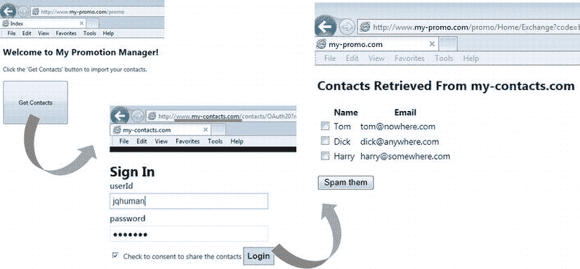
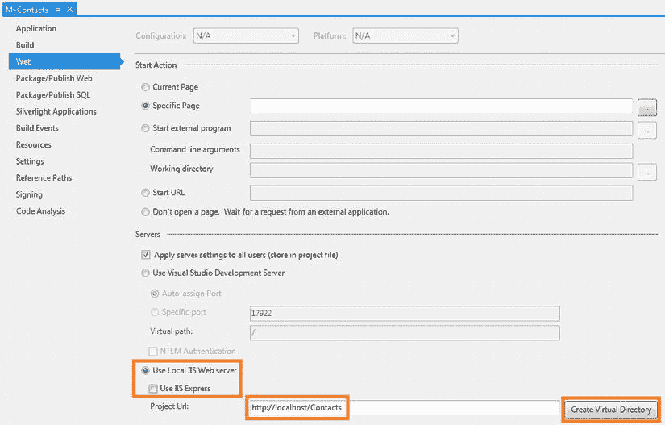
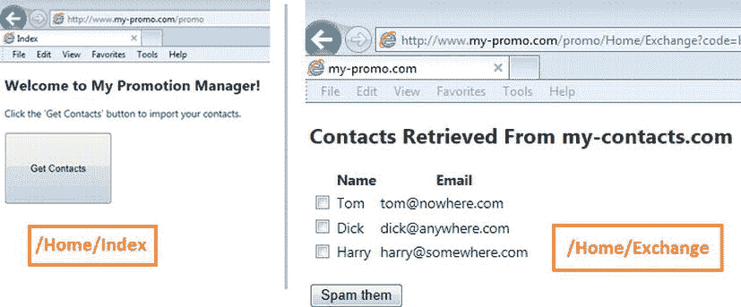
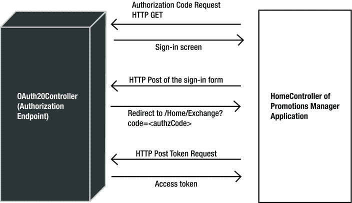
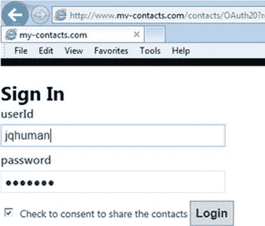

# 十二、自底向上的 OAuth 2.0

在本章中，我将向您展示如何使用两个 ASP.NET MVC Web 应用，在 ASP.NET Web API 中从头开始实现基于 OAuth 2.0 的授权，以便您了解 OAuth 2.0 的具体细节。本章的目的是通过从头构建一个工作示例，帮助您深入了解 OAuth 2.0 的授权代码授权类型是如何工作的。在这个练习中，我将重点介绍授权代码授权类型，因为它比其他授权类型涉及更复杂的流程。

尽管我在本章中向您展示了如何从头开始构建，但我并不建议您为您的应用以这种方式构建 OAuth 2.0。有一个很棒的开源。NET 框架库 DotNetOpenAuth (DNOA)，您可以使用它在 ASP.NET Web API 中实现基于 OAuth 2.0 的授权。我在第 13 章中深入报道了 DNOA。然而，从头开始构建——尽管这是一项艰苦的工作——有助于您理解像 DNOA 这样的库是如何帮助您实现的。此外，当事情没有按照预期的方式运行时，它会给你信心打开引擎盖，看看里面发生了什么。

请记住，一些企业可能会限制在生产中使用开源软件。出于这个或任何其他原因，如果你想写你自己的实现，本章为你打下了基础。

场景:共享联系信息

我们在本章中的场景类似于第 11 章中的场景:一个终端用户，John Q. Human，想要与 Promotion Manager 应用共享他的 contacts 应用中包含的联系信息。但是，他不想向 Promotion Manager 应用泄露他用来访问 contacts 应用的登录凭证。[表 12-1](#Tab1) 显示了 OAuth 2.0 的角色，以及这个场景的参与者。

[表 12-1。](#_Tab1) OAuth 2.0 角色

| OAuth 2.0 角色 | 运动员 |
| --- | --- |
| 资源所有者 | 资源所有者(在本例中是用户)是 John Q. Human，他是一个小型零售店的所有者，维护着他所有的客户联系信息。他不愿意与第三方`my-promo.com`分享他的`my-contacts.com`登录凭证，因为担心关键业务数据泄露给他的竞争对手。 |
| 资源服务器 | 资源服务器`www.my-contacts.com/contacts/api/contacts`以使用 ASP.NET web API 实现的 Web API 的形式公开联系信息。受保护的资源是联系信息。 |
| 授权服务器 | 授权服务器`www.my-contacts.com/contacts/OAuth20`与资源所有者合作以获得同意，并最终创建和发送一个令牌，客户端可以将该令牌提交给资源服务器并访问联系信息。 |
| 客户 | 客户端是促销管理器应用`www.my-promo.com/promo`，它是一个 ASP.NET MVC 4.0 web 应用。John 使用此应用发送促销电子邮件。 |

 **注**我不拥有[表 12-1](#Tab1) 中提到的`my-contacts.com`和`my-promo.com`域名。我使用它们是为了让您在测试流程时清楚地知道自己在应用中的位置(如 URL 栏中的浏览器所示)。为了识别应用，名称比端口号更好。我使用我在第 11 章[中展示的相同的 hosts 文件技巧来添加两个条目，它们的名称都指向 127.0.0.1。如果您是具有这些地址的真实站点的用户，那么在完成测试后，您需要从 hosts 文件中删除这些条目。此外，如果您足够幸运，能够在工作中花时间从代理后面的工作计算机上运行这些应用，您可能需要绕过这些地址的代理，主机文件技巧才能工作。](11.html)

有两个主要流程与我们的场景相关联。

1.  **联系人管理器流程—** 用户使用凭证直接登录联系人管理器，管理联系人，如查看、添加、编辑和删除联系人。
2.  **推广经理流程—** 这涉及到联系方式的共享。对我们来说，这是一个更重要的流程，因为这是 ASP.NET Web API 发挥作用的地方。用户转到 Promotion Manager 应用并执行一个操作，该操作需要来自 Contacts Manager 应用的联系信息。在我们的示例场景中，这个动作是用户点击一个按钮来获取联系信息。Promotion Manager 会将用户重定向到 Contacts Manager，在 Contacts Manager 同意与 Promotion Manager 共享联系人信息之前，会要求用户提供凭据并进行身份验证。同意后，Promotion Manager 使用 Contacts Manager 提供的 web API 提取联系信息，并向用户显示列表。

[图 12-1](#Fig1) 说明了促销经理流程。我们还没有进入实现细节，但是截屏将帮助您了解所涉及的步骤的全貌。



[图 12-1。](#_Fig1)促销经理流程

设计

作为我们解决方案的一部分，我们将在 Visual Studio 中创建两个 ASP.NET MVC 4.0 项目。

1.  这将是一个使用 Web API 模板创建的 ASP.NET MVC 4.0 项目。我们可以在同一个项目中同时拥有 MVC 控制器和 WebAPI 控制器。该项目代表资源服务器和授权服务器。尽管两个服务器可能属于同一个组织，因此可能属于同一个域，但通常需要进行逻辑分离。我将它们合并到一个项目中，这样我就可以在内存中存储它们之间共享的数据。这种方法将有助于我保持清单中的代码简洁，并专注于 OAuth 2.0，而不会涉及无关的持久性细节。
2.  这将是一个用基本模板创建的 ASP.NET MVC 4.0 项目。我使用基本模板，因为我不打算为这个应用提供任何 web API 或身份验证机制，但是您可以使用任何模板。 MyPromo 代表需要受保护资源才能运行的客户端 web 应用。

两个项目都使用本地 IIS(不是 IIS Express)。项目 URL 是 MyContacts 项目的`http://localhost/Contacts`和 MyPromo 项目的`http://localhost/Promo`。我没有使用本地主机，而是使用 hosts 文件中定义的名称，分别是:`http://www.my-contacts.com/contacts`和`http://www.my-promo.com/promo`

`.

 **注**要从本书附带的源代码中打开与本章对应的 Visual Studio 解决方案，必须以管理员身份运行 Visual Studio，才能正确加载项目。

在我们深入研究这些项目之前，我想解释一下访问令牌的格式。我们将实现授权代码授权类型来发布访问令牌，这将是一个签名的 JSON Web 令牌(JWT)。对于签名和验证，我们将使用在资源服务器和授权服务器之间带外交换的对称密钥。我们将使用在第 10 章中使用的相同的 JWT 实现。

我的联系人项目

表 12-2 显示了 MyContacts 项目中的类，以及对每个类的简要描述。我在表中显示了所有的类，以便给你一个概述，但是稍后我们将研究逻辑分组中各个类的代码。我们将近距离地了解这些职业，但不一定按照这里显示的顺序。

[表 12-2。](#_Tab2)my contacts 项目中的类

| 类别名 | 命名空间 | 描述 |
| --- | --- | --- |
| `HomeController` | `MyContacts.Controllers` | 包含登录和列出联系人的操作方法。这个 MVC 控制器是关于联系人管理的。 |
| `OAuth20Controller` | `MyContacts.Controllers` | 接受授权代码请求以及交换代码以访问令牌的请求。这个 MVC 控制器是授权端点。 |
| `ContactsController` | `MyContacts.Controllers` | 返回联系人列表。唯一的 API 控制器。 |
| `LoginRequired` | `MyContacts.Filters` | 基于存储在 cookie 中的值建立标识。如果不存在 cookie，它会重定向到登录页面，类似于在 contacts 应用中实现表单身份验证。 |
| `EncodingHelper` `EncryptionHelper` | `MyContacts.Helpers` | 为 base64 URL 编码(直接出自第 10 章)和对称密钥三重加密提供扩展方法。我选择 TripleDES 没有特别的原因。为此你可以使用任何你喜欢的强算法，比如 Rijndael。 |
| `AuthorizationManager` | `MyContacts.Infrastructure` | 为 web API 实现基于声明的访问控制。这个类是`ClaimsAuthorizationManager`的子类。用户授予的范围直接等同于为此目的的权利要求。 |
| `JsonWebToken` | `MyContacts.Infrastructure` | JSON web 标记的 CLR 表示形式。直出[第十章](10.html)。 |
| `OAuthTokenHandler` | `MyContacts.Infrastructure` | 基于传入 JWT 载体令牌中的声明建立标识。这是一个消息处理程序。 |
| `AuthzCodeRequest` | `MyContacts.Models` | 表示对授权码的请求。这是一个示范班。 |
| `TokenRequest` | `MyContacts.Models` | 表示对访问令牌的请求。这是一个示范班。 |
| `Contact` | `MyContacts.Models` | 表示联系人实体。这是一个示范班。 |

MyPromo 项目

表 12-3 显示了 MyPromo 项目中的类，并简要描述了每个类。

[表 12-3。](#_Tab3)MyPromo 项目中的类

| 类别名 | 命名空间 | 描述 |
| --- | --- | --- |
| `HomeController` | `MyPromo.Controllers` | 请求授权码，将其交换为令牌，进行 web API 调用，并向用户显示检索到的联系人。 |
| `Contact` | `MyPromo.Models` | 表示只有姓名和电子邮件的联系人业务实体的子集。 |

HTTP 交易

我在[第 11 章](11.html)中介绍了授权代码授权流程，在那里我展示了如何使用 Live Connect 的 web API。在这一节中，我将展示细节；即每个步骤的 HTTP 请求和 HTTP 响应。

我们在这里感兴趣的是来自促销管理器 web 应用的流程(参见前面的[图 12-1](#Fig1) 通过屏幕截图对流程的说明)。我没有介绍与用户直接登录到 Contacts Manager 并对联系人执行创建、读取、更新和删除(CRUD)操作相对应的流程。为了完整起见，我在本章前面简单地提到了这个流程。

以下 HTTP 交易发生在 Promotion Manager 流程中。

1.  John Q. Human goes to the Promotion Manager web application home page. This is the page with the big Get Contacts button.

    | **请求** | 获取`http://www.my-promo.com/promo` HTTP/1.1 主机:[www.my-promo.com](http://www.my-promo.com) |
    | **响应** | 
    HTTP/1.1 200 OK 内容-长度:647

    <！DOCTYPE html>T5】html>…</html> |

2.  John clicks the Get Contacts button, triggering an HTTP POST. An HTML form containing the only control of the Get Contacts button in the /Home/Index view gets posted to itself. The action method in the controller redirects to the authorization endpoint `http://www.my-contacts.com/contacts/OAuth20`, making the request for an authorization code. Because this is an authorization code grant, which is applicable for the server-side components of the web application, I’m making the request from the MVC controller itself, although it can be done using JQuery as well from the client side. The redirect URI specified in the request must be a controller action so that the important step of exchanging the authorization code to a token runs in the server side.

    | **请求** | POST`http://www.my-promo.com/promo`HTTP/1.1 Referer:`http://www.my-promo.com/promo`Content-Type:application/x-www-form-urlencoded Host:`www.my-promo.com`

    go = Get+Contacts |
    | **响应** | 
    HTTP/1.1 302 找到位置:`http://www.my-contacts.com/contacts/OAuth20?`response _ type = code&redirect _ uri =`http://www.my-promo.com/promo/Home/`Exchange&client _ id = 0123456789&scope = Read。联系人

    < html > <！-为简洁起见，省略了 HTML 响应正文- > < /html > |

3.  The redirect results in the GET to the `OAuth20Controller`’s `Index` action method. It returns a view that corresponds to the sign-in page, where John enters his credentials and expresses his consent to share the contact information by selecting the checkbox. It is important to note that John currently is in the `my-contacts.com` domain and no longer in `my-promo.com`.

    | **请求** | GET`http://www.my-contacts.com/contacts/OAuth20?`response _ type = code&redirect _ uri =`http://www.my-promo.com/promo/Home/Exchange&client_id=0123456789&scope=Read.Contacts`HTTP/1.1 Referer:`http://www.my-promo.com/promo`Host:`www.my-contacts.com` |
    | **响应** | HTTP/1.1 200 OK |

4.  As John clicks the login button, the form gets posted with his credentials along with a ciphertext. I’ll cover the details of the ciphertext later in this chapter when we get to the implementation details. `OAuth20Controller` handles this POST and redirects to the URI specified in the request, along with the authorization code in the query string. I use a GUID as the authorization code. At this point, John is getting redirected back to the Promotion Manager application.

    | **请求** | POST`http://www.my-contacts.com/Contacts/OAuth20/Authenticate`HTTP/1.1 referer:`http://www.my-contacts.com/contacts/OAuth20?`response _ Type = code&redirect _ uri =`http://www.my-promo.com/promo/Home/Exchange&client_id=0123456789&scope=Read.Contacts`Content-Type:application/x-www-form-urlencoded host:`www.my-contacts.com`userId = jq human&password = jq human&isOkayToShare = true&cipher text = ipbyun 0 bx 9 ax…oQ % 3D % 3D |
    | **响应** | HTTP/1.1 302 找到位置:`http://www.my-promo.com/promo/Home/`交换？code = 45a 92420-92 a2-4825-9a 06-35b 439 ef 8 b 01<title>物体移动</title> … |

5.  The redirect results in a GET to the `Exchange` action method of `HomeController` of the Promotion Manager web application. For this request, see the following substeps a, b, and c. The response to the request is generated only as part of substep c. This entire step, including the substeps, must run only on the server side (a confidential client), as specified by OAuth 2.0\. As covered in the previous chapter, exchanging the authorization code for a token requires a client secret, which must remain a secret that only the client application has access to. The user agent (browser) or the end user must not know the secret and hence must not be able to exchange the code and obtain a token themselves.

    | **请求** | GET`http://www.my-promo.com/promo/Home/Exchange?`code = 45a 92420-92 a2-4825-9a 06-35b 439 ef 8 b 01 HTTP/1.1 Referer:`http://www.my-contacts.com/contacts/OAuth20?`response _ type =…Host:`www.my-promo.com` |

    *   a.  The `Exchange` action method exchanges the code it received for an access token by making a POST request using `HttpClient` from within the action method.

        | **请求** | POST`http://www.my-contacts.com/contacts/OAuth20`HTTP/1.1 Content-Type:application/x-www-form-urlencoded Host:`www.my-contacts.com`client _ id = 0123456789&redirect _ uri = HTTP % 3A % 2F % 2fwww . my-promo . com % 2f promo % 2f home % 2f exchange&**client _ secret = txvtj 3 mgd lihdvcmqhise % 3D**&**code = 39 ebbe 3A-e68d** |
        | **响应** | HTTP/1.1 200 确定内容类型:application/json：charset = utf-8 { " access _ token ":" eyj 0 exi 1 nij 9 . eyjcyj 9 . pg 6 r qxxledlg 9 Alq " } |

    *   b.  The `Exchange` action method finally invokes the web API by passing the token in an HTTP request authorization header and gets the list of contacts in the form of JSON.

        | **请求** | 得到〔T1〕http/1.1〔T2〕授权:bearer eyj 0 exi 1 nij 9 . eyjcyj 9 . pg 6 r qxxledlg 9 alz q〔T3〕主机:`www.my-contacts.com` |
        | **响应** | HTTP/1.1 200 OK 内容类型:application/JSON；charset = utf-8 Content-Length:133
        [{ " Name ":" Tom "，" Email":" `tom@nowhere.com` "}，
        {"Name":"Dick "，" Email":" `dick@anywhere.com` "}，
        {"Name":"Harry "，" Email":" `harry@somewhere.com` "}] |

    *   c.  The JSON response is parsed into a list, which is sent to the view as a model. The view corresponding to the `Exchange` action method shows the list of contacts retrieved from the Contacts Manager application.

        | **响应** | HTTP/1.1 200 OK

        <DOCTYPE html>
        <html>…</html><！-为简洁起见，省略了响应正文。检索到的联系人列表- > |

 **注意**如果所请求的范围与离线访问相关，刷新令牌也可以在步骤 5a 的 HTTP 响应中发送给客户端。在这个练习中，我没有包含刷新标记来保持代码足够小，以便在本章中讨论。

构建联系人管理器应用

联系人管理应用是与 web API 相关联的底层 web 应用。为了完整起见，我在本章中包含了这个应用的代码。联系人管理器应用是用户直接与之交互的资源服务器的一部分。使用凭据登录后，用户可以添加、修改、删除和查看联系人。为了简洁起见，下面的代码只支持联系人列表。

1.  以管理员身份启动 Visual Studio 2012。
2.  使用 Web API 模板创建一个新的 ASP.NET MVC 4.0 项目，并将其命名为 MyContacts。
3.  Configure Visual Studio to use local IIS so that the project URL becomes`http://localhost/Contacts`. Select Use Local IIS Web server and clear the Use IIS Express checkbox. Click Create Virtual Directory to create the virtual directory in IIS (see [Figure 12-2](#Fig2)).

    

    [图 12-2。](#_Fig2)配置 Visual Studio 以使用 IIS

4.  Visual Studio creates an MVC controller `HomeController` as part of the project. This will be the major component of the Contacts Manager application. [Listing 12-1](#list1) shows the `HomeController` class with the `Index` action method, which corresponds to the home page of the Contacts Manager application. It calls the static `GenerateContacts` method in the `Contact` class that returns a hard-coded list of contacts and filters the contacts using the name of the identity. In other words, it displays only the contacts that belong to the logged-in user (I show the full coverage of the `Contact` class in the last step of this sequence). Forms authentication is not used and a simple mechanism based on an action filter is used. Note the application of the `LoginRequired` filter on the action method (shown in bold type).

    [***清单 12-1。***](#_list1)my contacts 项目中的 HomeController 类

    ```cs
    public class HomeController : Controller
    {
        [LoginRequired]
        public ActionResult Index()
        {
           string owner = Thread.CurrentPrincipal.Identity.Name;

           return View(Contact.GenerateContacts()
                           .Where((c => c.Owner == owner));
        }

        // Login methods go here
    }
    ```

5.  The `LoginRequired` filter shown in [Listing 12-2](#list2) ensures a user is logged in before starting to use the application. The `OnActionExecuting` base method is overridden to check for the presence of a cookie named “.contacts”. If the cookie is present, an identity is established with the name that is the same as the value read from the cookie. If the cookie is not present, it redirects to Login action, which is the login screen.

    [***清单 12-2。***](#_list2) 登录所需的过滤器

    ```cs
    public class LoginRequired : ActionFilterAttribute
    {
        public override void OnActionExecuting(ActionExecutingContext context)
        {
            HttpCookie cookie = context.HttpContext.Request.Cookies[".contacts"];
            if (cookie != null)
            {
                Thread.CurrentPrincipal = new GenericPrincipal(new GenericIdentity(cookie.Value), null);
            }
            else
            {
                context.Result = new RedirectToRouteResult(
                                            new RouteValueDictionary(
                                                new { Action = "Login", Controller = "Home" }));
            }
        }
    }
    ```

6.  Add the `Login` action method to `HomeController`, as shown in [Listing 12-3](#list3). Decorate this action method with the `HttpGet` attribute so that it handles only HTTP GET.

    [***清单 12-3。***](#_list3) 获取的登录动作方法

    ```cs
    [HttpGet]
    public ActionResult Login()
    {
            return View();
    }
    ```

7.  Right-click the `Login` action method and select Add View… in the resulting pop-up menu to create a new view. Leave the default selection of “Razor (CSHTML)” as the view engine. Copy and paste the code from [Listing 12-4](#list4) into the newly generated view file (`Login.cshtml`in the `Views\Home` folder).

    [***清单 12-4。***](#_list4) 登录视图(Login.cshtml)

    ```cs
    @using (Html.BeginForm())
    {
    <div class="editor-label"> @Html.Label("userId") </div>
    <div class="editor-field"> @Html.TextBox("userId")</div>

    <div class="editor-label">@Html.Label("password")</div>
    <div class="editor-field">@Html.Password("password")</div>

    <input type="submit" value="Login" />
    }
    ```

8.  Add the `Login` action method to `HomeController`, as shown in [Listing 12-5](#list5). This time, decorate the action method with the `HttpPost` attribute so that it handles only HTTP POST. If you are not familiar with ASP.NET MVC, model binding is what ensures the values entered by the user get passed into our action method as arguments. We follow the naming convention and make sure the text boxes in the HTML form are named userId and password, matching the parameter names of the `Login` action method for POST. As shown in the listing, the action method performs the authentication as just a check of the password matching the user ID for the purpose of illustration. If successful, the “.contacts” cookie is set and the browser is redirected to /Home/Index, which is the home page. The `LoginRequired` filter I covered earlier looks for this cookie to establish identity before the `Index` action method runs.

    [***清单 12-5。***](#_list5) 登录后的动作方法

    ```cs
    [HttpPost]
    public ActionResult Login(string userId, string password)
    {
            if (!String.IsNullOrWhiteSpace(userId))
            {
                if (userId.Equals(password)) // consider this an authentic user
                {
                    Thread.CurrentPrincipal = new GenericPrincipal(newGenericIdentity(userId), null);

                    // create cookie with userId
                    // Encrypt this - never use clear text cookies
                    Response.Cookies.Add(new HttpCookie(".contacts", userId));

                    return RedirectToAction("Index");
                }
            }

            return View();
    }
    ```

     **警告**永远不要编写如[清单 12-5](#list5) 所示的纯文本 cookies，除非你正在编写的代码是为了说明你正在编写的书中的一个概念！在将数据填充到 cookie 中之前，生产代码必须始终加密敏感数据。

9.  As a result of the redirect in the previous step, the `Index` action method discussed in Step 4 will be run. Because the `LoginRequired` filter has been applied to it, the filter runs first and creates the principal object based on the cookie from the previous step. When the actual method runs, it filters the contacts based on the principal and uses the same as the model to render the view. The view for /Home/Index is shown in [Listing 12-6](#list6). It just enumerates the model (the list of contacts) and displays each contact in a table row.

    [***清单 12-6。***](#_list6) 查看 for /Home/Index - Index.cshtml

    ```cs
    @model IEnumerable<MyContacts.Models.Contact>

    @{
        ViewBag.Title = "My Contacts";
    }

    <h2>My Contacts</h2>

    <p>
        @Html.ActionLink("Create New", "Create")
    </p>
    <table>
    <tr>
    <th>@Html.DisplayNameFor(model => model.Name) </th>
    <th>@Html.DisplayNameFor(model => model.Email) </th>
    <th>@Html.DisplayNameFor(model => model.Address) </th>
    <th>@Html.DisplayNameFor(model => model.DollarsSpentInStore) </th>
    <th>@Html.DisplayNameFor(model => model.LoyaltyPoints) </th>
    <th></th>
    </tr>

    @foreach (var item in Model) {
    <tr>
    <td>@Html.DisplayFor(modelItem => item.Name) </td>
    <td>@Html.DisplayFor(modelItem => item.Email) </td>
    <td>@Html.DisplayFor(modelItem => item.Address) </td>
    <td>@Html.DisplayFor(modelItem => item.DollarsSpentInStore) </td>
    <td>@Html.DisplayFor(modelItem => item.LoyaltyPoints) </td>
    <td>
                @Html.ActionLink("Edit", "Edit", new { /* id=item.PrimaryKey */ }) |
                @Html.ActionLink("Details", "Details", new { /* id=item.PrimaryKey */ }) |
                @Html.ActionLink("Delete", "Delete", new { /* id=item.PrimaryKey */ })
    </td>
    </tr>
    }
    </table>
    ```

10.  The final piece is the `Contact`class, the entity for which this application provides the user interface to accomplish CRUD operations. [Listing 12-7](#list7) shows this class. It has several properties and a static method `GenerateContacts`, which we already used in [Listing 12-1](#list1). Create this class in the `Models` folder.

    [***清单 12-7。***](#_list7) 联系类

    ```cs
    public class Contact
    {
        public string Name { get; set; }
        public string Email { get; set; }
        public string Address { get; set; }
        public decimal DollarsSpentInStore { get; set; }
        public int LoyaltyPoints { get; set; }
        public string Owner { get; set; }

        public static IEnumerable<Contact> GenerateContacts()
        {
            yield return new Contact()
            {
                Name = "Tom",
                Email = "tom@nowhere.com",
                Address = "123 Oak Circle, GermanTown, AB 12345",
                DollarsSpentInStore = 1234.56M,
                LoyaltyPoints = 1000,
                Owner = "jqhuman"
            };

            yield return new Contact()
            {
                Name = "Dick",
                Email = "dick@anywhere.com",
                Address = "987 Cedar Circle, DutchTown, YZ 98765",
                DollarsSpentInStore = 1784.96M,
                LoyaltyPoints = 1500,
                Owner = "jqhuman"
            };

            yield return new Contact()
            {
                Name = "Harry",
                Email = "harry@somewhere.com",
                Address = "567 Birch Circle, FrenchTown, UA 34589",
                DollarsSpentInStore = 14567.43M,
                LoyaltyPoints = 12000,
                Owner = "jqhuman"
            };

            yield return new Contact()
            {
                Name = "Tom",
                Email = "tom@missing.com",
                Address = "493 Hemlock Circle, SpanishTown, MB 53293",
                DollarsSpentInStore = 145.47M,
                LoyaltyPoints = 100,
                Owner = "jqlaw"
            };
        }
    }
    ```

这就完成了 Contacts Manager web 应用，这是一个小而普通的应用，我在这里主要是为了完整起见。Contacts Manager web 应用通过 web API 公开联系人信息，供其他应用使用。其中一个应用是 Promotion Manager 应用，我将在下一节中介绍它。

在这一节中，我强调了 MVC 的一些基本概念，比如绑定和命名约定，对于那些还没有使用伟大的 ASP.NET MVC 框架来构建 web 应用的人来说。

构建促销管理器应用

促销管理器 web 应用是客户端应用。这是一个 ASP.NET MVC 4.0 Web 应用。促销管理器应用需要来自联系人管理器应用的联系人信息。联系信息是 OAuth 2.0 保护的资源。该应用有两个屏幕:(1)主页/主页/索引和(2)联系人列表页/主页/交换，分别如[图 12-3](#Fig3) 的左侧和右侧所示。



[图 12-3。](#_Fig3)促销经理申请

下面的步骤展示了如何构建我们的客户端应用。

1.  以管理员身份启动 Visual Studio 2012。
2.  使用基本模板创建一个新的 ASP.NET MVC 4.0 项目，并将其命名为 MyPromo。
3.  将 Visual Studio 配置为使用本地 IIS，以便项目 URL 变为`http://localhost/Promo`。选择使用本地 IIS Web 服务器，并清除使用 IIS Express 复选框。单击“创建虚拟目录”在 IIS 中创建虚拟目录。
4.  添加一个新的 MVC 控制器，命名为`HomeController`。该控制器是应用的主要组件。它有两种动作方式:`Index`和`Exchange,`，分别对应两个屏幕。因为这是一个适用于 web 应用的授权代码授权，所以当您发现`HomeController` action 方法中所有与 OAuth 2.0 相关的逻辑都带有不了解 OAuth 2.0 的视图时，您应该不会感到惊讶。
5.  Add a view `Index.cshtml` in the `Views\Home` folder. Use the code in [Listing 12-8](#list8).

    [***清单 12-8。***](#_list8) Index.cshtml

    ```cs
    @{
        ViewBag.Title = "Welcome to My Promotion Manager!";
    }

    <h2>Welcome to My Promotion Manager!</h2>

    Click the 'Get Contacts' button to import your contacts.<br /><br />

    @using (Html.BeginForm())
    {
    <input type="submit" name="go" value="Get Contacts" style="width: 150px; height: 100px;"/>
    }
    ```

6.  Add the action method `Index` to `HomeController`, as shown in [Listing 12-9](#list9). The same action method of `Index` handles both GET and POST. If the incoming parameter `go` is empty, it is a GET. Otherwise, it is a POST. The parameter `go` corresponds to the button inside the form and the value of the button gets passed to the action method if the user submits the HTML form by clicking the Get Contacts button. The first time the user navigates to the home page of /Home/Index, the view displays the big Get Contacts button. When the user clicks the button, the OAuth 2.0 authorization code grant type flow starts. The browser is redirected to the authorization server `http://www.my-contacts.com/contacts/OAuth20` `,` passing the following data in the query string.
    *   a.客户端 ID，这是一个硬编码值 0123456789。这与我们在第 11 章的[中与 Live Connect 一起使用的客户端 ID 相同，尽管这里没有向授权服务器注册 Promotion Manager 的屏幕。这些值被简单地硬编码到各自的类中。](11.html)
    *   b.“阅读的范围。联系人”。在我们的示例场景中，这是授权服务器支持的唯一范围。
    *   c.指向`HomeController`的`Exchange`动作方法的重定向或/Home/Exchange 的回调 URI。需要注意的是，处理回调的代码必须在服务器端。在我们的例子中，当授权服务器重定向到回调 URI 时，浏览器将进行 GET to /Home/Exchange 操作，运行处理它的代码将在 MVC 控制器(`HomeController`)中，这是服务器端代码。
    *   d.响应类型指定为“代码”，表示这是一个授权代码请求。

    [***清单 12-9。***](#_list9) HomeController:指数动作法

    ```cs
    public class HomeController : Controller
    {
        string clientId = "0123456789";
        string clientSecret = "TXVtJ3MgdGhlIHdvcmQhISE=";

        public ActionResult Index(string go)
        {
            if (!String.IsNullOrWhiteSpace(go)) // Form Post
            {
                string redirectUri = " http://www.my-promo.com/promo/Home/Exchange ";
                string scope = "Read.Contacts";

                string url = " http://www.my-contacts.com/contacts/OAuth20 ";
                url += "?response_type=code&redirect_uri={0}&client_id={1}&scope={2}";

                url = String.Format(url, redirectUri, clientId, scope);

                return Redirect(url);
            }

            return View();
        }

        // Exchange action method goes here
    }
    ```

7.  此时，授权服务器提示输入用户 ID 和凭证。认证后，它会请求同意共享联系信息。获得同意后，它生成授权代码并将浏览器重定向到回调 URI，在查询字符串中传递授权代码。这将在下一节中介绍，但我在这里提到这一点是为了保持连续性。
8.  The redirect or the callback URI is specified as /Home/Exchange, which corresponds to the `Exchange` action method shown in [Listing 12-10](#list10).
    *   a.重定向产生的 GET 请求由`Exchange` action 方法处理。MVC 绑定魔术确保授权服务器发送的授权代码作为参数传递给`Exchange` action 方法。您需要确保参数被命名为`code`,以匹配查询字符串字段。
    *   b.使用`HttpClient`通过向授权服务器发送 POST 来交换访问令牌的授权代码，传递客户端 ID、客户端机密、代码字段的硬编码值“code”以及作为授权类型的“authorization_code”。正如我们在第 11 章的[中看到的，对于 Live Connect，客户端秘密是确保只有客户端应用，而不是资源所有者或最终用户，可以获得访问令牌的秘密武器。这就是授权码授予的特殊性。](11.html)
    *   c.上一步中要发布的响应消息是一个包含访问令牌的 JSON。从客户端应用的角度来看，令牌只是一个不透明的字符串。所有需要做的就是将它作为凭证发送给 web API。
    *   d.使用承载模式将访问令牌填充到授权请求头中，并向 ASP.NET Web API 发出 GET 请求以检索联系人列表。
    *   e.GET 的响应消息也是一个 JSON，使用`Newtonsoft.Json.JsonConvert`将它反序列化回一个`IEnumerable<Contact>`，并作为模型传递给视图进行渲染。

    [***清单 12-10。***](#_list10) 交换动作法

    ```cs
    public ActionResult Exchange(string code )
    {
            using (HttpClient client = new HttpClient())
            {
                var postData = new List<KeyValuePair<string, string>>();
                postData.Add(new KeyValuePair<string, string>("client_id", clientId));
                postData.Add(new KeyValuePair<string, string>("redirect_uri",
                                                        " http://www.my-promo.com/promo/Home/Exchange "));
                postData.Add(new KeyValuePair<string, string>("client_secret", clientSecret));
                postData.Add(new KeyValuePair<string, string>("code", code));
                postData.Add(new KeyValuePair<string, string>("grant_type", "authorization_code"));

                HttpContent content = new FormUrlEncodedContent(postData);

                var tokenResponse = client.PostAsync(" http://www.my-contacts.com/contacts/OAuth20 ", content)
                                                               .Result;

                if (tokenResponse.IsSuccessStatusCode)
                {
                    var token = tokenResponse.Content.ReadAsStringAsync().Result;

                    string accessToken = (string)(JObject.Parse(token).SelectToken("access_token"));

                    client.DefaultRequestHeaders.Authorization =
                                                   new AuthenticationHeaderValue("Bearer", accessToken);

                    var apiResponse = client.GetAsync(" http://www.my-contacts.com/contacts/api/contacts ")
                                                               .Result;

                    if (apiResponse.IsSuccessStatusCode)
                    {
                        string result = apiResponse.Content.ReadAsStringAsync().Result;

                        var contacts = JsonConvert.DeserializeObject<IEnumerable<Contact>>(result);

                        return View(contacts);
                    }
                }
            }

            return Content("Failed to Exchange the authz code. Hope you find this message informative!");
    }
    ```

9.  The view that renders the model, which is `IEnumerable<Contact>,` is shown in [Listing 12-11](#list11).

    [***清单 12-11。***](#_list11) 交换动作方法的视图:Exchange.cshtml

    ```cs
    @model IEnumerable<MyPromo.Models.Contact>
    <h2>Contacts Retrieved From my-contacts.com</h2>

    <table>
    <tr>
    <th></th>
    <th>@Html.DisplayNameFor(model => model.Name)</th>
    <th>@Html.DisplayNameFor(model => model.Email)</th>
    </tr>

    @foreach (var item in Model) {
    <tr>
    <td>@Html.CheckBox(item.Email)</td>
    <td>@Html.DisplayFor(modelItem => item.Name)</td>
    <td>@Html.DisplayFor(modelItem => item.Email)</td>
    </tr>
    }
    </table>
    <br />
    <input type="button" value="Spam them" />
    ```

10.  Here is the `Contact` class corresponding to the JSON response sent by the web API. It just contains two properties: `Name` and `Email`, as shown in [Listing 12-12](#list12). Add this class to the Models folder.

    [***清单 12-12。***](#_list12) 促销经理中的联系类

    ```cs
    public class Contact
    {
        public string Name { get; set; }
        public string Email { get; set; }
    }
    ```

 **注意**我们刚刚构建的客户端应用与我们在[第 11 章](11.html)中使用授权码 grant 和 Live Connect 构建的应用非常相似。毕竟，这是坚持标准的好处之一。如果您改变服务器实现，您的客户机代码几乎不会改变。像 OAuth 2.0 这样的标准使这成为可能。

构建授权服务器

在我们到目前为止一直在处理的场景中，`www.my-contacts.com/contacts/OAuth20`是授权端点。这对应于将成为 MyContacts 项目一部分的`OAuth20Controller`类。我做的一个设计决定是让联系人管理器 web 应用、授权服务器和资源服务器(ASP.NET Web API)都属于同一个项目。因此，我们的授权服务器或端点`OAuth20Controller`以及本节中涉及的其他类将需要添加到我们之前在构建联系人管理器应用时创建的相同 MyContacts 项目中。

如果你可以把授权服务器想象成一个黑匣子，如图[图 12-4](#Fig4) 所示，有三个请求进来。



[图 12-4。](#_Fig4)授权服务器作为黑匣子

1.  授权码请求，这是一个 HTTP GET，由 Promotion Manager 主页的重定向产生。这里的请求中有四个字段:response_type(值为“code”)、redirect_uri、client_id 和 scope。这个请求将由`OAuth20Controller`中的`Index`动作方法(用`HttpGet`属性修饰)来处理。
2.  带有凭证的登录表单的 HTTP POST 以及共享受保护资源的用户同意。在 Live Connect 中，用户同意作为下一步出现在另一个屏幕上，但为了简洁起见，这里将其合并为一个屏幕。这个请求将由`OAuth20Controller`中的`Authenticate`动作方法(用`HttpPost`属性修饰)来处理。
3.  令牌请求，，它是授权码的 HTTP POST。这里的请求中有五个字段:redirect_uri、client_id、client_secret、code 和 grant_type(值为“authorization_code”)。这个请求将由`OAuth20Controller`中的`Index`动作方法(用`HttpPost`属性修饰)来处理。

我们从没有动作方法的`OAuth20Controller`类开始，然后随着我们继续实现功能，添加对应于前面三个请求的三个动作方法。[清单 12-13](#list13) 显示了没有动作方法的控制器。有两个类级别字段:`applicationRegistry`和`codesIssued`。

1.  `applicationRegistry`字典将密钥作为客户端 ID，值是包含客户端秘密和域的`Tuple`。这基本上代表了与 Live Connect 中的应用注册屏幕相关联的数据。目前，我们存储的值对应于我们唯一一个客户的值——换句话说，就是在 Promotion Manager 应用的`HomeController`中硬编码的值。
2.  `codesIssued`字典是一个并发字典，以 key 为授权码，也就是`System.Guid`。当授权服务器发布授权码时，它被插入到这里，以便当随后的令牌请求进来要求用授权码来交换令牌时，控制器可以验证该码，以查看它过去是否发布过授权码。该值是一个`Tuple`,它存储用户标识符、重定向 URI 和授权代码所针对的范围。这些值被存储以用于验证随后的令牌请求。

在`OAuth20Controller`类中使用的字典对象只是持久存储机制(如数据库)的占位符。当部署在负载平衡的环境中时，或者甚至在使用 web garden 的同一台机器上时，这些代码都将不起作用。在这种情况下，持久性存储必须替换这些字典对象。

向 MyContacts 项目添加一个名为`OAuth20Controller`的新 MVC 控制器。参见[清单 12-13](#list13) 中没有动作方法的控制器类。随着下一节的进行，我们将在这个类中添加动作方法。

[***清单 12-13。***](#_list13)oauth 20 控制器无动作方法

```cs
public class OAuth20Controller : Controller
{
    private Dictionary<string, Tuple<string, string>> applicationRegistry = new Dictionary<string,
                                                                            Tuple<string, string>>();
    private static ConcurrentDictionary<Guid, Tuple<string, string, string>> codesIssued =
                                                                            new ConcurrentDictionary <Guid,Tuple<string,
string, string>>();

    public OAuth20Controller()
    {
        // client id, client secret and domain
        applicationRegistry.Add("0123456789",new Tuple<string, string>("TXVtJ3MgdGhlIHdvcmQhISE=",
                                                                       " http://www.my-promo.com "));
    }

    // Action methods go here

}
```

HTTP GET 的索引操作方法

现在让我们添加处理来自 Promotion Manager 主页的重定向的`Index`操作方法。重定向产生的 HTTP GET 由本节描述的`Index`操作方法处理。该动作方法对应的视图显示了用户输入凭证并同意共享联系人信息的登录界面，如图[图 12-5](#Fig5) 所示。



[图 12-5。](#_Fig5)授权服务器登录(oauth 20/索引视图)

1.  When the Promotion Manager home page redirects the browser to the authorization endpoint, it passes several values in the query string. These values will be bound to the properties of the parameter of the action method, which is an `AuthzCodeRequest` object by the MVC framework. The `AuthzCodeRequest` class represents the data coming in the query string. The properties of this class match the field names in the query string, as specified by OAuth 2.0\. To make matters simple, I have named the properties exactly the same as fields defined in OAuth 2.0, with the underscore and all, which is generally against the C# naming convention. It is possible to get around this using a custom binder, but that will be too much of a detour. So, I’ll stick with property names containing underscores. [Listing 12-14](#list14) shows the `AuthzCodeRequest` class. Because all the fields in the query string are mandatory, we can simply annotate the corresponding properties with the `Required` attribute. If any of these fields are missing in the request, the model state will be invalid. It is convenient to just check for `ModelState.IsValid` instead of checking the fields individually for presence. Create the class `AuthzCodeRequest` in the Models folder of the MyContacts project.

    [***清单 12-14。***](#_list14) AuthzCodeRequest 类

    ```cs
    public class AuthzCodeRequest
    {
        [Required]
        public string response_type { get; set; }

        [Required]
        public string redirect_uri  { get; set; }

        [Required]
        public string client_id { get; set; }

        [Required]
        public string scope { get; set; }
    }
    ```

2.  给 OAuth20Controller 添加`Index`动作方法，如[清单 12-15](#list15) 所示。以下步骤构成了`Index`动作方法的执行。
    *   a.通过查看`ModelState.IsValid`确保输入`AuthzCodeRequest`参数中的所有属性都已填充。
    *   b.检查客户端 ID 是否存在于注册表中。如果是，检索注册的域，并确保重定向 URI 是该域的一部分。
    *   c.唯一支持的作用域是`Read.Contacts`。确保传入范围相同。拒绝任何其他范围。
    *   d.最后，确保响应类型为“代码”。如果这些条件都满足了，那就继续吧。如果不是，请转到一般错误页面。
    *   e.  When all is well at this point, we are ready to show the sign-in page (see [Figure 12-5](#Fig5)) where the user enters credentials and the consent to share the contact information. One challenge ahead is when the user clicks the Login button, we get the credentials entered and the boolean value indicating the user’s consent to share. To issue an authorization code at that time, we will need two values that we currently have in our input `AuthzCodeRequest` object: the scope and the redirect URI. We just validated the URI and scope, and we want the same values available to use while we issue the authorization code. But the values will not come in again from the user. We need to store it on the server side and pick it up using some kind of correlation ID that comes in later. As another option, we could just create a blob of stuff containing these two values, decipherable to no one but us, and put that in the sign-in form as a hidden field that we pick up when the sign-in form gets posted. I chose the second approach to avoid writing any persistence logic for the sake of simplicity. So, we create a string with a redirect URI and scope delimited with a pipe, encrypt this string, convert the resulting bytes into base64 encoding, and stuff that in a `ViewBag` property, which is rendered into a hidden field in the sign-in form.

        [***清单 12-15。***](#_list15) 指标动作法

        ```cs
        [HttpGet]
        public ActionResult Index(AuthzCodeRequest request)
        {
            bool isRequestValid = false;
            if (ModelState.IsValid)
            {
                if (applicationRegistry.ContainsKey(request.client_id))
                {
                    var registryInfo = applicationRegistry[request.client_id];
                    if (request.redirect_uri.StartsWith(registryInfo.Item2))
                    {
                        if (request.scope.Equals("Read.Contacts"))
                        {
                            if (request.response_type.Equals("code"))
                                isRequestValid = true;
                        }
                    }
                }
            }

            if (!isRequestValid)
                return RedirectToAction("Error");

            ViewBag.CipherText = String.Format("{0}|{1}", request.redirect_uri, request.scope)
                                        .ToCipherText();

            return View(); // shows login screen that posts to Authenticate
        }
        ```

3.  To implement the `ToCipherText` extension method used in [Listing 12-15](#list15), create a folder called `Helpers` and create the static class `EncryptionHelper` inside this folder. See [Listing 12-16](#list16). For more information on encryption, see [Chapter 6.](06.html)

    [***清单 12-16。***](#_list16) ToCipherText 扩展方法

    ```cs
    public static class EncryptionHelper
    {
        private static byte[] initVector = new byte[] { 13, 62, 115, 120, 34, 163, 226, 86 };
        private static byte[] key = new byte[] { 186, 20, 218, 62, 141, 209, 50, 89, 181, 54, 61,
                                                        108, 144, 128, 224, 86, 207, 106, 6, 68, 182, 166, 44, 236 };

        public static string ToCipherText(this string clearText)
        {
            TripleDESCryptoServiceProvider provider = new TripleDESCryptoServiceProvider();

            byte[] clearBytes = Encoding.UTF8.GetBytes(clearText);
            byte[] foggyBytes = Transform(clearBytes, provider.CreateEncryptor(key, initVector));

            return Convert.ToBase64String(foggyBytes);
        }

        private static byte[] Transform(byte[] textBytes, ICryptoTransform transform)
        {
            using (MemoryStream buf = new MemoryStream())
            {
                using (CryptoStream stream = new CryptoStream(buf, transform, CryptoStreamMode.Write))
                {
                    stream.Write(textBytes, 0, textBytes.Length);
                    stream.FlushFinalBlock();
                    return buf.ToArray();
                }
            }
        }
    }
    ```

4.  Now create the view for the preceding `Index` action method and copy and paste the code from [Listing 12-17](#list17).

    [***清单 12-17。***](#_list17) Index.cshtml

    ```cs
    <h1>Sign In</h1>
    @using (Html.BeginForm("Authenticate", "OAuth20"))
    {
    <div class="editor-label">@Html.Label("userId")</div>
    <div class="editor-field">@Html.TextBox("userId")</div>
    <div class="editor-label">@Html.Label("password")</div>
    <div class="editor-field">@Html.Password("password")</div>

    @Html.CheckBox("isOkayToShare")<text>&nbsp;Check to consent to share the contacts</text>

    @Html.Hidden("CipherText", (string)ViewBag.CipherText)

    <input type="submit" value="Login" />
    }
    ```

验证操作方法

清单 12-17 中的索引视图呈现的一个 HTML 表单将`OAuth20Controller`的`Authenticate`动作方法指定为目标。有一个复选框，用户可以选择它来同意共享联系信息。还有一个隐藏字段是使用我们刚刚在`ViewBag`中传递的值呈现的。这些以及名为 userId 和 password 的文本框都被发送到`Authenticate`动作方法，如[清单 12-18](#list18) 所示。以下是构成`Authenticate`行动方法执行的步骤。

1.  `Authenticate`动作方法有四个参数，其名称与我们在[清单 12-17](#list17) 中看到的表单字段完全匹配。因此，在获得用户 Id 和密码后，对其进行身份验证。在这里，我只是检查用户 Id 和密码是否相同，这样用户才被认为是可信的。当然，这纯粹是从图解的角度来做的。
2.  如果用户通过选择复选框同意共享，布尔参数`isOkayToShare`将为真。如果是这种情况，并且凭据是可信的，请执行以下步骤。
    *   a.使用`ToClearText`扩展方法解密`CipherText`参数中已经到达 action 方法的隐藏字段的内容，并恢复 URI 和范围。
    *   b.连同这两个和用户 ID 一起，创建一个`Tuple`。
    *   c.生成一个 GUID 作为授权码，并使用它作为密钥，将`Tuple`存储在并发字典中。
    *   d.  Finally, redirect to the redirect URI specified in the initial request passing the code as a query string.

        [***清单 12-18。***](#_list18) 认证动作方法

        ```cs
        [HttpPost]
        public ActionResult Authenticate(string userId, string password,
        bool isOkayToShare, string CipherText)
        {
            // Authenticate
            bool isAuthentic = !String.IsNullOrWhiteSpace(userId) && userId.Equals(password);

            if (!isAuthentic)
                return RedirectToAction("Error");

            if (isOkayToShare)
            {
                var tokens = CipherText.ToClearText().Split('|');
                string uri = tokens[0];
                string scope = tokens[1];

                Guid code = Guid.NewGuid();
                codesIssued.TryAdd(code, new Tuple<string, string, string>(userId, uri, scope));

                uri += "?code=" + code.ToString();

                return Redirect(uri);
            }

            return RedirectToAction("Index", "Home");
        }
        ```

给我们之前看到的静态类`EncryptionHelper`添加一个新的静态方法`ToClearText`，如[清单 12-19](#list19) 所示。有关解密的更多信息，请参见[第 6 章](06.html)。

[***清单 12-19。***](#_list19) ToClearText 扩展方法

```cs
public static string ToClearText(this string cipherText)
{
    TripleDESCryptoServiceProvider provider = new TripleDESCryptoServiceProvider();
    byte[] foggyBytes = Convert.FromBase64String(cipherText);

    return Encoding.UTF8.GetString(
Transform(foggyBytes,
provider.CreateDecryptor(key, initVector)));
}
```

重定向的结果是，浏览器将转到 Promotion Manager 应用，我们在上一节中看到的`Exchange`动作方法提取这段代码，并发出 POST 请求，用这段代码交换一个访问令牌。具有`HttpPost`属性的`Index`动作方法将处理该帖子。我将在下一节介绍这个过程。

HTTP POST 的索引操作方法

`OAuth20Controller`的`Index`动作方法处理来自 Promotion Manager 应用的 HTTP POST，以将授权代码交换为访问令牌。下面的步骤完成了这个动作方法的实现。

1.  The fields in the request entity-body of the HTTP POST can be represented by a class, similar to the `Index` action method that we created for GET. Create a `TokenRequest` class in the `Models` folder of the MyContacts project, as shown in [Listing 12-20](#list20). Because all the fields in the request are mandatory, we can simply annotate the properties with the `Required` attribute. If any of these fields is missing in the request, the model state will be invalid. It is convenient to just check for `ModelState.IsValid` instead of checking the fields individually for presence.

    [***清单 12-20。***](#_list20) 令牌请求类

    ```cs
    public class TokenRequest
    {
        [Required]
        public string redirect_uri { get; set; }

        [Required]
        public string client_id { get; set; }

        [Required]
        public string code { get; set; }

        [Required]
        public string client_secret { get; set; }

        [Required]
        public string grant_type { get; set; }
    }
    ```

2.  Create the `Index` action method with the `HttpPost` attribute in `OAuth20Controller`, as shown in [Listing 12-21](#list21). To summarize the action, it just performs a bunch of validations. If all are successful, it creates a JSON Web Token and sends that back as the `JsonResult` in the access_token field. Following are the validations performed before an access token is issued.
    *   a.所有必需的字段都存在。这种验证只需检查`ModelState.IsValid`即可完成。
    *   b.客户端 ID 在注册表中，传入的客户端密码与注册表中存储的客户端密码相匹配。
    *   c.授权类型为“授权 _ 代码”。
    *   d.请求中的授权码存在于并发字典中；换句话说，代码是我们在过去某个时候发布的。当前的实现并没有对授权码的寿命施加任何限制。
    *   e.请求中的重定向 URI 与初始请求中指定的 URI 相匹配。

    如果满足所有条件，那么从字典中删除授权代码，并发布一个 JSON Web 令牌作为访问令牌。

    [***清单 12-21。***](#_list21) 【指标动作法】(岗位)

    ```cs
    [HttpPost]
    public JsonResult Index(TokenRequest request)
    {
        bool isRequestValid = false;
        Tuple<string, string, string> grantData = null;

        // All required inputs are present
        if (ModelState.IsValid)
        {
            // client id is in the registry
            if (applicationRegistry.ContainsKey(request.client_id))
            {
                var registryInfo = applicationRegistry[request.client_id];
                // client secret is the registy against the client id
                if (request.client_secret.Equals(registryInfo.Item1))
                {
                    // grant type is correct
                    if (request.grant_type.Equals("authorization_code"))
    ```

    ```cs
    {
                        Guid code = Guid.Parse(request.code);
                        // we have issued the code, since it is present in our list of codes issued
                        if (codesIssued.TryGetValue(code, out grantData))
                        {
                            // Token request is for the same redirect URI for which we
    // previously issued the code
                            if (grantData != null && request.redirect_uri.Equals(grantData.Item2))
                            {
                                // all is well - remove the authz code from our list
                                isRequestValid = true;
                                codesIssued.TryRemove(code, out grantData);
                            }
                        }
                    }
                }
            }
        }

        if (isRequestValid)
        {
            JsonWebToken token = new JsonWebToken()
            {
                SymmetricKey = EncryptionHelper.Key ,
                Issuer = " http://www.my-contacts.com/contacts/OAuth20 ",
                Audience = " http://www.my-promo.com/promo/Home "
            };

            token.AddClaim(ClaimTypes.Name, grantData.Item1);
            token.AddClaim(" http://www.my-contacts.com/contacts/OAuth20/claims/scope ", grantData.Item3);

            return Json(new { access_token = token.ToString() });
        }

        // OAuth 2.0 spec requires the right code to be returned
        // For example, if authorization code is invalid, invalid_grant must be returned
        // I'm just returning 'invalid_request' as a catch-all thing, just for brevity
        return Json(new { error = "invalid_request" });
    }
    ```

3.  JWT 是一个签名令牌，它包含两个声明:代表用于登录的用户标识符的标准名称声明和代表作用域的自定义声明。我直接从第 10 章的[中取出`JsonWebToken`类，以及它所依赖的助手类`EncodingHelper`，并将它们分别放在`Infrastructure`和`Helpers`文件夹中。在复制文件之前创建`Infrastructure`文件夹。](10.html)
4.  对于任何错误，我返回一个总括错误。OAuth 2.0 明确规定了不同情况下必须返回的错误码。在阅读规范之后，您可以很容易地实现返回适当错误的逻辑。`OAuth20Controller`有`Error` action 方法，它返回一个静态视图，用一些措辞表示在处理请求时出现了错误。当验证失败时，其他操作方法重定向到此。我没有在单独的清单中显示代码，因为它只有一个`return View();`作为方法体。

 **注意**我使用`EncryptionHelper`类通过一个静态只读属性来公开它用于加密的密钥，我用它来进行 JWT 签名(参见[清单 12-21](#list21) )。这个类与创建 JWT 的`OAuth20Controller`和验证 JWT 签名的`OAuthTokenHandler`是同一个项目的一部分。因此，我简单地通过直接调用`EncryptionHelper.Key`在两个地方使用这个键。没有带外密钥共享。

构建资源服务器

最后，我们回到编写与 ASP.NET Web API 相关的代码。`ContactsController`是一个`ApiController`，它只有一个返回联系人的方法。客户端应用的最终目标是调用这个方法。然而，该方法受到消息处理器形式的门的保护，并且访问令牌是可以打开该门的钥匙。下面是构建资源服务器的步骤。

1.  Start with the message handler shown in [Listing 12-22](#list22). The handler looks at the authorization request header and if the scheme is “Bearer”, it pulls out the value in the header and deserializes the value into a `JsonWebToken`. The signature validation and expiry is checked by `Parse()`, as we saw in [Chapter 10](10.html). Ultimately, the claims in the token are used to create a `ClaimsIdentity` object and subsequently a `ClaimsPrincipal` object that is set in `Thread.CurrentPrincipal`.

    [***清单 12-22。***](#_list22) OAuthTokenHandler

    ```cs
    public class OAuthTokenHandler : DelegatingHandler
    {
        protected override async Task<HttpResponseMessage> SendAsync(HttpRequestMessage request,
    CancellationToken cancellationToken)
        {
            try
            {
                var headers = request.Headers;
                if (headers.Authorization != null)
                {
                    if (headers.Authorization.Scheme.Equals("Bearer"))
                    {
                        string accessToken = request.Headers.Authorization.Parameter;
                        JsonWebToken token = JsonWebToken.Parse(accessToken, EncryptionHelper.Key);

                        var identity = new ClaimsIdentity(token.Claims, "Bearer");
                        var principal = new ClaimsPrincipal(identity);

                        Thread.CurrentPrincipal = principal;

                        if (HttpContext.Current != null)
                            HttpContext.Current.User = principal;
                   }
                }

                var response = await base.SendAsync(request, cancellationToken);

                if (response.StatusCode == HttpStatusCode.Unauthorized)
                {
                    response.Headers.WwwAuthenticate.Add(
                                new AuthenticationHeaderValue("Bearer",
                                    "error=\"invalid_token\""));
                }

                return response;
            }
            catch (Exception)
            {

                var response = request.CreateResponse(HttpStatusCode.Unauthorized);

                response.Headers.WwwAuthenticate.Add(
                        new AuthenticationHeaderValue("Bearer", "error=\"invalid_token\""));

                return response;
            }
        }
    }
    ```

2.  通过在`App_Start`文件夹的`WebApiConfig.cs`文件中添加`config.MessageHandlers.Add(new OAuthTokenHandler());`行，消息处理程序被插入到管道中。
3.  Create a new `ApiController` named `ContactsController`, as shown in [Listing 12-23](#list23). It uses the `GenerateContacts()` method of the `Contact` class, filters the list using the name of the identity, and creates a list of  `MailingContact` objects. The message handler establishes the identity, but if the authorization header is not passed in it does not reject the request by sending back an unauthorized response. By decorating the `Get()` method in [Listing 12-23](#list23) with a `ClaimsPrincipalPermission` attribute, I make sure the API works only if the identity is established and the necessary claims are there to invoke the method.

    [***清单 12-23。***](#_list23) 联系人控制器:Web API

    ```cs
    public class ContactsController : ApiController
    {
        [ClaimsPrincipalPermission(SecurityAction.Demand, Operation = "Get", Resource = "Contacts")]
        public IEnumerable<MailingContact> Get()
        {
            return Contact.GenerateContacts()
                            .Where(c => c.Owner == User.Identity.Name)
                            .Select(c => new MailingContact()
                            {
                                Name = c.Name,
                                Email = c.Email
                            }).ToList();
        }
    }
    ```

4.  Create a class `MailingContact` with the `Name` and `Email` properties, as shown in [Listing 12-24](#list24). I have this class inside `ContactsController.cs`, but you can create it in the Models folder if you like to organize your classes that way.

    [***清单 12-24。***](#_list24) 邮件联系类

    ```cs
    public class MailingContact
    {
        public string Name { get; set; }
        public string Email { get; set; }
    }
    ```

5.  The claims needed to invoke the web API are not hard-coded in the `ApiController`, but I use a `ClaimsAuthorizationManager` subclass, shown in [Listing 12-25](#list25). This is not a new concept for us because we looked at this class in [Chapter 5](05.html).The authorization manager looks for a claim of type `http://www.my-contacts.com/contacts/OAuth20/claims/scope` and a value of “Read.Contacts”, which is our one and only scope to decide if the API can be allowed to be invoked or not. It is currently trivial, but any changes to be made to the authorization logic in the future will be isolated to only this class and will not affect the API.

    [***清单 12-25。***](#_list25)ClaimsAuthorizationManager 子类

    ```cs
    public class AuthorizationManager : ClaimsAuthorizationManager
    {
        public override bool CheckAccess(AuthorizationContext context)
        {
            string resource = context.Resource.First().Value;
            string action = context.Action.First().Value;

            if (action == "Get" && resource == "Contacts")
            {
                ClaimsIdentity id = (context.Principal.Identity as ClaimsIdentity);

                if (!id.IsAuthenticated)
                        return false;

                return (id.Claims.Any(c =>
    c.Type == " http://www.my-contacts.com/contacts/OAuth20/claims/scope "
    && c.Value.Equals("Read.Contacts")));
            }

            return false;
        }
    }
    ```

6.  To plug the `ClaimsAuthorizationManager` subclass into the claims pipeline, modify Web.config, as shown in [Listing 12-26](#list26).

    [***清单 12-26。***](#_list26) Web.config 修改

    ```cs
    <configuration>
          <configSections>
    ```

    ```cs
    <section name="system.identityModel"
                     type="System.IdentityModel.Configuration.SystemIdentityModelSection,
                     System.IdentityModel, Version=4.0.0.0, Culture=neutral,
               PublicKeyToken=B77A5C561934E089"/>
          </configSections>
              . . .
     <system.identityModel>
                 <identityConfiguration>
                          <claimsAuthorizationManager
                                  type="MyContacts.Infrastructure.AuthorizationManager, MyContacts"/>
                 </identityConfiguration>
     </system.identityModel>
    </configuration>
    ```

经过所有这些艰苦的工作，你准备好享受你的劳动成果。从促销管理器应用开始。浏览至`http://www.my-promo.com/promo`。我假设您已经编辑了计算机中的 hosts 文件，这样就可以工作了。

点击大的获取联系人按钮，输入 **jqhuman** 和 **jqhuman** 的凭证作为用户 ID 和密码。切记选中复选框并单击登录。促销经理将显示联系人:汤姆、迪克和哈里。您刚刚实现了 OAuth 2.0 的授权码授予流程！

虽然它不是生产强度，并且不包含刷新令牌，这也是我们大多数人使用授权代码授权的原因，但它仍然是一个工作模型，您可以从该模型构建生产强度代码。

安全考虑

我们刚刚从头实现的授权代码授权主要是为了让您能够理解具体细节。除了确保访问令牌交换的授权代码在服务器端代码中完成，以便只有客户端应用能够使用客户端密码获得访问令牌之外，我们没有过多考虑安全方面。这不是出于安全考虑，而是 OAuth 2.0 规范对授权码授予的要求。

在这一节中，我将简要介绍在实现 OAuth 2.0 时需要考虑的安全方面。我在这里指出了需要关注的领域，这样您就可以在设计和实现时遵循这些领域。涵盖安全性的每一个方面并提供您可以随时重用的代码在一本合理大小的书中是不可能的，至少在一本可以用两只手拿着的书中是不可能的！

除了以下注意事项之外，您还可以查看 OAuth 2.0 规范(RFC 6749)的第 10 节，该节专门讨论安全注意事项。

1.  在前面的场景中，我们没有使用传输安全性。在生产环境中，HTTPS 将是强制性的，以确保用户凭据以及授权代码和令牌的机密性。OAuth 2.0 倚重 HTTPS。
2.  顾名思义，客户秘密必须保密。不得向任何人透露，包括合法的最终用户。甚至开发团队也不需要访问生产环境中使用的客户端机密。除了一两个管理员之外，应该只有客户端应用可以访问客户端机密。
3.  OAuth 2.0 没有指定访问令牌的格式，但是不言而喻，在大多数生产场景中，令牌必须受到完整性和机密性的保护。HTTPS 形式的传输安全将是一个很大的帮助，但是使用签名和加密实现的消息安全也可以考虑用于端到端保护。
4.  RFC 6750 规定使用接入令牌作为承载令牌。与密钥持有者令牌不同，无记名令牌没有加密支持来证明令牌所有权。因此，必须使用 HTTPS 来保护客户端应用向资源服务器提供承载令牌的通道。
5.  刷新令牌是获取新的访问令牌的便利机制，而无需麻烦用户进行认证和同意共享。但是从安全的角度来看，这是一个令人头疼的管理问题，因为刷新令牌是长期存在的。刷新令牌在运动和静止时都必须受到保护。如果恶意用户进入您存储刷新令牌的数据存储，那将是一场灾难。对于刷新令牌，一种值得考虑的技术是在 RFC 6749 的第 10 节中提到的技术，该技术采用“使用并丢弃”刷新令牌，该刷新令牌在第一次请求刷新访问令牌时到期。对这种访问令牌刷新请求的响应消息可以包含新的访问令牌以及新的刷新令牌。
6.  授权码在查询字符串中发送，也可以记录并存储在浏览器历史记录中。授权码必须是一次性的，并且是短期的。在我们在本章看到的实现中，颁发的授权码永远不会过期，这是您需要注意的。
7.  web 应用的典型安全威胁，如 XSS、XSRF、点击劫持等，在这里也同样适用。你必须确保有效地处理它们。ASP.NET MVC 为您提供了反 XSRF 的防伪令牌。有关 XSS 和 XSRF 的更多信息，请参见第 15 章。
8.  在对授权码的请求中传递重定向或回调 URI，在授权服务器重定向到 URI 时，在查询字符串中发送授权码。为了防止恶意用户操纵此 URI，您必须始终检查请求中的回调 URI 是否是客户端应用注册时注册的域的一部分。
9.  在授权代码授权类型的情况下，通过确保只有客户端应用可以访问客户端机密，您可以确保对 web API 的请求仅来自客户端应用，具有不可否认性。使用隐式授权，令牌被发送到浏览器，因此用户可以访问令牌。您不知道是客户端应用进行 API 调用，还是合法用户直接进行调用，或者是恶意用户 Mallory 进行调用！对于隐式授权，HTTPS 是必须的，因为令牌是在 URI 片段中发送的。
10.  值得注意的是，RFC 6749 的第 10 节建议最小化资源所有者密码凭证授予类型，因为它比其他类型风险更大，因为它维护了 OAuth 2.0 竭力避免的密码反模式。
11.  客户端凭据授予类型是两条腿的，因为没有用户参与。以授权代码授权为例，它有三条腿:用户必须提供凭证，客户机应用必须提供客户机秘密，以便颁发令牌，这更符合双人规则。因此，从安全的角度来看，客户端凭证授权类型相对来说不够健壮。当然，这种类型也有用例，但是最好尽量少用这种授权类型。如果客户端凭据是对称密钥，请确保定期轮换它。

OPENID 连接

基于 OAuth 的访问令牌可以用来认证用户吗？答案是肯定的。例如，Promotion Manager 应用可以基于从 Contacts Manager 应用接收到的访问令牌来建立用户的身份。如果这个令牌是一个只有授权服务器可读的加密令牌呢？Promotion Manager 可以简单地通过令牌进行 API 调用，如果 API 调用成功，就可以推断用户是经过身份验证的用户。这种类型的间接认证通常被称为伪认证。然而，这不是正确的方法。

正确的方法是使用 OpenID Connect，它构建在 OAuth 2.0 之上。OpenID Connect 允许客户端根据授权服务器执行的身份验证来验证用户(资源所有者)的身份。为了发出 OpenID Connect 请求，客户端构建一个常规的 OAuth 2.0 请求来获取访问令牌，就像授权代码授权的情况一样。一个特殊的强制作用域 **openid** 被包含在请求的作用域中。

用户授权请求后，客户端会收到授权码。授权码被交换为接入令牌和称为 id 令牌(id_token)的附加令牌，ID 令牌是包含一些强制声明的 JWT，包括用户 ID (user_id)。OAuth 2.0 规范没有指定访问令牌的属性，因为就客户端而言，它只是一个不透明的字符串。但是，OpenID Connect 将 ID 标记指定为 JWT。这是有意义的，因为 ID 令牌是供客户端使用的，而且在大多数情况下(如果不是全部的话),客户端与资源和授权服务器非常不同，因此对标准化的需求要大得多。

为了获得用户的额外属性或任何其他额外令牌，客户端向一个名为 **UserInfo** 的特殊端点发出 GET 或 POST 请求，使用承载方案在 HTTP 授权请求头中传递访问令牌。

我们刚刚看到的是一个 OpenID Connect 基本客户端配置文件。在撰写本书时，OpenID Connect 正处于实施者的草案审查阶段，因此除了这个侧栏之外，本书中不会有关于该主题的详细论述。

摘要

在这一章中，我向您展示了 John Q. Human 使用两个 web 应用的场景:用于管理其联系信息的 Contacts Manager 应用和用于管理其零售商店促销活动的 Promotion Manager 应用。促销管理器应用需要来自联系人管理器应用的联系人信息来发送促销。但是，John 不想与 Promotion Manager 应用共享他的联系人管理器密码。

我们将联系人管理器和促销管理器实现为 ASP.NET MVC 应用，联系人信息的受保护资源通过 web API 共享给促销管理器，该 API 期望通过 OAuth 2.0 授权代码授权获得访问令牌。客户端应用(在本例中为 Promotion Manager)从 Contacts Manager 授权服务器获取访问令牌，并以承载模式将该令牌提供给 ASP.NET Web API，以接收 JSON 形式的联系信息。对于访问令牌，我使用了 JWT，并重用了第 10 章中的 JSON web 令牌实现。

在下一章中，我们将研究如何使用 DotNetOpenAuth 来处理 OAuth 2.0。`