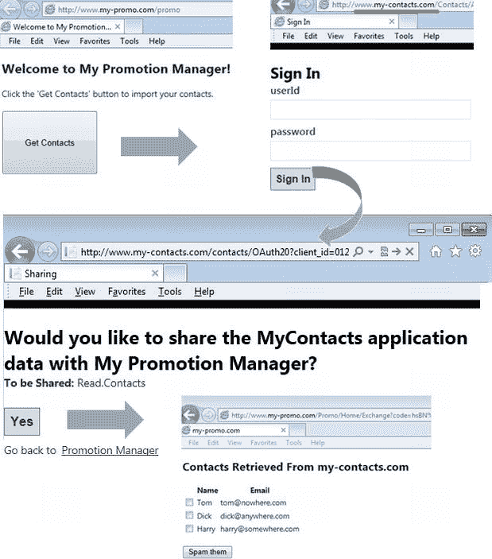
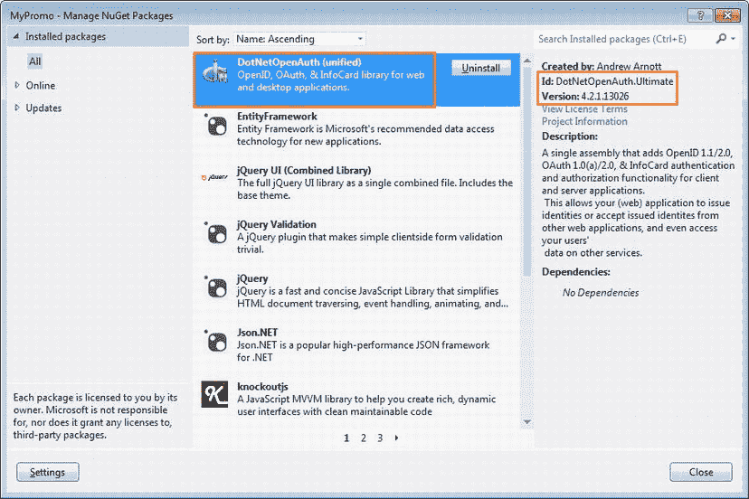
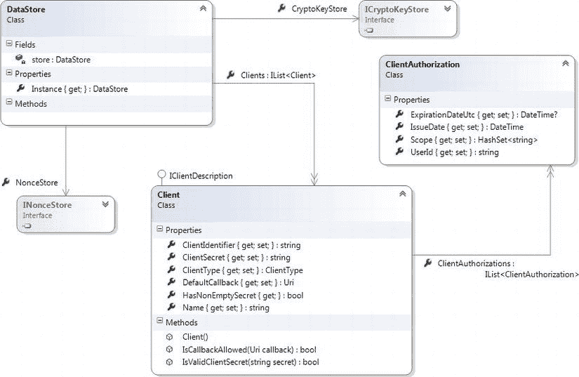
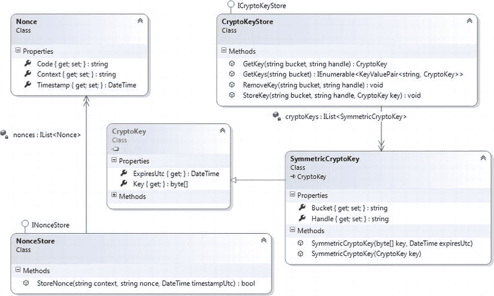
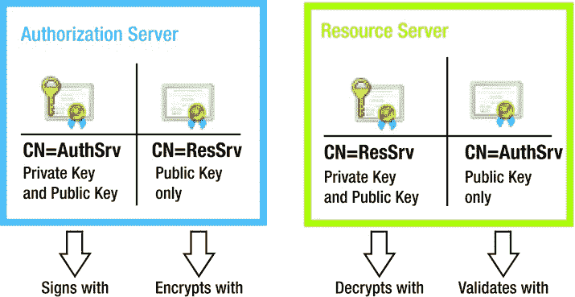
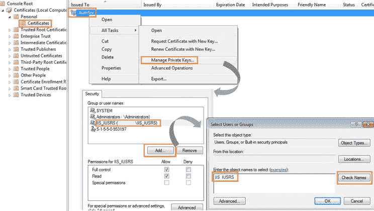
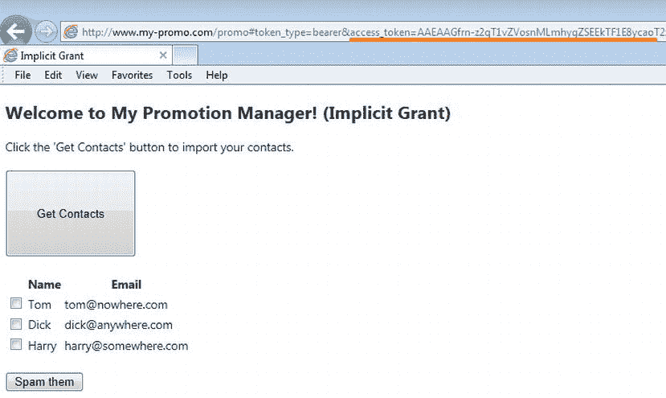

# 十三、使用 DotNetOpenAuth 的 OAuth 2.0

在本章中，我们使用 DotNetOpenAuth (DNOA) 在 ASP.NET Web API 中实现了基于 OAuth 2.0 的授权。DotNetOpenAuth ( `http://www.dotnetopenauth.net/`)是一个完善的**开源**。NET Framework 库，它可以帮助您为 web API 实现基于生产级 OAuth 2.0 的授权。

DNOA 为您实现 OAuth 2.0 提供了一个很好的 API。有一些类可以用来表示资源服务器、授权服务器和客户端的 OAuth 2.0 角色:分别是`ResourceServer`、`AuthorizationServer`和`WebServerClient`。这些类为您提供了一些方法，这些方法抽象出了请求、创建、获取和验证访问令牌所需的复杂性和过程步骤。

例如，要从客户端启动 OAuth 2.0 流，只需调用`WebServerClient`的`RequestUserAuthorization`方法，传递作用域和回调 URI。在回调 URI 对应的 action 方法中，调用`ProcessUserAuthorization`方法获得授权后，您可以通过`AccessToken`属性提取访问令牌。事实上，你甚至不需要知道有 HTTP 重定向和 posts 发生，我们在上一章已经看到了，就可以获得访问令牌。这就是 DNOA 提供的使你的生活更容易的那种抽象。

当您阅读本章时，您将会体会到，与我们在上一章中实现的功能相比，更少的代码行为您提供了更丰富的功能。在本章中，您将看到基础设施端存储与客户端、客户端授权等相关的数据的更多代码行，而不是与核心 OAuth 2.0 相关的代码行。当然，这是可以理解的，因为像我们在上一章中所做的那样，在类级别上硬编码客户端 ID、客户端机密和授权代码，并不能让您很好地实现编写生产级代码的目标。尽管 DNOA 帮助我们从硬编码数据转移到良好建模的类，为了简洁起见，我仍然坚持我的避免数据库的原则。在您的实现中，您可以很容易地将内存中的存储替换为持久存储，如数据库。

我们使用的场景与在第 11 章中使用的场景相同:一个终端用户 John Q. Human 希望与 Promotion Manager 应用共享他的 contacts 应用中包含的联系人信息，而不将他的 contacts 应用登录凭证泄露给 Promotion Manager 应用。我们为这个场景实现授权码授予。我们将使用 DNOA，而不是像在第 12 章中那样从头开始建造。我们最后快速看一下实现隐式授权流。

 **注** DotNetOpenAuth 帮助您实现基于生产级 OAuth 2.0 的授权。但是，如果您需要通过 OAuth 2.0 发布令牌的预构建实现，请使用 Thinktecture。IdentityServer v2 是一个很好的开源选项，供您评估。转到`https://github.com/thinktecture/Thinktecture.IdentityServer.v2`。

设计

与第 12 章一样，我们有两个 ASP.NET MVC 4.0 项目，作为我们 Visual Studio 解决方案的一部分。

1.  这是一个使用 Web API 模板创建的 ASP.NET MVC 4.0 项目。我们可以在同一个项目中同时拥有 MVC 控制器和 WebAPI 控制器。该项目代表资源服务器和授权服务器。
2.  这是一个使用基本模板创建的 ASP.NET MVC 4.0 项目。MyPromo 表示需要受保护资源才能运行的客户端 web 应用。

正如在[第 12 章](12.html)中，两个项目都使用本地 IIS(不是 Express IIS)。项目 URL 是 MyContacts 项目的`http://localhost/Contacts`和 MyPromo 项目的`http://localhost/Promo`。不使用 localhost，而是使用 hosts 文件中定义的名称`http://www.my-contacts.com/contacts`和`http://www.my-promo.com/promo`。这将使测试更容易，更不容易混淆。

 **注意**在本章中我们不会使用 JSON Web 令牌或任何其他标准的令牌格式。在写这本书的时候，DNOA 还不支持这些格式。不过这并不重要，因为 DNOA 在两端都被使用:DNOA 在授权服务器端铸造令牌，DNOA 在资源服务器端读取并验证令牌。

我的联系人项目

表 13-1 显示了 MyContacts 项目中的类，以及对每个类的简要描述。带星号(*)的类名是 MyContacts 项目的新类，我们在第 12 章中没有用到。控制器类与第 12 章中[my contacts 项目的控制器类保持一致。设计没有根本性的改变。我在这里利用了表单认证，为此包含了`AuthenticationController`。](12.html)

[表 13-1。](#_Tab1)my contacts 项目中的类

| 类别名 | 命名空间 | 描述 |
| --- | --- | --- |
| `HomeController` | `MyContacts.Controllers` | 仅作为联系人管理器 web 应用的占位符。这是一个 MVC 控制器。 |
| `OAuth20Controller` | `MyContacts.Controllers` | 接受授权代码请求以及交换代码以访问令牌的请求。这个 MVC 控制器是授权端点。 |
| `ContactsController` | `MyContacts.Controllers` | 返回联系人列表。我们项目中唯一的 API 控制器。 |
| `AuthenticationController*` | `MyContacts.Controllers` | 提供身份验证或登录功能。窗体身份验证重定向到此控制器进行身份验证。 |
| `CertificateHelper*` | `MyContacts.Helpers` | 帮助将证书的使用者名称转换为证书对象。这是 string 的扩展方法。 |
| `AuthorizationManager` | `MyContacts.Infrastructure` | 基于声明控制对 web API 的访问。这是`ClaimsAuthorizationManager`的一个子类。 |
| `OAuthTokenHandler` | `MyContacts.Infrastructure` | 基于 OAuth 访问令牌建立身份。它使用了`ResourceServer` DNOA 对象。这是一个消息处理程序。 |
| `ServerHost*` | `MyContacts.Infrastructure` | 实现了实例化 DNOA 的`AuthorizationServer`类所需的`IAuthorizationServerHost`。 |
| `DataStore*` | `MyContacts.Infrastructure.Store` | 充当所有与存储相关的类的外观。这是一个独生子。 |
| `Client*` `ClientAuthorization*` `CryptoKeyStore*` `Nonce*` `NonceStore*` | `MyContacts.Infrastructure.Store` | 提供与存储客户端详细信息相关的功能，例如客户端 ID、客户端机密、客户端授权、随机数和对称密钥。 |
| `Contact` | `MyContacts.Models` | 表示联系人实体。这是一个示范班。 |
| `AuthorizationRequest*` | `MyContacts.Models` | 帮助呈现请求用户同意共享数据的视图或屏幕。这是一个视图模型类。 |

一个更好的主要变化是在`Infrastructure.Store`下包含了几个类，代表持久化的实体。正如我在本章介绍中提到的，我不使用数据库。我将对象存储在应用域本身中，但是如果您愿意，将它们存储在数据库中并不困难。

 **注意**如果你计划使用一个数据库，你需要在`Store`类中做一些小的改动。因为我处理的不是关系数据库，所以我不必处理关系世界和对象世界之间的阻抗不匹配。我将对象图直接存储在 AppDomain 中，但是您需要使用实体框架之类的对象关系映射器(ORM ),并用 PK-FK 关系设计您的表。这些类需要反映这一点。

MyPromo 项目

表 13-2 显示了 MyPromo 项目中的两个类，并简要描述了每个类。这些类类似于第 12 章中[的 MyPromo 项目中的两个类。项目结构不变的原因是因为这是使用 OAuth 2.0 的客户端。这种影响只是在服务器端，因为我们使用 DNOA 来构建服务器。然而，由于这里使用了 DNOA `WebServerClient`类，本章中的实现细节确实发生了变化。](12.html)

[表 13-2。](#_Tab2)MyPromo 项目中的类

| 类别名 | 命名空间 | 描述 |
| --- | --- | --- |
| `HomeController` | `MyPromo.Controllers` | 请求授权代码，将其交换为令牌，进行 web API 调用，并向用户显示检索到的联系人。它使用`WebServerClient` DNOA 类启动 OAuth 2.0 流，并从响应中提取令牌。 |
| `Contact` | `MyPromo.Models` | 表示只有姓名和电子邮件的联系人业务实体的子集。 |

HTTP 交易

在我们看 HTTP 事务之前，你需要注意到与[第 12 章](12.html)相比，本章中的屏幕流有一个微小的变化。在[第 12 章](12.html)中，我们看到用户在登录授权服务器时使用的同一个屏幕中提供同意。在本章中，有一个单独的授权屏幕供用户同意共享。[图 13-1](#Fig1) 显示了屏幕流程。



[图 13-1。](#_Fig1)促销经理流程

DNOA 生成的 HTTP 事务与我们在[第 12 章](12.html)中看到的事务相似，但不完全相同。除了新的授权屏幕，本章的场景中还有一个额外的重定向，因为我们使用了表单身份验证。

除了这些变化，我们在第 11 章中看到的与授权码授权相关的流程的基本结构保持不变。毕竟，流程是在 OAuth 2.0 规范中定义的，无论实现细节如何，都必须保持基本相同。下面的 HTTP 事务发生在 Promotion Manager 流程中。

1.  John goes to the Promotion Manager web application home page. This is the page with the big Get Contacts button.

    | **请求** | 获取`http://www.my-promo.com/promo` HTTP/1.1 主机:`www.my-promo.com` |
    | **响应** | HTTP/1.1 200 OK
    Content-Type:text/html；字符集=utf-8 |
    |  | 
    < html >。。。带有大按钮的促销经理主页 |

2.  John clicks the Get Contacts button, triggering an HTTP POST. The /Home/Index form with only that button gets posted to itself. DNOA tries to redirect the browser to the authorization endpoint `http://www.my-contacts.com/contacts/OAuth20`, making the request for an authorization code.

    | **请求** | POST`http://www.my-promo.com/promo`HTTP/1.1
    refer:`http://www.my-promo.com/promo`
    Host:`www.my-promo.com`go = Get+Contacts |
    | **响应** | HTTP/1.1 302 找到内容类型:text/html；charset = utf-8 Location:`http://www.my-contacts.com/contacts/OAuth20?client_id=0123456789&redirect_uri=http%3A%2F%2Fwww.my-promo.com%2FPromo%2FHome%2FExchange&state=apqv345snyz5ghqimdt2awkd&scope=Read.Contacts&response_type=codeSet-Cookie: ASP.NET_SessionId=apqv345snyz5ghqimdt2awkd; path=/;`http only |

3.  The redirect results in another redirect. Because the authorization endpoint is protected with an `Authorize` attribute, it results in forms authentication making another redirect to the `Authentication` controller.

    | **请求** | GET`http://www.my-contacts.com/contacts/OAuth20?client_id=0123456789&redirect_uri=http%3A%2F%2Fwww.my-promo.com%2FPromo%2FHome%2FExchange&state=apqv345snyz5ghqimdt2awkd&scope=Read.Contacts&response_type=code`HTTP/1.1
    Referer:`http://www.my-promo.com/promo`
    Host:`www.my-contacts.com` |
    | **响应** | HTTP/1.1 302 找到
    位置:/联系人/认证？ReturnUrl = % 2f contacts % 2f auth 20% 3f client _ id % 3d 0123456789% 26 redirect _ uri % 3d http % 253 a % 252 f % 252 f`www.my-promo.com%252FPromo%252FHome%252FExchange%26`状态% 3 DAP qv 345 snyz 5 ghqimdt 2 awkd % 26 scope % 3d read。联系人%26 响应类型。。。 |

4.  The redirect results in a GET to Authorization/Index, which renders the login page for the user to enter credentials.

    | **请求** | 获取`http://www.my-contacts.com/Contacts/Authentication?`T3【返回 URL】= % 2 fcacts % 2 foauth 20% 3f…【http/1.1】
    参考:`http://www.my-promo.com/promo`
    主机:`www.my-contacts.com` |
    | **响应** | HTTP/1.1 200 OK
    Content-Type:text/html；charset = utf-8

    T3】html>。。。。AuthenticationController 生成的登录页面 |

5.  John enters the credentials and submits the form, resulting in a POST.

    | **请求** | POST`http://www.my-contacts.com/Contacts/Authentication?`ReturnUrl = % 2f contacts % 2f auth 20% 3f client _ id % 3d 0123456789% 26 redirect _ uri % 3d http % 253 a % 252 f % 252 fwww . my-promo . com % 252 f promo % 252 f home % 252 Fe exchange % 26 state % 3d apqv 345 snyz 5 ghqimdt 2 awkd % 26 scope % 3d read。联系人% 26 response _ type % 3d code&client _ id = 0123456789&redirect _ uri = http % 3A % 2F % 2fwww . my-promo . com % 2f promo % 2f home % 2f exchange&state = apqv 345 snyz 5 ghqimdt 2 awkd&scope = Read。联系人&response _ type = code HTTP/1.1 Referer:`http://www.my-contacts.com/Contacts/Authentication?ReturnUrl`。。。主持人:`www.my-contacts.com`userId = jq human&password = jq human |
    | **响应** | HTTP/1.1 302 找到位置:/contacts/OAuth20？client _ id = 0123456789 & redirect _ uri = http % 3A % 2F % 2F`www.my-promo.com`% 2f promo % 2f home % 2f exchange&state = apqv 345 snyz 5 ghqimdt 2 awkd&scope = Read。联系人&response _ type =代码集-Cookie:。MyContacts=67AF4EA87E。。。0694AA 路径=/；HttpOnly |

6.  After authentication, the browser is redirected to the authorization endpoint. This is the same as Step 3 except that it will go through this time, in contrast to the last time when it failed with a 401 and got redirected for want of a forms authentication ticket. Now, the request contains the cookie .MyContacts, which is the ticket. Because of this, John gets to see the authorization screen, where he can give his consent to share the data.

    | **请求** | GET`http://www.my-contacts.com/contacts/OAuth20?client_id=0123456789&`redirect _ uri = http % 3A % 2F % 2fwww . my-promo . com % 2f promo % 2f home % 2f exchange&state = apqv 345 snyz 5 ghqimdt 2 awkd&scope = Read。联系人&response _ type = code HTTP/1.1 Referer:`http://www.my-contacts.com/Contacts/Authentication?ReturnUrl=%2fcontacts%2fOAuth20%3f`。。。**饼干:<其他饼干>。my contacts = 67 af 4 ea 87 e 3…694 aa**主持人:【www.my-contacts.com】T4 |
    | **响应** | HTTP/1.1 200 OK 内容-类型:text/html；charset=utf-8 。。。。用户单击“是”同意共享的授权屏幕 |

7.  DNOA does an HTTP POST to the authorization endpoint, specifying the redirect URI as `http://www.my-promo.com/promo/Home/Exchange` and the response_type as `code`. The authorization endpoint redirects to this URI passing along the authorization code in the query string.

    | **请求** | POST`http://www.my-contacts.com/contacts/OAuth20?client_id=0123456789&`redirect _ uri = http % 3A % 2F % 2fwww . my-promo . com % 2f promo % 2f home % 2f exchange&state = apqv 345 snyz 5 ghqimdt 2 awkd&scope = Read。联系人&response _ type = code HTTP/1.1 Referer:`http://www.my-contacts.com/contacts/OAuth20?client_id=0123456789&`redirect _ uri = HTTP % 3A % 2F % 2fwww . my-promo . com % 2f promo % 2f home % 2f exchange&state = apqv 345 snyz 5 ghqimdt 2 awkd&scope = Read。联系人& response_type=code
    主持人:`www.my-contacts.com`
    Cookie:。MyContacts=67AF4EA8。。。。41fd 0694 aa
    client _ id = 0123456789&redirect _ uri = http % 3A % 2F % 2fwww . my-promo . com % 2f promo % 2f home % 2f exchange&state = apqv 345 snyz 5 ghqimdt 2 awkd&scope = Read。联系人& response_type=code &用户批准=是 |
    | **响应** | HTTP/1.1 302 找到了
    地点:`http://www.my-promo.com/Promo/Home/Exchange?` **代码=eMSd%。。。2 fnw**&state = apqv 345 snyz 5 ghqimdt 2 awkd |

8.  DNOA exchanges the authorization code for a token by making an HTTP request. Next, the `/Home/Exchange` action method makes a GET to the `ContactsController` web API with the OAuth 2.0 access token in the HTTP authorization header (bearer scheme) to get the JSON response, which is passed to the view as the model for rendering.

    | **请求** | GET`http://www.my-promo.com/Promo/Home/Exchange?code=eMSd% . . . 2Fnw&state=apqv345 snyz5ghqimdt2awkd`HTTP/1.1
    Referer:`http://www.my-contacts.com/contacts/OAuth20?client_id=0123456789&`redirect _ uri = HTTP % 3A % 2F % 2fwww . my-promo . com % 2f promo % 2f home % 2f exchange&state = apqv 345 snyz 5 ghqimdt 2 awkd&scope = Read。联系人&response _ type = code
    Cookie:ASP。NET _ session id = apqv 345 snyz 5 ghqimdt 2 awkd
    主机:`www.my-promo.com` |
    | **响应** | HTTP/1.1 200 OK
    Content-Type:text/html；charset = utf-8
    T2<！DOCTYPE html>T5】html>。。。显示联系人。。。。 |

步骤 8 有几个子步骤，最值得注意的一个是 DNOA 使用客户机 ID 和客户机秘密作为用户名和密码在授权头中发出 POST 请求，使用一个基本方案来获得访问令牌。

| **请求** | POST`http://www.my-contacts.com/contacts/OAuth20/Token  HTTP/1.1`Content-Type:application/x-www-form-urlencoded；charset = utf-8 User-Agent:DotNetOpenAuth/<version>**授权:基本 mdeymzq 1 njc 4 otpu 0 sjnnz 2 rhagxjsgr 2y 21 rael rt0 =**主机:`www.my-contacts.com`代码=eMSd%21IAA。。。&redirect _ uri = http % 3A % 2F % 2fwww . my-promo . com % 2f promo % 2f home % 2f exchange&grant _ type = authorization _ code</version> |
| **响应** | HTTP/1.1 200 OK 内容类型:application/JSON；charset = utf-8 {**" access _ token ":" gAAAAGih。。。AzoE"** ，" token_type":"bearer "，" expires_in":"120 "，" refresh_token":"T2C9！IAAAAO…Q0UQ "，" scope ":"阅读。联系人" } |

一旦检索到访问令牌，促销经理`/Home/Exchange`就将访问令牌用作不记名令牌，并调用联系人管理器 web API。HTTP 请求和产生的 JSON 响应与我们在[第 12 章](12.html)中看到的事务完全相同；基于这个原因，我在这里不再重复这些信息。

 **注意**从实现的角度来看，前一步很重要。旧版本的 DNOA 发送两个请求:第一个没有凭据，导致 401-未授权，随后一个有凭据。更多详情请参考问题`https://github.com/DotNetOpenAuth/DotNetOpenAuth/issues/195`。

实施基础工作

首先，我们将 DotNetOpenAuth 库添加到我们的项目中，并做一些配置更改以使其工作。以下是步骤。

1.  在 Visual Studio 解决方案资源管理器中，右键单击项目 MyPromo 下的“引用”节点，然后选择“管理 NuGet 包”。
2.  进入在线 All，搜索 DotNetOpenAuth。
3.  In the search results, locate the file with the name of DotNetOpenAuth (unified). It is a single .dll with everything in it. I’m using version 4.2.1.13026\. [Figure 13-2](#Fig2) shows the Manage NuGet Packages Visual Studio window so you can verify you are using the right DNOA assembly, the same assembly as the one I use.

    

    [图 13-2。](#_Fig2)管理 NuGet 包

4.  类似于前面的步骤，也在 MyContacts 项目中安装 DNOA 程序集。
5.  我在 Windows 7 中使用 Visual Studio 2012，目标是。NET 框架 4.5。根据版本的不同，您可能会得到稍微不同的行为。如果您得到一个配置错误“定义了一个重复的‘uri’部分”，您可能需要在两个项目中注释掉`<configSections>`下的行`<section name="uri" type="System.Configuration.UriSection . . .`。
6.  因为为了简单起见，我们不使用 HTTPS，所以编辑 dotNetOpenAuth 下的消息传递节点，在两个项目中添加一个属性，例如`<messaging relaxSslRequirements="true">`。

 **告诫**没有 HTTPS 千万不要投产。OAuth 2.0 非常依赖传输安全。

构建客户端应用

Promotion Manager web 应用 是客户端应用。这是一个 ASP.NET MVC 4.0 Web 应用。 `HomeController`是该应用的主要组件，有两种动作方式:`Index`和`Exchange`。与第 12 章中的[实现相比，该应用没有太大变化。`HomeController`有完全相同的方法，一个`Index`和一个`Exchange`方法。下面的步骤展示了如何构建我们的客户端应用。](12.html)

1.  Because we used the Basic template to create the MyPromo project in Visual Studio, you must manually add the `HomeController` class. Create a new MVC controller for this purpose. [Listing 13-1](#list1) shows the bare-bones `HomeController` with a few fields, to which we add the action methods, as we progress through the steps. The following is an overview of the fields and the variables.
    *   a.授权服务器的令牌颁发和授权端点存储在两个常量中。与只有一个端点的上一章相比，这是一个稍微不同的行为。
    *   b.为了简单起见，客户端 ID 和客户端密码在这里是硬编码的。在生产环境中，至少必须从加密配置中读取客户端机密。
    *   c.使用授权服务器端点创建类型为`AuthorizationServerDescription`的静态对象。同样用于创建`WebServerClient`对象的实例，这是`HomeController`工作的核心。

    [***清单 13-1。***](#_list1) HomeController

    ```cs
    public class HomeController : Controller
    {
            const string TOKEN_ENDPOINT = " http://www.my-contacts.com/contacts/OAuth20/Token ";
            const string AUTHZ_ENDPOINT = " http://www.my-contacts.com/contacts/OAuth20 ";

            private readonly string clientId = "0123456789";
            private readonly string clientSecret = "TXVtJ3MgdGhlIHdvcmQhISE=";
            private readonly WebServerClient client;

            private static AuthorizationServerDescription authServer = new AuthorizationServerDescription()
            {
                TokenEndpoint = new Uri(TOKEN_ENDPOINT),
                AuthorizationEndpoint = new Uri(AUTHZ_ENDPOINT),
            };

            public HomeController()
            {
                client = new WebServerClient(authServer, clientId, clientSecret);
            }

            // Action methods go here
    }
    ```

2.  Add the `Index` action method, as shown in [Listing 13-2](#list2). As with the previous chapter, this action method handles both GET and POST. When the user clicks the Get Contacts button, the `RequestUserAuthorization()` method of the `WebServerClient` object is called passing in the scope and the redirect URI. This call sets the wheels in motion and the OAuth flow is triggered. A browser redirection happens a few times when the user enters the credentials for authentication and gives consent to share data. Finally the browser is redirected to the redirect URI, which corresponds to the `Exchange` action method.

    [***清单 13-2。***](#_list2) 指标法

    ```cs
    public ActionResult Index(string go)
    {
                if (!String.IsNullOrWhiteSpace(go))
                {
                    client.RequestUserAuthorization(new[] { "Read.Contacts" },
                                        new Uri(Url.Action("Exchange", "Home", null, Request.Url.Scheme)));
                }

                return View();
    }
    ```

3.  Add the `Exchange` action method, as shown in [Listing 13-3](#list3). Note the following points.
    *   a.在`Exchange`动作方法中，调用`WebServerClient`对象的`ProcessUserAuthorization`方法来获取访问令牌和刷新令牌。
    *   b.刷新即将过期或已经过期的访问令牌只是一行代码。对象的方法刷新令牌。该方法的第二个参数接受一个`TimeSpan,`，它是刷新令牌的截止时间。如果访问令牌的剩余寿命超过此`TimeSpan`，令牌将不会被刷新。
    *   c.一旦获得了访问令牌，对 web API 的调用与前一章中的调用是一样的；也就是说，在承载方案中传递授权头中的令牌。

    [***清单 13-3。***](#_list3) 交换动作法

    ```cs
    public ActionResult Exchange()
    {
                var authorization = client.ProcessUserAuthorization();
                if (authorization != null)
                {
                    if (authorization.AccessTokenExpirationUtc.HasValue)
                        client.RefreshAuthorization(authorization, TimeSpan.FromSeconds(30));

                    string token = authorization.AccessToken;

                    string result = String.Empty;
                    using (HttpClient httpClient = new HttpClient())
                    {
                        httpClient.DefaultRequestHeaders.Authorization = new
                                                  AuthenticationHeaderValue("Bearer", token);
                        var apiResponse = httpClient.GetAsync(
    " http://www.my-contacts.com/contacts/api/contacts ").Result;

                        if (apiResponse.IsSuccessStatusCode)
                        {
                            result = apiResponse.Content.ReadAsStringAsync().Result;

                            var contacts = JsonConvert.DeserializeObject<IEnumerable<Contact>>(result);

                            return View(contacts);
                        }
                    }
                }

                return View();
    }
    ```

4.  因为我们用等价的 DNOA 调用替换了控制器中的自定义代码，所以视图与第 12 章中的视图保持一致，所以我在这里不再重复这些视图。将前一章中的`Contact`类和两个视图——主页/索引视图(`Index.cshtml`)和主页/交换视图(`Exchange.cshtml`)——分别复制到`Models`文件夹和`Views\Home`文件夹中，以完成 MyPromo 项目。

在第 12 章的[中，我们使用 HTTP 处理 OAuth 2.0 的基本细节，与之相反，DNOA 在这里提供了一个很棒的类:`WebServerClient`。如果考虑整个授权代码授予流程，客户端需要请求用户授权并处理授权以获得令牌。这就是调用`RequestUserAuthorization()`然后调用`ProcessUserAuthorization()`的情况。](12.html)

构建授权服务器

授权服务器包括两个逻辑组件:(1)由`OAuth20Controller`提供的外观，用于请求授权代码和访问令牌的端点，以及(2)从幕后驱动我们的授权服务器的特定于 DNOA 的类。构建前面两个组件的过程可以分为以下几个步骤。

1.  创建 DNOA 管理客户机、客户机授权等所需的基础结构类。
2.  创建`IAuthorizationServerHost`实现。
3.  创建`OAuth20Controller`类。DNOA 需要在授权服务器中指定两个端点，一个用于授权，一个用于获取令牌。我们在前一章中使用了 URI `www.my-contacts.com/contacts/OAuth20`。我们保留它作为授权端点，并使用`www.my-contacts.com/contacts/OAuth20/Token`作为令牌发布的端点。`OAuth20Controller`的两个动作方式`Index`和`Token`代表两个端点。
4.  通过使用另一个 MVC 控制器`AuthenticationController`实现表单认证来保护`OAuth20Controller`公开的端点。

创建基础设施

使用 DNOA 构建授权服务器的第一步是为 DNOA 类创建基础结构，以存储和检索客户端详细信息、客户端授权、关联的授权代码以及加密和签名授权代码和刷新令牌的密钥。

设计

我有一个单独的类`DataStore`，作为其他基础设施类的外观。[图 13-3](#Fig3) 显示了 Visual Studio 为`DataStore`生成的类图，以及与客户端细节和资源所有者授予的授权相关的两个基础设施类，即`Client`和`ClientAuthorization`。



[图 13-3。](#_Fig3)基础设施类别

`DataStore`有一个`Client`列表，每个对象代表一个客户端应用。在我们的例子中，Promotions Manager 是唯一的客户端应用。`Client`类实现了 DNOA 提供的`IClientDescription`接口。`Client`有一个`ClientAuthorization`列表，这个类的每个实例代表一个用户授权，根据这个授权发布一个令牌。

`DataStore`有两个属性，分别是类型`ICryptoStore`和`INonceStore`。DNOA 提供的这些接口的实现分别是`CryptoKeyStore`和`NonceStore`类。`NonceStore`存储`Nonce`对象，`CryptoKeyStore`存储`SymmetricCryptoKey`对象，如图[图 13-4](#Fig4) 所示。这些类由 OAuth 2.0 流中的 DNOA 类内部使用。`CryptoKeyStore`代表用于存储加密密钥的存储器，该密钥用于对称地加密和签署授权码以及刷新令牌。`NonceStore`代表存储授权码的商店。这个存储的目的是确保授权码只使用一次。随机数是使用一次的数字。



[图 13-4。](#_Fig4)随机数和加密存储

实现基础设施类

以下步骤显示了如何实现上一节中介绍的类。该部分中的所有类都将创建在`Infrastructure`文件夹下的`Store`文件夹中。

1.  创建文件夹`Infrastructure`和子文件夹`Store`。
2.  Create the `DataStore` class, as shown in [Listing 13-4](#list4). It has a static reference to an object of type `DataStore` and all access is through the `Instance` property, making this a singleton. It has a list of `Client` objects. Currently, the list has one `Client` object representing Promotions Manager.

    [***清单 13-4。***](#_list4) 数据存储

    ```cs
    public class DataStore
    {
        private static DataStore store = null;

        static DataStore()
        {
            store = new DataStore();
        }

        private DataStore()
        {
            this.Clients = new List<Client>();
            this.CryptoKeyStore = new CryptoKeyStore();
            this.NonceStore = new NonceStore();

            this.Clients.Add(
                        new Client()
                        {
                            Name = "My Promotion Manager",
                            ClientIdentifier = "0123456789",
                            ClientSecret = "TXVtJ3MgdGhlIHdvcmQhISE=",
                            DefaultCallback = new Uri(" http://www.my-promo.com/promo "),
                            ClientType = ClientType.Confidential
                        });
        }

        public static DataStore Instance
        {
            get
            {
                return store;
            }
        }

        public IList<Client> Clients { get; set; }

        public ICryptoKeyStore CryptoKeyStore { get; set; }
        public INonceStore NonceStore { get; set; }
    }
    ```

3.  Create the `ClientAuthorization` class, as shown in [Listing 13-5](#list5). An authorization is given by the user for a scope. Hence, `ClientAuthorization` has these two properties: `UserId` and `Scope`. In our example, we deal with one scope only but there can be multiple scopes. For this reason, scope is defined as `HashSet<string>`. No duplicates are allowed.

    [***清单 13-5。***](#_list5) ClientAuthorization 类

    ```cs
    public class ClientAuthorization
    {
        public DateTime IssueDate { get; set; }

        public string UserId { get; set; }

        public HashSet<string> Scope { get; set; }

        public Nullable<DateTime> ExpirationDateUtc { get; set; }
    }
    ```

4.  `ClientAuthorization` cannot exist without a `Client`. There will be multiple authorizations against a `Client`. Create the `Client` class, as shown in [Listing 13-6](#list6). `Client` implements `IClientDescription`, an interface provided by DNOA. Following are the points to note about this class.
    *   a.客户机应用(在我们的例子中是促销管理器)在发出请求时提供的重定向 URI 被传递给`IsCallbackAllowed`方法，让您验证 URI 是否有效和可接受。将传入 URI 的主机、端口和方案(HTTP/HTTPS)与针对客户端在`DataStore`类中注册的默认回调进行比较。在检查请求中的重定向 URI 时，您可以根据自己希望的宽松程度或严格程度来实现这里的逻辑。
    *   b.属性`HasNonEmptySecret`和方法`IsValidClientSecret`是普通的实现。代码本身是不言自明的。DNOA 在不同的时间调用这些方法，以确保请求是有效的。

    [***清单 13-6。***](#_list6) 客户端类

    ```cs
    public class Client : IClientDescription
    {
        public string ClientIdentifier { get; set; }

        public string ClientSecret { get; set; }

        public Uri DefaultCallback { get; set; }

        public string Name { get; set; }

        public ClientType ClientType { get; set; }

        public IList<ClientAuthorization> ClientAuthorizations { get; set; }

        public Client()
        {
            this.ClientAuthorizations = new List<ClientAuthorization>();
        }

        public bool HasNonEmptySecret
        {
            get { return !string.IsNullOrEmpty(this.ClientSecret); }
        }

        public bool IsCallbackAllowed(Uri callback)
        {
            return callback.Scheme == this.DefaultCallback.Scheme &&
                        callback.Host == this.DefaultCallback.Host &&
                            callback.Port == this.DefaultCallback.Port;
        }

        public bool IsValidClientSecret(string secret)
        {
            return MessagingUtilities.EqualsConstantTime(secret, this.ClientSecret);
        }
    }
    ```

5.  Create the Nonce class, as shown in [Listing 13-7](#list7). `Nonce` represents the authorization code generated by the authorization server. For subsequent validation, `Nonce` is stored in a `NonceStore`.

    [***清单 13-7。***](#_list7) 临时类

    ```cs
    public class Nonce
    {
        public string Context { get; set; }

        public string Code { get; set; }

        public DateTime Timestamp { get; set; }
    }
    ```

6.  Create the `NonceStore` class, as shown in [Listing 13-8](#list8). By virtue of implementing the `INonceStore` interface, `NonceStore` implements the `StoreNonce` method. When DNOA calls this method with a nonce, context, and timestamp that is not already present, we insert and return true. When this combination is already present, we return false and DNOA rejects the request because it could be a replay attack.

    [***清单 13-8。***](#_list8) NonceStore 和 Nonce 类

    ```cs
    public class NonceStore : INonceStore
    {
        private IList<Nonce> nonces = new List<Nonce>();

        public bool StoreNonce(string context, string nonce, DateTime timestampUtc)
        {
            if (nonces.Any(n => n.Context == context &&
                                                   n.Code == nonce &&
                                                          n.Timestamp == timestampUtc))
                return false; // Possibly a replay attack, return false
            else
            {
                Nonce newNonce = new Nonce { Context = context,
    Code = nonce,
    Timestamp = timestampUtc };

                nonces.Add(newNonce);
                return true;
            }
        }
    }
    ```

     **注意**在将授权码换成令牌时，旧版本的 DNOA 发送两个请求:一个没有凭据，导致 401-未授权，随后是有凭据的请求。由于这个原因，在使用旧版本的 DNOA 的实现中，实现 *INonceStore* ( [清单 13-8](#list8) )的类中的 *StoreNonce* 方法被调用了两次。我们当前的逻辑会使第二个请求失败，假设它是一个重放。确保您使用最新版本的 DNOA。

7.  Create the `SymmetricCryptoKey` class, as shown in [Listing 13-9](#list9). The `SymmetricCryptoKey` class inherits the `CryptoKey` class provided by DNOA and, by virtue of inheritance, gets the `Key` and `ExpiresUtc` properties. Because symmetric keys are shared between two parties, DNOA changes them periodically. `ExpiresUtc` is important from that perspective. `ExpiresUtc` defines the lifetime of a key, after which a key is discarded and a new one is generated by DNOA.

    [***清单 13-9。***](#_list9) SymmetricCryptoKey 类

    ```cs
    public class SymmetricCryptoKey : CryptoKey
     {
        public SymmetricCryptoKey(byte[] key, DateTime expiresUtc) : base(key, expiresUtc) { }

        public SymmetricCryptoKey(CryptoKey key) : base(key.Key, key.ExpiresUtc) { }

        public string Bucket { get; set; }

        public string Handle { get; set; }
    }
    ```

8.  Create the `CryptoKeyStore` class, as shown in [Listing 13-10](#list10). DNOA uses symmetric keys to encrypt and sign authorization codes and refresh tokens. These keys are stored in the crypto key store, an object implementing `ICryptoKeyStore`. DNOA calls the methods defined in this interface to store and retrieve keys.

    [***清单 13-10。***](#_list10) 密钥库类

    ```cs
    public class CryptoKeyStore : ICryptoKeyStore
     {
        private IList<SymmetricCryptoKey> cryptoKeys = new List<SymmetricCryptoKey>();

        public CryptoKey GetKey(string bucket, string handle)
        {
            return cryptoKeys.Where(k => k.Bucket == bucket && k.Handle == handle).FirstOrDefault();
        }

        public IEnumerable<KeyValuePair<string, CryptoKey>> GetKeys(string bucket)
        {
            return cryptoKeys.Where(k => k.Bucket == bucket)
                        .OrderByDescending(o => o.ExpiresUtc)
                            .Select(kvp => new KeyValuePair<string, CryptoKey>(kvp.Handle, kvp));
        }

        public void RemoveKey(string bucket, string handle)
        {
            var key = cryptoKeys.FirstOrDefault(k => k.Bucket == bucket && k.Handle == handle);
            if (key != null)
                cryptoKeys.Remove(key);
        }

        public void StoreKey(string bucket, string handle, CryptoKey key)
        {
            cryptoKeys.Add(new SymmetricCryptoKey(key) { Bucket = bucket, Handle = handle });
        }
     }
    ```

至此，我们已经完成了 DNOA 发布授权码和令牌所需的类的实现。DNOA 类调用我们的类作为 OAuth 2.0 流程的一部分。

创建 IAuthorizationServerHost 实现

到目前为止，我们看到的所有基础设施类——`Client`、`ClientAuthorization`、`CryptoKeyStore`和`NonceStore`——都由一个类集合在一起，即实现`IAuthorizationServerHost`接口的`ServerHost`类。所有繁重的工作都与处理基础设施类相关吗？

DNOA 提供的`AuthorizationServer` 类是服务器端 OAuth 的基础。我们已经看到了`WebServerClient`在客户端的应用。与`WebServerClient`相对应的服务器端是`AuthorizationServer`。要实例化`AuthorizationServer`，需要一个`ServerHost`的实例。通过由`IAuthorizationServerHost`接口公开的属性，DNOA 可以使用`CryptoKeyStore`和`NonceStore`基础设施类。下面的步骤展示了如何构建`ServerHost`类。

1.  Create a class `ServerHost` in the `Infrastructure` folder, as shown in [Listing 13-11](#list11).
    *   a.实现`CryptoKeyStore`和`NonceStore`属性，返回我们的基础设施外观`DataStore`的相应属性。
    *   b.我选择不实现`IAuthorizationServerHost`接口的`TryAuthorizeClientCredentialsGrant`、`TryAuthorizeResourceOwnerCredentialGrant`、`CheckAuthorizeClientCredentialsGrant`和`CheckAuthorizeResourceOwnerCredentialGrant`方法，因为这些方法与授权代码授权无关。
    *   c.实现`GetClient`方法，从`DataStore`中维护的客户端列表中返回与传入客户端 ID 对应的`Client`对象。

    [***清单 13-11。***](#_list11) ServerHost 类(部分实现)

    ```cs
    public class ServerHost : IAuthorizationServerHost
    {
        public ICryptoKeyStore CryptoKeyStore
        {
            get { return DataStore.Instance.CryptoKeyStore; }
        }

        public INonceStore NonceStore
        {
            get { return DataStore.Instance.NonceStore; }
        }

        public IClientDescription GetClient(string clientIdentifier)
        {
            return DataStore.Instance.Clients.First(c => c.ClientIdentifier == clientIdentifier);
        }

        public bool TryAuthorizeClientCredentialsGrant(IAccessTokenRequest accessRequest)
        {
            throw new NotImplementedException();
        }

        public bool TryAuthorizeResourceOwnerCredentialGrant(string userName, string password,
                                                             IAccessTokenRequest accessRequest,
                                                                   out string canonicalUserName)
        {
            throw new NotImplementedException();
        }

        public AutomatedAuthorizationCheckResponse CheckAuthorizeClientCredentialsGrant(
                                                             IAccessTokenRequest accessRequest)
        {
            throw new NotImplementedException();
        }

        public AutomatedUserAuthorizationCheckResponse
                                                      checkAuthorizeResourceOwnerCredentialGrant(
                                                          string userName, string password,
                                                          IAccessTokenRequest accessRequest)
        {
            throw new NotImplementedException();
        }
    }
    ```

2.  Implement the `IsAuthorizationValid` method, as shown in [Listing 13-12](#list12).  Look for a client authorization that has not expired yet, with the user ID matching the incoming user ID. Ensure the scope list requested is a subset of the scopes granted by the user for this matching authorization. In our example scenario it is just one scope, yet the code is future-proof to handle multiple scopes.

    [***清单 13-12。***](#_list12)isaauthorizationvalid 方法

    ```cs
    public bool IsAuthorizationValid(IAuthorizationDescription authorization)
    {
        var client = DataStore.Instance.Clients
                                    .First(c => c.ClientIdentifier ==
    authorization.ClientIdentifier);

        var authorizations = client.ClientAuthorizations
                                   .Where(a => a.UserId == authorization.User &&
                                          a.IssueDate <=
    authorization.UtcIssued.AddSeconds(1) &&
                                          (!a.ExpirationDateUtc.HasValue ||
                                                   a.ExpirationDateUtc.Value >=
    DateTime.UtcNow));
        if (!authorizations.Any()) // No authorizations
            return false;

        var grantedScopes = new HashSet<string>();
        authorizations.ToList().ForEach(a => grantedScopes.UnionWith(a.Scope));

        return authorization.Scope.IsSubsetOf(grantedScopes);
    }
    ```

3.  Implement the `CreateAccessToken` method that creates the token, which will be signed and encrypted, as shown in [Listing 13-13](#list13). We will use X.509 certificates to provide us with the public–private key pairs for this purpose. The token will be signed with the private key of the authorization server and encrypted with the public key of the resource server. The X.509 certificate corresponding to the authorization server will contain both public and private keys in the server running the authorization server. In the server running the resource server, the same authorization server certificate will contain only the public key. This is just the opposite for the resource server certificate. [Figure 13-5](#Fig5) shows the keys distribution in a typical production environment. However, I use the same machine for running both servers and hence both certificates with both keys are present on my computer.

    

    [图 13-5。](#_Fig5)签名和加密密钥分发

    [***清单 13-13。***T5】CreateAccessToken 方法](#_list13)

    ```cs
    public AccessTokenResult CreateAccessToken(IAccessTokenRequest request)
    {
            var accessToken = new AuthorizationServerAccessToken();
            accessToken.Lifetime = TimeSpan.FromMinutes(2);

            // Using the certificate of our one and only resource server blindly
            accessToken.ResourceServerEncryptionKey =(RSACryptoServiceProvider)WebApiApplication
                                                                   .EncryptionCertificate.PublicKey.Key;

            accessToken.AccessTokenSigningKey =(RSACryptoServiceProvider)WebApiApplication
                                                                         .SigningCertificate.PrivateKey;

            var result = new AccessTokenResult(accessToken);
            return result;
        }
    ```

    关于`CreateAccessToken()`方法还有一点需要注意，因为我们只有一个联系人管理器形式的资源服务器，所以我盲目地返回与之对应的键。如果一个授权服务器为多个资源服务器提供服务，则必须使用与请求令牌的资源服务器相对应的证书。为此，DNOA 传入一个类型为`IAccessTokenRequest`的对象让我们检查。

4.  Define the keys needed by the `CreateAccessToken` method at the application level as static properties in `Global.asax.cs`, as shown in [Listing 13-14](#list14).

    [***清单 13-14。***](#_list14) 全球。asax . cs:web app

    ```cs
    public class WebApiApplication : System.Web.HttpApplication
    {
        private static X509Certificate2 signingCertificate = "CN=AuthSrv".ToCertificate();
        private static X509Certificate2 encryptionCertificate = "CN=ResSrv".ToCertificate();

        public static X509Certificate2 SigningCertificate
        {
            get
            {
                return signingCertificate;
            }
        }

        public static X509Certificate2 EncryptionCertificate
        {
            get
            {
                return encryptionCertificate;
            }
        }

        protected void Application_Start()
        {
            ...
        }
    }
    ```

对应于主题名 CN=AuthSrv 和 CN=ResSrv 的 X.509 证书是使用 Makecert 工具生成的，正如我们在[第 6 章](06.html)中看到的。从主题名称字符串返回`X509Certificate2`对象的扩展方法也来自[第六章](06.html)。将这个类复制到`Helpers`文件夹中。

在 IIS 中运行应用

如果您在 IIS 中部署应用，我们的应用将很难访问证书的私钥。您需要授予 IIS 应用池帐户访问这两个证书的私钥的权限。

在我的机器上，我使用默认的应用池。我已经将访问私钥的权限授予 IIS_IUSRS 组，它是 IIS 使用的内置组。

要授予对私钥的访问权限，请使用下列步骤。

1.  使用 Microsoft 管理控制台(MMC)。您可以通过在运行框中键入 **mmc** 来启动 MMC。
2.  选择文件添加/删除管理单元。
3.  在可用管理单元的左侧，选择证书管理单元，然后单击添加。
4.  选择“计算机帐户”、“本地计算机”以查看您计算机上的证书。
5.  Locate the certificate under Personal  Certificates. Right-click the certificate and select Manage Private Keys . . . in the shortcut menu and add the user account, as shown in [Figure 13-6](#Fig6).

    

    [图 13-6。](#_Fig6)通过 MMC 提供对私钥的访问

正在创建 oauth 20 控制器

`OAuth20Controller`有`Index`和`Token`动作方法，分别代表授权和令牌发放端点。控制器中有三种动作方法。

1.  **处理 HTTP GET** 的 Index 动作方法:这个动作方法处理重定向请求，这是授权代码授予流程的第一步。这个动作方法返回的视图是授权页面，用户同意共享受保护的资源，在我们的场景中是联系信息。
2.  **处理 HTTP POST 的 Index 动作方法**:这个动作方法处理用户点击授权页面上的 Yes 或 No 按钮触发的表单 POST。如果用户同意共享，该操作方法将在重定向 URI 的查询字符串中返回一个授权代码。
3.  **令牌动作方法**:该动作方法返回访问令牌。

下面的步骤展示了如何创建`OAuth20Controller`类。

1.  Unlike the `OAuth20Controller` that we saw in [Chapter 12](12.html) that dealt with the nuts and bolts, this controller will be simple because it uses the `AuthorizationServer` class provided by DNOA. An instance of `AuthorizationServer` is created by passing in an instance of the `ServerHost` class that we saw in the preceding subsection. Create a new MVC controller, as shown in [Listing 13-15](#list15).

    [***清单 13-15。***](#_list15)oauth 20 控制器

    ```cs
    public class OAuth20Controller : Controller
    {
        private readonly AuthorizationServer server = new AuthorizationServer(new ServerHost());

        // Action methods go here
    }
    ```

2.  Add the `Index` action method that handles HTTP GET. Read the authorization request by calling the `ReadAuthorizationRequest()` method on the `AuthorizationServer` instance. Create an instance of the view model `AuthorizationRequest` and send that to the view for rendering. See [Listing 13-16](#list16). Pay attention to the `Authorize` filter applied to this action method. I cover the details related to this in the next section.

    [***清单 13-16。***](#_list16) 【指标动作方法(HTTP GET)

    ```cs
    [Authorize]
    public ActionResult Index()
    {
        var request = this.server.ReadAuthorizationRequest();
        if (request == null)
            throw new HttpException((int)HttpStatusCode.BadRequest, "Bad request");

        var model = new AuthorizationRequest
        {
            ClientApp = DataStore.Instance.Clients
                            .First(c => c.ClientIdentifier == request.ClientIdentifier).Name,
            Scope = request.Scope,
            Request = request,
        };

        return View(model);
    }
    ```

3.  Create the `AuthorizationRequest` view model class in the `Models` folder. See [Listing 13-17](#list17).

    [***清单 13-17。***](#_list17) 授权请求视图模型

    ```cs
    public class AuthorizationRequest
    {
        public string ClientApp { get; set; }

        public HashSet<string> Scope { get; set; }

        public EndUserAuthorizationRequest Request { get; set; }
    }
    ```

4.  Create the view corresponding to the `Index` action method, as shown in [Listing 13-18](#list18).

    [***清单 13-18。***](#_list18) 索引查看 Index.cshtml:查看/OAuth20/Index

    ```cs
    @model MyContacts.Models.AuthorizationRequest

    @{
        ViewBag.Title = "Sharing";
    }

    <h2>Would you like to share the MyContacts application data with @Model.ClientApp?</h2>
    <div>
        <b>To be Shared: </b>
        @String.Join(" ", Model.Scope.ToArray())
    </div>

    @using (Html.BeginForm())
    {
        @Html.Hidden("client_id", Model.Request.ClientIdentifier)
        @Html.Hidden("redirect_uri", Model.Request.Callback)
        @Html.Hidden("state", Model.Request.ClientState)
        @Html.Hidden("scope", DotNetOpenAuth.OAuth2.OAuthUtilities.JoinScopes(Model.Request.Scope))
        @Html.Hidden("response_type", " code ")
        <br />
            <input type="submit" name="userApproval" value="Yes"/>
    }

    Go back to <a href=" http://www.my-promo.com/promo">Promotion Manager</a>
    ```

5.  The `AuthorizationRequest` view model is rendered by the view in Step 4\. The resulting screen, which is the authorization screen, asks the user for consent to share the data listing the scopes in the request. When the user clicks the Yes or No button, the HTML form is posted to `/OAuth20/Index` with the response_type of `code`. Create the `Index` action method to handle this POST, as shown in [Listing 13-19](#list19). The following steps constitute the processing that happens in this method.
    *   a.使用`AuthorizationServer`实例的`ReadAuthorizationRequest`方法读取请求。
    *   b.如果用户点击“是”同意共享数据，则动作方法的`userApproval`参数将为非空。基于此参数，分别针对用户和客户端(John Q. Human (jqhuman)和 Promotion Manager web 应用)存储授权。
    *   c.如果用户同意共享联系人信息的受保护资源，调用`AuthorizationServer`实例上的`PrepareApproveAuthorizationRequest`方法。
    *   d.这样准备的消息被传递到`PrepareResponse`方法中，最终`ActionResult`对象被发送回来。如此发送的响应包含授权码。
    *   e.我们在客户端使用的来自推广管理器`HomeController`的`WebServerClient`，检索这个代码并向`/OAuth20/Token`发出请求，将这个代码换成一个访问令牌。

    [***清单 13-19。***](#_list19) 【指标动作法(HTTP POST)

    ```cs
    [Authorize, HttpPost]
    public ActionResult Index(string userApproval)
    {
        var request = this.server.ReadAuthorizationRequest();
        if (request == null)
            throw new HttpException((int)HttpStatusCode.BadRequest, "Bad request");

        if (!String.IsNullOrWhiteSpace(userApproval))
        {
            // Record the authorization against the client and user
            DataStore.Instance.Clients
                .First(c => c.ClientIdentifier == request.ClientIdentifier)
                    .ClientAuthorizations.Add(
                        new ClientAuthorization
                        {
                            Scope = request.Scope,
                            UserId = User.Identity.Name,
                            IssueDate = DateTime.UtcNow
                        });

            var response = this.server.PrepareApproveAuthorizationRequest(request, User.Identity.Name);

            return this.server.Channel.PrepareResponse(response).AsActionResult();
        }

        return View();
    }
    ```

6.  Create the `Token` action method, as shown in [Listing 13-20](#list20). From the `Token` action method, just call the `HandleTokenRequest` method on the `AuthorizationServer` instance. DNOA takes care of minting the token and sending it back to the client.

    [***清单 13-20。***](#_list20) 令牌动作方法

    ```cs
    public ActionResult Token()
    {
                             return this.server.HandleTokenRequest(this.Request).AsActionResult();
    }
    ```

因此，我们添加了授权服务器的端点，通过`OAuth20Controller`的动作方法实现。目前，它们通过`Authorize`属性得到保护，但是它们并没有完全发挥作用，因为还缺少一部分，我们将在下一节中看到这一点。

保护 oauth 20 控制器端点

我们通过表单认证来保护 MyContacts 项目，包括`OAuth20Controller`。在 Web.config 文件中创建一个条目，如清单 13-21 所示。

[***清单 13-21。***](#_list21) 启用表单认证的 Web.config

```cs
<system.web>
    <!--<authentication mode="None" />-->
    <authentication mode="Forms">
        <forms name=".MyContacts" protection="All" cookieless="UseCookies" loginUrl="Authentication" />
    </authentication>
    ...
</sytem.web>
```

当用`Authorize`属性修饰一个动作方法时，会生成一个 401-未授权响应。但是`FormsAuthenticationModule`捕捉到这一点，并将浏览器重定向到配置文件中指定的登录 URL。在这种情况下，登录 URL 被指定为身份验证，即`/Authentication/Index`。[清单 13-22](#list22) 显示了相应的控制器类`AuthenticationController`。

[***清单 13-22。***](#_list22) 认证控制器

```cs
public class AuthenticationController : Controller
{
    [HttpGet]
    public ActionResult Index()
    {
        return View();
    }

    [HttpPost]
    public ActionResult Index(string userId, string password, string returnUrl)
    {
        bool isAuthentic = !String.IsNullOrWhiteSpace(userId) && userId.Equals(password);

        if(isAuthentic)
            FormsAuthentication.SetAuthCookie(userId, false);

        return Redirect(returnUrl ?? Url.Action("Index", "Home"));
    }
}
```

GET 的`Index`动作只是呈现视图，用户可以在这个屏幕上输入登录凭证并单击 Sign In 按钮。回发由具有`HttpPost`属性的`Index`动作处理。与其他地方一样，为了便于说明，身份验证只是一种检查，以确保用户 ID 和密码是相同的。如果满足该条件，就会创建一个表单身份验证票，并将其写入 cookie。[清单 13-23](#list23) 显示了对应于`Index`动作的视图。文本框的名称与`Index`动作方法的参数名称相匹配。

[***清单 13-23。***](#_list23) 指标视图

```cs
@{
    ViewBag.Title = "Sign In";
}

<h2>Sign In</h2>

@using (Html.BeginForm())
{
    <div class="editor-label">
        @Html.Label("userId")
    </div>
    <div class="editor-field">
        @Html.TextBox("userId")
    </div>

    <div class="editor-label">
        @Html.Label("password")
    </div>
    <div class="editor-field">
        @Html.Password("password")
    </div>
    <input type="submit" value="Sign In" />
}
```

如此实现的表单认证确保当促销管理器应用将浏览器重定向到资源服务器时，用户得到认证；也就是`OAuth20Controller`的动作方法。表单验证没有明确保护`Token`动作方法。由于令牌的授权代码的交换将由客户端应用的服务器端进行，它不会共享包含票证的 cookie，因此不能显式保护此操作方法。但是，它受到隐式保护，因为需要有效的授权代码来获取令牌，并且有效代码只能通过转到 forms 身份验证安全端点来获取。

构建资源服务器

资源服务器和我们在[第 12 章](12.html)中看到的一样。使用承载方案在 HTTP 授权请求报头中传递访问令牌。`ClaimsPrincipal`对象是基于令牌创建的，并由消息处理程序设置为`Thread.CurrentPrincipal`。

`ApiController`动作方法用`ClaimsPrincipalPermission`属性修饰，授权基于`ClaimsAuthorizationManager`子类返回的真或假。您可以通过在 Web.config 中创建一个条目，将该类插入索赔处理管道。

总而言之，运行中的资源服务器与我们在第 12 章中看到的资源服务器完全相同，所以我在这里不再重复这些步骤。然而，在第 12 章中，发布的令牌是一个 JSON Web 令牌，这里的访问令牌是由 DNOA 创建的。我们需要使用 DNOA 提供的`ResourceServer`类来读取令牌。

完成这个活动的`OAuthTokenHandler`类如清单 13-24 中的[所示。与我们如何使用授权服务器端的密钥(签名证书的私钥和加密证书的公钥)相反，我们使用签名证书的公钥和加密证书的私钥来读取资源服务器中的令牌。](#list24)

 **注意**从[第 12 章](12.html)中复制类`ContactsController`、`Contact`和`AuthorizationManager`，修改 Web.config 将`AuthorizationManager`插入管道。另外，将`OAuthTokenHandler`添加到`App_Start`文件夹的`WebApiConfig.cs`中的 handlers 集合中，以完成 MyContacts 项目。

[***清单 13-24。***](#_list24) OAuthTokenHandler

```cs
public class OAuthTokenHandler : DelegatingHandler
{
        protected override async Task<HttpResponseMessage> SendAsync(HttpRequestMessage request,
                                                                CancellationToken cancellationToken)
        {
            try
            {
                var headers = request.Headers;
                if (headers.Authorization != null)
                {
                    if (headers.Authorization.Scheme.Equals("Bearer"))
                    {
                        string accessToken = request.Headers.Authorization.Parameter;

                        ResourceServer server = new ResourceServer(
                                        new StandardAccessTokenAnalyzer(
                                               (RSACryptoServiceProvider)
                                                      WebApiApplication.SigningCertificate                                                            .PublicKey.Key,
                                               (RSACryptoServiceProvider)
                                                      WebApiApplication.EncryptionCertificate                                                            .PrivateKey
                                        )
                                    );

                        OAuthPrincipal principal = server.GetPrincipal() as OAuthPrincipal;
                        if (principal != null && principal.Identity != null && principal.Identity.IsAuthenticated)
                        {
                            var claims = new List<Claim>();

                            foreach (string scope in principal.Roles)
                                claims.Add(new Claim("
                                http://www.my-contacts.com/contacts/OAuth20/claims/scope ",scope));

                            claims.Add(new Claim(ClaimTypes.Name, principal.Identity.Name));

                            var identity = new ClaimsIdentity(claims, "Bearer");

                            var newPrincipal = new ClaimsPrincipal(identity);
Thread.CurrentPrincipal = newPrincipal;
if (HttpContext.Current != null)
HttpContext.Current.User = newPrincipal;
                        }
                    }
                }

                var response = await base.SendAsync(request, cancellationToken);

                if (response.StatusCode == HttpStatusCode.Unauthorized)
                {
                    response.Headers.WwwAuthenticate.Add(
                                new AuthenticationHeaderValue("Bearer",
                                    "error=\"invalid_token\""));
                }

                return response;
            }
            catch (Exception)
            {
                var response = request.CreateResponse(HttpStatusCode.Unauthorized);

                response.Headers.WwwAuthenticate.Add(
                        new AuthenticationHeaderValue("Bearer", "error=\"invalid_token\""));

                return response;
            }
        }
    }
```

为了测试应用，您可以直接从 Visual Studio 运行 MyPromo 项目，但是将 Internet Explorer 地址栏中的 URL 从`http://localhost/Promo/`更改为`http://www.my-promo.com/promo`，因为这是我们已经向`DataStore`注册的回调 URL。

 **注意**在我们在本章看到的代码中，已经删除了一些与安全相关的方面，例如在 DNOA 示例中使用的点击劫持缓解和防伪令牌的使用，以保持对 OAuth 的关注。如果您计划基于本章中的示例构建生产代码，您将需要包括那些保护。请务必审查来自`https://github.com/DotNetOpenAuth/DotNetOpenAuth`的 DNOA 样品。

隐性资助

通过使用 DNOA 实现授权码授权，现在实现隐式授权非常容易。授权和资源服务器部分将保持不变。只是客户端会有所不同。隐式授权是针对客户端应用的，例如在 web 浏览器的上下文中执行的 JavaScript。以下步骤显示了如何实现隐式授权流。

1.  Although it is possible to use just static HTML to illustrate an implicit grant, I’ll use ASP.NET MVC. We just need to add an additional action method to `HomeController` in the MyPromo project, as shown in [Listing 13-25](#list25).

    [***清单 13-25。***](#_list25) 动作方法在 HomeController 中进行隐式授予

    ```cs
    public ActionResult Implicit()
    {
        return View();
    }
    ```

2.  The `Implicit()` action method does nothing much, as expected. Because this is an implicit grant, we will have all the code in JavaScript. The view corresponding to the `Implicit()` action method is shown in [Listing 13-26](#list26). Add the view by right-clicking the action method in Visual Studio and selecting Add View on the shortcut menu.

    [***清单 13-26。***](#_list26) 查看对应的隐式动作方法

    ```cs
    @{
        ViewBag.Title = "Implicit Grant";
    }

    <h2>Welcome to My Promotion Manager! (Implicit Grant)</h2>

    Click the 'Get Contacts' button to import your contacts.<br />
    <br />

    @using (Html.BeginForm())
    {
        <input type="button" id="btnGo" name="go" value="Get Contacts" style="width: 150px; height: 100px;" />
    }
    <br />
    <div id="result" style="display:none">
        <table id="contacts">
            <tr>
                <th></th>
                <th>Name</th>
                <th>Email</th>
            </tr>
        </table>
        <br />
        <input type="button" value="Spam them" />
    </div>

    @section scripts{
        <script src="@Url.Content("∼/Scripts/implicitgrant.js")" type="text/javascript"></script>
    }
    ```

3.  The view generates the HTML to show a big Go button, like the home page of the My Promo application we saw earlier. All the action happens in implicitgrant.js, shown in [Listing 13-27](#list27). Add this file to the `Scripts` folder. When the Go button is clicked, the `getContacts()` function is called. This method formats a URL corresponding to the authorization endpoint we have been using in this chapter. It passes the client ID, a hard-coded scope of ‘Read.Contacts’, and the redirect URI and response_type of `token` in the query string. For the authorization code grant, we used response_type of `code`. Finally, it sets the `document.location` to the URL it has just formatted.

    [***清单 13-27。***](#_list27) Implictgrant.js

    ```cs
    $(document).ready(function () {
        $('#btnGo').click(getContacts);

        var hashIndex = document.location.href.indexOf('#');
        if (hashIndex > 0) {
            // rest of the code goes here
        }
    });

    function getContacts(evt) {
        var url = ' http://www.my-contacts.com/contacts/OAuth20 ';
        url = url + '?client_id=0123456789';
        url = url + '&scope=Read.Contacts'; // hard-coded scope for illustration only
        url = url + '&redirect_uri=' + encodeURIComponent(' http://www.my-promo.com/promo ');
        url = url + ='&response_type=token';

        document.location = url;
    };
    ```

4.  此时，用户被带到登录页面，随后是用户同意共享联系人的页面。从最终用户的角度来看，屏幕流将与授权码授权流完全相同。然而，在用户同意共享数据之后，授权端点不发送授权码；相反，它在重定向 URI 片段中发送令牌本身。
5.  The redirect URI is `http://www.my-promo.com/promo`, which is `/Home/Index`. However, our action method is `Implicit`. Just to keep things simple, we can tweak the `RouteConfig.cs` file in the `App_Start` folder to make the action method `Implicit` the default action method so that `http://www.my-promo.com/promo` corresponds to the `/Home/Implicit` action method. The correct way to do this is to change the server code to accommodate the new redirect URI, but that will be a bigger change that will take the focus away from the implicit grant flow. Hence, I’m opting to tweak `RouteConfig.cs`, as shown in [Listing 13-28](#list28).

    [***清单 13-28。***](#_list28) 路由配置. cs

    ```cs
    public class RouteConfig
    {
        public static void RegisterRoutes(RouteCollection routes)
        {
            routes.IgnoreRoute("{resource}.axd/{*pathInfo}");

            // Change default action of "Index" to "Implicit" to test implicit grant flow
            routes.MapRoute(
                name: "Default",
                url: "{controller}/{action}/{id}",
                defaults: new { controller = "Home", action = " Implicit ", id = UrlParameter.Optional }
            );
        }
    }
    ```

6.  As a result of this change, after the user clicks the button to consent to share the contacts, the `/Home/Implicit` action method is invoked and the corresponding view is rendered. As the browser renders the HTML, script from the file (`implicitgrant.js`) starts to execute (see [Listing 13-29](#list29)). First, we look for a hash in the URI and extract out the fragment, which happens to contain key value pairs. The key we are interested in is ‘access_token’, and the corresponding value is the access token.

    [***清单 13-29。***](#_list29) 检索访问令牌

    ```cs
    var fragment = document.location.href.substring(hashIndex + 1);
    var accessToken = null;

    var keyValuePairs = fragment.split('&');
    for (var i = 0; i < keyValuePairs.length; i++) {
        var keyValue = keyValuePairs[i].split('=');
        var key = decodeURIComponent(keyValue[0]);
        if (key == 'access_token') {
            var value keyValue[1];
            accessToken = decodeURIComponent(value);
            break;
        }
    };
    ```

7.  At this point, the access token is visible in the address bar of the browser, which means the end user as well as the script code have access to the token. Contrasting this to the authorization code grant flow, only the authorization code is visible in the address bar and the server-side code ultimately exchanges it for a token without the user’s knowledge. Once the token is extracted out of the URL fragment, we can just stuff the token in the authorization header using the bearer scheme and make the web API call from JavaScript. When the Web API JSON response is received, we use JQuery to build the HTML table, displaying the contacts. We use JQuery to call the My Contacts web API from the My Promo application. Clearly, this is a violation of the same origin policy and browsers will not tolerate it. To get around this, we have to use CORS. I’m using `$.support.cors = true;` to bypass the same origin check altogether for Internet Explorer, which is not good from a security standpoint. When you test this flow by running the application, Internet Explorer will warn you and ask for a confirmation to continue. I’m taking this shortcut for the purpose of brevity. The shortcut, however, will not work with other browsers such as Firefox. Production-strength code will use CORS and send the Access-Control-Allow-Origin response header that we saw in [Chapter 4](04.html). See [Listing 13-30](#list30).

    [***清单 13-30。***](#_list30) 进行 API 调用

    ```cs
    if (accessToken) {
        $.support.cors = true; // Allows cross-domain requests in case of Internet Explorer

        $.ajax({
            type: 'GET',
            url: ' http://www.my-contacts.com/contacts/api/contacts ',
            dataType: 'json',
            contentType: 'application/json; charset=utf-8',
            headers: { 'Authorization=': ='Bearer ' + accessToken },
            success: function (data) {
                $('#result').show();
                $.each(data, function (i, contact) {
                    $('#contacts').append($('<tr>')
                        .append($('<td>')
                            .append($('<input>')
                                .attr('type', 'checkbox')
                            )
                        )
                        .append($('<td>')
                            .text(contact.Name)
                        )
                        .append($('<td>')
                            .text(contact.Email)
                        )
                    );
                });
            }
        });
    }
    ```

8.  One last thing remains. We have to make a minor modification to the `Index` view of `OAuth20Controller` to get this thing working. When we were building the authorization code grant, we hard-coded the value of `code` as the response_type in [Listing 13-18](#list18). To make the same authorization endpoint work, we need to make a change, as shown in bold type in [Listing 13-31](#list31), to choose the right response_type at runtime.

    [***清单 13-31。***](#_list31) 更改为 OAuth20/Index 视图

    ```cs
    @model MyContacts.Models.AuthorizationRequest

    @{
        ViewBag.Title = "Sharing";
    }

    <h2>Would you like to share the MyContacts application data with @Model.ClientApp?</h2>
    <div>
           <b>To be Shared: </b>
           @String.Join(" ", Model.Scope.ToArray())
    </div>

    @{
        bool isImplictGrant = Model.Request.ResponseType ==
                                 DotNetOpenAuth.OAuth2.Messages
                                       .EndUserAuthorizationResponseType
                                               .AccessToken;

        string responseType = isImplictGrant ? "token" : "code";
    }

    @using (Html.BeginForm())
    {
        @Html.Hidden("client_id", Model.Request.ClientIdentifier)
        @Html.Hidden("redirect_uri", Model.Request.Callback)
        @Html.Hidden("state", Model.Request.ClientState)
        @Html.Hidden("scope", DotNetOpenAuth.OAuth2.OAuthUtilities.JoinScopes(Model.Request.Scope))
        @Html.Hidden("response_type", responseType )
        <br />
            <input type="submit" name="userApproval" value="Yes"/>
    }

    Go back to <a href=" http://www.my-promo.com/promo">Promotion Manager</a>
    ```

要测试该流程，导航至`http://www.my-promo.com/promo`。因为我们将`Implicit`动作方法作为`HomeController`的默认方法，您将看到与`Implicit`动作相对应的屏幕。它非常类似于`/Home/Index`屏幕。当你点击大的 Go 按钮时，它触发隐式授权流。[图 13-7](#Fig7) 显示了点击按钮后显示联系信息的新屏幕。



[图 13-7。](#_Fig7)隐式授权流的屏幕

摘要

在这一章中，我们实现了与在[第 12 章](12.html)中实现的相同的授权码授权流，但是在这一章中我们使用了 DotNetOpenAuth，一个开源的。NET 框架库。DNOA 提供了一个很好的 API 供我们使用，并以一种更健壮的方式实现相同的流程，而不是通过进行 HTTP 调用在底层工作。我们使用了 DNOA 提供的以下主要类别:

1.  我们的授权服务器端点`OAuth20Controller`中的`AuthorizationServer`类管理和响应授权代码和令牌请求。
2.  消息处理程序`OAuthTokenHandler`中的`ResourceServer`类读取访问令牌。
3.  来自客户端应用的`HomeController`的`WebServerClient`类使用 OAuth 2.0 授权代码授权流发出请求并获得令牌。