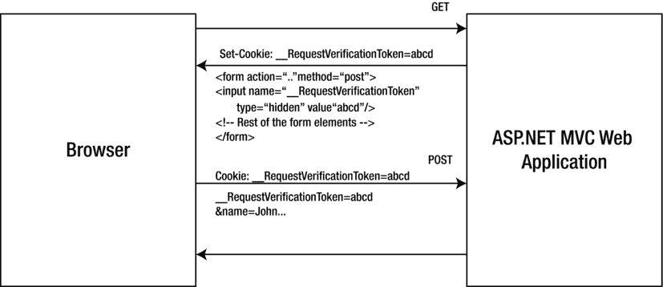

# 十五、安全漏洞

我们在[第 1 章](01.html)中看到，术语*信息安全*是指保护信息和信息系统免受未经授权的访问、使用、泄露、破坏、修改或破坏，以确保机密性、完整性和可用性。与此相关，我们已经看到了应用如何使用基于知识、所有权和继承的三个因素来识别和验证实体，以控制未授权实体对受保护的应用资源的访问。此外，我们还研究了加密技术如何帮助确保消息安全性的两个重要方面:通过加密的机密性和通过数字签名技术的完整性。我们还研究了通过 TLS over HTTP (HTTPS)实现的传输安全性。

现在，您已经对我在前面章节中介绍的安全技术有了新的理解，在这最后一章中，我将向您展示如何通过熟悉开放 Web 应用安全项目(OWASP)2013 年十大清单，从其他组织的错误中吸取教训。在写这本书的时候，这个列表是一个候选版本。该列表确定了十大应用安全漏洞或风险。OWASP 是一个全球性的非营利组织，致力于提高软件的安全性。OWASP 十大风险列表旨在通过确定组织面临的一些最严重的安全风险来提高对应用安全的认识。

RFC 4949，“互联网安全术语表，第 2 版”，将漏洞*T2】定义为系统设计、实现、操作或管理中的缺陷或弱点，可能被利用来违反系统的安全策略。如果漏洞被利用而没有有害的结果，则该漏洞不被认为是一种风险。从 2010 年开始，OWASP 列出了十大风险，而不是漏洞。然而，作为一名开发人员、应用设计人员或应用架构师，您需要了解所有可能导致您的 ASP.NET Web API 易受攻击、有风险或无风险的可能性。在本章中，我将从漏洞的角度介绍 OWASP 风险。*

*攻击*是攻击者利用应用中的漏洞的技术。在前面的章节中，我们已经看到了多种类型的攻击，如中间人(MITM)和重放攻击。反击的行动或技术是一种*对策* 。一个好的对策通常是硬件、软件和流程的组合。这里的软件一词既包括系统软件，如操作系统，也包括应用软件，即您编写的代码或您重用的代码。为了阐明这一点，我在本章中介绍了几种攻击和相应的对策。

最后，我简要介绍了与保护 ASP.NET Web API 相关的两种可靠的实践:日志记录(或审计)和输入验证。

OWASP 应用安全风险

以下是 2013 年 OWASP 十大应用安全风险。在撰写本文时，这个列表是一个发布候选。

1.  注射
2.  被破坏的认证和会话管理
3.  跨站点脚本(XSS)
4.  不安全的直接对象引用
5.  安全错误配置
6.  敏感数据曝光
7.  缺少功能级访问控制
8.  跨站请求伪造(CSRF)
9.  使用已知易受攻击的组件
10.  未经验证的重定向和转发

注射

如果应用向解释器发送不可信的数据，它就容易受到注入攻击。有许多类型的注入:SQL、LDAP、XPATH 等等。从 ASP.NET Web API 的角度来看，我涵盖了两种类型的注入，即 SQL 注入和溢出。

SQL 注入

SQL 注入几乎所有的应用，无论是 web 应用还是其他应用，都必须使用某种类型的存储来持久存储从与最终用户或其他系统的交互中产生的数据，或者作为输入的内部处理的结果。最常见的数据存储类型是关系数据库或 SQL 数据库。SQL 数据库的定义特征是它支持结构化查询语言(SQL) 来管理存储的数据。

一个 SQL 查询由一个或多个 SQL 语句组成，如`SELECT`、`INSERT`、`UPDATE`和`DELETE.`，如果一个查询包含多个语句，则用分号(；)分隔符用于分隔语句。SQL 语句由诸如子句、表达式等语言元素组成。

一个`SELECT` SQL 语句是最常见的，`SELECT`语句的`WHERE`子句和`SELECT`语句本身一样有名。`WHERE`条款让我们能够准确地获得我们需要的数据。在一个拥有 10，000 名员工的组织中，存储员工记录的表将包含与员工数量一样多的记录。如果我对获取雇员的详细信息感兴趣，一个简单的`SELECT`语句，比如`SELECT * FROM employee WHERE employee_id = 12345`，可以返回标识符为 12345 的雇员的详细信息。`WHERE`条款非常灵活。我不仅可以通过 ID 查询 employee 表，还可以使用任何其他属性(数据库中的字段的属性)，比如`WHERE first_name = 'John'`。

SQL 语句本身只是字符串，在 C# 这样的语言中，我们可以声明一个字符串类型的变量并存储 SQL 语句，例如`string sql = "SELECT * FROM employee WHERE employee_id = 12345".`当`SELECT`语句的输入数据(即 12345 的员工 ID)必须根据用户输入进行更改时，构造`SELECT`语句的一个简单方法是将 ID 与骨架 SQL 连接起来。因此，您将从`string sql = "SELECT * FROM employee WHERE employee_id ={0}";`开始，然后插入值，该值来自使用`String.Format()`的用户输入，甚至只是简单的连接。这种方法是 SQL 注入攻击的根本原因，特别是当用户输入未经任何验证或净化就被插入时。插入的输入不必来自屏幕上的用户输入。对于 web API，它可以基于请求头、URI、查询字符串或消息体中的值。举个例子吧。清单 15-1 显示了一个简单的 GET 动作方法，它根据传入的 ID 返回一个`Employee`对象。

[***清单 15-1。***](#_list1) 获取动作方法

```cs
public Employee Get(string id)
{
       return repository.GetEmployee(id);
}
```

控制器可能正在使用与设计相关的良好实践，例如依赖注入和存储库模式，但是传入的 ID 从来没有被验证过，只是被传递到存储库方法中。`GetEmployee` repository 方法可以将未初始化的值进一步向下传递。最后，在数据访问层(如果有的话)，ID 被简单地连接到一个 SQL 字符串上，形成一个`SELECT`语句，并对数据库执行，如[清单 15-2](#list2) 所示。

[***清单 15-2。***](#_list2) SQL 执行

```cs
string connectionString = "Put your connection string here";
string sql = "SELECT * FROM employee WHERE employee_id = " + id; // id is straight from the URI
using (var connection = new SqlConnection(connectionString))
{
        using (var cmd = new SqlCommand(sql, connection))
        {
                connection.Open();
                // use the reader returned by cmd.ExecuteReader(); to create Employee object
        }
}
```

此 web API 易受 SQL 注入攻击。如果用户向`http://server/api/employees/12345`发送 GET，那么刚才讨论的方法非常有效。如果另一个用户向`http://server/api/employees/12345;%20update%20employees%20set%20password='abc'; --,`发送 GET，那么执行的两个语句将是`SELECT * FROM employees WHERE employee_id=12345; and UPDATE employees SET password='abc'; --.`。现在，发出前一个 GET 的用户可以作为任何其他员工登录，假设 employees 表在 password 列中以明文形式存储密码。这是一个过于简单的例子，但足以证明潜在的风险。

如果用户发出 GET to `http://server/api/employees/12345;Truncate%20table%20employees`命令，如果建立连接的 SQL 用户帐户被授权截断表，那么它会产生更大的破坏性影响。有三种方法可以抵御 SQL 注入的攻击。

1.  ASP.NET Web API 世界的第一道防线是正确使用模型绑定。在前面的例子中，即使开发人员不知道 SQL 注入，如果她遵循了 C# 等强类型语言的编程基础，并使用正确的类型将操作参数声明为整数，特别是考虑到标识符通常是数字的事实，就可以避免 SQL 注入风险。模型绑定将无法将字符串转换为预期的数值，请求将失败，并显示 400-错误请求。
2.  第二道防线是验证输入的非法字符。如果雇员标识符必须是一个字符串，比如' jqhuman '而不是 12345，那么模型绑定没有保护，动作参数必须是`string`。在这种情况下，可以检查传入参数的非法值，如分号、引号、注释分隔符(如-或/* */)。这种方法被称为黑名单，比白名单稍逊一筹，白名单只允许特定的一组字符。例如，如果您知道您的组织中的雇员 ID 是基于姓名的，例如，John Q. Human 是 jqhuman，那么您只需允许从 a 到 z 的字符，其他任何字符都是非法的。当然，我们在这里假设用户 ID 永远不会包含任何其他字符，即使员工姓名包含其他字符，就像 Richard Ricochet O'Connell 的情况一样。
3.  第三条也是最重要的防线是永远不要将值连接到 SQL 中并使用参数。我重写了[清单 15-2](#list2) 来使用参数，如[清单 15-3](#list3) 所示。

[***清单 15-3。***](#_list3) 使用参数执行 SQL

```cs
string sql = "SELECT * FROM employee WHERE employee_id = @ID;";
using (var connection = new SqlConnection(connectionString))
{
        using (var cmd = new SqlCommand(sql, connection))
        {
                cmd.Parameters.Add("@ID", SqlDbType.Int);
                cmd.Parameters["@ID"].Value = id; // from the URI after validation

                connection.Open();
                // use the reader returned by cmd.ExecuteReader(); to create Employee object
        }
}
```

 **提示**通过使用实体框架(EF)之类的对象关系映射器(ORM)，可以间接使用参数化查询。ORM 在执行与您的过滤器表达式相对应的查询时，使用参数化查询。因此，ORM 不仅仅是为了消除关系世界与对象世界的阻抗不匹配。还有其他好处。

过贴

如果 ASP.NET Web API 应用盲目地使用绑定中使用的模型对象的所有属性进行进一步处理，而不进行任何验证，那么它就容易受到过度发布 的攻击。ASP.NET Web API 的一个伟大之处在于它拥有与 ASP.NET MVC 相同的模型绑定能力。MVC 模型绑定大部分时候会感觉很神奇。控制器动作方法的参数是根据 HTTP 请求中的内容自动填充的。绑定使开发人员不必编写样板代码来将请求中的值复制到他们想要处理的对象的属性中。由于绑定的魔力，action 方法代码仍然清晰明了。

虽然这是最酷的事情之一，但它也有不好的一面。模型绑定器将尝试映射和设置来自请求的动作方法参数中的所有数据。假设我们有一个`Employee`类，如[清单 15-4](#list4) 所示。

[***清单 15-4。***](#_list4) 员工

```cs
public class Employee
{
    public int Id { get; set; }
    public string FirstName { get; set; }
    public string LastName { get; set; }
    public string Address { get; set; }
    public string Phone { get; set; }
    public bool IsEligibleForBonus { get; set; }
}
```

`EmployeeController`用 action 方法处理更新(PUT)接受一个`Employee`对象作为参数，如[清单 15-5](#list5) 所示。此方法旨在供内部 web 应用使用，以便员工更新他们的联系信息。网络应用具有一个屏幕，该屏幕具有仅对应于联系人详细资料属性的字段:`FirstName`、`LastName`、`Address,`和`Phone`。`Employee`类的`IsEligibleForBonus`属性表示特定员工是否有资格获得基于个人表现和其他一些类似参数的年度奖金。有一个支持该属性的数据库字段，但是员工用来更新联系地址的屏幕不会显示供用户输入要绑定到该属性的任何值的字段。

[***清单 15-5。***](#_list5) 摆放动作方法

```cs
public void Put(Employee emp)
{
    // repository.Save(emp);
}
```

现在，一个精通技术的员工所要做的就是收集在任何 HTTP GET 响应中发回的`Employee`对象的 JSON 表示，以了解属性`IsEligibleForBonus`的存在。有了这些知识，他可以操纵地址更改 HTTP POST 来发送“IsEligibleForBonus”的附加字段:“true”以使自己有资格获得奖金支出！这里的主要问题是直接使用域对象作为允许用户超载发布的动作方法的参数。

如果`Employee`类有一个代表用户账户的属性，情况会变得更糟，如[清单 15-6](#list6) 所示。

[***清单 15-6。***](#_list6) 带有 UserAccount 属性的雇员类

```cs
public class Employee
{
    public int Id { get; set; }
    public string FirstName { get; set; }
    public string LastName { get; set; }
    public string Address { get; set; }
    public string Phone { get; set; }
    public bool IsEligibleForBonus { get; set; }

    public UserAccount Account { get; set; }
}
```

假设`UserAccount`类具有`Password`属性，发送一个类似于[清单 15-7](#list7) 中的 JSON 就可以将`UserAccount`对象的密码属性设置为任意随机密码。如果数据库更新是基于`Employee`对象手动完成的，那么密码很可能不会更新，因为您将尝试只更新 employees 表。如果`Employee`类是一个 ORM 的实体类，比如您正在尝试重用的 EF，而`Account`是一个导航属性，那么效果可能是毁灭性的，密码会在被操纵的请求中一路到达您的数据存储。

EF 是一个 ORM，enables.NET 框架开发人员使用特定领域的对象来处理关系数据。通过指定类模型和表模型之间的映射，您可以让 EF 管理数据库操作，例如选择、插入、更新或删除表行，而无需编写任何数据访问代码。更多信息，参见`http://msdn.microsoft.com/en-us/data/ef.aspx`。

[***清单 15-7。***](#_list7) 请求 JSON

```cs
{
        "Id":12345,
        "Address":"123 Birchwood Lane",
        "Phone":"123-456-7890",
        "IsEligibleForBonus":true,
        "Account":
        {
                "Password":"some random password"
        }
}
```

防止 ASP.NET Web API 中溢出漏洞的最佳方法是永远不要直接使用实体类进行模型绑定。最好的方法是使用实体类的一个子集，它对当前的场景不多也不少。例如，使用[清单 15-8](#list8) 中所示的类进行模型绑定将防止任何溢出。在这种情况下，任何过度发布的数据都会被活页夹忽略。

[***清单 15-8。***](#_list8) 员工视图模型

```cs
public class EmployeeModel
{
    public int Id { get; set; }
    public string FirstName { get; set; }
    public string LastName { get; set; }
    public string Address { get; set; }
    public string Phone { get; set; }
}
```

当然，在将这些属性中存储的值存储到数据库中之前，您需要确保将这些值传输到`Employee`对象中。您可以手动完成同样的工作，或者使用基于约定的对象到对象映射器，比如 AutoMapper ( `http://automapper.org/`)。

被破坏的认证和会话管理

从 ASP.NET Web API 的角度来看，我省略了会话管理，因为它不适用于我们使用 ASP.NET Web API 构建的无状态服务。我在本书中广泛地讨论了身份验证，但是这里值得注意的一点是使用全局消息处理程序进行身份验证。

如第 3 章所述，全局消息处理程序为所有请求运行。与此相反，每个路由的消息处理程序为该路由内的请求运行，而过滤器在应用到操作方法时只为特定的操作方法运行。通过使用全局消息处理程序或全局过滤器进行身份验证，您可以确保所有 API 调用都得到身份验证，而不依赖于编写各种操作方法的程序员的技能和知识水平。对于虚拟主机，您还可以使用 HTTP 模块来确保所有请求都经过身份验证。

跨站点脚本(XSS)

跨站脚本【XSS】都是关于一个恶意用户将客户端脚本注入其他用户将会看到的网页。这种形式的漏洞不适用于 ASP.NET Web API。XSS 有两种口味:

1.  当来自客户端的查询字符串形式的输入被服务器直接用于生成响应而不进行清理时，会出现非持久形式的 XSS。这种形式的 XSS 与 ASP.NET Web API 完全无关。
2.  当来自客户端的输入未经清理就存储在持久性存储中，随后未经清理就被检索并写入响应时，会出现 XSS 的持久性形式。

以我们的员工 API 收到的 POST 请求为例。假设我们创建了一个新雇员，或者甚至更新了一个现有的雇员，其姓名与请求中的姓名完全相同。例如，如果请求中的名字是`<script>alert('Howdy!');</script>`，我们就存储与雇员名字相同的名字，而不进行任何清理。如果这个 web API 被一个 web 应用使用，该应用将雇员的名字按原样写入浏览器的 HTTP 响应中，那么我们就有一个持久的 XSS 问题。

然而，web API 并不负责对数据进行编码和存储。web API 是基于 HTTP 的，但它可以被任何东西使用，显示的数据可以在任何设备上，由任何应用使用。比方说，对于在窗口的标签中显示名字的 WPF 应用来说，转义这个输入是一个有争议的问题。只有当带有脚本标签的名称被原样写入发送到 web 浏览器的 HTTP 响应时，才会出现问题。因此，防止 XSS 漏洞的责任将是使用 web API 的 web 应用的责任。

即使`GetAllEmployees`方法返回的是`<script>alert('Howdy!');</script>`而不是 John Q. Law，Home/Index 视图也可以在生成用于浏览器呈现的 HTML 之前对名称进行 HTML 编码。默认情况下，JQuery 等 JavaScript 库执行 HTML 编码。ASP.NET MVC 中的 Razor 视图引擎也是如此。总而言之，在大多数典型情况下，ASP.NET Web API 不会考虑 XSS。

不安全的直接对象引用

宁静的 URIs 是可以被黑客攻击的，事实上，他们被认为是可以被黑客攻击的。例如，假设`http://server/api/employees/12345`可以给出雇员 John Q. Human 的信息，其雇员 ID 为 12345。如果 John 使用 URI 看到了自己的详细信息，那么任何好奇的人都会很自然地看到这个端点将为 ID 为 12346 的同事返回什么。这里的直接对象是雇员的标识符。如果我们盲目的根据 ID 返回数据，就变成了不安全的直接对象引用。

这正是授权的要点。授权不需要局限于动作方法的层次。有时，它需要比这更细化。在我们所看的例子中，在那个级别上授权失败是不安全的直接对象引用的一个例子。

然而，与 ASP.NET MVC 相比，关于 ASP.NET Web API 要注意的一点是，ASP.NET Web API 的 URI 对典型用户是不可见的，即使当使用 Web API 的客户端应用是 Web 应用时。换句话说，如果 ASP.NET MVC 应用的雇员详细信息页面的 URI 是`http://server/hrapplication/employee/getdetails/12345`，那么用户很可能会试图编辑 URI，并用另一个雇员 ID 进行尝试。在 ASP.NET Web API 的情况下，URI 不会向最终用户公开。然而，模糊安全性并不是一个可靠的安全原则，您必须在正确的粒度级别实现授权，而不管用户是否能看到 URI。

在前面关于过度发布的小节中，我建议使用一个模型类，并给出了`EmployeeModel`类的例子([清单 15-8](#list8) )。有一个名为`Id`的属性。想想看，用户可以发布 HTTP 帖子并更新其他员工的联系方式吗？答案是肯定的。模型类确实解决了溢出漏洞，但是它不能防止用户进行非故意的更新。这种漏洞是另一种形式的不安全直接对象引用。因此，这种形式的脆弱性不仅限于 URIs。

安全错误配置

安全性是通过配置和编程实现的。安全错误配置 ，顾名思义，就是没有以正确的方式配置安全。这里的“配置”一词不仅限于像 Web.config 这样的配置文件，程序员在阅读小节标题时会立即联想到它。根据 OWASP，未能通过不应用补丁来保持您的软件更新；不禁用和删除不必要的服务、软件和操作系统帐户；不阻塞不需要的端口；以及为连接到开发和生产数据库分配相同的凭据都属于这一类。

虽然前面的活动与 IT 管理有关，但是程序员也可能引入漏洞。这里有两个这样的例子。

1.  当生产环境中出现异常时，向最终用户发送堆栈跟踪会带来安全风险。在`App_Start`文件夹的`WebApiConfig.cs`中为错误详细信息包含策略指定`Never`选项可以阻止堆栈跟踪到达客户端，如下:`config.IncludeErrorDetailPolicy = IncludeErrorDetailPolicy.Never;`程序员将此设置更改为`Always`并将其签入，构建过程将此更改传播到生产环境，这是由程序员和软件配置管理过程引入的安全错误配置漏洞的一个示例。
2.  `HttpRuntimeSection.EnableHeaderChecking`属性的目的是在响应头中启用回车和换行符编码，以防止 HTTP 响应分割攻击。默认情况下，这是真的，因此 ASP.NET 应用不容易受到攻击。将此设置为 false 是安全性错误配置的另一个例子。

敏感数据暴露

敏感数据暴露意味着无法保护静态数据和动态数据。首先，让我们试着理解动态数据和静态数据。顾名思义，移动中的数据是指网络中正在移动的数据。静态数据是存储的数据，例如文件和数据库中的数据。在保护数据安全方面，移动中的数据备受关注，因为与安全地存储在安全数据中心内的服务器上的数据相比，您自然会更担心从您可以控制的边界传输出去的数据。

静态数据

如果 Mallory 篡改了 Alice 和 Bob 之间交换的消息，影响相对较低，因为它只影响 Alice 和 Bob。然而，如果马洛里得到了敏感的存储数据，它会影响到每一个以不安全的方式存储数据的汤姆、迪克和哈利。

静态数据的敏感数据漏洞源于敏感数据以明文形式存储而不进行任何加密、使用内部编写的劣质加密算法、标准加密算法使用不当，或者缺乏更好的流程来保护密钥等相关加密材料。

散列密码用于安全存储

在第 6 章中，我从保护动态数据的角度描述了加密和签名，尽管加密也可以用来保护静态数据。现在，我们来看看与保护静态数据密切相关的一种技术，即哈希技术。哈希是将任意数据或消息转换为固定长度字符串的过程。

加密和哈希之间的重要区别在于，与加密不同，哈希的输出不能恢复到原始状态。加密的数据可以使用相同的密钥进行解密，如在对称加密的情况下，或者在不对称加密的情况下使用不同的密钥。经过哈希处理的数据将永远保持哈希状态。哈希数据的定义特征是原始数据永远无法从哈希数据中恢复。那么，它有什么用呢？

如果我使用某种算法将“世界和平”散列到 123456 中，并将散列存储在我的数据存储中，我就不需要担心怀有恶意的人能够从 123456 中恢复秘密“世界和平”。每当我通过算法运行“世界和平”时，它总是给我 123456。因此，散列的一个很大用途是存储敏感信息，比如密码，用户每次登录我们的系统时都需要输入密码。我们可以对输入的密码进行哈希运算，并将哈希运算的结果与之前存储的内容进行比较，以做出身份验证决定。因此，散列是保护静态敏感数据(如密码)的一种很好的技术。

 **请注意**哈希并不是一种适合所有静态数据安全需求的万能解决方案。您不能散列信用卡号码并存储它以备后用，因为信用卡号码不能从散列中恢复。在这种情况下，加密更合适。

有多种算法可用于散列。MD5 消息摘要算法是一种广泛使用的算法，它产生 128 位(16 字节)的哈希值。它有一些弱点，这导致了密码世界开始使用安全散列算法(SHA-1)。SHA-1 也发现了安全缺陷，SHA-2 是目前推荐的算法。在写这本书的时候，一个新的算法 SHA-3 已经到位，补充 SHA-2。SHA-3 不应该取代 SHA-2，因为到目前为止还没有显示出对 SHA-2 的弱点。

中的`System.Security.Cryptography`命名空间。NET 框架有对应于不同散列算法的类:MD5、SHA1、SHA256、SHA384、SHA512 等等。最后三个类代表 SHA-2 算法家族，分别产生大小为 256、384 和 512 位的摘要。

让我们直接从英语词典中为一个极长的单词创建一个 SHA256 散列，“supercalifragilisticepialidocious”和一个小单词“hello”参见[清单 15-9](#list9) 中创建散列的代码。

[***清单 15-9。***](#_list9) SHA256 哈希

```cs
string data = "Supercalifragilisticexpialidocious";
SHA256 hasher = SHA256.Create();
byte[] hash = hasher.ComputeHash(Encoding.UTF8.GetBytes(data));

string hashString = BitConverter.ToString(hash).Replace("-", "").ToLower();
```

创建散列极其简单。只需调用`ComputeHash`方法就可以了。`BitConverter`类用于将字节数组转换成十六进制字符串表示。单词“supercaliflagilisticexpalidocious”和“hello”的输出如清单 15-10 中的[所示。](#list10)

[***清单 15-10。***](#_list10) 哈希输出

```cs
94730f57d7e41018d963d92fbf11618dce8274ca2c1bf72274e0285a6013c17b
2cf24dba5fb0a30e26e83b2ac5b9e29e1b161e5c1fa7425e73043362938b9824
```

虽然输入字符串在长度上有很大不同，但两种情况下的摘要长度都是 256 位。不过，重要的一点是，破解这些散列很容易。换句话说，如果您将这些哈希值输入到任何在线哈希破解程序，就有可能获得原始字符串。就连那个大词也不例外。我们开始这一部分的基本前提是原始字符串不能从散列中恢复。在线工具如何进行提取？这些工具甚至不是批处理或离线程序，而是可以在几秒钟内导出原始字符串的在线 web 应用。

正如我们在[第 8 章](08.html)中看到的，我们可以强力攻击 hash。在运行中，我们可以计算 a 的散列，并将其与输入的值进行比较。如果不匹配，我们从 b 开始。当我们到达 z 时，我们从 aa 开始，以此类推。正如我们在[第 8 章](08.html)中所确定的，这将需要相当多的时间和 CPU 能力来实现。

有可能提前计算出众所周知的单词的散列，例如字典中的单词，当散列被输入时，它就变成了简单的查找问题。显然，原始形式的散列法并不是存储密码的好选择，因为拥有散列密码的恶意用户可以像使用在线工具一样很容易地获得原始字符串。

普通散列的基本问题是特定输出到相应输入的映射可以预先计算和存储。解决这个问题的一个简单方法是*腌制*。salt 只是在哈希之前添加到数据中的随机字符串，因此不能使用预计算映射将输出映射回输入。因此，除了强力攻击之外，salting 使得对散列的所有攻击无效，包括基于字典的攻击。将 salt 值保存更长时间是很重要的，如果为每个消息或数据使用唯一的 salt 值，将会更加安全。

Salting 确保攻击者不能使用查找表快进攻击过程，但攻击者可以发起暴力攻击。随着 CPU 变得越来越强大、越来越便宜，弹性计算能力可以每小时使用，无需预先投资硬件，暴力攻击在理论上是不可能的。有一种叫做*键拉伸的技术可以让暴力攻击变慢。事实上，这将使它变得如此之慢，以至于几乎不可能破解散列。在现实世界中，至少从攻击者的角度来看，花几个月的时间破解一个 hash 和无法破解一样糟糕。*

基于密码的密钥派生函数 2 (PBKDF2) 是一种密钥派生函数，是 RSA 实验室的公钥加密标准(PKCS)系列的一部分，特别是 PKCS #5 版本 2.0，也作为互联网工程任务组的 RFC 2898 发布。它取代了早期的标准 PBKDF1，后者只能产生最长 160 位的派生密钥。

有一些标准算法可用于密钥拉伸，例如 PBKDF2 算法。它将输入密码或数据与一个 salt 值进行哈希运算，并多次重复该过程以生成一个派生密钥。这种重复的散列使得暴力攻击耗时且令攻击者沮丧。建议迭代次数为 1，000 次。迭代次数越多，需要的 CPU 能力和时间就越多，但是安全性会更好。参见清单 15-11 中使用 salt 和 PBKDF2 生成 SHA-1 散列的代码。在这个例子中，`Rfc2898DeriveBytes`类是基于 SHA-1 的，因此产生的散列是 SHA-1 而不是 SHA256。

[***清单 15-11。***](#_list11) 用盐和钥匙拉伸 SHA-1 哈希

```cs
string data = "hello";

byte[] salt = new Byte[32];
using (var provider = new RNGCryptoServiceProvider())
{
    provider.GetBytes(salt);
}

Rfc2898DeriveBytes pbkdf2 = new Rfc2898DeriveBytes(data, salt);
pbkdf2.IterationCount = 1000;

byte[] hash = pbkdf2.GetBytes(32);

string hashString = Convert.ToBase64String(hash);
```

我们该如何运用它？假设您的用户表有 user_id 和 password 列，在用户注册时，为 salt 添加另一列，并将[清单 15-11](#list11) 中的`hashString`和`salt`分别存储在 password 和 salt 列中。你可以原样储存盐；也就是说，作为字节数组本身。或者你可以用 base64 编码。[清单 15-12](#list12) 展示了如何在用户重新登录时验证用户凭证。

[***清单 15-12。***](#_list12) 用户凭证认证

```cs
string password = String.Empty; // Placeholder for the password from database
string saltString = String.Empty; // Placeholder for the salt from database
string userEnteredPassword = String.Empty; // User input

var pbkdf2 = new Rfc2898DeriveBytes(userEnteredPassword, Convert.FromBase64String(saltString));
pbkdf2.IterationCount = 1000;
byte[] computedHash = pbkdf2.GetBytes(32);

bool isAuthenticCredential = password.Equals(
Convert.ToBase64String(computedHash),
StringComparison.Ordinal);
```

 **提示**要加密数据库中的数据，你需要一个密钥。永远不要将此密钥存储在数据库本身中。如果数据库遭到破坏，例如通过 SQL 注入，攻击者将发现如果密钥存储在数据库本身中，就很容易获得并解密密钥。而是将其存储在运行数据库引擎的操作系统帐户无权访问的文件中。

加密 Web。配置

在本节的开头，我们看到了静态数据和动态数据之间的区别。术语静态数据不限于存储在数据库或文件中的应用数据。它确实包括存储在配置文件(如 Web.config)中的配置数据，虽然在典型情况下可能没有必要加密整个 Web.config 文件，但有选择地加密节是保护配置文件中敏感信息的好策略。最适合的是数据库连接字符串、web API 可能需要用来连接其他系统的凭证等等。加密 Web.config 文件非常重要，因为它需要驻留在 Web 服务器中。web 服务器通常位于 dmz 中。

在我们看加密 Web.config 的过程之前，我们先来看看[清单 15-13](#list13) 的`connectionStrings`段加密后是什么样子，如图[清单 15-14](#list14) 所示。

[***清单 15-13。***](#_list13) Web.config 明文

```cs
<connectionStrings>
  <add name="DefaultConnection" connectionString="Data Source=.\SQLEXPRESS;
                AttachDbFilename=|DataDirectory|\aspnet-MyApplication-20121110193704.mdf;
                Initial Catalog=aspnet-MyApplication-20121110193704;Integrated Security=True;
                User Instance=True"
                providerName="System.Data.SqlClient" />
</connectionStrings>
```

[***清单 15-14。***](#_list14) Web.config 加密

```cs
<connectionStrings configProtectionProvider="RsaProtectedConfigurationProvider">
  <EncryptedData Type=" http://www.w3.org/2001/04/xmlenc#Element "
    FontName1">http://www.w3.org/2001/04/xmlenc #">
    <EncryptionMethod Algorithm=" http://www.w3.org/2001/04/xmlenc#tripledes-cbc " />
    <KeyInfo FontName1">http://www.w3.org/2000/09/xmldsig #">
      <EncryptedKey FontName1">http://www.w3.org/2001/04/xmlenc #">
        <EncryptionMethod Algorithm=" http://www.w3.org/2001/04/xmlenc#rsa-1_5 " />
        <KeyInfo FontName1">http://www.w3.org/2000/09/xmldsig #">
          <KeyName>Rsa Key</KeyName>
        </KeyInfo>
        <CipherData>
         <CipherValue>fg1RaefMxjQBV6hwx3q. . .1qnDmdDrsWcwk=</CipherValue>
        </CipherData>
      </EncryptedKey>
    </KeyInfo>
    <CipherData>
      <CipherValue>ld0t8MkPX9euWy2bjFj. . .nTEYzApmlQC9A80=</CipherValue>
    </CipherData>
  </EncryptedData>
</connectionStrings>
```

虽然 Web.config 的加密也可以通过 C# 代码来完成，但是让我们把重点放在使用 aspnet_regiis 实用程序上。在生产环境中，系统管理员很可能会执行此任务，因此使用实用程序更适合此目的。aspnet_regiis 工具位于`%windows%\Microsoft.NET\Framework\versionNumber`文件夹中。比如它是“C:\Windows\Microsoft。NET\Framework\v4.0.30319”。

首先，您需要授予运行 IIS 工作进程的 Windows 帐户对默认 RSA 密钥容器的读取权限，对于该容器使用了 pa 开关。我已经在默认应用池中部署了 ASP.NET Web API 应用。我在清单 15-15 的第一行使用的账户反映了这个事实。

[***清单 15-15。***T5】aspnet _ regiis 命令](#_list15)

```cs
aspnet_regiis -pa "NetFrameworkConfigurationKey" "IIS APPPOOL\DefaultAppPool"

aspnet_regiis -pef "connectionStrings" "C:\Users\102628\Desktop\MvcApplication5\MvcApplication5"

aspnet_regiis -pdf "connectionStrings" "C:\Users\102628\Desktop\MvcApplication5\MvcApplication5"
```

为了加密，使用 pef 开关。参数是应用的节名和路径。若要将 Web.config 文件解密回明文，请使用 pdf 开关。

不管 Web.config 文件是否加密，都可以使用`System.Web.Configuration.WebConfigurationManager.ConnectionStrings["DefaultConnection"].ConnectionString`读取配置数据。

动态数据

保护移动中的数据是一个广泛的话题。从历史上看，密码学主要是为了保护通信的安全，或者从移动数据的角度来看。在第 6 章中，我们从保护移动数据的角度研究了加密和签名。

首先，在 web 世界中，通过 HTTP/TLS(也称为 HTTPS)的传输安全是确保通信安全的最基本也是最重要的方面。从程序员的角度来看，HTTPS 如果做得正确，是最容易使用的，因为没有什么额外的事情需要做。当然，从 IT 管理、运营和预算的角度来看，这意味着在服务器端获取、安装和管理有效的证书。

我想引用 Eran Hammer 的一篇帖子中的几段话来说明一个事实，即 HTTPS 并不是解决所有与动态数据相关的漏洞的灵丹妙药。

HTTPS 不是能解决所有问题吗？

HTTPS 保证端到端的安全连接。实现和部署细节是确保这一点的关键，但是如果做得正确(并不总是这样)，这是一个很好的解决方案。HTTPS 提供的是一个安全的渠道。通过 HTTPS 发送的任何秘密、口令或不记名令牌都受到保护，不会被监听线路的攻击者破坏。HTTPS 允许客户端将秘密安全地发送到它想要的目的地。

然而，如果客户想要的目的地是一个糟糕的地方，HTTPS 也无能为力。HTTPS 无助于防止网络钓鱼攻击，因为任何人都可以获得 SSL 证书并在浏览器中显示安全图标。您使用安全通道的事实并不意味着另一端的实体是好的。这只是意味着没有其他人可以监听它(只有坏人)。如果客户将他们的不记名令牌发送到错误的地方，甚至是 HTTPS，那么游戏就结束了。

——他们是锤子
`http://hueniverse.com/2010/09/oauth-2-0-without-signatures-is-bad-for-the-web/`

Eran Hammer 是 OAuth 规范的主要作者和编辑。前面的引用摘自他关于 OAuth 2.0 中不记名令牌支持的帖子。OAuth 1.0 要求加密签名与请求一起发送。OAuth 2.0 放弃了签名和加密，转而支持无记名令牌。当我们处理 SAML 令牌时，我们已经看到了持有人密钥令牌与无记名令牌，但概念是无记名令牌就像现金一样。发现者，保管者！

尽管 Eran Hammer 的文章与 OAuth 访问令牌有关，但给出的叙述适用于任何动态的敏感数据。HTTPS 是伟大的，但它需要大量的纪律和深厚的知识。我们倾向于选择阻力最小的方式，尤其是在项目进度压力下，来完成工作。如果我们得到一个错误，因为证书有一些问题，或者有一些与服务器配置相关的问题，我们通常不会修复最终的问题，而只是近似的问题。禁用证书检查比解决最终问题要容易得多。虽然不是故意的，但我们在这个过程中使 HTTPS 机制容易受到 MITM 攻击。

签名 ASP.NET Web API 响应

HTTPS 的传输安全性确保没有人能够窃听或发动 MITM 攻击，但它不能确保消息安全性提供的端到端安全性。在这一节中，我将展示一个与签名相关的有用的小技巧。当 HTTPS 无法使用时，或者如果您相信深度防御，并希望在 HTTPS 的基础上构建一些额外的东西，您可以将签名合并到 web API 响应中，使其防篡改。

为此，我使用了一个动作过滤器，以便只有选择性的动作方法的响应被签名。[清单 15-16](#list16) 显示了动作过滤器的代码。我重写了`OnActionExecuted`方法来实现签名逻辑。`OnActionExecuted`方法在 action 方法之后运行，因此是实现我们的逻辑的合适位置。签名是使用 URI、HTTP 方法和整个消息体生成的。SHA256 HMAC 被填充到 X-Signature 响应头中，供客户端验证。

[***清单 15-16。***](#_list16) 签约滤镜

```cs
public class SignIt : ActionFilterAttribute
{
    public override void OnActionExecuted(HttpActionExecutedContext context)
    {
        // 256-bit shared key - hard-coded here only for the purpose of this example
        string key = "foGqiG0GLeY8VGdP2PZoS9aoOB7VjkNaUc549Ac2OCkh2t5rk9";
        key += "wTB0Ebj98I7LGE1mpAkAHXabU/aHTiRhud9A==";

        string response = context.Response.Content.ReadAsStringAsync().Result;

        if (!String.IsNullOrWhiteSpace(response))
        {
            string data = String.Format("{0}{1}{2}", context.Request.RequestUri.ToString(),
                                                        context.Request.Method,
                                                            response);

            byte[] bytes = Encoding.UTF8.GetBytes(data);
            using (HMACSHA256 hmac = new HMACSHA256(Convert.FromBase64String(key)))
            {
                string signature = Convert.ToBase64String(hmac.ComputeHash(bytes));
                context.Response.Headers.Add("X-Signature", signature);
            }
        }
    }
}
```

客户端可以按照与创建签名类似的方式验证签名。客户端代码如清单 15-17 中的[所示。我在客户端使用相同的密钥，因此这是一个对称共享密钥。我计算签名，并将其与 X 签名头中的签名进行比较。匹配的值表明响应未被篡改。为了简洁起见，清单 15-17](#list17) 中的代码假设 X 签名响应头将一直存在。

[***清单 15-17。***](#_list17) 客户端验证响应完整性

```cs
static void Main(string[] args)
{
    string key = "foGqiG0GLeY8VGdP2PZoS9aoOB7VjkNaUc549Ac2OCkh2t5rk9";
    key += "wTB0Ebj98I7LGE1mpAkAHXabU/aHTiRhud9A==";

    using (HttpClient client = new HttpClient())
    {
        Uri uri = new Uri(" http://localhost:20759/api/employees/12345 ");

        string creds = String.Format("{0}:{1}", "badri", "badri");
        byte[] bytes = Encoding.ASCII.GetBytes(creds);
        var header = new AuthenticationHeaderValue("Basic", Convert.ToBase64String(bytes));
        client.DefaultRequestHeaders.Authorization = header;

        var result = client.GetAsync(uri).Result;
        string response = result.Content.ReadAsStringAsync().Result;

        string message = String.Format("{0}{1}{2}", uri.ToString(), "GET", response);

        byte[] signature = Encoding.UTF8.GetBytes(message);
        using (HMACSHA256 hmac = new HMACSHA256(Convert.FromBase64String(key)))
        {
            byte[] signatureBytes = hmac.ComputeHash(signature);
            bool isValid = Convert.ToBase64String(signatureBytes)
                                      .Equals(result.Headers.GetValues("X-Signature").First(),
                                                                        StringComparison.Ordinal);
        }
    }
}
```

 **提示**响应头也可以包含在签名中，但是只包含敏感的自定义头，因为头可以由中介添加或更改。包含所有标题并不是一个好主意。

缺少功能级访问控制

缺少函数级访问控制 漏洞是由于应用未能正确保护低级函数造成的。这与不安全的直接对象引用有关，但有一个主要的区别。不安全的直接对象引用与输入数据有关，而缺少函数级访问控制漏洞与未能保护函数有关。

例如，假设`http://server/api/employees/12345`可以给出雇员 ID 为 12345 的雇员的信息。对雇员详细信息具有只读访问权限的用户可以获得 JSON 表示，并在操纵 get 响应的 JSON 后，尝试在同一个 URI 上进行 HTTP POST。如果 ASP.NET Web API 允许 HTTP POST，它容易受到缺少函数级访问控制漏洞的攻击。

为每个 API 调用实现可靠的授权机制非常重要。正如我们在[第 5 章](05.html)中看到的，为所有调用运行的全局消息处理程序或过滤器，并使用`ClaimsAuthorizationManager`的子类基于声明控制访问，是防止 ASP.NET Web API 中这一漏洞的最佳方法。

跨站请求伪造 (CSRF)

跨站点请求伪造(CSRF，发音为 *sea-surf* )只是欺骗 web 浏览器使用您之前作为常规身份验证的一部分收到的身份验证令牌向网站发出请求。CSRF 通常与包含认证票的 cookie 联系在一起，所以你可能想知道 CSRF 与 ASP.NET Web API 有什么关系。web API 是基于 REST 的，我不使用 cookie。不幸的是，cookie 并不是唯一可以被 CSRF 攻击利用的东西。浏览器不缓存 cookies 以外的东西，比如用户在基本身份验证期间直接输入到浏览器中的用户 ID 和密码。

假设我从我的网络浏览器向受基本认证保护的`http://server.com/api/Employees/123`发出请求。因为浏览器接收到一个指示基本方案的 WWW-Authenticate 响应头，所以浏览器会弹出一个对话框并获取我的凭据。在对同一路径`/api/Employees`的所有后续请求中，凭证会像 cookie 一样被谨慎地发送回去。

基本的身份验证凭据类似于内存中的 cookie，因为您需要关闭浏览器来清除缓存的凭据。浏览器出于好意缓存凭据。它不想用认证对话框来轰炸你从服务器请求的每一个资源。不幸的是，所有良好的意图并不能确保好的结果。

通过基本身份验证了解 CSRF

让我们看一个涉及 ASP.NET Web API 的例子来理解 HTTP 基本认证是如何被利用的。因为它涉及基本的身份验证，所以如果愿意，您可以在 IIS 中部署应用并启用 HTTPS。通过 HTTPS 的交通安全，或缺乏它，不会改变最终结果。

我们需要 Fiddler 的帮助来获取流量。如果启用 HTTPS，您需要启用 Fiddler 来解密 HTTPS 流量。以下步骤显示了受 HTTP 基本认证保护的 ASP.NET Web API 的 CSRF。

1.  使用 Web API 模板在 Visual Studio 中创建新的 ASP.NET MVC 4 项目。
2.  Create a new `ApiController` (`EmployeesController`) and a class (`Employee`), as shown in [Listing 15-18](#list18).

    [***清单 15-18。***](#_list18) 员工控制员

    ```cs
    public class EmployeesController : ApiController
    {
        [Authorize]
        public IEnumerable<Employee> Get()
        {
            return new Employee[]
            {
                new Employee() { Id = 12345, FirstName = "John", LastName = "Human" },
                new Employee() { Id = 67890, FirstName = "Jane", LastName = "Public" }
            };
        }

        [Authorize]
        public Employee Get(int id)
        {
            return new Employee()
                {
                    Id = id,
                    FirstName = "John",
                    LastName = "Human"
                };
        }

        public void Post(Employee emp)
        {
            // repository.Save(emp);
        }

        public void Put(Employee emp)
        {
            // repository.Save(emp);
        }
    }

    public class Employee
    {
        public int Id { get; set; }
        public string FirstName { get; set; }
        public string LastName { get; set; }
    }
    ```

3.  使用消息处理器实现基本认证，就像我们在第 8 章中所做的那样。
4.  通过将消息处理程序添加到`App_Start`文件夹的`WebApiConfig`文件中的 handlers 集合，将该处理程序挂接到管道中。
5.  Change the view Index.cshtml corresponding to `HomeController`, as shown in [Listing 15-19](#list19).

    [***清单 15-19。***](#_list19)Index . csth ml:home controller 的索引视图

    ```cs
    @section scripts{
        <script type="text/javascript">
            $(document).ready(function () {
                $('#search').click(function () {
                    $('#employees').empty();
                    $.getJSON("/api/employees", function (data) {
                        $.each(data, function (i, employee) {
                            var content = employee.Id + ' ' + employee.FirstName;
                            content = content + ' ' + employee.LastName;
                            $('#employees').append($('<li/>', { text: content }));
                        });
                    });
                });
            });
        </script>
    }
    <div>
        <div>
            <h1>
                Employees Listing</h1>
            <input id="search" type="button" value="Get" />
        </div>
        <div>
            <ul id="employees" />
        </div>
    </div>
    ```

6.  该视图使用 JQuery 对/api/employees 进行 AJAX 调用，并将结果显示为无序列表。
7.  Create a new MVC controller, `BadController` with `Index` action. The controller action method and the view are shown in [Listing 15-20](#list20) and [Listing 15-21](#list21), respectively.

    [***清单 15-20。***](#_list20) BadController :指数动作法

    ```cs
    public class BadController : Controller
    {
        public ActionResult Index()
        {
            return View();
        }
    }
    ```

    [***清单 15-21。***](#_list21) BadController:索引动作视图

    ```cs
    @{
        ViewBag.Title = "Index";
    }

    <h2>Index</h2>
    
    @section scripts{
        <script type="text/javascript">
            document.getElementById('myForm').submit();
        </script>
    }

    <form id="myForm" action="/api/employees" method="post">
        <input type="hidden" name="Id" value="78956" />
        <input type="hidden" name="FirstName" value="John" />
        <input type="hidden" name="LastName" value="Human" />
    </form>
    ```

8.  在这种情况下，`BadController`在同一个应用中运行，但它只是一个用于说明的占位符。它可以是任何东西，如任何网站提供的页面，甚至是您计算机中的静态 HTML 页面。
9.  现在我们已经完成了编码，让我们用下面的步骤来测试一下。
    *   a.转到`https://server/yourapplication`，将显示`HomeController`的索引视图。
    *   b.如果您配置了 HTTPS，但没有使用有效的服务器端证书，浏览器将会报错。为了这个测试的目的，忽略它。
    *   c.单击获取按钮。浏览器应该会弹出一个对话框，获取您的凭证，并将员工列表显示为一个无序列表。
    *   d.在不关闭浏览器的情况下，浏览您喜欢的任何网站，并在一段时间后返回我们的应用。甚至可以是第二天。
    *   e.转到`https://server/yourapplication/bad`。该页面将正常显示，没有什么特别的。
    *   f.如果您看到 Fiddler 捕获，您会注意到坏页面使用您缓存的基本凭证成功地向 API 发出了 GET 和 POST 请求。可以想象，坏页面可能是世界上任何一个 web 服务器提供给你的。这个页面只是普通的 HTML。对眼睛来说，看起来没什么不同。通过使图像的宽度和高度为零，即使是破碎的图像也是不可见的。

事实是，您所浏览的网页已经成功地执行了一个 GET 和一个 POST，欺骗您的浏览器将 authorize 头和您的凭证发送到我们的 web API。通过 POST 请求，它可以将一个随机的雇员插入到我们的雇员数据库中。我们的 GET 是无效的，所以没有太大的损害。

对于需要从浏览器上下文中运行的网页访问的 web API，最好避免 HTTP 基本身份验证。这是否意味着 HTTP 基本认证实际上毫无价值？答案是否定的。只有当浏览器出现时，我们才有 CSRF 问题。对于非浏览器客户端，基于 HTTPS 的基本身份验证仍然是一个好的、简单的选择。

CSRF 涉及饼干

当涉及 cookies 的 CSRF 受表单身份验证保护时，它通常与 ASP.NET Web API 相关。表单认证在第 2 章中有详细介绍。当您第一次导航到某个页面时，您将被重定向到登录页面。身份验证成功后，带有身份验证票的 cookie 将被写入 HTTP 响应。浏览器获取 cookie，并开始在后续请求中将 cookie 发送回 web 应用，直到 cookie 过期。如果 cookie 是内存中的 cookie，当用户关闭浏览器时，cookie 将不复存在。

只要 cookie 有效，当向首先发送 cookie 的 web 应用发出请求时，浏览器就会努力发送 cookie。需要注意的关键点是，无论是您作为用户发起 HTTP GET 或 POST，还是浏览器自己创建，浏览器都会发送 cookie。

什么时候浏览器会在你没有告诉它的情况下发出请求？当一个 HTML 页面需要被渲染时，浏览器会在没有得到你的许可的情况下发出多个请求来获取 CSS、脚本文件和图像等文件。如果有一个图像的`src`属性被设置为 URI `http://server.com/employee/delete/12345`，浏览器将发出 GET 请求并触发服务器端的代码执行，并可能删除标识符为 12345 的雇员。

与`EmployeeController`中的动作方法`Delete`对应的资源`http://server.com/employee/delete/12345`，受表单认证保护。如果直接向 URI 发出请求，浏览器将被重定向到登录页面。只有认证成功，用户才能使用 web 应用做任何有用的事情。

浏览器在您不知情的情况下访问了此页面。如果您以前登录过这个 web 应用，并且打开了一个会话，也就是说，您有一个带有身份验证票的实时 cookie，浏览器会通过这个 GET 请求发送 cookie，该请求是由浏览器检索图像的尝试触发的。

ASP.NET 很高兴，因为它得到了票，并在服务器端运行代码。这种影响就像有人掏空了你的银行账户一样具有毁灭性，但归根结底是服务器端的代码做了什么。使 GET 请求无效是一种威慑，但不足以堵住这个安全漏洞。使用几行 JavaScript 发布一个 HTML 表单非常容易。

如果可能的话，最好使用 ASP.NET Web API 避免涉及 cookies 的表单验证。没有理由像 forms authentication 那样，使用包含在基于 web 浏览器的客户机和 web API 之间来回发送的身份验证票的 cookies。然而，如果你有正当的理由必须使用这样的 cookie——老实说，我甚至想不出一个正当的理由为什么 cookie 必须与 web API 一起使用——你必须意识到这样一个事实，即你的 web API 现在容易受到 CSRF 攻击。

我们不得不接受这样一个事实，那就是我们必须和一块饼干一起生活。我们如何防止 CSRF 袭击？看看那些已经为 web 应用设计了这种机制的人，比如 ASP.NET MVC 提供的防伪标记。

CSRF 的一个重要特征是恶意用户通常对用户和网站之间的交互一无所知。他只是欺骗浏览器发出一个用户确实打算发起的请求，并期望从这个非故意的请求中获得一些东西。ASP.NET MVC 的防伪令牌是一个简单的机制，它利用了前面的事实(见[图 15-1](#Fig1) )。



[图 15-1。](#_Fig1) MVC 防伪令牌在发挥作用(为便于理解而近似)

一个令牌被写入一个隐藏字段，该字段是要提交的 HTML 表单的一部分，同样的令牌作为 cookie 被写入响应。当一个真实的用户发布消息时，cookie 会被发送回来，消息头中带有令牌，消息体中带有令牌的隐藏字段也是如此。在服务器端，比较这两个值的简单检查可以检测到 CSRF。恶意用户可以用 cookies 欺骗浏览器发出请求，但不能伪造包含相同令牌的请求，因为他对用户或受害者与 web 应用之间发送的内容一无所知。

在前面的例子中，攻击者可以欺骗浏览器向 web 应用发出请求，请求中包含一个`__RequestVerificationToken` cookie，但是不知道要在消息正文中放入值 abcd。当然，abcd 只是一个占位符，真正的令牌将是一个很长的、难以猜测的神秘字符串。ASP.NET MVC web 应用可以立即拒绝该请求，因为消息体或者根本不包含`__RequestVerificationToken`字段，或者如果存在的话，该值将与 cookie 中的值不同。

MVC 框架提供了`AntiForgeryToken()` helper 方法，可以用来插入隐藏字段和 cookie。通过将`@Html.AntiForgeryToken()`放入表单，我们可以完成同样的事情。在服务器端，处理 POST 的动作方法可以用一个`ValidateAntiForgeryToken`属性来修饰，该属性将负责比较头和主体令牌值，并拒绝伪造的请求。

实现防伪标记的一个基本假设是，我们的 ASP.NET MVC 应用没有任何 XSS 漏洞。如果有，恶意用户可以读取防伪标记值，并使用它来伪造有效的 HTTP 帖子。

通过 ASP.NET Web API 使用 ASP.NET MVC 防伪令牌

不难实现一种类似于 ASP.NET MVC 的防伪令牌的机制。更好的是，你可以利用防伪机制本身。如果您在 MVC 视图中的某个地方有`@Html.AntiForgeryToken()`,那么当您对 web API 进行 AJAX 调用时，您的 JavaScript 应该能够读取隐藏字段并将令牌填充到自定义头中。

假设 web API 和您的 web 应用在同一个域中，这样 web API 也可以使用包含由 web 应用创建的会话票证的 cookie 来建立身份，所有三样东西都将在 HTTP 请求头中传输:包含身份验证票证的 cookie、包含令牌值的 cookie 和包含令牌值的自定义头。

在服务器端，可以在 web API 管道中插入一个消息处理程序来执行令牌验证。如果缺少自定义头，消息处理器可以立即拒绝请求。如果 cookie 和自定义标头都出现在请求中，处理程序可以比较 cookie 和自定义标头中的令牌值，如果值中有任何差异，则拒绝请求。有一个可用的方法`AntiForgery.Validate(string, string)`，消息处理程序代码可以使用它来执行令牌值的比较。当您的浏览器由于 CSRF 攻击而被诱骗发送 cookie 时，它将发送两个 cookie，但不发送自定义标题。即使发送了头，值也不会匹配。以下步骤展示了如何在 ASP.NET Web API 中使用防伪令牌。

1.  We use the same project we created in the previous subsection. Create an action method `TestAft` in `HomeController` and create a view for this action, copying and pasting the code from [Listing 15-22](#list22). By including the `AntiForgeryToken()` helper, we make sure a hidden field with a token gets written into the page. In the case of ASP.NET MVC, this typically will be inside a form so that this field travels in the message body when the form is submitted. In the case of an AJAX call to a web API, we simply need to take that token value and put it in a request header, which I have named X-AFT. When this view is converted into HTML and sent to the browser, in addition to the hidden field a cookie is also sent, which looks something like this: `Set-Cookie: __RequestVerificationToken_L012\. . .I081; path=/; HttpOnly`. The browser starts sending this cookie to the server for all subsequent requests. As we make this GET request, the X-AFT request header and the cookie get sent to our web API. If the user is already forms authenticated, the ticket cookie will also get sent.

    [***清单 15-22。***](#_list22)Index . csth ml:home controller 的索引视图

    ```cs
    @section scripts{
        <script type="text/javascript">
            $(document).ready(function () {
                $('#search').click(function () {
                    $('#employees').empty();

                    $.ajax({
                        cache: false,
                        dataType: 'json',
                        type: 'GET',
                        headers: { "X-AFT": $('input[name="__RequestVerificationToken"]').val() },
                        contentType: 'application/json; charset=utf-8',
                        url: '/api/employees',
                        success: function (data) {
                            $.each(data, function (i, employee) {
                                var content = employee.Id + ' ' + employee.FirstName;
                                content = content + ' ' + employee.LastName;
                                $('#employees').append($('<li/>', { text: content }));
                            });
                        }
                    });
                });
            });
        </script>
    }
    @Html.AntiForgeryToken()
    <div>
        <div>
            <h1>
                Employees Listing</h1>
            <input id="search" type="button" value="Get" />
        </div>
        <div>
            <ul id="employees" />
        </div>
    </div>
    ```

2.  Create a message handler by calling `AntiForgeryTokenHandler` as shown in [Listing 15-23](#list23) to validate the antiforgery token. Note the following points.
    *   a.消息处理程序分别使用`request.Headers.GetCookies(AntiForgeryConfig.CookieName)`和`request.Headers.GetValues("X-AFT"),`提取 cookie 令牌和表单令牌(在我们的例子中，它变成了头令牌)，并将令牌值传递给`AntiForgery.Validate`方法。
    *   b.如果令牌有效，`Validate`方法什么也不做。否则，它将引发异常。我们接受这一点，但是`isCsrf`标志不会被设置为 false。基于该标志，我们发送一个禁止响应，并缩短流水线处理。
    *   c.消息处理程序是不宽容的。它假设每个请求都是伪造的请求，并希望您通过发送适当的令牌来证明并非如此。它还期望在各种请求中发送防伪标记，包括 GET，但是如何处理这一部分完全取决于您。您当然可以对 GET 这样无效的方法宽容一些。

    [***清单 15-23。***](#_list23) 防伪验钞机

    ```cs
    public class AntiForgeryTokenHandler : DelegatingHandler
    {
        protected override async Task<HttpResponseMessage> SendAsync(HttpRequestMessage request,
                                                                    CancellationToken cancellationToken)
        {
            bool isCsrf = true;

            CookieHeaderValue cookie = request.Headers
                                                .GetCookies(AntiForgeryConfig.CookieName)
                                                    .FirstOrDefault();
            if (cookie != null)
            {
                if (request.Headers.Contains("X-AFT"))
                {
                    try
                    {
                        AntiForgery.Validate(cookie[AntiForgeryConfig.CookieName].Value,
                                                       request.Headers.GetValues("X-AFT").First());

                        isCsrf = false;
                    }
                    catch (Exception) { }
                }
            }

            if (isCsrf)
            {
                return request.CreateResponse(HttpStatusCode.Forbidden);
            }

            return await base.SendAsync(request, cancellationToken);
        }
    }
    ```

3.  要查看这个处理程序的运行情况，向`http://localhost:<port>/home/testaft`发出一个 Get 请求，然后单击 GET 按钮。

 **注意**对于那些注重细节的人来说，发送 403-禁止响应而不是 401-未授权，以表明我们拒绝服务该请求。401–当凭据缺失或凭据不正确时，将发送未授权。然而，在我们的情况下，这是一个请求伪造。404–文件未找到也可以被退回，因为我们不想发送我们拒绝服务请求的原因。

JAVASCRIPT 消费的 WEB API

CSRF 邪恶的根源是网络浏览器本身。cookies 和缓存凭证是近因，但如果没有 web 浏览器，就不会有 CSRF。然而，基于浏览器的应用无处不在，没有什么能打败 web 浏览器中基于 AJAX 的用户体验——不仅仅是从性能角度，甚至从最终用户的角度。

因此，如果我们必须开发一个 web API 供 JavaScript 使用，我们如何保护 web API 呢？这是一个独特的问题，因为我们倾向于在假设端点值得信任的情况下关注安全性。爱丽丝和鲍勃总是脾气很好的人。只有马洛里和夏娃是坏人，不是吗？

对于 JavaScript，您编写的任何类型的安全逻辑都将暴露给用户。一个聪明的用户总是可以通过像 Fiddler 这样的工具检查脚本代码和调试 HTTP 消息来弄清楚发生了什么。因此，我们不能直接在 JavaScript 中实现任何类型的安全性。JavaScript 必须不知道任何敏感信息，如凭据或获取凭据的知识。根据需要，JavaScript 可以通过用户交互或服务器端应用获得凭证。

一种选择是让服务器端代码将 HTML 中的某种令牌放入一个隐藏字段中，供 JavaScript 获取并用作与 web API 对话的凭证。这类似于我们使用防伪标识的方式。没有服务器端代码的帮助，JavaScript 无法与 web API 对话。

另一种选择是使用涉及用户的三足认证。我们在第 11 章中提到的 OAuth 2.0 的隐式授权流以及在第 13 章中使用 DNOA 实现的 OAuth 2.0 是一个很好的选择。如果没有用户的参与，就无法获得令牌，因此不允许访问 web API。

使用已知易受攻击的组件

该漏洞不是针对 ASP.NET Web API 的。保持所有应用组件(包括第三方组件 )最新是一个很好的做法，只要有可用的补丁和修复程序就应用它们。

尽管典型企业中的 IT 管理团队非常关注主要软件组件(如操作系统和数据库引擎)的更新，但保持应用组件最新的任务通常是由 IT 管理和应用维护团队共同完成的。流程必须到位，以确保这种情况不会发生。

在您承诺使用第三方组件之前，请确保涵盖了所有安全方面，并且第三方可以提供支持来解决他们的代码以及他们使用的组件可能引起的任何安全问题。

未验证的重定向和转发

此漏洞不适用于 ASP.NET Web API。然而，值得注意的是我们在前面章节中看到的 OAuth 2.0 中发生的重定向。如果您实现了 OAuth 2.0 授权服务器，请确保您有适当的验证，以确保请求中的重定向 URI 与向客户端应用注册的 URI 相匹配。

安全性=硬件+软件+流程

应用安全性是硬件和软件安全性的结合，有明确定义的流程作为后盾。就硬件而言，我指的是基础设施，包括服务器以及防火墙、路由器等网络组件。我所说的软件是指系统软件，如操作系统和应用软件，包括您编写的代码和您重用的代码。第三个是需要落实到位的一组过程，比如定期轮换对称密钥、更新即将过期的 X.509 证书等等。

然而，作为一名程序员，所有的问题看起来都像是基于编程的解决方案的潜在候选者；如果你只有一把锤子，那么所有的问题都是钉子。我用两个相关的攻击来说明如何选择有效的对策。

1.  拒绝服务(DOS) 攻击是指用如此大量的请求来压倒诸如 ASP.NET Web API 之类的网络资源，以至于合法用户得不到服务；换句话说，用户被拒绝服务。分布式拒绝服务(DDOS)是 DOS 攻击的一种变体。分布在互联网上的多个系统协同工作来压倒一个目标。
2.  暴力攻击通常是猜测用户的密码并绕过访问控制。它包括遍历所有可能的字符排列，直到找到正确的密码。

DOS 攻击和暴力攻击在某种意义上是相关的，都是通过某种软件自动攻击服务器，但它们的动机不同。DOS 攻击就是拒绝服务，而暴力攻击则试图获取用户的凭证。ASP.NET Web API 非常适合这种类型的攻击，因为它非常容易交互。毕竟，web API 旨在由另一个应用使用，而不是像 web 应用那样由最终用户使用。此外，用 HTTP 编程和解析 JSON 或 XML 简单明了。编写一个简单的 C# 程序，运行一个循环来执行 get 或 POSTs 到 URI，只需要几行代码。在。NET Framework 中，运行并行循环以最大限度地利用计算机中的所有 CPU 内核对于任何经验水平来说都太容易了。

如果您是一名程序员，从对策的角度来看，您想到的第一件事可能是编写一个 ASP.NET Web API 消息处理程序来记录请求和时间戳，并检测 DOS 或暴力模式。然而，对于这些类型的攻击，消息处理程序方法可能效率不高。理想情况下，最好在生命周期的早期就避开这些攻击。即使是在`HttpServer`之后运行的处理程序也为时已晚。请求通过 spent 管道传入，CPU 和内存资源已经用于创建一些 spent 甚至 web API 对象。

最佳解决方案是基于硬件的防御机制，包括路由器和防火墙。如果这些都不可行，那么在 web 服务器级别进行限制，比如 IIS 的动态 IP 限制扩展，比创建我们自己的解决方案要好(假设您的 ASP.NET Web API 是 Web 托管的)。IIS 的动态 IP 限制可以检查请求的源 IP，寻找攻击模式，并将违规的 IP 放在临时拒绝列表中。虽然这只是一个例子，但它有助于从整体上说明保护应用的思维过程。

以下是支持这种整体思维的一些安全原则。

1.  最小特权原则 意味着只给用户执行任务绝对必要的特权。如果您的 ASP.NET Web API 必须访问数据库，您将需要一个用户帐户从 Web API 连接到您的数据库。当然，您可以使用数据库系统管理员帐户，例如 sa，它可以对您的数据库执行任何操作。然而，这不是根据最小特权原则。如果您像任何典型的应用一样读写表，那么数据库用户帐户必须具有只读取和更新数据库中的表行的权限。这种方法的明显优点是，如果您的应用有程序员引入的 SQL 注入缺陷，损害将是最小的。例如，恶意用户不能截断您的表。
2.  *纵深防御* 是使用多重安全对策来保护您的应用。这是基于一个军事原则，即对于敌人来说，击败多层防御比攻克单一防线更困难。这是不同 IT 团队之间团队合作的另一个案例。例如，您的网络管理员确保您的防火墙和路由器只通过特定端口传递来自特定 IP 范围的请求。您的应用逻辑建立在此基础之上，并确保只有真正授权的用户才能访问应用资源。
3.  *默认拒绝* *，*也称为白名单，是一种假设每个实体都是恶意实体的方法，除了那些在系统的好书中的实体列表上的实体。我们在第 5 章中看到的访问控制机制就是这种方法的一个例子。如果应用可以识别用户并对凭据进行身份验证，则用户可以使用该应用，但要遵守为其分配的权限。同样的原则也适用于其他层，比如防火墙。默认情况下，您的企业防火墙会拒绝所有进入的请求。您可以通过向网络管理团队提出启用 IP 地址范围和端口的请求来对此原则进行例外处理。

网络服务器指纹识别

如你所知，指纹识别人类。在 web 世界中，指纹识别是一种基于响应消息，特别是响应报头和由 web 服务器产生的报头顺序来识别 web 服务器的过程。指纹生成关于 web 服务器的详细信息，例如服务器类型、服务器软件和平台详细信息。攻击者可以恶意使用这些数据，因为安全漏洞通常与平台和软件版本有关。

我之所以介绍这个主题，是因为清除服务器响应上的 web 服务器指纹可能会成为您为了遵守安全管理团队或运营团队的策略而采取的行动。有时，基于渗透测试的报告确实强调指纹是一个漏洞。去除指纹更多地是通过模糊来实现安全，这是关于使用保密来提供安全。通过隐藏来获得安全是否是一种可靠的方法，这是有争议的，但有时保持低调是好的。毫无疑问，真正有帮助的是在有新的补丁或服务包时通过修补来保留 Windows 操作系统和所有服务器端软件更新，尽管这通常不是程序员、软件设计师或技术架构师会做的事情，尤其是在生产服务器中。

清单 15-24 显示了在我的机器上运行的 IIS 产生的响应头。从响应头可以明显看出，服务器是 IIS，我们使用的是 ASP.NET 框架。

[***清单 15-24。***](#_list24) 回复标题

```cs
HTTP/1.1 200 OK
Cache-Control: no-cache
Pragma: no-cache
Content-Type: application/json; charset=utf-8
Expires: -1
Server: Microsoft-IIS/7.5
X-AspNet-Version: 4.0.30319
X-Powered-By: ASP.NET
Date: Wed, 07 Nov 2012 17:15:48 GMT
Content-Length: 244
```

要删除 X-AspNet-Version 和 X-Powered-By，或者只是将 X-Powered-By 更改为其他名称，您需要编辑应用的 Web.config 文件，如清单 15-25 所示。

[***清单 15-25。***](#_list25) Web.config 修改

```cs
<system.web>
        . . .
        <httpRuntime targetFramework="4.5" enableVersionHeader="false" />
        . . .
</system.web>
<system.webServer>
        . . .
        <httpProtocol>
                <customHeaders>
                        <remove name="X-Powered-By" />
                         <add name="X-Powered-By" value="Biofuel" />
                </customHeaders>
        </httpProtocol>
</system.webServer>
```

在 IIS 6.0 和 IIS 7.0 经典模式下，可以使用微软的 UrlScan 免费实用程序删除服务器头。对于 IIS 7.0 集成管道，其中。基于. NET 框架的模块是一等公民，你可以写一个原生模块。更好的是，在你的 Global.asax.cs 中写几行代码来删除服务器头，如清单 15-26 所示。

[***清单 15-26。***](#_list26) Global.asax.cs

```cs
public class WebApiApplication : System.Web.HttpApplication
{
    protected void Application_Start() { . . . }

    protected void Application_PreSendRequestHeaders(object sender, EventArgs e)
    {
        HttpContext.Current.Response.Headers.Remove("Server");
    }
}
```

日志记录、审计和跟踪

日志记录、审计和跟踪在技术上是相同的:它们都是关于创建应用中发生的事件的记录。然而，目的是区别它们的地方。没有严格的规则来划分日志记录、审计和跟踪，但是从更广的层面理解它们的区别是有帮助的。

日志记录是将应用中发生的事件的细节写入持久性存储。日志可以记录正常事件和异常事件，如错误或异常。日志记录的目的主要是从运营的角度获取运营指标，以及帮助确保服务级别协议(SLA) 。通常有专门的软件来监控特定事件的日志，并向支持应用的团队发出警报。日志记录通常是非功能性需求。

确切地说，审计或审计日志记录是日志记录的一种特殊情况，旨在从安全的角度捕获事件日志，例如身份验证和授权失败或用户访问受保护的资源并做出更改。日志记录是关于记录事件本身的细节，而审计也是关于记录用户身份——负责事件或充当触发器的用户。根据业务的性质，有些应用为几乎所有内容创建审计日志，有些为关键子集创建审计日志，有些则根本不创建审计日志。审计日志可能是功能性的需求，也可能是非功能性的需求，这同样取决于应用的性质。

跟踪与系统开发生命周期(SDLC)的开发阶段相关联。跟踪是日志记录的一个特例，旨在记录关于应用代码执行的信息。程序员使用跟踪来调试代码。跟踪通常不被认为是功能性或非功能性需求，因为它与用户操作无关。它主要是关于应用本身，只是开发团队的一个工具。

与任何软件应用相关的日志记录技术适用于 ASP.NET Web API。您的组织标准中定义的日志记录机制也可以用于 web API。然而，ASP.NET Web API 具有内置的跟踪功能，除了您自己的代码之外，还可以跟踪 Web API 管道中代码的执行。

在 ASP.NET Web API 中实现跟踪

我们现在来看看 ASP.NET Web API 中现成可用的跟踪机制。启用跟踪的最基本步骤是创建一个实现`System.Web.Http.Tracing.ITraceWriter`接口的类，如[清单 15-27](#list27) 所示。

[***清单 15-27。***](#_list27) 痕迹作家

```cs
public class WebApiTracer : ITraceWriter
{
    public void Trace(HttpRequestMessage request,
string category,
                                       TraceLevel level,
Action<TraceRecord> traceAction)
    {
        TraceRecord rec = new TraceRecord(request, category, level);
        traceAction(rec);

        using (Stream xmlFile = new FileStream(@"C:\Path\log.xml", FileMode.Append))
        {
            using (XmlTextWriter writer = new XmlTextWriter(xmlFile, Encoding.UTF8))
            {
                writer.Formatting = Formatting.Indented;
                writer.WriteStartElement("trace");
                writer.WriteElementString("timestamp", rec.Timestamp.ToString());
                writer.WriteElementString("operation", rec.Operation);
                writer.WriteElementString("user", rec.Operator);
                writer.WriteElementString("message", rec.Message);
                writer.WriteElementString("category", rec.Category);
                writer.WriteEndElement();
                writer.WriteString(Environment.NewLine);
            }
        }
    }
}
```

`ITraceWriter`需要实现`Trace`方法。我正在创建一个跟踪文件，每个条目都以名为`trace`的 XML 元素的形式存在。要插入它，在 App_Start 下的 WebApiConfig 中添加一行代码，如下所示:`config.Services.Replace(typeof(ITraceWriter), new WebApiTracer());`

实际上，如果您运行应用并发出 web API 请求，它将开始跟踪 web API 管道中的代码执行。要跟踪我们的代码，你可以调用`Trace`方法，如[清单 15-28](#list28) 所示。

[***清单 15-28。***](#_list28) 从 ApiController 追踪

```cs
public class EmployeesController : ApiController
{
    [Authorize]
    public IEnumerable<Employee> Get()
    {
        Configuration.Services.GetTraceWriter().Trace(Request, "MyCategory", TraceLevel.Info,
        (t) =>
{
t.Operation = Request.Method.Method;
                        t.Operator = User.Identity.Name;
                        t.Message = "Get Employees";
                 });

        return new Employee[]
        {
            new Employee() { Id = 12345, FirstName = "John", LastName = "Human" },
            new Employee() { Id = 67890, FirstName = "Jane", LastName = "Public" }
        };
    }
}
```

也可以从处理程序进行跟踪。[清单 15-29](#list29) 显示了一个记录请求和响应消息的消息处理器。我们使用`HttpMessageContent`的`ReadAsStringAsync`方法提取原始格式的请求和响应消息，并写入跟踪。

[***清单 15-29。***](#_list29) 追踪处理程序

```cs
public class TracingHandler : DelegatingHandler
{
    protected override async Task<HttpResponseMessage> SendAsync(HttpRequestMessage request,
                                                                CancellationToken cancellationToken)
    {
        HttpMessageContent requestContent = new HttpMessageContent(request);
        string requestMessage = requestContent.ReadAsStringAsync().Result;

        var response = await base.SendAsync(request, cancellationToken);

        HttpMessageContent responseContent = new HttpMessageContent(response);
        string responseMessage = responseContent.ReadAsStringAsync().Result;

        GlobalConfiguration.Configuration.Services.GetTraceWriter()
            .Trace(request, "MyCategory", System.Web.Http.Tracing.TraceLevel.Info,
                (t) =>
                {
                    t.Operation = request.Method.Method;
                    t.Operator = Thread.CurrentPrincipal.Identity.Name;
                    t.Message = requestMessage + Environment.NewLine + responseMessage;
                });

        return response;
    }
}
```

 **注意**最好通过定期批处理或离线过程将 web 应用创建的安全审计文件移动到其他网络位置。当 web 服务器受到威胁时，攻击者将无法获取安全审计文件。此外，运行工作进程的帐户绝不能被授予删除这些文件的权限。

输入验证

输入验证也与 ASP.NET Web API 相关，尽管这里的输入不是直接的用户输入。在这方面要做的基本事情之一是准确地定义变量或属性的数据类型，以便模型绑定本身在无效或恶意输入的情况下会失败。

此外，web API 支持验证注释，就像 ASP.NET MVC 一样。数据注释是属性，是`System.ComponentModel.DataAnnotations`名称空间的一部分。`Required`、`StringLength RegularExpression`、`Range,`和`Email`是一些现成的属性，可以帮助我们进行输入验证。如果现成的属性不能满足验证需求，也可以创建我们自己的定制属性。

在模型绑定之后，如果任何输入无效，模型状态将会出错。我们可以通过检查`ModelState.IsValid`来检查错误。如果这是假的，请求可以以坏请求为由被拒绝。

摘要

在本章中，我从 ASP.NET Web API 的角度介绍了 2013 年 OWASP 十大漏洞。其中一些不适用于 ASP.NET Web API，最著名的是 XSS。其中一些应用适用于 ASP.NET Web API 和其他任何应用，不值得特别提及。下面的列表显示了 OWASP 前十名中最相关的子集。

*   注入:就像任何其他基于 UI 的应用一样，SQL 注入适用于 ASP.NET Web API。此外，ASP.NET Web API 还可能存在另一种形式的注入漏洞:过量发布。使用不同于实体模型的视图模型有助于防止过度发布。
*   **不安全的直接对象引用:** RESTful URIs 可以被黑客攻击，ASP.NET Web API 非常适合用户操纵 URI 或输入。细粒度授权是防止这种漏洞的解决方案。
*   **缺少函数级访问控制:**为所有 API 调用实现可靠的授权机制对于防止该漏洞非常重要。使用`ClaimsAuthorizationManager`的子类为所有调用运行并基于声明控制访问的全局消息处理程序或过滤器是防止 ASP.NET Web API 中此漏洞的最佳方法。
*   **跨站点请求伪造(CSRF):** CSRF 不仅适用于 cookies，还适用于浏览器缓存的凭证，用于基本身份验证和 Windows 身份验证。如果 ASP.NET Web API 必须使用 cookies，那么可以使用一个防伪标记来防止 CSRF。
*   **未验证的重定向和转发:**此漏洞不适用于 ASP.NET Web API，但值得注意的是 OAuth 2.0 中发生的重定向。如果实现 OAuth 2.0 授权服务器，请确保验证请求中的重定向 URI。

应用安全性是硬件和软件安全性的结合，有明确定义的流程作为后盾。硬件包括所有基础设施方面，包括网络组件，如服务器、防火墙、路由器等。软件包括操作系统等系统软件以及应用软件，应用软件包括您开发的软件和第三方软件。同样重要的是围绕硬件和软件的过程，以确保应用的安全性在应用的生命周期内保持在所需的水平。

从程序员的角度来看，输入验证和日志或审计对于确保安全性非常重要。模型绑定和数据注释帮助开发人员验证输入数据。ASP.NET Web API 对跟踪有现成的支持，可用于跟踪、记录和创建审计日志。