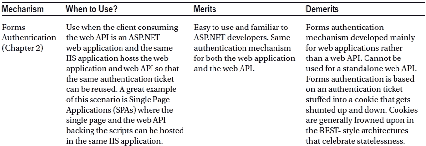
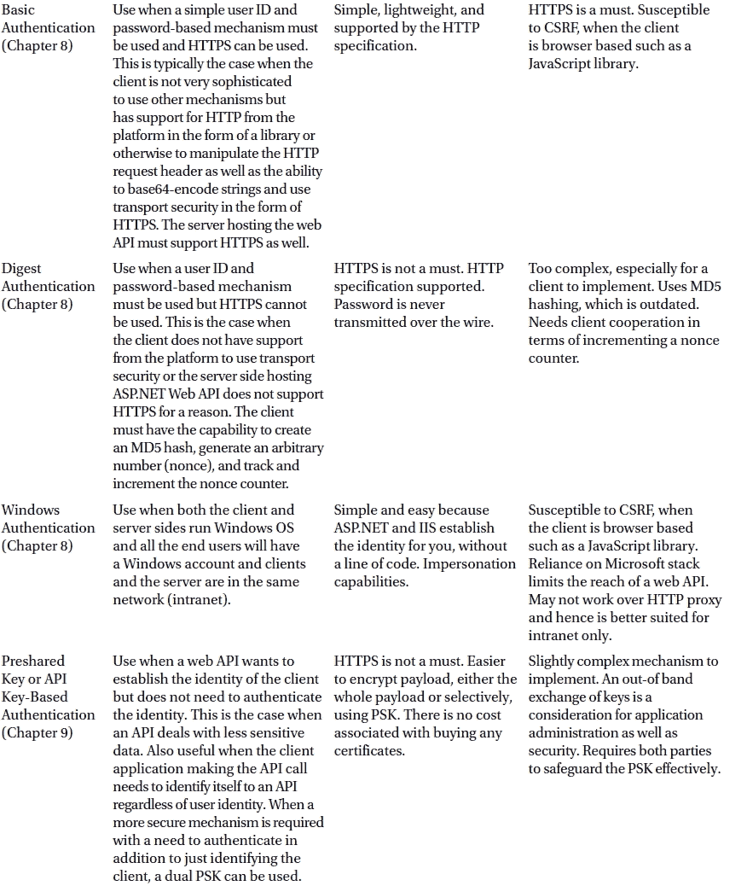
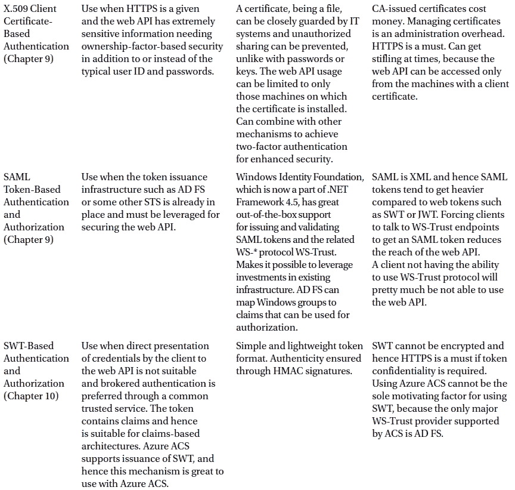
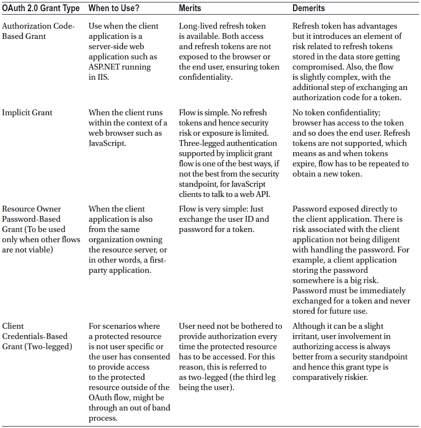

# 十六、附录 A：ASP.NET Web API 安全精华

这个附录是这本书的一个很好的总结，概括了我们到目前为止看到的各种安全机制。机制没有绝对意义上的好坏。这本书的理念是把所有的机制都呈现出来，让你根据自己的需求来决定。

没有规定您必须只选择一种机制。您可以设计您的 web API 来支持多个 API，并为客户端应用提供一些选项。ASP.NET Web API 管道帮助我们插入尽可能多的处理器来运行。消息处理程序是实现这一目标的重要手段。

如果你决定选择一个以上，仔细考虑各种可能性。例如，如果您混合了基本认证和摘要认证并决定将 HTTPS 仅用于基本认证，则存在恶意中间人(MITM)删除 **WWW-Authenticate: Digest** 响应报头并诱骗客户端以明文形式发送基本方案中的凭证的风险。

T6】

确保 ASP.NET Web API 安全的正确方法是为您的组织和应用需求选择合适的机制，而不是受他人的影响。例如，不要因为别人使用 OAuth 2.0 就使用它。

ASP.NET Web API 和。NET Framework 的一个优点是，您可以插入新的身份验证和授权方法，同时保持应用不受这些变化的影响。可以插入新的消息处理程序来处理新的身份验证方法，最终，如果 web API 基于声明工作，那么它就归结为处理程序为身份创建适当的声明。