# 一、介绍

技术在不断发展。我们需要应对最新的或者至少是时下流行的东西。开始时，您可能会发现自己很难跟上最新的技术，因为不知道应该使用哪一套技术以及从哪里开始。有大量的资源可供你参考学习，但是你仍然发现很难将图片中的点联系起来。有时候你甚至会想到失去学习的兴趣，放弃。如果你很困惑，不知道如何从头开始构建一个 iOS 或 Android 移动应用，以及如何将你的应用与你的数据库和 API 连接起来，那么这本书就是为你准备的。

请记住，这本书只强调了一个头脑/记忆游戏类型的移动应用的基本实现。如果你正在寻找一个动作，冒险，卡牌，RPG，或体育类型的游戏应用开发，那么这本书不适合你。

本书，*用 Xamarin 理解游戏应用开发。Forms 和 ASP.NET*，将带您了解如何使用 Xamarin 和 Web API 的力量构建一个简单的数据驱动的移动游戏应用。我们还将使用 ASP.NET 模型-视图-控制器(MVC)和 SignalR 构建一个实时排行榜页面。

这本书涵盖了从零开始创建 SQL 数据库，到构建 Web API 端点，到制作面向 iOS 和 Android 的移动应用，到构建玩家排名的实时排行榜页面，最后到部署。

本书的目标是指导。NET 开发人员，他们可能会对移动应用开发感兴趣，如果他们发现需要一个简单的工作游戏应用，该应用需要某种功能来将数据从移动应用连接到其他服务，如 REST 应用或 web 应用。

这本书是针对初学者到中级读者的。NET 开发人员，他们希望使用 Xamarin 进行移动应用开发，并尝试使用实际的例子。

我写这本书是为了通过提供一步一步的过程和尽可能多的详细代码解释，使其易于理解。当你读到这本书的结尾时，你会学到用于构建整个应用的每种技术的基本概念和基础，以及它们之间是如何相互联系的。

## 路标

### 第[章 1](1.html)

第 [1](1.html) 章概述了这本书是为谁而写的，并提供了一个简短的背景介绍，介绍了哪些技术将用于构建 web 和移动应用，以及我们为什么选择使用它们。它还简要概述了“工作记忆”，这是这本书将要涉及的游戏应用类型。这一章强调了读者将从书中学到什么的主题。它还强调了 Xamarin 的简要概述。表单、ASP.NET Web API、MVC、SignalR 和实体框架(EF ),并讨论了如何将它们连接在一起以实现目标。它还讨论了构建应用所需的工具和框架，并提供了如何在开发机器上配置和安装它们的说明。

### 第[章 2](2.html)

第 [2](2.html) 章提供游戏概述并讨论应用流程，使用 Xamarin 创建和运行核心移动应用项目。表单，并为应用安装所需的 NuGet 包。应用流部分讨论了系统处理从一个应用层到另一个应用层的请求的过程，从帐户创建/登录开始，到玩游戏、实时同步数据，最后将更改保存在数据库中。游戏概述部分处理游戏的机制和目标。

### 第 [3 章](3.html)

第 [3](3.html) 章包含了关于使用 EF 进行数据访问配置以及使用 ASP.NET Web API 构建 REST API 端点的信息。本章的第一节讨论了数据库的创建。第二部分描述了将 EF 集成到 Web API 项目中的步骤，然后建立一个数据访问层来实现创建、读取、更新和删除(CRUD)操作。本章的第三部分考虑 REST API 端点的创建，如何启用跨源资源共享(CORS)，以及最后如何测试端点。

### 第 [4 章](4.html)

第 [4](4.html) 章包含使用 Xamarin.Forms 的移动应用的实际实现。这一章是本书的核心，因为它讨论了针对 Android 和 iOS 平台构建工作内存游戏应用的详细步骤和过程。一步一步的过程和将代码分解成带有解释的部分应该让读者更好地理解应用的工作原理。

### 第 [5 章](5.html)

第 [5](5.html) 章讨论了使用 ASP.NET MVC 和 SignalR 构建一个实时排行榜页面，并详细解释了实时交流如何为项目服务。

### 第 [6 章](6.html)

第 [6](6.html) 章讨论了如何使用传送带插件和 SharpProxy 工具在特定于平台的设备模拟器中部署和测试移动应用的步骤和过程。

### 第 [7 章](7.html)

第 [7](7.html) 章带你了解如何使用 Visual Studio 2017 将你的应用代码推送到 GitHub，同时也包含了本书使用的源代码链接和资源参考。

## 背景

几年前，我的任务是以手机应用游戏的形式创建一个关于“工作记忆”的概念验证应用，同时提供一个显示排行榜的 web 应用。我有点紧张，同时也很好奇，因为构建一个移动应用并不是我的专业领域。有机会使用移动应用，特别是游戏开发，是非常令人兴奋的，因为这在当今越来越受欢迎。构建移动应用甚至可穿戴应用并没有你想象的那么复杂。使用正确的工具和技术让我们更容易构建移动应用和原型。

排放量...，合适的工具和技术？

没错。具体来说，我指的是令人敬畏的 Xamarin。

Xamarin 允许您为 Android、iOS 和 UWP 构建跨平台的应用，它使用 C# 作为后端语言。Xamarin 还介绍了 Xamarin。Forms，它允许您轻松创建可以在 Android、iOS 和 Windows 手机上共享的原生用户界面(UI)布局。只要你懂 C#，为你的应用创建逻辑是很容易的，因为你已经熟悉了语法和最重要的。网络图书馆。从 web 过渡到移动的唯一学习曲线是，你需要知道和理解 Android、iOS 和 Windows 平台是如何工作的，以及每个框架如何解释东西。我决定使用 Xamarin、ASP.NET 和 Visual Studio，原因如下:

*   Xamarin 现在已经与最新的 Visual Studio 版本(截至本文撰写之时为 VS 2017)完全集成。

*   Xamarin 允许您使用 C# 构建跨平台应用(iOS、Android 和 UWP)。

*   我是一名经验丰富的 C# 开发人员。

*   我是一名经验丰富的 ASP.NET 开发者。

*   我对 Visual Studio 开发工具比较熟悉。

*   我不需要学习如何使用其他框架、编辑器、工具或编程语言来构建原生应用。

*   我可以利用 Xamarin 提供的很酷的功能，比如云测试和应用监控。

*   Xamarin 和 Visual Studio 是构建现实世界应用的非常流行和稳定的平台。

*   Xamarin 有自己的专用支持站点，因此当您在开发过程中遇到任何问题时，您可以很容易地将您的问题发布到他们的专用论坛上。

我写这本书是为了让任何对移动应用开发感兴趣的人可以参考它，如果他们需要一个简单的工作游戏应用，需要将移动应用的数据连接到其他服务(如 REST 应用或 web 应用)的功能。这本书将带你通过使用 Xamarin 和 ASP.NET 的力量构建一个简单的工作记忆游戏应用。

在我们深入探讨之前，让我们先谈一谈工作记忆。

### 什么是工作记忆？

根据[文档](https://en.wikipedia.org/wiki/Working_memory)，工作记忆是一个容量有限的认知系统，负责暂时保存可供处理的信息。工作记忆对于推理、决策和行为的指导非常重要。我们可以说，工作记忆是一个至关重要的大脑功能，我们用它来集中注意力和控制我们的思维。要了解更多信息，请参阅本书末尾的参考资料部分。

## 你将学到什么

这本书是针对初学者到中级读者的。NET 开发人员，他们希望构建一个数据驱动的移动应用，从头开始连接到其他服务，并尝试使用实际的例子。我写这本书是为了容易理解。当你坚持到最后，你会学到以下几点:

*   用于构建整个应用的相关技术的基本概念和基础。

*   如何下载和安装所需的工具和开发框架。

*   如何从头开始设置 SQL Server 数据库？

*   如何使用 Xamarin 构建一个简单的工作记忆游戏应用？面向 iOS 和 Android 平台的表单。

*   如何创建 ASP.NET Web API 项目？

*   如何集成 EF 作为我们的数据访问机制？

*   如何创建一个 ASP.NET MVC 5 项目？

*   如何将 ASP.NET 信号集成到 ASP.NET MVC 应用中？

*   如何从 Web API 项目中调用 SignalR Hub 客户端代理。

*   在特定于平台的设备模拟器中部署和测试应用。

*   使用 Visual Studio 2017 将您的代码推送到 GitHub。

## 先决条件

在进一步阅读之前，请确保您对系统有必要的要求，并且您的开发环境配置正确。该演示使用以下平台和框架:

*   Windows 10

*   Visual Studio 2017

*   SQL Server Express Edition 2017

*   SQL Server Management Studio(SSMS)17.9

*   Xamarin 4.11

*   ASP.NET Web API 2

*   ASP.NET mv C5

*   ASP？ASP？ASP？净信号 2.2

*   EF 6

还需要以下语言和概念的基础知识:

*   C#

*   结构化查询语言

*   JavaScript/jQuery

*   创建交互式、快速动态网页应用的网页开发技术

*   超文本标记语言

*   XAML(可扩展应用标记语言)

*   HTTP 请求和响应

*   面向对象的程序设计(Object Oriented Programming)

## 开发工具下载资源

您可以从以下链接下载 Visual Studio 和 SQL Server Express edition:

### Windows 操作系统

*   [T2`www.visualstudio.com/downloads/`](http://www.visualstudio.com/downloads/)

*   [T2`www.microsoft.com/en-us/sql-server/sql-server-editions-express`](http://www.microsoft.com/en-us/sql-server/sql-server-editions-express)

### 苹果个人计算机

*   [T2`https://code.visualstudio.com/download`](https://code.visualstudio.com/download)

*   [`www.visualstudio.com/downloads/`](http://www.visualstudio.com/downloads/)(Mac 版 Visual Studio)

*   [T2`https://database.guide/how-to-install-sql-server-on-a-mac/`](https://database.guide/how-to-install-sql-server-on-a-mac/)

## 安装指南

对于这个演示，我将在 Windows 10 机器上开发应用，因为我更熟悉和舒适的构建。Windows 环境下的. NET 应用。如果您使用的是 Mac，那么请访问前面“开发工具下载资源”一节中提到的下载链接。

### Visual Studio 2017

Microsoft Visual Studio 是微软的集成开发环境(IDE)。它用于开发计算机程序以及网站、web 应用、web 服务和移动应用。Visual Studio 的最新版本现在是一个适用于 Android、iOS、Windows、web 和 cloud 的全功能 IDE，这使得它成为在. NET 环境中构建应用的一个舒适而强大的选择。

让我们通过这个链接下载 Visual Studio:[`https://visualstudio.microsoft.com/downloads/`](https://visualstudio.microsoft.com/downloads/)。一旦您进入下载链接，您将看到以下页面:

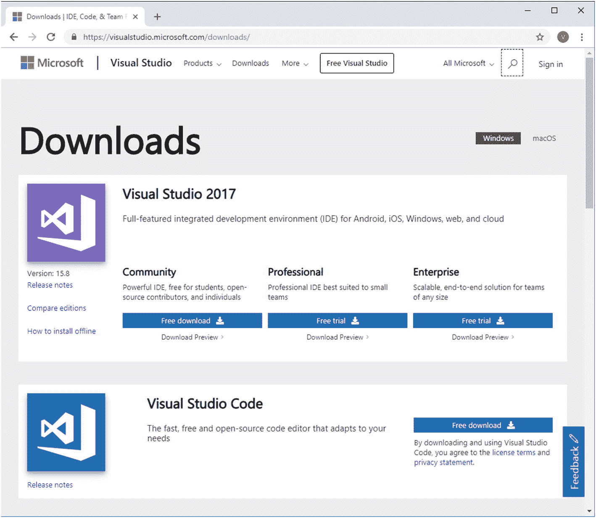

图 1-1

Visual Studio 官方下载站点

选择您要使用的版本，然后单击下载按钮；它应该会将下列 Visual Studio 安装程序之一下载到您计算机的驱动器中:

*   Visual Studio 企业版的 vs_enterprise.exe

*   用于 Visual Studio 专业版的 vs_professional.exe

*   Visual Studio 社区的 **vs_community.exe**

安装程序应该包括安装和自定义 Visual Studio 所需的一切。现在继续双击你已经下载的安装程序来启动引导程序。如果提示用户账户控制通知，只需点击**是**。

然后，它会要求您确认 Microsoft 许可条款和 Microsoft 隐私声明。

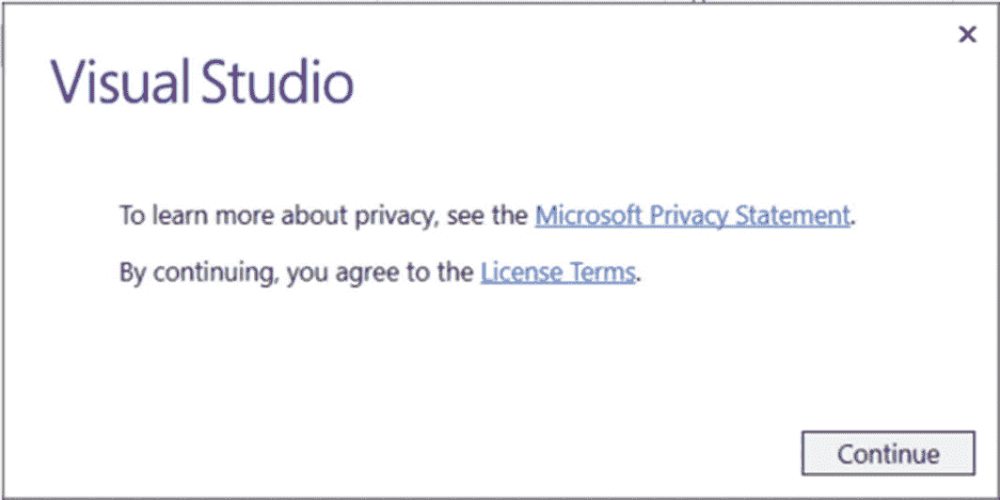

图 1-2

Visual Studio 许可条款协议

点击**继续**继续安装。

安装程序安装完成后，您应该看到以下视图，通过选择您想要的特性集或工作负载来自定义您的安装。

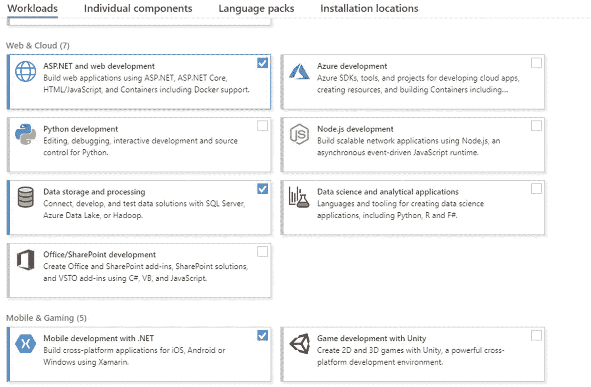

图 1-3

工作负载选择

为了构建本例中的应用，我们需要选择以下工作负载:

*   ASP.NET 和网络开发

*   数据存储和处理

*   移动开发。网

选择所需的工作负载后，点击**安装**按钮。应该会出现一个屏幕，显示安装的状态和进度。

安装好新的工作负载和组件后，您可以单击 **Launch** 开始使用 Visual Studio。

### SQL Server 2017

微软 SQL Server 是微软开发的关系数据库管理系统。作为数据库服务器，它是一种软件产品，主要功能是存储和检索其他软件应用(桌面、服务、移动或 web)请求的数据，这些应用可以运行在同一台计算机上，也可以运行在网络或互联网上的另一台计算机上。

为简单起见，我将使用 SQL Server 2017 的 Expression edition，因为我们将创建一个包含简单表的基本数据库，并且只存储最少量的数据。

请点击以下链接下载 SQL Server Express edition:[`www.microsoft.com/en-us/sql-server/sql-server-editions-express`](http://www.microsoft.com/en-us/sql-server/sql-server-editions-express)。您应该会看到以下页面:

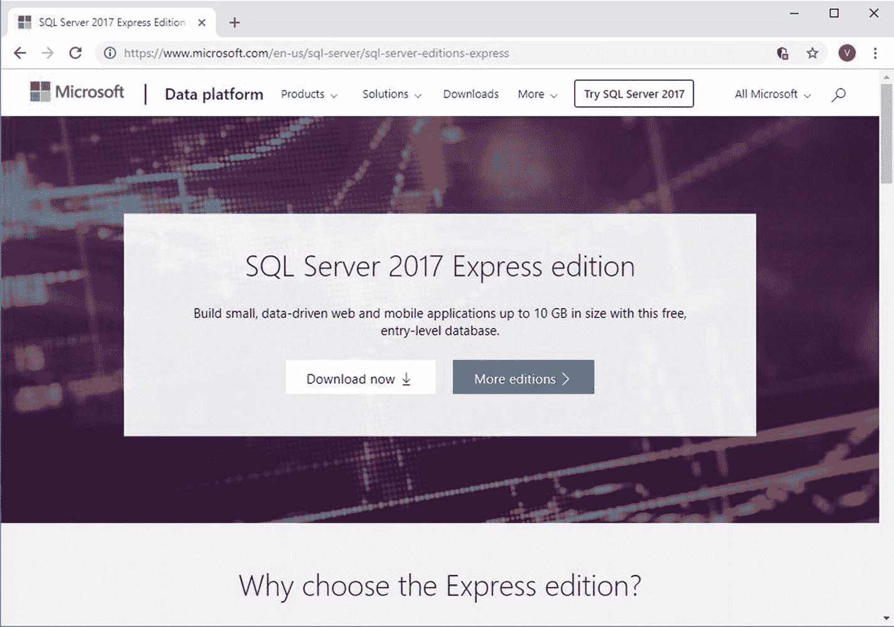

图 1-4

SQL Server 官方下载网站

点击**立即下载**按钮，应该会将以下 SQL Server 2017 Express 安装程序下载到您的机器驱动器中:

*   SQLServer2017-SSEI-Expr.exe

运行 SQLServer2017-SSEI-Expr.exe 安装程序，它应该会显示如下所示的屏幕:

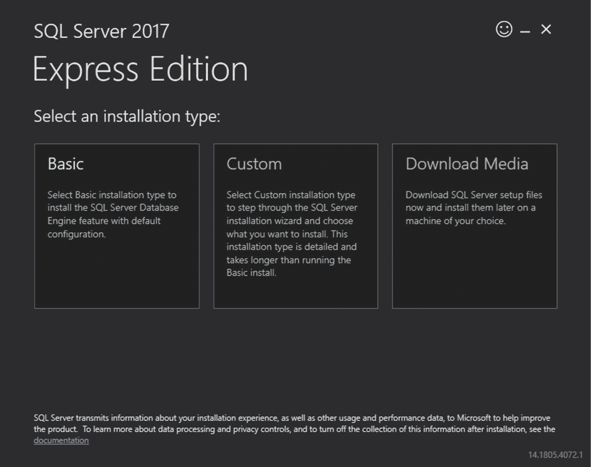

图 1-5

SQL Server 安装选择

只需选择**基本**安装类型，它会将您带到以下屏幕，并要求您接受 Microsoft SQL Server 许可条款:

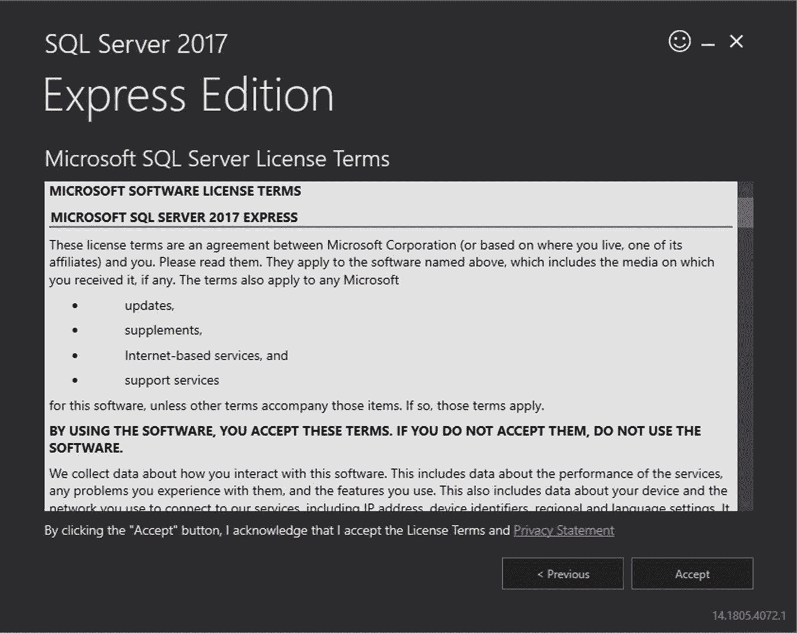

图 1-6

SQL Server 许可条款协议

点击**接受**。现在，您应该会看到以下屏幕:

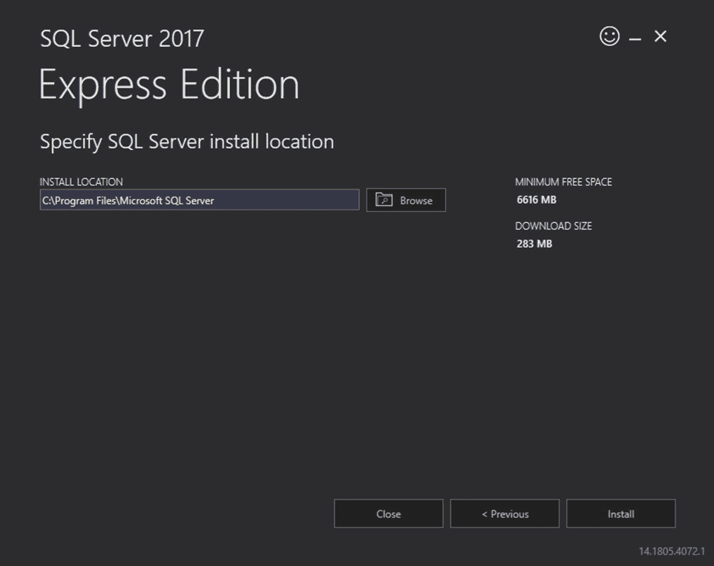

图 1-7

SQL Server 指定安装位置

选择安装 SQL Server 的目标位置。如果您对默认安装位置或您当前选择的安装位置感到满意，那么请点击**安装**。

下一个屏幕应该显示安装状态和进度，如下图所示:

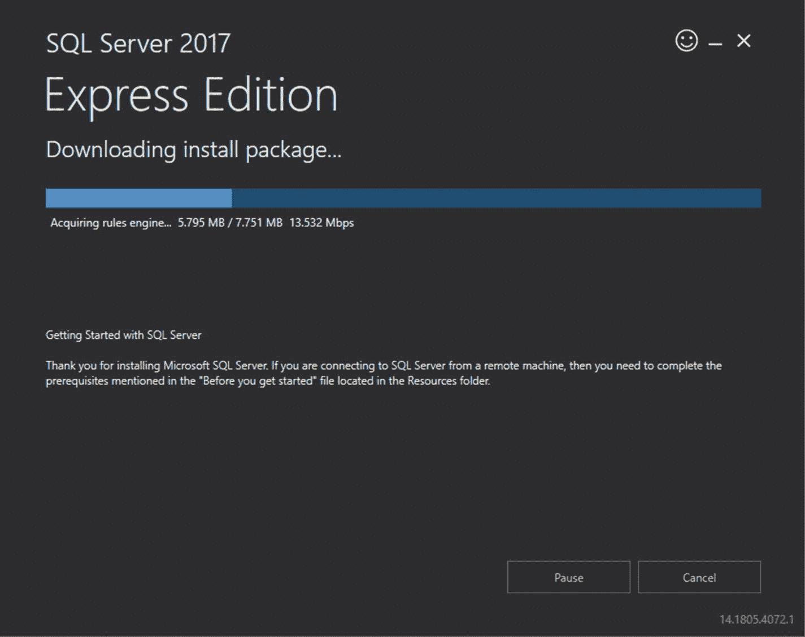

图 1-8

SQL Server 安装进度

您可能需要等待几分钟才能完成安装。安装完成后，您应该会看到以下屏幕:

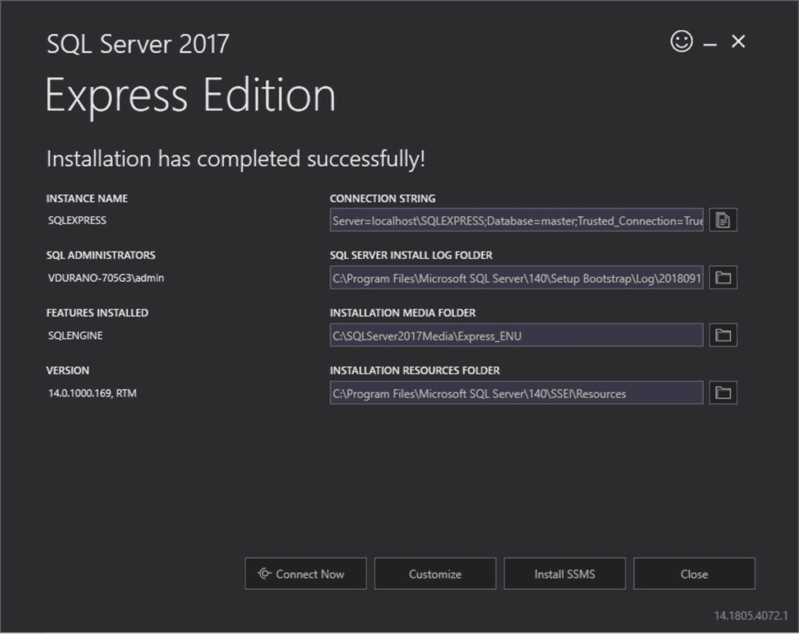

图 1-9

SQL Server 安装摘要

最后的安装屏幕显示安装摘要。它还允许您直接打开 SQL Server 并自定义安装。下一步是安装 SSMS。点击**安装 SSMS** 按钮，它会带你到一个下载链接。截至撰写本文时，最新版本是 SSMS 9.7。

**从微软下载网站下载 SSMS 后，运行**在线安装程序。您应该会看到以下屏幕:

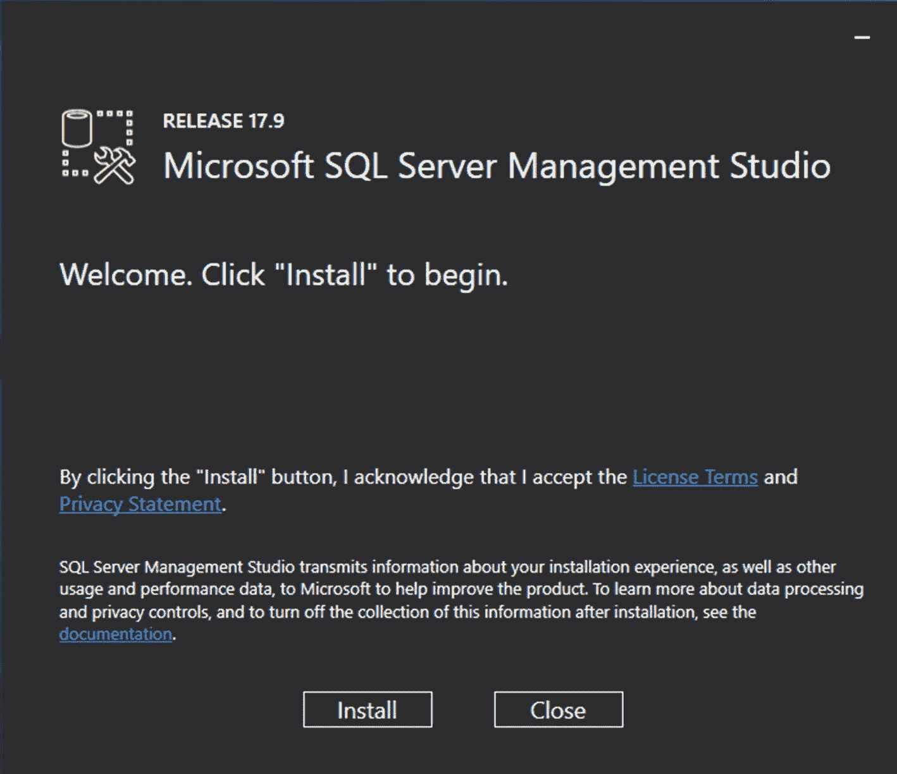

图 1-10

SSMS 装置

点击**安装**。设置完成后，点击**关闭**即可。

我们将在第 3 章[的后面使用 SSMS 来查询、设计和管理数据库。](3.html)

## 五名球员，一个目标

正如你从“先决条件”部分看到的，我们将使用各种技术来构建整个游戏应用，以实现一个目标。此时，只要正确安装了“安装指南”一节中提到的所需工作负载，就应该已经在您的机器上安装了所需的框架。

我们的主要目标是使用前沿技术构建一个简单的数据驱动的工作记忆游戏应用:Xamarin.Forms、ASP.NET Web API、EF、ASP.NET MVC 和 ASP.NET SignalR。

在我们讨论每项技术如何连接在一起的高级流程流之前，让我们看一下它们的简要概述。

### Xamarin。形式

构建面向 Android、iOS 和 UWP 等多个平台的移动应用一直是一件耗时的事情，因为您必须处理不同的编程语言和特定于平台的实现。除此之外，维护多个代码库来做本质上相同的事情在最好的情况下是乏味的，在最坏的情况下可能会成为一场噩梦。

作为一个懂 C# 的. NET 开发者，Xamarin 会给你提供你需要的功能。它承诺提供共享代码库的移动应用；然而，共享代码基础是在应用逻辑方面。传统 Xamarin.iOS，Xamarin。安卓和 Xamarin。UWP 开发仍然要求 ui 彼此分开编写，这不是一个小任务。

Xamarin.Forms 在这方面节省了大量时间。它之所以出名，是因为它将每个平台的 UI(独立的操作系统控件和导航隐喻)抽象为一个通用层，可用于构建 iOS、Android 和 UWP 的应用，包括一个共享的应用层和一个 UI 层。

Xamarin。Forms 是一个用于生成跨平台 ui 的移动应用框架，它将。NET 标准来共享代码，这使它成为更好的选择。下面是取自官方文档的定义: [`https://docs.microsoft.com/en-us/xamarin/xamarin-forms/`](https://docs.microsoft.com/en-us/xamarin/xamarin-forms/)

> *Xamarin。Forms 公开了一个完整的跨平台 UI 工具包。NET 开发人员。在 Visual Studio 中使用 C# 构建完全原生的 Android、iOS 和通用 Windows 平台应用。*

Xamarin。除了 20 多个跨平台 UI 控件之外，Forms 还提供了更多跨平台的功能。

#### Xamarin 对 Xamarin。形式

Xamarin(有时称为 Xamarin Native)使开发人员能够在 C# 和 Visual Studio 中创建完全丰富的 iOS、Android、macOS、watchOS、tvOS 和 Windows 应用，并在 C# 中对每个平台进行 100%的 API 覆盖。您为每个平台开发本地 UI，但是共享您所有的业务逻辑，平均来说，这占您应用的 60–80%。这种方法给你 100%的 API 访问，100%的 UI，当然还有最好的性能。

Xamarin。Forms 提供了一个基于 XAML 或 C# 的跨平台 UI，位于 Xamarin Native 本身之上。这适用于 iOS、Android、UWP、macOS 以及社区支持的其他平台。语言是相似的，因为它是 XAML，但不完全相同，因为控件和名称有点不同。然而，学习起来很容易，Xamarin 和微软都有很好的文档。

### ASP.NET Web API

ASP.NET Web API 是一个可扩展的框架，用于构建基于 HTTP 的服务，可以在不同平台上的不同应用中访问这些服务。它的工作方式与 ASP.NET MVC web 应用大致相同，只是它发送数据作为响应，而不是 HTML 视图。它类似于 web 服务或 WCF(Windows Communication Foundation)服务，但例外是它只支持 HTTP 协议。下面是取自官方文档的定义: [`https://msdn.microsoft.com/en-us/library/hh833994(v=vs.108).aspx`](https://msdn.microsoft.com/en-us/library/hh833994(v=vs.108).aspx)

> ASP.NET Web API 是一个框架，它使得构建 HTTP 服务变得容易，这些服务可以到达广泛的客户端，包括浏览器和移动设备。ASP.NET Web API 是在。NET 框架。

### 仰角指示器

EF 是一个久经考验的对象关系映射器(ORM)。NET 经过多年的特性开发和稳定。

据官方文献记载: [`https://docs.microsoft.com/en-us/ef/ef6/`](https://docs.microsoft.com/en-us/ef/ef6/)

> 作为一个 O/RM，EF 减少了关系世界和面向对象世界之间的阻抗不匹配，使开发人员能够使用强类型编写与存储在关系数据库中的数据交互的应用。NET 对象来表示应用的域，并且消除了对他们通常需要编写的大部分数据访问“管道”代码的需要。

如果你仍然不清楚 ORM 是做什么的，EF 在应用中是如何工作的，不要担心，因为我们将在第 [3](3.html) 章中看到关于它的细节。

### ASP.NET 最有价值球员

ASP.NET MVC 是微软开发的一个 web 应用框架，它实现了 MVC 模式。下面是取自官方文档的定义: [`https://msdn.microsoft.com/en-us/library/dd381412(v=vs.108).aspx`](https://msdn.microsoft.com/en-us/library/dd381412(v=vs.108).aspx)

> **模型-视图-控制器(MVC)* *架构模式将应用分成三个主要组件:模型、视图和控制器。ASP.NET MVC 框架为创建 Web 应用提供了 ASP.NET Web 窗体模式的替代方案。ASP.NET MVC 框架是一个轻量级的、高度可测试的表示框架，它(与基于 WebForm 的应用一样)与现有的 ASP.NET 功能(如母版页和基于成员身份的验证)相集成。系统中定义了 MVC 框架。Web.Mvc 程序集。**

 *### ASP？ASP？ASP？净报告

ASP.NET SignalR 通常用于向您的 ASP.NET 应用添加任何类型的“实时”web 功能。虽然聊天经常被用作一个例子，但你可以做得更多。每当用户刷新 web 页面以查看新数据，或者页面实现长轮询以检索新数据时，都有可能使用 SignalR。示例包括仪表板和监控应用、协作应用(如文档的同步编辑)、作业进度更新和实时表单。

下面是取自官方文档的定义: [`https://docs.microsoft.com/en-us/aspnet/signalr/overview/getting-started/introduction-to-signalr`](https://docs.microsoft.com/en-us/aspnet/signalr/overview/getting-started/introduction-to-signalr)

> ASP.NET SignalR*是一个面向 ASP.NET 开发者的库，它简化了向应用添加实时网络功能的过程。实时 web 功能是让服务器代码在内容可用时立即将内容推送到连接的客户端的能力，而不是让服务器等待客户端请求新数据。*

### 总结

现在，您已经了解了我们将用来构建应用的每项技术和框架的基本概况，是时候让我们花点时间来看看如何将图片中的点连接起来了。下图说明了这些技术相互连接的高级流程。

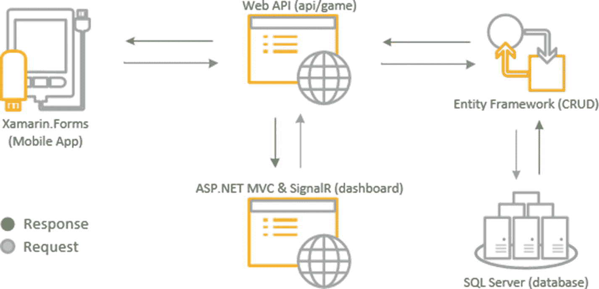

图 1-11

技术如何交互的高级图表

根据前面的说明，我们将需要构建以下应用:

*   一款面向 iOS 和 Android 平台的移动应用

*   公开一些面向公众的 API 端点的 Web API 应用

*   托管实时仪表板的 web 应用

*   存储和保存数据的数据库

由于本演示主要关注游戏开发，因此流程将从移动应用开始。一个移动应用通过 REST API 调用(ASP.NET Web API)请求存储和检索用户信息的数据。所有请求都将由 Web API 服务器处理。Web API 服务器充当从数据库访问资源的中央网关；它为请求提供服务，并在必要时返回响应。Web API 服务器不保存实际的数据，但包含如何检索或存储数据的实际实现，并使用 EF 处理 CRUD 操作。EF 所做的所有数据更改都将在 SQL Server 数据库中执行和反映。SQL Server 数据库充当保存和持久化数据的存储介质。

REST 服务的美妙之处在于，只要它支持 HTTP 协议，它就允许不同的客户端应用(例如，桌面、移动、web 或服务)通过端点使用 API。根据上图，web 应用也可以向 Web API 服务器请求数据。该 web 应用充当仪表板页面，使用 ASP.NET 信号实时显示信息。

总而言之，我们将使用 **(1)** **Xamarin 构建一个移动应用。可以针对 iOS 和 Android 平台的表单**。移动应用是实际游戏实现的地方，也是允许用户注册的地方。我们将使用 **(3)** **EF** 构建一个**(2)****ASP.NET Web API**服务器应用来处理 CRUD 操作。Web API 项目将作为中央网关来处理来自移动应用和 Web 应用的数据请求。我们还将使用**(4)****ASP.NET MVC**和**(5)****ASP.NET SignalR**构建一个 web 应用来显示实时仪表板，用于显示玩家排名。最后，我们将创建一个数据库，用于在 SQL Server 中存储球员的信息和分数。*