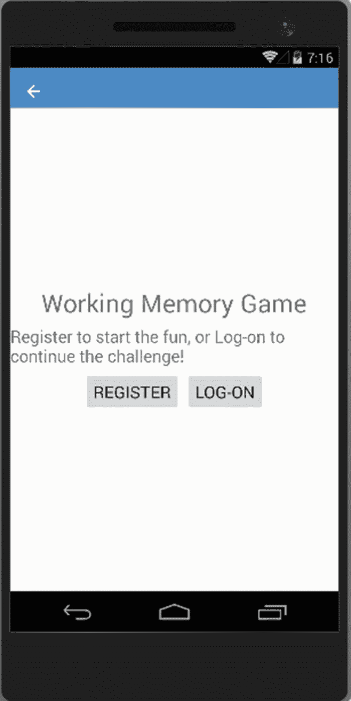
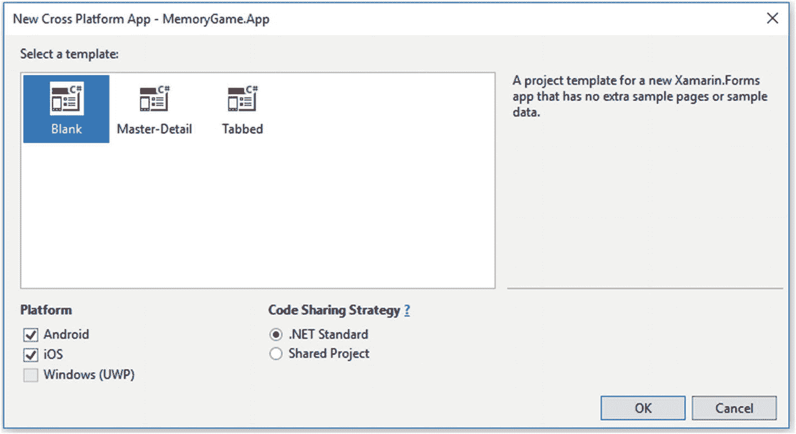
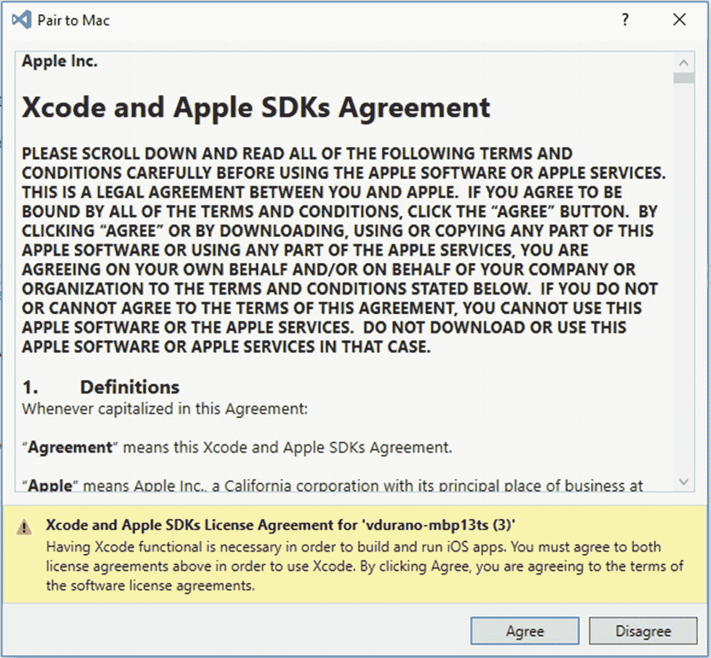

# 二、入门指南

在我们接触实际的编码之前，让我们先试着理解应用的流程，这样你就可以从用户的角度更好地了解应用的整个流程。

## 应用流程

我们将要构建的应用有三个主要层:

*   移动应用

*   Web API 服务器

*   网络应用

下图显示了每一层的应用流程，以及各层如何相互作用以实现目标:

图 2-1

申请流程

### 移动应用流程

先说第一层，**手机 app** 。为了让用户开始玩游戏，他们需要先注册一个帐户。在注册过程中，用户只需要提供他们的电子邮件地址、名字、姓氏，就这样。为了简单起见，我选择在注册时不包含密码，以消除管理用户帐户的复杂性。也就是说，移动应用将简单地要求用户的电子邮件地址来登录系统。如果您看一下前面的图表，移动应用在验证凭证之前，通过发出 HTTP Get 请求与 Web API 服务器对话以获取用户信息。Web API 服务器处理来自移动应用的请求，并将 JSON 响应返回给移动应用。请记住，移动应用也在本地存储用户信息。这是为了确保当用户离线玩游戏时，系统有数据的本地副本。

现在，当用户的凭证被成功验证时，用户将被导航到应用的主屏幕，在那里他们可以开始玩游戏。否则，会出现验证错误，提示凭据无效或不存在。

在游戏过程中，应用会在给定的时间内(以秒为单位)随机发出哔哔声、闪烁图像或振动设备。当时间过去后，应用将自动带用户到下一个屏幕，在那里他们可以输入他们的答案。在他们提交答案后，系统将验证该输入，并显示“祝贺”消息并允许他们进入下一关，或者如果他们的答案不正确，则显示“游戏结束”消息。在系统验证答案后，系统还会自动同步用户的最高分数和级别。

这个游戏令人兴奋的是，你越是进入下一个级别，它触发不同事件类型的速度就越快，直到你不记得发生了哪种类型的事件。

### Web API 服务器流程

概括地说，API 服务器充当处理来自客户端应用的 HTTP 请求的中央网关。在这个特定的设置中，API 服务器处理移动和 web 应用请求，然后使用 EF 将请求委托给数据访问子层来处理数据。HTTP 请求可以是插入、更新、读取或删除的一种形式。EF 通过强类型操作数据。NET 对象，然后将其转换为 SQL 查询命令并执行它，以将数据中的更改反映并保存到 SQL Server 数据库中。

### Web 应用流程

web 应用只是一个显示用户排名仪表板(也称为排行榜)的页面。这个页面是一个 ASP.NET MVC 应用，它通过订阅一个 Web API 端点来异步监听数据更改，然后使用 ASP.NET SignalR 实时显示更改。当从移动应用触发手动同步或自动同步时，会发生实时变化。

## 游戏概述

本节讨论游戏机制和目标。

### 力学

在游戏过程中，只要你点击 **Start** 按钮，应用就会在给定的时间间隔内随机播放不同类型的事件，时间间隔以毫秒表示。触发周期具有同样以毫秒表示的时间间隔。例如，在 10 秒钟内，应用会在 2 秒钟的周期内随机播放不同的事件类型，如闪烁图像、播放声音或激活设备上的振动。在随后的级别，2 秒的周期间隔将减少，这导致事件的触发比前一级别快得多。

为了更清楚，下图显示了游戏流程:

图 2-2

游戏流程

### 目标

这个游戏的目标很简单。你只需要计算并记住在一段时间内灯闪烁、扬声器发出哔哔声和设备振动的次数。你的级别越高，它闪烁、蜂鸣和振动的速度就越快。这将考验你的记忆力有多强。

## 移动应用视图

本节将为您提供一些关于我们将要构建的应用的输出的可视化参考。

### 欢迎屏幕

欢迎屏幕是应用的默认视图，它显示注册新帐户或作为回头客登录的信息。

图 2-3

移动应用欢迎视图

### 注册屏幕

点击**注册**按钮将显示注册屏幕，允许用户使用名字、姓氏和电子邮件进行注册。**登录**按钮将显示登录屏幕，允许返回的用户输入他们注册的电子邮件。

下面是注册屏幕的运行视图:

图 2-4

移动应用注册视图

### 主屏幕

用户成功注册或登录系统后，他们将被重定向到主屏幕，如下图所示。

图 2-5

移动应用主页视图

主屏幕显示当前和最佳水平分数，以及一个**同步**按钮，允许用户手动同步他们在数据库中的分数。它还显示三个主要图像:灯泡、扬声器和指示振动的设备。

点击**开始**按钮会在短时间内开始游戏，按钮文字变为**游戏开始...，**如下图所示。

图 2-6

移动应用游戏视图

### 结果屏幕

时间过去后，它会将用户带到结果屏幕，在那里他们可以输入每个事件发生多少次的答案。

图 2-7

手机应用回答视图

点击**提交**按钮将触发系统验证答案，并确定用户是否给出了正确答案，从而可以进入下一关，或者游戏是否应该在当前关重新开始。请注意，一旦用户超过他们当前的最佳分数，分数将自动同步到数据库。

以下是一些结果截图:

图 2-9

移动应用结果视图:恭喜！

图 2-8

移动应用结果视图:游戏结束！

### Web 应用视图

这是使用 ASP.NET MVC 和 ASP.NET SignalR 构建的实时排行榜页面的示例输出。

图 2-10

Web app 实时排名视图

就这样。既然你已经对应用的外观有了一些视觉上的参考，那么是时候让我们构建应用并使用真实的代码示例了。

## 创建移动应用的核心项目

我会尽量保持这个演示简单，这样初学者就可以很容易地跟上。所谓“简单”，我的意思是我将限制对理论和概念的讨论，而是直接跳入泥淖，让我们用代码示例来弄脏我们的手。

让我们启动 Visual Studio 2017，然后创建一个新的空白 XAML 应用(Xamarin。表格)通过办理**文件** ➤ **新建** ➤ **项目**。您应该会看到一个**新项目**窗口对话框。在对话框左窗格的**已安装**项下，向下钻至 **Visual C#** ➤ **跨平台**然后选择**移动应用(Xamarin.Forms)**就像下图这样。

图 2-11

创建新的 Xamarin.Forms 项目

虽然您可以根据自己的喜好自由命名该项目，但对于这个演示，我们只将其命名为 **MemoryGame。App，**因为它非常适合我们将要构建的内容。点击**确定**，会弹出如下窗口对话框。

图 2-12

空白模板

选择**空白**模板，在平台下勾选**安卓**和 **iOS** 选项。选择**。NET 标准**作为代码共享策略，然后点击 **OK** 让 Visual Studio 为你生成必要的文件。

根据您的计算机和互联网速度，可能需要一段时间来生成文件和依赖项。

在 Visual Studio 为项目生成默认文件并提取必要的依赖项之后，它应该会显示如下内容。

图 2-13

默认生成的文件

Xamarin.Forms 项目模板基本上生成以下三个主要项目:

*   `MemoryGame.App`

*   `MemoryGame.App.Android`

*   `MemoryGame.App.iOS`

### 注意

该解决方案只包含。安卓和。iOS 项目。我们省略了。UWP 项目，所以我们将专注于 Android 和 iOS 应用。

## 概述和剖析

让我们快速浏览一下生成的每个项目。

### MemoryGame.App

2011 年，微软发布了一种新类型的类库，称为可移植类库(PCL)。PCL 是一种项目类型，它创建与多种框架兼容的二进制文件。之前版本的 Xamarin。Forms 使用 PCL 使您能够选择希望代码运行的平台组合。PCL 支持集中式代码共享，这允许开发人员在单个项目中编写和测试代码，这些代码可以被其他库或应用使用。

但是，每次选择新的目标框架时，可用的 API 都会减少。例如，如果类在。NET Framework 4.5.1，但不在 Windows Universal 10.0 中，它不会在针对这两个框架的 PCL 中可用。目标框架的组合被称为概要文件。

虽然 PCL 在创建时是一个突破，但有时很难找到关于哪些 API 可用以及在哪里可以找到它们的信息。随着时间的推移。NET 团队认为需要一种更简单的方法，这就是为什么。净标准符合。

记忆游戏。App 是一个. NET 标准库项目。Xamarin 的预发布版本。表单 2.3.5 增加了与的兼容性。净标准。

。NET 标准是。NET APIs，旨在对所有。NET 运行时(如。NET 框架、Mono 和。网芯)。实际上，你可以认为这是一个简化但扩展的 PCL。添加到. NET 标准库中的任何代码都可以在任何支持。NET 标准平台。此外，我们还可以在。NET 基础类库，这支持更多的平台。更多信息请参见 [`https://blogs.msdn.microsoft.com/dotnet/2016/09/26/introducing-net-standard/`](https://blogs.msdn.microsoft.com/dotnet/2016/09/26/introducing-net-standard/) 。

这是 Xamarin 的剖析图。表格。网络标准项目:

<colgroup><col class="tcol1 align-left"> <col class="tcol2 align-left"></colgroup> 
| 

文件夹/文件

 | 

目的

 |
| --- | --- |
| **依赖关系** | 包含项目的 NuGet 和 SDK 依赖项。 |
| **App.xaml** | 负责实例化将由应用在每个平台上显示的第一个页面。 |
| **首页 xaml** | 初始化主页组件。 |

### 记忆游戏，App，Android

记忆游戏。Android 包含运行应用所需的特定于 Android 的配置和文件。以下是对 Android 项目的剖析:

<colgroup><col class="tcol1 align-left"> <col class="tcol2 align-left"></colgroup> 
| 

文件夹/文件

 | 

目的

 |
| --- | --- |
| **互联服务** | 允许服务提供商创建无需离开 IDE 即可添加到项目中的 Visual Studio 扩展。它还允许您将您的 ASP.NET Core 应用或移动服务连接到 Azure 存储服务。Connected Services 负责所有的引用和连接代码，并相应地修改您的配置文件。 |
| **属性** | 包含 AndroidManifest.xml 文件，该文件描述了我们的 Xamarin 的所有要求。Android 应用，包括名称、版本号和权限。它还包含 AssemblyInfo.cs 文件，您可以在其中定义程序集的详细信息，如标题、描述、版权信息、版本等。 |
| **参考文献** | 包含生成和运行应用所需的程序集。 |
| **资产** | 包含应用需要运行的文件，包括字体、本地数据文件和文本文件。 |
| **资源** | 包含应用资源，如字符串、图像和布局。您可以通过生成的资源类在代码中访问这些资源。 |
| **MainActivity.cs** | 包含用于初始化和加载应用的代码的 C# 类。 |

### 记住我。应用 iOS

记忆游戏。App.iOS 包含运行应用所需的特定于 iOS 的配置和文件。下面是对 iOS 项目的剖析:

<colgroup><col class="tcol1 align-left"> <col class="tcol2 align-left"></colgroup> 
| 

文件夹/文件

 | 

目的

 |
| --- | --- |
| **资产目录** | 就像。Android 项目，这包含了应用需要运行的文件，包括字体、本地数据文件和文本文件。 |
| **原生引用** | 这是您添加特定于 iOS 平台的程序集的地方。 |
| **资源** | 包含应用资源，如字符串、图像和布局。您可以通过生成的资源类在代码中访问这些资源。 |
| **AppDelegate.cs** | 这个类负责启动应用的用户界面，以及监听(和可选地响应)来自 iOS 的应用事件。 |
| **Entitlements.plist** | 用于指定授权和签署应用包。本质上，授权是授予应用的特殊应用功能和安全权限，这些应用被正确配置以使用它们。 |
| **信息. plist** | 包含系统的元数据。该文件通常包含应用配置包的键及其相应的值。 |
| **Main.cs** | 应用的主入口点。 |

## 架构基础

一个`Xamarin.Forms`应用的架构与传统的跨平台应用相同。共享代码通常放在. NET 标准库中，特定于平台的应用使用共享代码。下图显示了`MemoryGame.App`应用的这种关系的概述:

图 2-14

Xamarin.Forms 架构基础

### 首轮放映

为了确保我们拥有核心移动应用项目所需的一切，让我们尝试构建并运行项目。让我们通过浏览 Visual Studio 主菜单中的**视图** ➤ **输出**来启用输出窗口，如下图所示:

图 2-15

启用输出窗口

接下来，让我们尝试构建整个项目，方法是右键单击解决方案级别，然后选择**构建解决方案** **，**，如下图所示:

图 2-16

构建项目的解决方案

或者，你可以简单地按下 F6 的键。

**输出**窗口应该显示构建结果。如果一切顺利，构建成功，那么我们就可以开始运行应用了。好在安装 Visual Studio 2017 开发 Xamarin 应用时，附带了 Visual Studio Emulator for Android。这意味着您可以立即测试和运行应用，而无需单独下载和安装 Android 模拟器。

如果你不想使用 Visual Studio 2017 自带的默认仿真器，那么你也可以单独下载一个仿真器。

*   Windows 8.1 和 Windows 10: [`https://visualstudio.microsoft.com/vs/msft-android-emulator/`](https://visualstudio.microsoft.com/vs/msft-android-emulator/)

*   Windows 7:可以使用 Android SDK/Google，也可以使用 GenyMotion/xa marin Android Player 等第三方模拟器。

对于这个演示，我将只使用 Visual Studio 2017 中的默认仿真器。

### 巫师安卓系统

让我们试着运行 Xamarin。安卓项目第一。为此，我们需要设置 Xamarin。Android 项目作为启动项目。App.Android 然后选择**设置为启动项目**。

**记忆游戏。App.Android** 项目要从解决方案中突出出来。现在点击**播放**按钮，在 Android 模拟器中运行项目，如下图所示:

图 2-17

运行 Xamarin。第一次 Android 项目

### 注意

如果你被提示一个性能警告，说模拟器将无加速运行，只需点击“启动”按钮启动模拟器。

模拟器启动后，Visual Studio 将构建应用，然后是 Xamarin。Android 会将应用部署到模拟器中。模拟器使用配置的虚拟设备映像运行应用。下面的截图显示了一个 Android 模拟器的例子。在本例中，模拟器正在运行应用，默认页面显示“欢迎使用 Xamarin”。表格！”

图 2-18

Android 模拟器输出

仿真器可以保持运行:每次启动应用时，不必关闭仿真器并等待它重新启动。这是第一次 Xamarin。Android 应用运行在仿真器 Xamarin 中。安装目标 API 级别的 Android 共享运行时，然后安装应用。运行时安装可能需要一些时间，所以请耐心等待。运行时的安装仅在第一个 Xamarin。Android app 部署到模拟器；后续部署更快，因为只有应用被复制到模拟器。

此时，您可以关闭 Android 模拟器，因为我们需要测试一下 **MemoryGame。App.iOS** 项目**。**

### 洗发精，快

要运行 Xamarin.iOS 项目，您需要有一台 Mac 计算机来模拟应用。您首先需要将 Mac 配对，以便 **MemoryGame。App.iOS** 项目可以连接。

构建原生 iOS 应用需要使用苹果的构建工具，这些工具只能在 Mac 上运行。因此，Visual Studio 2017 必须连接到可访问网络的 Mac 才能构建 Xamarin.iOS 应用。有关配对 Mac 的更多信息，请参阅以下内容:

[T2`https://docs.microsoft.com/en-us/xamarin/ios/get-started/installation/windows/connecting-to-mac/`](https://docs.microsoft.com/en-us/xamarin/ios/get-started/installation/windows/connecting-to-mac/)

现在登录你的 Mac 电脑，然后进入**系统偏好** ➤ **分享**。勾选**远程登录**，选择**所有用户**允许访问，如下图所示:

图 2-19

在 Mac 上启用远程登录

完成后，确保您已经在 Mac 上安装了 **Xcode** :

*   [T2`https://itunes.apple.com/us/app/xcode/id497799835?mt=12`](https://itunes.apple.com/us/app/xcode/id497799835?mt=12)

为了构建和运行 iOS 应用，Xcode 是必需的，所以请确保您正确安装了 Xcode，并且它是可用的。

现在继续切换到 Visual Studio 并设置 **MemoryGame。App.iOS** 项目作为启动项目。

点击**播放**按钮，显示**模拟器**，如下图所示。

图 2-20

首次运行 Xamarin.iOS 项目

然后，它应该显示以下内容:

图 2-21

配对到 Mac 指令

如果它与 Windows 机器在同一个网络上，Mac 现在应该可以被 Visual Studio 2017 发现。如果仍未发现 Mac，请尝试手动添加 Mac 或查看以下链接中的故障排除指南:

*   [T2`https://docs.microsoft.com/en-us/xamarin/ios/get-started/installation/windows/connecting-to-mac/#manually-add-a-mac`](https://docs.microsoft.com/en-us/xamarin/ios/get-started/installation/windows/connecting-to-mac/#manually-add-a-mac)

*   [T2`https://docs.microsoft.com/en-us/xamarin/ios/get-started/installation/windows/connecting-to-mac/troubleshooting`](https://docs.microsoft.com/en-us/xamarin/ios/get-started/installation/windows/connecting-to-mac/troubleshooting)

点击**下一步**，将出现以下画面:

图 2-22

选择要配对的 Mac

点击**连接...**按钮，它会提示您提供用户名和密码来连接您的 Mac 计算机，如下图所示:

图 2-23

连接到 Mac

输入您的用户名和密码，点击**登录**。

如果登录成功，提示您缺少 Mono 安装，只需点击**安装**，如下图所示:

图 2-24

丢失单声道安装警告

还可能会提示您缺少 Xamarin.iOS 安装。只需点击 Install，它就会下载并安装缺少的部分，如下图所示:

图 2-25

缺少 Xamarin.iOS 安装警告

根据您的网速，下载和配置单声道设置可能需要几分钟时间，请耐心等待。

*   如果由于某种原因 Mono 安装失败，那么尝试在你的 Mac 机器上手动安装。你可以在这里下载单声道安装程序: [`www.mono-project.com/docs/getting-started/install/mac/`](http://www.mono-project.com/docs/getting-started/install/mac/)

*   为了确保您拥有在 Mac 上运行 Xamarin.iOS 所需的一切，我建议您安装 Visual Studio for Mac。你可以在这里下载安装程序: [`https://docs.microsoft.com/en-us/visualstudio/mac/installation`](https://docs.microsoft.com/en-us/visualstudio/mac/installation)

一旦所有必要的工具完成安装，它应该会要求您同意 Xcode 和 Apple SDKs 协议，如下图所示:

图 2-26

Xcode 和 Apple SDKs 协议

点击**同意**。

一旦您的 PC 与 Mac 成功配对，您应该能够在 Visual Studio 设备列表中看到各种设备模拟器，如下图所示:

图 2-27

选择 iOS 设备模拟器

下面是在 iPhone 模拟器上运行的 Xamarin.iOS 的示例截图:

图 2-28

iOS 仿真器输出

有关将电脑与 Mac 配对的更多信息，请参见以下内容: [`https://docs.microsoft.com/en-us/xamarin/ios/get-started/installation/windows/connecting-to-mac/`](https://docs.microsoft.com/en-us/xamarin/ios/get-started/installation/windows/connecting-to-mac/)

## 所需的 NuGet 包

下一步是添加我们的应用所需的包。继续，右键单击**解决方案**，在所有项目中安装以下包:

*   Xam。插件.设置 3.1.1

*   Xam。插件连接 3.2.0

*   纽顿软件。Json 11.0.2

### 注意

前面提到的特定版本。这些是截至撰写本文时发布的最新稳定版本，我们将在本演示中使用它们。每个包的未来版本可能包含一些新的变化，并且可能以不同的方式工作。

我们将使用 **Xam。Plugins.Settings** 为我们提供跨所有项目的一致的跨平台设置/首选项(可移植库。NET 标准、Android 和 iOS 项目)。 **Xam。Plugin.Connectivity** 将用于获取网络连接信息，如网络类型、速度和连接可用性。**纽敦软件公司。Json** 将在我们的代码中用于序列化和反序列化来自 API 请求的 Json 对象。我们将在后面看到这些引用是如何使用的。

在 Visual Studio 中有两种添加包的方法；您可以使用软件包管理器控制台，或者通过 NuGet 软件包管理器(NPM)继续。在本演示中，我们将使用 NPM，这样您就可以有一个直观的参考。

现在，右键单击**解决方案**级别，然后选择**管理解决方案**的 NuGet 包。选择**浏览**选项卡，在搜索栏中输入“Xam。插件.设置”。这应该会产生如下结果:

图 2-29

安装 NuGet 包

当安装成功后，一个使用 **Xam 的 **reame.txt** 文件。插件.设置**应该会自动显示。接下来，安装“ **Xam。插件连接**和 **Newtonsoft。Json** " NuGet 包。

一旦你安装了它们，你应该能够看到它们被添加到你的项目**依赖项**中，如下图所示:

图 2-30

已安装的 NuGet 包

此时，我们应该相信我们已经拥有了构建和运行应用所需的一切。现在是时候用编码来弄脏我们的手了。

你可能也想看看 Xamarin。Essentials，因为它为您的移动应用提供了跨平台的 API。参见这里的文档: [`https://docs.microsoft.com/en-us/xamarin/essentials/`](https://docs.microsoft.com/en-us/xamarin/essentials/)