# 三、配置数据访问和 API 端点

在这一章中，我们将看到如何设置数据库、配置数据访问和构建 REST API 端点。

## 创建新的空数据库

让我们从创建一个用于存储和持久化用户数据的数据库开始。现在继续，启动微软 SSMS，使用 Windows 身份验证登录。进入工作室管理后，选择**文件** ➤ **新建** ➤ **查询当前连接**，如下图所示:

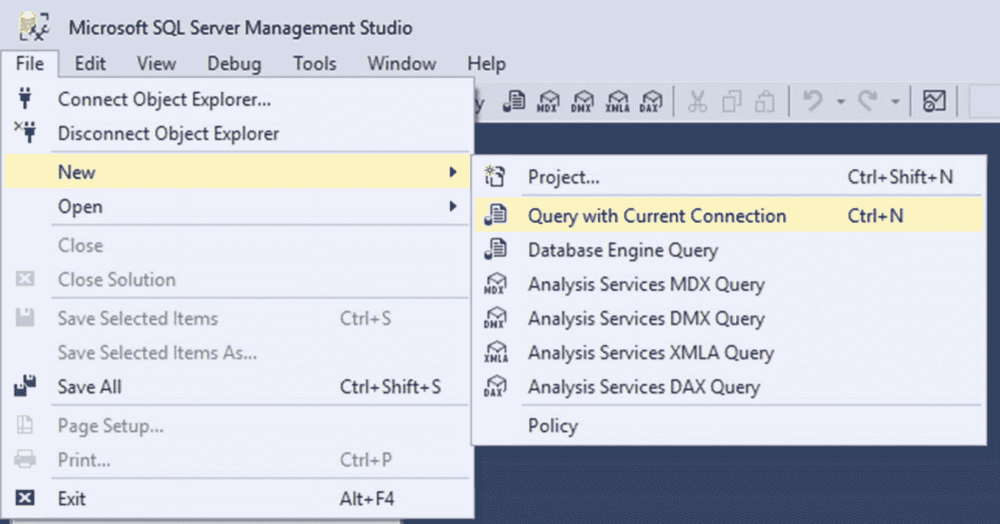

图 3-1

创建新的查询编辑器

在查询编辑器中复制以下 SQL 脚本:

```cs
CREATE Database MemoryGame
GO

USE [MemoryGame]
GO

CREATE TABLE [dbo].[Challenger](
       [ChallengerID] [int] IDENTITY(1,1) NOT NULL,
       [FirstName] [varchar](50) NOT NULL,
       [LastName] [varchar](50) NOT NULL,
       [Email] [varchar](50) NULL,
CONSTRAINT [PK_Challenger] PRIMARY KEY CLUSTERED
(
       [ChallengerID] ASC
)WITH (PAD_INDEX  = OFF, STATISTICS_NORECOMPUTE  = OFF,
                    IGNORE_DUP_KEY = OFF,
                    ALLOW_ROW_LOCKS  = ON,
                    ALLOW_PAGE_LOCKS  = ON)
                    ON [PRIMARY]
) ON [PRIMARY]

GO

CREATE TABLE [dbo].[Rank](
       [RankID] [int] IDENTITY(1,1) NOT NULL,
       [ChallengerID] [int] NOT NULL,
       [Best] [tinyint] NOT NULL,
       [DateAchieved] [datetime] NOT NULL,
 CONSTRAINT [PK_Rank] PRIMARY KEY CLUSTERED
(
       [RankID] ASC
)WITH (PAD_INDEX  = OFF, STATISTICS_NORECOMPUTE  = OFF,
                    IGNORE_DUP_KEY = OFF,
                    ALLOW_ROW_LOCKS  = ON,
                    ALLOW_PAGE_LOCKS  = ON) ON [PRIMARY]
) ON [PRIMARY]

GO

```

然后点击**执行**按钮或点击 **F5** ，如下图所示:

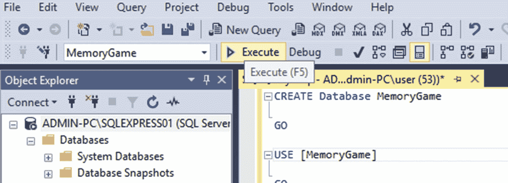

图 3-2

执行 SQL 查询

前面的 SQL 脚本应该使用下表创建“ **MemoryGame** ”数据库:

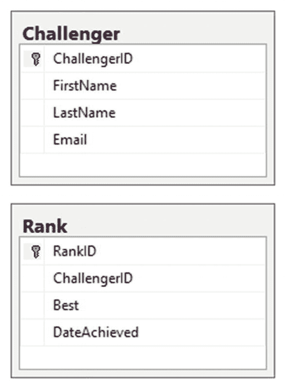

图 3-3

数据库模式

我们创建的数据库表非常简单明了。 **dbo。Challenger** 表包含了一些基本属性，供我们识别一个玩游戏的用户。 **dbo。Rank** 表同样包含一些基本属性，可以帮助我们识别哪个用户的排名最高。

请记住，这本书的重点不是数据库，所以如果您是 SQL 数据库的新手，我真的建议您开始查看一些资源，如书籍或在线教程，以了解数据库的基本基础。

既然我们已经建立了数据库，是时候构建一个 REST 服务来处理数据库调用和 CRUD 操作了。我们选择 Web API 是因为它非常适合在. NET 环境下构建 RESTful 服务。它还允许其他客户端应用(移动应用、Web 应用，甚至桌面应用)通过端点使用我们的 API。这将使我们的应用允许客户机访问任何类型的应用中的数据，只要它支持 HTTP 服务。

## 创建 ASP.NET Web API 项目

让我们继续工作吧。切换回 Visual Studio 2017，右击**解决方案**关卡添加新项目，然后选择**添加** ➤ **新项目**➤**visual c#**➤**web**。选择**ASP.NET 网络应用(。NET Framework)** 并将项目命名为“ **MemoryGame。API** "如下图所示:

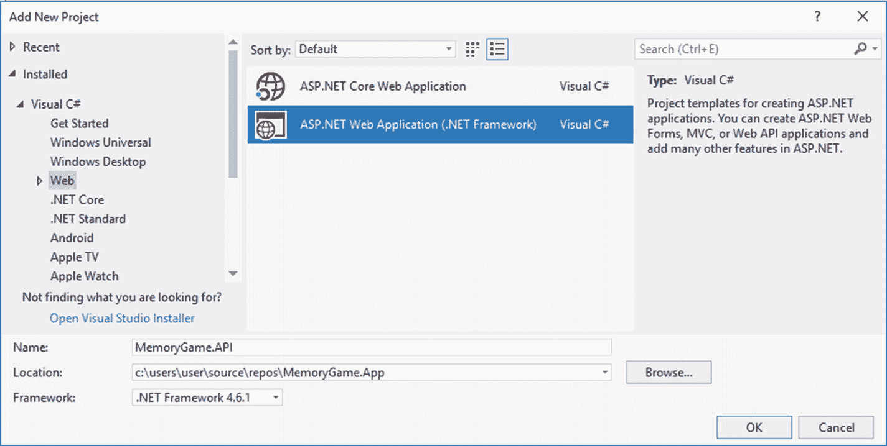

图 3-4

创建新的 ASP.NET Web API 项目

点击**确定**，您将看到下一个屏幕:

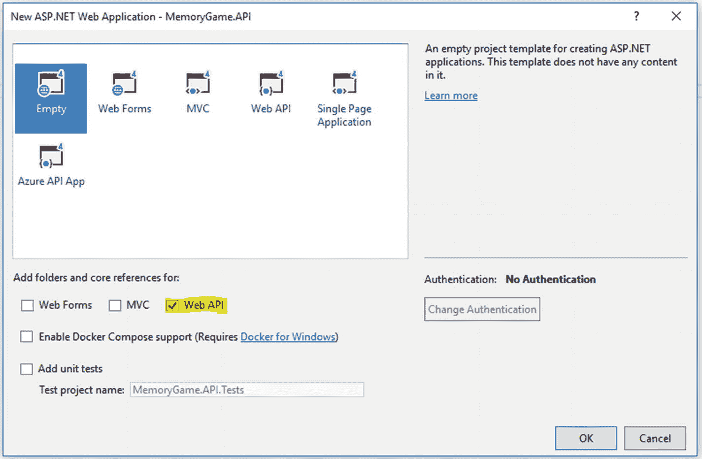

图 3-5

选择空的 Web API 模板

从 ASP.NET Web 应用项目模板中选择“ **Empty** ”，然后只勾选“ **Web API** 选项。点击**确定**让 Visual Studio 为你生成项目。这是现在的解决方案:

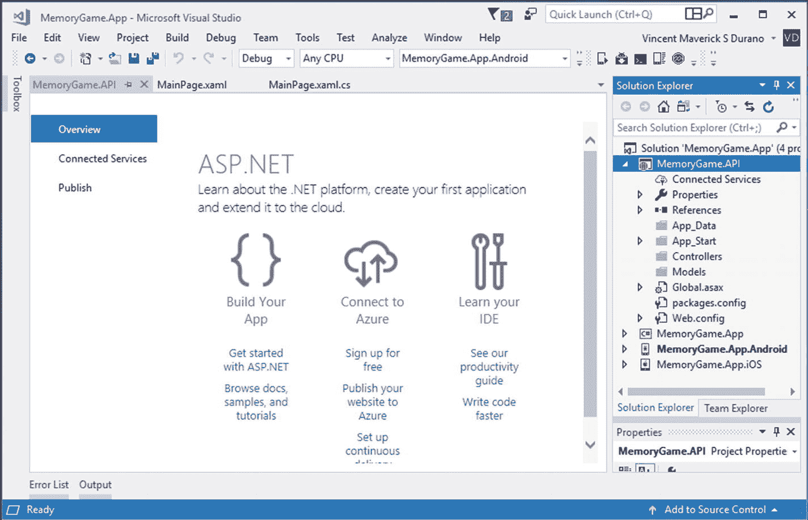

图 3-6

默认生成的文件

默认情况下，ASP.NET Web API 项目配置传统路由和基于属性的路由的组合。通过导航到 **App_Start** 文件夹➤ **WebApiConfig.cs** ，可以看到路由是如何设置的。代码如下所示:

```cs
using System.Web.Http;
namespace MemoryGame.API
{
    public static class WebApiConfig
    {
        public static void Register(HttpConfiguration config)
        {
            // Web API configuration and services
            // Web API routes
            config.MapHttpAttributeRoutes();

            config.Routes.MapHttpRoute(
                name: "DefaultApi",
                routeTemplate: "api/{controller}/{id}",
                defaults: new { id = RouteParameter.Optional }
            );
        }
    }
}

```

配置。MapHttpAttributeRoutes()行启用属性路由，其中您可以在 Web API 类的控制器或操作级别配置自定义路由。有关属性路由的更多信息，请阅读以下内容: [`https://docs.microsoft.com/en-us/aspnet/web-api/overview/web-api-routing-and-actions/attribute-routing-in-web-api-2`](https://docs.microsoft.com/en-us/aspnet/web-api/overview/web-api-routing-and-actions/attribute-routing-in-web-api-2) 。

第二行代码使用基于约定的路由定义了路由表的默认路由模板。路由表中的每个条目都包含一个路由模板。Web API 的默认路由模板是“api/{controller}/{id}”。在这个模板中，“api”是一个文字路径段，{controller}和{id}是占位符变量。当 Web API 服务器收到 HTTP 请求时，它会尝试将 URI 与路由表中的某个路由模板进行匹配。有关常规路由的更多信息，请阅读以下内容: [`https://docs.microsoft.com/en-us/aspnet/web-api/overview/web-api-routing-and-actions/routing-in-aspnet-web-api`](https://docs.microsoft.com/en-us/aspnet/web-api/overview/web-api-routing-and-actions/routing-in-aspnet-web-api) 。

ASP.NET 路由能够让 URL 代表抽象的动作，而不是具体的物理文件。如果你熟悉 ASP.NET MVC，Web API 路由与 MVC 路由非常相似。主要区别在于，Web API 使用 HTTP 方法，而不是 URI 路径来选择操作。

在本演示中，我们将使用属性路由在路由表中添加路由模板，因为与常规路由相比，它为我们定义路由提供了更大的灵活性。

## 集成 EF

现在我们已经准备好了 Web API 项目，让我们继续实现数据访问层来处理来自数据库的数据。

在软件开发领域，大多数应用都需要数据存储或数据库。因此，我们都需要一个代码来读/写我们存储在数据库或数据存储中的数据。为数据库创建和维护代码是一项乏味的工作，也是一项真正的挑战。这就是像 EF 这样的 ORM 出现的地方。

### 什么是 ORM？

ORM 使开发人员能够通过对概念应用模型进行编程来创建数据访问应用，而不是直接对关系存储模式进行编程。目标是减少面向数据的应用所需的代码量和维护量。像 EF 这样的 ORM 提供了以下好处:

*   应用可以按照更加以应用为中心的概念模型工作，包括具有继承、复杂成员和关系的类型。

*   应用摆脱了对特定数据引擎或存储模式的硬编码依赖。

*   概念模型和特定于存储的模式之间的映射可以在不改变应用代码的情况下改变。

*   开发人员可以使用一致的应用对象模型，该模型可以映射到各种存储模式，可能在不同的数据库管理系统中实现。

*   多个概念模型可以映射到一个存储模式。

*   语言集成查询(LINQ)支持为针对概念模型的查询提供编译时语法验证。

### EF 是什么？

概括地说，EF 是一种 ORM，它支持。NET 开发人员使用特定于领域的对象来处理关系数据。它消除了开发人员通常需要编写的大部分数据访问代码。

这可能仅仅意味着使用 EF 我们将与实体(你的数据结构的类/对象表示)一起工作，并让框架处理基本的创建、读取、更新和删除(CRUD)操作。在传统的 ADO.NET 中，您将直接针对表/列/过程编写 SQL 查询，并且您没有实体，因此它不太面向对象。

更多信息，请阅读以下: [`https://msdn.microsoft.com/en-us/library/aa937723(v=vs.113).aspx`](https://msdn.microsoft.com/en-us/library/aa937723(v=vs.113).aspx) 。

就像任何其他 ORM 一样，EF 支持两个主要的设计工作流程:在**代码优先**方法中，您创建您的类(POCO 实体)并从它们生成一个新的数据库。**数据库优先**方法允许您使用现有的数据库，并基于您的数据库模式生成类。对于这个演示，我们将使用数据库优先的方法，因为我们已经创建了一个现有的数据库。

## 设置数据访问层

在**记忆游戏中。API** 项目，在 **Models** 文件夹下新建一个名为“ **DB** 的文件夹。在“ **DB** 文件夹中，添加一个**ADO.NET 实体数据模型**。为此，只需遵循以下步骤:

1.  右键单击“ **DB** 文件夹，然后选择**添加** ➤ **新项目**。

2.  在左侧窗格的 **Visual C#** 项下，选择**数据**ADO.NET**➤实体数据模型**。

3.  将文件命名为“ **MemoryGameDB** ”，然后点击**添加**。

4.  在下一个向导中，从**数据库**中选择 **EF 设计师**，然后点击**下一步**。

5.  点击“**新建连接…** ”按钮。

6.  在**数据源**下选择**微软 SQL Server** ，点击**继续**。

7.  提供创建数据库的数据库服务器名称。在我的例子中，我的 SQL server 的名称是“ADMIN-PC\SQLEXPRESS01”。请记住，您的实例可能不同，所以请确保您提供了正确的实例。您可以在 SSMS 找到服务器名称。

8.  选择或输入数据库名称**。**在本例中，这个例子的数据库名称是“**内存游戏**”。

9.  Click the **Test Connection** button to see if it’s successful just like in the following figure:

    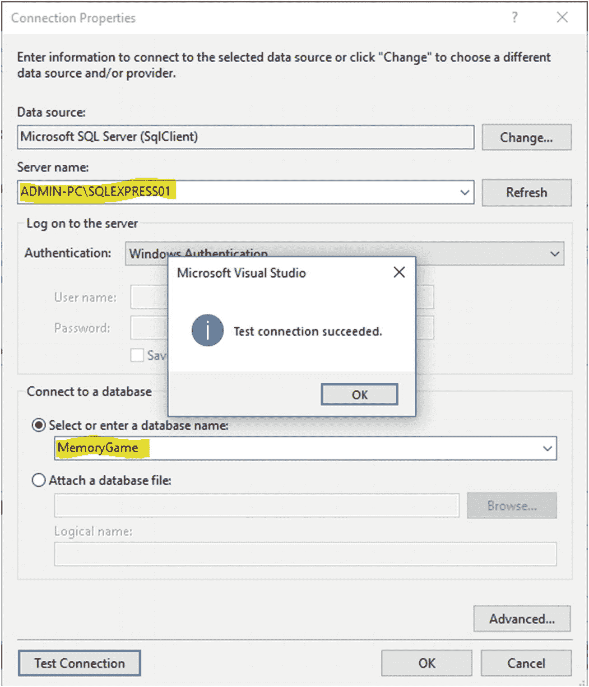

    图 3-7

    测试数据库连接

10.  点击 **OK** 关闭弹出对话框，再次点击 **OK** 生成将用于我们应用的连接字符串。

11.  在下一个向导中，点击**下一个**。

12.  选择 **EF 6.x** 然后点击**下一步**。

13.  选择“**挑战者**和“**等级**表格，然后点击**完成**。

那个。 **EDMX** 文件现在应该被添加到“ **DB** 文件夹下，如下图所示:

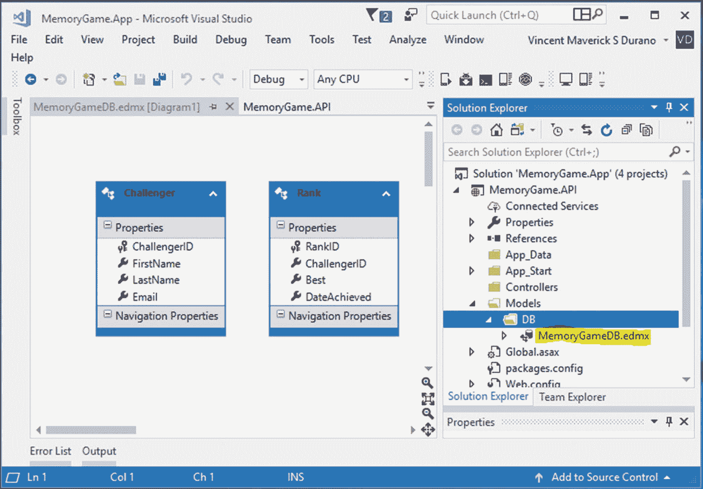

图 3-8

生成的实体模型

这里发生的事情是，EF 自动为您生成业务对象，并让您根据它进行查询。EDMX 或实体数据模型将作为主要网关，通过它您可以从数据库中检索对象并重新提交更改。

在幕后，EDMX 文件包含以下子文件:

*   MemoryGameDB.Context.tt

*   MemoryGameDB。Designer.cs

*   MemoryGameDB。Edmx .图表

*   MemoryGameDB.tt

**MemoryGameDB。Context.tt** 是一个 Visual Studio 文本模板文件(又名 **T4** 模板)。T4 文本模板是可以生成文本文件的文本块和控制逻辑的混合物。在 Visual C# 中，控制逻辑是作为程序代码片段编写的。扩展**内存 GameDB。Context.tt** 文件将显示 **MemoryGameDB。Context.cs** ，其中包含以下代码块:

```cs
namespace MemoryGame.API.Models.DB
{
    using System;
    using System.Data.Entity;
    using System.Data.Entity.Infrastructure;

    public partial class MemoryGameEntities : DbContext
    {
        public MemoryGameEntities()
            : base("name=MemoryGameEntities")
        {
        }

        protected override void OnModelCreating(DbModelBuilder modelBuilder)
        {
            throw new UnintentionalCodeFirstException();
        }

        public virtual DbSet<Challenger> Challengers { get; set; }
        public virtual DbSet<Rank> Ranks { get; set; }
    }
}

```

**MemoryGameEntities** 类表示与数据库的会话，并允许您查询和保存实体类的实例。该类派生自 **DbContext** ，并公开了 **DbSet** 虚拟属性，这些属性表示上下文中指定实体的集合。由于我们是与 EF 设计师(EDMX)一起工作，所以上下文是自动为我们生成的。如果您正在使用代码优先的方法，您通常会自己编写上下文。

您可能已经注意到，生成的模型是作为分部类创建的。这意味着您可以在必要时通过为每个实体模型类创建另一个分部类来扩展它们。

一旦有了模型，应用与之交互的主要类就是 **System。Data.Entity.DbContext** (通常称为 Context 类)。您可以使用与模型相关联的 **DbContext** 来:

*   编写和执行查询

*   将查询结果具体化为实体对象

*   跟踪对这些对象所做的更改

*   将对象更改保留回数据库

*   将内存中的对象绑定到 UI 控件

**MemoryGameDB.tt** 包含以下基于我们从数据库中定义的表生成的类:

*   挑战者. cs

*   Rank.cs

```cs
namespace MemoryGame.API.Models.DB
{
    using System;
    using System.Collections.Generic;

    public partial class Challenger
    {
        public int ChallengerID { get; set; }
        public string FirstName { get; set; }
        public string LastName { get; set; }
        public string Email { get; set; }
    }
}

```

```cs
namespace MemoryGame.API.Models.DB
{
    using System;
    using System.Collections.Generic;

    public partial class Rank
    {
        public int RankID { get; set; }
        public int ChallengerID { get; set; }
        public byte Best { get; set; }
        public System.DateTime DateAchieved { get; set; }
    }
}

```

前面生成的类将用作一种 DbSet 对象。 **DbSet** 类表示可以用于 CRUD 操作的实体集。

**DbSet** 类派生自 **IQuerayable** 。因此，我们可以使用 LINQ 来查询**数据库集**，它将被转换成一个 SQL 查询。EF API 对底层数据库执行这个 SQL 查询，获得平面结果集，将其转换成适当的实体对象，并作为查询结果返回。

## 实现 CRUD 操作

下一步是创建一个中央类来处理 CRUD 操作。现在，在**模型**文件夹下创建一个名为**数据管理器**的新文件夹。右击**数据管理器**文件夹，选择**添加** ➤ **新建** ➤ **类**。将该类命名为“ **GameManager** ”，单击**添加**按钮，然后复制以下代码:

```cs
using System;
using System.Collections.Generic;
using System.Linq;
using MemoryGame.API.Models.DB;

namespace MemoryGame.API.Models.DataManager
{

    #region DTO
    public class ChallengerViewModel
    {
        public int ChallengerID { get; set; }
        public string FirstName { get; set; }
        public string LastName { get; set; }
        public byte Best { get; set; }
        public DateTime DateAchieved { get; set; }
    }
    #endregion

    #region HTTP Response Object
    public class HTTPApiResponse
    {
        public enum StatusResponse
        {
            Success = 1,
            Fail = 2
        }
        public StatusResponse Status { get; set; }
        public string StatusDescription { get; set; }
        public int StatusCode { get; set; }
    }

    #endregion

    #region Data Access
    public class GameManager
    {

        public IEnumerable<ChallengerViewModel> GetAll { get { return GetAllChallengerRank(); } }
        public List<ChallengerViewModel> GetAllChallengerRank()
        {
            using (MemoryGameEntities db = new MemoryGameEntities())
            {
                var result = (from c in db.Challengers
                              join r in db.Ranks on c.ChallengerID equals
                              r.ChallengerID
                              select new ChallengerViewModel
                              {
                                 ChallengerID = c.ChallengerID,
                                 FirstName = c.FirstName,
                                 LastName = c.LastName,
                                 Best = r.Best,
                                 DateAchieved = r.DateAchieved
                              }).OrderByDescending(o => o.Best)
                              .ThenBy(o => o.DateAchieved);

                return result.ToList();
            }
        }
        public HTTPApiResponse UpdateCurrentBest(DB.Rank user)
        {
            using (MemoryGameEntities db = new MemoryGameEntities())
            {
                var data = db.Ranks.Where(o => o.ChallengerID == user.ChallengerID);

                if (data.Any())
                {
                    Rank rank = data.FirstOrDefault();
                    rank.Best = user.Best;
                    rank.DateAchieved = user.DateAchieved;
                    db.SaveChanges();
                }
                else
                {
                    db.Ranks.Add(user);
                    db.SaveChanges();
                }
            }

            return new HTTPApiResponse
            {
                Status = HTTPApiResponse.StatusResponse.Success,
                StatusCode = 200,
                StatusDescription = "Operation successful."
            };
        }

        public int GetChallengerID(string email)
        {
            using (MemoryGameEntities db = new MemoryGameEntities())
            {
                var data = db.Challengers.Where(o => o.Email.ToLower().Equals(email.ToLower()));
                if (data.Any())
                {
                    return data.FirstOrDefault().ChallengerID;
                }

                return 0;
            }
        }

        public HTTPApiResponse AddChallenger(DB.Challenger c)
        {
            HTTPApiResponse response = null;
            using (MemoryGameEntities db = new MemoryGameEntities())
            {
                var data = db.Challengers.Where(o => o.Email.ToLower().Equals(c.Email.ToLower()));
                if (data.Any())
                {
                    response = new HTTPApiResponse
                    {
                        Status = HTTPApiResponse.StatusResponse.Fail,
                        StatusCode = 400,
                        StatusDescription = "User with associated email already exist."
                    };
                }
                else
                {
                    db.Challengers.Add(c);
                    db.SaveChanges();

                    response = new HTTPApiResponse
                    {
                        Status = HTTPApiResponse.StatusResponse.Success,
                        StatusCode = 200,
                        StatusDescription = "Operation successful."
                    };
                }

                return response;
            }
        }

        public ChallengerViewModel GetChallengerByEmail(string email)
{
        using (MemoryGameEntities db = new MemoryGameEntities())
        {

            var result = (from c in db.Challengers
                          join r in db.Ranks on c.ChallengerID equals r.ChallengerID
                          where c.Email.ToLower().Equals(email.ToLower())
                          select new ChallengerViewModel
                          {
                              ChallengerID = c.ChallengerID,
                              FirstName = c.FirstName,
                              LastName = c.LastName,
                              Best = r.Best,
                              DateAchieved = r.DateAchieved
                          });

            if (result.Any())
                return result.SingleOrDefault();
        }

        return new ChallengerViewModel();
    }

    public HTTPApiResponse DeleteChallenger(int id)
    {

        HTTPApiResponse response = null;
        using (MemoryGameEntities db = new MemoryGameEntities())
        {
            var data = db.Challengers.Where(o => o.ChallengerID == id);
            if (data.Any())
            {
                try
                {
                    var rankData = db.Ranks.Where(o => o.ChallengerID == id);
                    if (rankData.Any())
                    {
                        db.Ranks.Remove(rankData.FirstOrDefault());
                        db.SaveChanges();
                    }

                    db.Challengers.Remove(data.FirstOrDefault());
                    db.SaveChanges();

                    response = new HTTPApiResponse
                    {
                        Status = HTTPApiResponse.StatusResponse.Success,
                        StatusCode = 200,
                        StatusDescription = "Operation successful."
                    };
                }
                catch (System.Data.Entity.Validation.DbUnexpected ValidationException)
                {
                    //handle error and log

                    response = new HTTPApiResponse
                    {
                        Status = HTTPApiResponse.StatusResponse.Fail,
                        StatusCode = 500,
                        StatusDescription = "An unexpected error occurred."
                        };
                    }
                }
                else
                {
                    response = new HTTPApiResponse
                    {
                        Status = HTTPApiResponse.StatusResponse.Fail,
                        StatusCode = 400,
                        StatusDescription = "Associated ID not found."
                    };
                }
                return response;
            }
        }
    }
    #endregion
}

```

让我们来看看我们刚刚在那里做了什么。

前面的代码由三个主要区域组成:数据传输对象(DTO)、HTTP 响应对象和 GameMananger 类。让我们把它分解成代码细节。我们将从 DTO 开始:

```cs
     public class ChallengerViewModel
     {
         public int ChallengerID { get; set; }
         public string FirstName { get; set; }
         public string LastName { get; set; }
         public byte Best { get; set; }
         public DateTime DateAchieved { get; set; }
     }

```

DTO 仅仅是一个普通的类，包含了一些属性，这些属性将在视图或任何使用 API 的客户端中使用。

下一个代码块:

```cs
     public class HTTPApiResponse
     {
         public enum StatusResponse
         {
             Success = 1,
             Fail = 2
         }
         public StatusResponse Status { get; set; }
         public string StatusDescription { get; set; }
         public int StatusCode { get; set; }
     }

```

**HTTPApiResponse** 对象是保存 enum 和三个主要基本属性的类:**状态**、**状态码**和**状态描述**。该对象将在**游戏管理器**类方法中作为响应或返回类型对象使用。

游戏管理器类是我们处理实际 CRUD 操作的核心类。这就是我们使用 EF 与数据库进行通信的地方，通过处理一个概念性的数据实体，而不是一个真正的 SQL 查询。EF 使我们能够使用。NET 对象并消除了开发人员通常需要编写的大部分数据访问代码。

让我们把它分解成代码细节。让我们从这段代码开始:

```cs
public IEnumerable<ChallengerViewModel> GetAll { get { return GetAllChallengerRank(); } }

```

方法 **GetAll** 是一个公共属性，它返回一个**IEnumerable<challenger viewmodel>**。该属性的唯一目的是获取数据；这就是为什么我们只设置一个 getter 访问器。仅使用 getter 创建属性会使您的属性对于该类之外的任何代码都是只读的。

下一个代码块:

```cs
public List<ChallengerViewModel> GetAllChallengerRank()
{
    using (MemoryGameEntities db = new MemoryGameEntities())
    {
        var result = (from c in db.Challengers
                      join r in db.Ranks on c.ChallengerID equals r.ChallengerID
                      select new ChallengerViewModel
                      {
                          ChallengerID = c.ChallengerID,
                          FirstName = c.FirstName,
                          LastName = c.LastName,
                          Best = r.Best,
                          DateAchieved = r.DateAchieved
                       }).OrderByDescending(o => o.Best)
                       .ThenBy(o => o.DateAchieved);

        return result.ToList();
    }
}

```

方法 **GetAllChallengerRank()** 基本上是获取挑战者的个人资料及其对应的排名。该方法中的第一行代码创建了一个名为**内存游戏实体**的**数据库上下文**的实例。我们使用块将用于实例化 **DbContext** 的代码包装在**中，以确保对象在使用后会被正确地处理掉。**

下一行使用 LINQ 查询表达式来查询数据。该查询加入了**数据库。挑战者**和 **db。使用**连接**子句对**数据集进行排序。然后**选择**我们需要的数据，并将它们关联到一个名为 ChallengerViewModel 的强类型对象中，按照最高等级对结果进行排序，并通过调用 ToList()函数返回结果。 **ToList()** 是一个位于**系统中的扩展方法。Linq** 名称空间，它将集合(IEnumerables)转换为列表实例。

下一个代码块:

```cs
public HTTPApiResponse UpdateCurrentBest(DB.Rank user)
{
    using (MemoryGameEntities db = new MemoryGameEntities())
    {
        var data = db.Ranks.Where(o => o.ChallengerID == user.ChallengerID);
        if (data.Any())
        {
            Rank rank = data.FirstOrDefault();
            rank.Best = user.Best;
            rank.DateAchieved = user.DateAchieved;

            db.SaveChanges();
        }
        else
        {
            db.Ranks.Add(user);
            db.SaveChanges();
        }
    }

    return new HTTPApiResponse
    {
        Status = HTTPApiResponse.StatusResponse.Success,
        StatusCode = 200,
        StatusDescription = "Operation successful."
    };
}

```

**UpdateCurrentBest()** 方法接受**数据库。将**等级作为参数。代码块基本上使用 LINQ **Where** 函数基于 **ChallengerID** 获得 **Rank** 对象，并将结果分配给变量 **data** 。然后我们调用 LINQ **Any()** 函数来检查对象是否包含序列中的任何单个元素。

如果查询返回了任何数据，那么我们创建一个 **Rank** 类的实例，并使用 FirstOrDefault() LINQ 函数设置来自**数据**变量的结果。LINQ **FirstOrDefault()** 是一个急切函数，它返回满足指定条件的序列的第一个元素。一旦 FirstOrDefault()函数被调用，EF 将自动向数据库发出一个参数化的 SQL 查询，其中 SQL Server 可以理解，然后将结果带回实体模型。然后，我们为每个字段分配新值，并调用 **SaveChanges()** 方法用这些更改更新数据库。

否则，如果没有数据或者 LINQ 函数返回 false，那么我们只需在数据库中创建一条新记录。

最后，我们返回一个表示操作成功的**httpapisresponse**对象。

下一个代码块:

```cs
public int GetChallengerID(string email)
{
    using (MemoryGameEntities db = new MemoryGameEntities())
    {
        var data = db.Challengers.Where(o => o.Email.ToLower().Equals(email.ToLower()));
        if (data.Any())
        {
            return data.FirstOrDefault().ChallengerID;
        }

        return 0;
    }
}

```

顾名思义， **GetChallengerID()** 方法通过传递一封电子邮件作为参数来获取挑战者的 **ChallengerID** 。到现在为止，前面的代码您可能已经很熟悉了，因为它使用了我们之前讨论过的常见 LINQ 函数，例如 **Where()** 、 **Any()** 和 **FirstOrDefault()** 。

下一个代码块:

```cs
public HTTPApiResponse AddChallenger(DB.Challenger c)
{
    HTTPApiResponse response = null;
    using (MemoryGameEntities db = new MemoryGameEntities())
    {
        var data = db.Challengers.Where(o => o.Email.ToLower().Equals(c.Email.ToLower()));

        if (data.Any())
        {
            response = new HTTPApiResponse
            {
                Status = HTTPApiResponse.StatusResponse.Fail,
                StatusCode = 400,
                StatusDescription = "User with associated email already exist."
            };
        }
        else
        {
            db.Challengers.Add(c);
            db.SaveChanges();

            response = new HTTPApiResponse
            {
                Status = HTTPApiResponse.StatusResponse.Success,
                StatusCode = 200,
                StatusDescription = "Operation successful."
            };
        }
        return response;
    }
}

```

**AddChallengerID()** 方法使用一个**数据库。挑战者**级。前面的代码检查数据库中是否已经存在与电子邮件关联的数据。如果是，那么它返回一个错误；否则，它会向数据库添加一个新条目，并返回一个成功的响应。

下一个代码块:

```cs
public ChallengerViewModel GetChallengerByEmail(string email)
{
    using (MemoryGameEntities db = new MemoryGameEntities())
    {
        var result = (from c in db.Challengers
                      join r in db.Ranks on c.ChallengerID equals r.ChallengerID
                      where c.Email.ToLower().Equals(email.ToLower())
                      select new ChallengerViewModel
                      {
                          ChallengerID = c.ChallengerID,
                          FirstName = c.FirstName,
                          LastName = c.LastName,
                          Best = r.Best,
                          DateAchieved = r.DateAchieved
                      });

        if (result.Any())
            return result.SingleOrDefault();
    }

    return new ChallengerViewModel();
}

```

**GetChallengerByEmail()** 函数的代码实现与 **GetAllChallengerRank()** 函数有些类似。唯一的区别是，我们使用 LINQ **Where()** 函数通过电子邮件过滤数据，而使用 LINQ **SingleOrDefault()** 函数只返回一个结果。 **SingleOrDefault()** 函数类似于 **FirstOrDefault()** 函数，只返回一行。但是，它们在使用方式上有所不同。每当您使用 SingleOrDefault()时，您都清楚地声明查询应该最多产生一个结果。另一方面，当使用 **FirstOrDefault()** 时，查询可以返回任意数量的结果，但是您声明您只想要第一个结果。因为我们让电子邮件是唯一的，我们确信电子邮件不能被复制，因此我们选择 **SingleOrDefault()** 。

下一个代码块:

```cs
public HTTPApiResponse DeleteChallenger(int id)
{
    HTTPApiResponse response = null;
    using (MemoryGameEntities db = new MemoryGameEntities())
    {
        var data = db.Challengers.Where(o => o.ChallengerID == id);
        if (data.Any())
        {
            try
            {
                var rankData = db.Ranks.Where(o => o.ChallengerID == id);
                if (rankData.Any())
                {
                    db.Ranks.Remove(rankData.FirstOrDefault());
                    db.SaveChanges();
                }

                db.Challengers.Remove(data.FirstOrDefault());
                db.SaveChanges();
                response = new HTTPApiResponse
                {
                Status = HTTPApiResponse.StatusResponse.
                Success,
                StatusCode = 200,
                StatusDescription = "Operation successful."
            };
        }
        catch (System.Data.Entity.Validation.DbUnexpectedValidationException)
        {
            //handle error and log
            response = new HTTPApiResponse
            {
                Status = HTTPApiResponse.StatusResponse.Fail,
                StatusCode = 500,
                StatusDescription = "An unexpected error occurred."
            };
        }
    }
    else
    {
        response = new HTTPApiResponse
        {
            Status = HTTPApiResponse.StatusResponse.Fail,
            StatusCode = 400,
            StatusDescription = "Associated ID not found."
        };
    }

        return response;

    }
}

```

**DeleteChallenger()** 方法将一个 **id** 作为参数。这意味着它会删除某个挑战者及其相关排名的所有信息。该代码主要通过使用 LINQ **Where()** 函数查询数据库来检查挑战者的存在。如果记录存在，那么它将删除与数据库表 **Rank** 和 **Challenger** 中的 **id** 相关联的记录。否则，它会返回一个响应，说明没有找到相关的 ID。

总而言之， **GameManager** 类由以下方法组成:

*   **get all()**–一个简短的方法，调用 **GetAllChallengerRank()** 方法并返回一个**IEnumerable<ChallengerViewModel**>。

*   **GetAllChallengerRank()** -获取所有挑战者的名字及其相应的排名。它使用 LINQ 查询模型并对数据进行排序。该方法返回一个**列表<ChallengerViewModel>T3】对象。**

*   **GetChallengerByEmail(string email)**——通过邮件获取挑战者信息及其对应的排名。该方法返回一个 **ChallengerViewModel** 对象。

*   **GetChallengerID(string email)**–通过将电子邮件地址作为参数传递来获取挑战者 ID。此方法返回一个 int 类型。

*   **AddChallenger(DB。挑战者 c**)–向数据库中添加一个新的挑战者。此方法返回一个 HTTPApiResponse 对象。

*   **UpdateCurrentBest(DB。等级用户)**–将挑战者的等级更新为新获得的高分。这个方法返回一个 **HTTPApiResponse** 对象。

*   **删除挑战者(int id)**–从数据库中删除挑战者。此方法返回一个 HTTPApiResponse 对象。

## 友好的提醒

我的意图是不分离数据访问层的实际实现，因为我试图使这个演示尽可能简单。在现实世界中，如果您想要处理复杂的数据库并评估数据访问的可测试性，那么我建议您实现一个数据存储库模式。添加您自己的存储库实现的主要原因是，这样您就可以使用 **DependencyInjection** (DI)并使您的代码更具可测试性。EF 不是开箱即可测试的，但是用一个可以注入的**接口**制作一个 EF 数据上下文的模拟版本是非常容易的。换句话说，如果你为你的数据访问实现了一个接口，其他服务比如 Web API 就可以使用那个接口，而不是直接从你的 Web API 控制器访问你的 **DBContext** 。

## Web API 端点

现在我们已经准备好了数据访问，我们可以开始创建 API 端点来使用 ASP.NET Web API 提供数据。总的来说，Web API 是一个用于构建 HTTP 服务的框架，是在。NET 框架。

在**内存游戏的根目录下创建一个名为 **API** 的新文件夹。API** 应用。右击 API 文件夹，选择**添加** ➤ **控制器**。选择 **Web API 2 控制器–清空**，如下图所示:

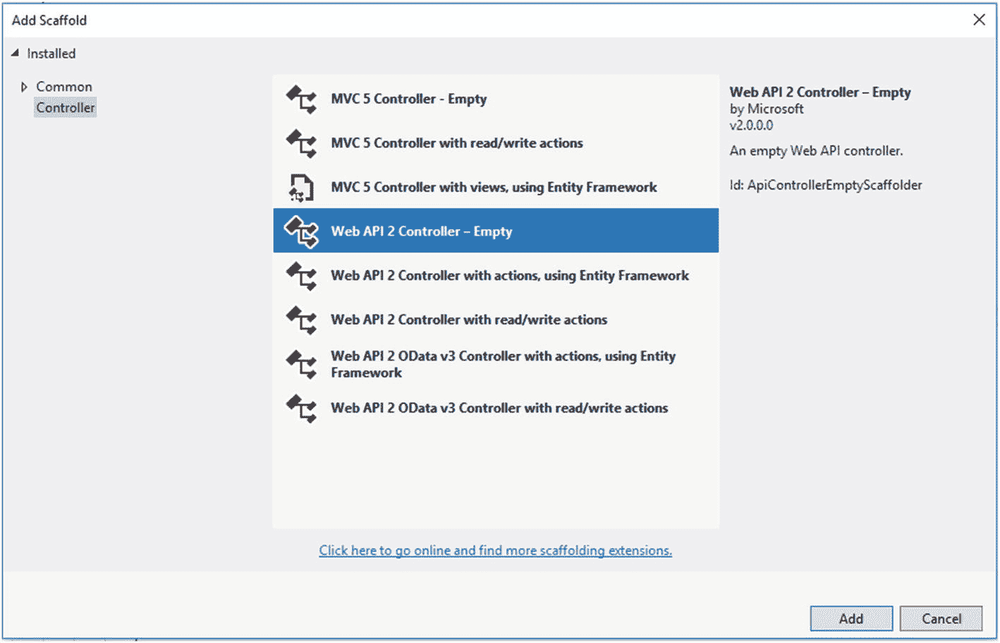

图 3-9

添加新的空 Web API 2 控制器

点击**添加**，然后在下一个屏幕上，将控制器命名为“**游戏控制器**，如下图所示:

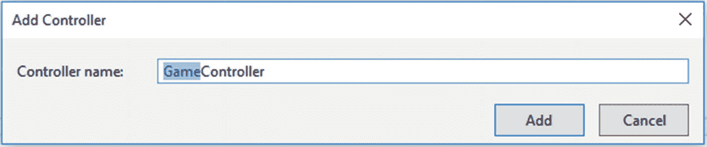

图 3-10

分配控制器名称

点击**添加**，然后复制以下代码:

```cs
using MemoryGame.API.Models.DataManager;
using MemoryGame.API.Models.DB;
using System.Collections.Generic;
using System.Web.Http;

namespace MemoryGame.API.API
{
    [RoutePrefix("api/game/players")]
    public class GameController : ApiController
    {

        GameManager _gm;
        public GameController()
        {
            _gm = new GameManager();
        }

        [HttpGet, Route("")]
        public IEnumerable<ChallengerViewModel> Get()
        {
            return _gm.GetAll;
        }

        [HttpGet, Route("{email}")]
        public int GetPlayerID(string email)
        {
            return _gm.GetChallengerID(email);
        }

        [HttpGet, Route("~/api/game/profile/{email}")]
        public ChallengerViewModel GetPlayerProfile(string email)
        {
            return _gm.GetChallengerByEmail(email);
        }
        [HttpPost, Route("")]
        public HTTPApiResponse AddPlayer(Challenger user)
        {
            return _gm.AddChallenger(user);
        }

        [Route("score")]
        [HttpPost]
        public void UpdateScore(Rank user)
        {
            _gm.UpdateCurrentBest(user);
        }

        [HttpDelete, Route("{id}")]
        public HTTPApiResponse DeletePlayer(int id)
        {
            return _gm.DeleteChallenger(id);
        }
    }
}

```

前面的代码包括 Web API 端点定义。它使用一个**属性 Routing** 来定义映射到端点实际代码实现的路由。让我们分解代码细节。我们将从类级别开始，使用以下代码:

```cs
[RoutePrefix("api/game/players")]
public class GameController : ApiController
{
    //trimmed down code for clarity
}

```

游戏控制器类是 API 端点的主要入口点。该类派生出 **ApiController** 类，并使用 **RoutePrefix** 属性为该类中的所有路由定义一个公共前缀。在这个演示中，常见的路由前缀是“API/游戏/玩家”。

ApiControllers 包含专门返回数据的方法和属性。例如，它们负责将数据透明地序列化为客户端请求的格式。此外，默认情况下，它们遵循不同的路由模式(如:将 URL 映射到动作)，按照惯例提供 RESTful API。

> 如果你和 ASP.NET MVC 一起工作过，那么你已经对控制器很熟悉了。它们在 Web API 中的工作方式类似，但是 Web API 中的控制器是从 ApiController 类而不是 Controller 类派生的。您将注意到的第一个主要区别是，Web API 控制器上的操作不返回视图，而是返回数据。

下一个代码块:

```cs
GameManager _gm;
public GameController()
{
    _gm = new GameManager();
}

```

这段代码是 **GameController** 类的类构造器。这是我们初始化创建**游戏管理器**类实例的地方。**游戏管理器**是数据访问网关，它包含处理 CRUD 操作的方法。再次提醒您，您可能希望实现一个**接口**来将 **GameManager** 对象从您的 Web API 控制器中分离出来，以使您的类更具可测试性。

下一个代码块:

```cs
[HttpGet, Route("")]
public IEnumerable<ChallengerViewModel> Get()
{
    return _gm.GetAll;
}

```

**Get()** 方法从数据库中获取所有挑战者数据，并返回一个**IEnumerable<challenger viewmodel>T3】。注意，这个方法是用**【http get】**和**Route】**属性修饰的。这意味着这个方法只能在一个 **GET** Http 请求上调用，并路由到“api/game/players”。将路由属性设置为空(**[Route(" "]**)会自动映射到在类级别定义的基本路由。**

下一个代码块:

```cs
[HttpGet, Route("{email}")]
public int GetPlayerID(string email)
{
    return _gm.GetChallengerID(email);
}

```

**GetPlayerID()** 方法将一封电子邮件作为参数。该方法从 **GameChallenger** 类中调用 **GetChallengerID()** ，该类返回电子邮件中关联的挑战者的 **ID** 。这个方法只能在一个 **GET** Http 请求上调用，因为我们用**【Http GET】**属性来修饰这个方法。路由中的 **{email}** 值是映射到 **GetPlayerID()** 方法的**字符串 email** 参数的参数模板持有者。此方法路由到以下端点:“API/game/players/test mail . com/”，其中“test mail . com”是传递给路由模板的电子邮件的值。

下一个代码块:

```cs
[HttpGet, Route("profile/{email}")]
public ChallengerViewModel GetPlayerProfile(string email)
{
    return _gm.GetChallengerByEmail(email);
}

```

**GetPlayerProfile()** 方法也将电子邮件作为参数，并从**游戏管理器**类中调用 **GetChallengerByEmail()** 方法。这个方法只能在一个 **GET** Http 请求上调用，因为我们用**【Http GET】**属性来修饰这个方法。该方法路由到“API/game/players/profile/test mail . com/”，其中“test mail . com”是传递给路由模板的电子邮件的值。

下一个代码块:

```cs
[HttpPost, Route("")]
public HTTPApiResponse SavePlayer(Challenger user)
{
    return _gm.SaveChallenger(user);
}

```

**SavePlayer()** 方法将一个**挑战者**模型作为参数，并在数据库中创建一个新条目。该方法从 **GameManager** 类中调用 **SaveChallenger()** 方法，并返回一个**httpipinaresponse**对象。请注意，该方法现在用**【http post】**进行了修饰。这意味着这个方法只能在一个 **POST** Http 请求上调用，并路由到基础端点“api/game/players”。

下一个代码块:

```cs
[HttpPost, Route("score")]
public void AddScore(Rank user)
{
    _gm.UpdateCurrentBest(user);
}

```

**AddScore()** 方法以**排名**模型为参数，创建或更新数据库中挑战者记录的当前最佳得分。该方法从 **GameManager** 类中调用 **UpdateCurrentBest()** 方法，并返回 **void** 。这个方法只能在一个 **POST** Http 请求上调用，它路由到“api/game/players/score”。

下一个代码块:

```cs
[HttpDelete, Route("{id}")]
public HTTPApiResponse DeletePlayer(int id)
{
    return _gm.DeleteChallenger(id);
}

```

**DeletePlayer()** 方法将一个**整数**值作为参数，并删除数据库中的挑战者档案和相关等级记录。该方法调用 **GameManager** 类的 **DeleteChallenger()** 方法，并返回一个**httpipinaresponse**对象。它使用**【Http DELETE】**属性来表示该方法只能在 **DELETE** Http 请求上调用，并且它路由到“api/game/players/1”，其中“1”是传递到路由表中的 **ID** 的值。

以下是对**游戏控制器** API 端点的总结:

<colgroup><col class="tcol1 align-left"> <col class="tcol2 align-left"> <col class="tcol3 align-left"> <col class="tcol4 align-left"></colgroup> 
| 

**HTTP 方法**

 | 

**C# 方法**

 | 

**终点(路线)**

 | 

**描述**

 |
| --- | --- | --- | --- |
| 得到 | 获取() | API/游戏/玩家 | 获取所有挑战者和排名数据 |
| 邮政 | AddPlayer(挑战者用户) | API/游戏/玩家 | 添加新的挑战者 |
| 邮政 | 更新分数(排名用户) | API/游戏/玩家/分数 | 添加或更新挑战者分数 |
| 删除 | DeletePlayer(int id) | API/游戏/玩家/{id} | 移除玩家 |
| 得到 | GetPlayerID（字符串电子邮件） | API/游戏/玩家/{email} | 根据电子邮件获取挑战者 ID |
| 得到 | getplayerprofile(字串电子邮件) | API/游戏/玩家/个人资料/{email} | 根据电子邮件获取挑战者信息 |

示例中的所有 Web API 端点都包含在一个类中，因为我试图使这个演示尽可能简单。在处理大型数据模型的真实场景中，我强烈建议您将每个控制器实现分开，并尽可能遵循 REST 标准。还建议总是用有意义的结果包装 API 响应，并处理可能的错误。你可以看看我写的关于编写自定义包装器来管理 API 异常和一致响应的文章，例如: [`http://vmsdurano.com/asp-net-core-and-web-api-a-custom-wrapper-for-managing-exceptions-and-consistent-responses/`](http://vmsdurano.com/asp-net-core-and-web-api-a-custom-wrapper-for-managing-exceptions-and-consistent-responses/) 。

## 扶持 CORS

现在我们已经准备好了我们的 API 端点，在这个项目中我们要做的最后一步是启用 CORS。我们需要这样做，因为这个 API 将在其他可能有不同领域的应用中使用。

根据这里的文档，这里是 CORS 的定义: [`https://msdn.microsoft.com/en-us/magazine/dn532203.aspx`](https://msdn.microsoft.com/en-us/magazine/dn532203.aspx)

*跨源资源共享(CORS* ) *是万维网联盟(W3C)规范(通常被认为是 HTML5 的一部分)，它让 JavaScript 克服浏览器强加的同源策略安全限制。同源策略* ) *意味着你的 JavaScript 只能对包含网页的同源进行 AJAX 调用(其中“源”定义为主机名、协议和端口号的组合)。例如，来自* [`http://foo.com`](http://foo.com) *的网页上的 JavaScript 不能对* [`http://bar.com`](http://bar.com) *(或者对* [`http://www.foo.com`](http://www.foo.com) *、* [`https://foo.com`](https://foo.com) *或者* [`http://foo.com:999`](http://foo.com:999) *)进行 AJAX 调用。*

CORS 放宽了这一限制，让服务器指明哪些来源可以调用它们。浏览器强制实施 CORS，但必须在服务器上实现，最新发布的 ASP.NET Web API 2 完全支持 CORS。使用 Web API 2，您可以配置策略以允许来自不同来源的 JavaScript 客户机访问您的 API。

要在 ASP.NET Web API 中启用 CORS，请执行以下操作:

1.  安装微软。通过掘金。截至本文撰写之时，最新的稳定版本是 5.2.6。

2.  导航到 **App_Start** 文件夹，然后打开 **WebApiConfig.cs** 。将以下代码添加到 WebApiConfig 中。注册方法:

    ```cs
    config.EnableCors();

    ```

1.  打开**游戏控制器**类，然后声明以下名称空间:

    ```cs
    using System.Web.Http.Cors;

    ```

1.  最后，添加**【enable CORS】**属性，如下所示:

    ```cs
    [EnableCors(origins: "http://localhost:60273", headers: "*", methods: "*")]
    public class GameController : ApiController

    ```

***注意，您必须根据消费客户端的 URI 替换 origins 的值。否则，您可以使用“*”通配符来允许任何域访问您的 API。**T3】*

至此，我们已经创建了所需的 API 端点。在进入第四章之前，我建议你做一次**清理**，然后**重建**，以确保应用没有编译错误。

## 样本卷曲

REST APIs 的一个优点是，您几乎可以使用任何编程语言来调用端点。端点只是位于特定路径的 web 服务器上的一个资源。

每种编程语言都有不同的 web 调用方式。而不是耗尽你的精力试图展示如何打网络电话。NET、Java、Python、C++、JavaScript、Ruby 等等，使用 cURL 就可以显示调用。

cURL 提供了一种通用的、与语言无关的方式来演示 HTTP 请求和响应。用户可以看到请求的格式，包括任何头和其他参数。你的用户可以把它翻译成他们正在使用的语言的特定格式。

您可以使用下面的 cURLs 来测试我们之前自己创建的 API 端点:

*   获取所有玩家

    ```cs
    curl -X GET \
      http://localhost:56393/api/game/players \
      -H 'Cache-Control: no-cache' \

    ```

*   获得玩家挑战

    ```cs
    curl -X GET \
      http://localhost:56393/api/game/players/testemail.com/ \
      -H 'Cache-Control: no-cache' \

    ```

*   获取玩家档案

    ```cs
    curl -X GET \
      http://localhost:56393/api/game/players/profile/testemail.com/ \
      -H 'Cache-Control: no-cache' \

    ```

*   添加新玩家

    ```cs
    curl -X POST \
      http://localhost:56393/api/game/players \
      -H 'Cache-Control: no-cache' \
      -H 'Content-Type: application/json' \
      -d '{
            "Email":"vynnmarkus@email.com",
            "FirstName":"Vynn Markus",
            "LastName":"Durano"
    }'

    ```

*   更新玩家分数

    ```cs
    curl -X POST \
      http://localhost:56393/api/game/players/score \
      -H 'Cache-Control: no-cache' \
      -H 'Content-Type: application/json' \
      -d '{
            "ChallengerID":1,
            "Best":3,
            "DateAchieved":"9/23/2018 4:16"
    }'

    ```

*   删除玩家

    ```cs
    curl -X DELETE \
      http://localhost:56393/api/game/players/1 \
      -H 'Cache-Control: no-cache' \

    ```

下表显示了前面示例中使用的 cURL 命令及其描述:

<colgroup><col class="tcol1 align-left"> <col class="tcol2 align-left"></colgroup> 
| 

**命令**

 | 

**描述**

 |
| --- | --- |
| ［加在以-u 结尾的法语词源的名词之后构成复数］ | X 表示用于请求的方法。常见的选项有 GET、POST、DELETE、PUT。 |
| -H | 将请求标头提交给资源。这在 REST API 请求中很常见，因为授权通常包含在消息头中。 |
| -d | 包括要发布到 URL 的数据。数据需要进行 URL 编码。数据也可以在请求体中传递。 |

关于可以使用的 cURL 命令的列表，请参见 cURL 文档: [`https://curl.haxx.se/docs/manpage.html`](https://curl.haxx.se/docs/manpage.html)

## 邮递员测试

您还可以下载 Postman 来测试我们之前创建的 API 端点。Postman 真的是一个测试 API 的便捷工具，不需要创建 UI，而且完全免费。拿到这里: [`www.getpostman.com/`](https://www.getpostman.com/)

下面是在 Postman 中测试的 API 的示例截图:

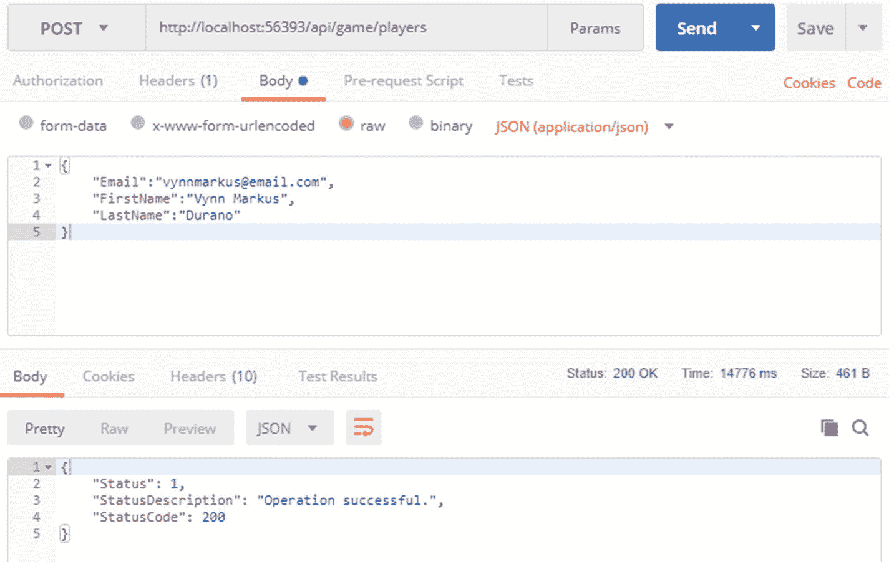

图 3-11

用 Postman 测试 API