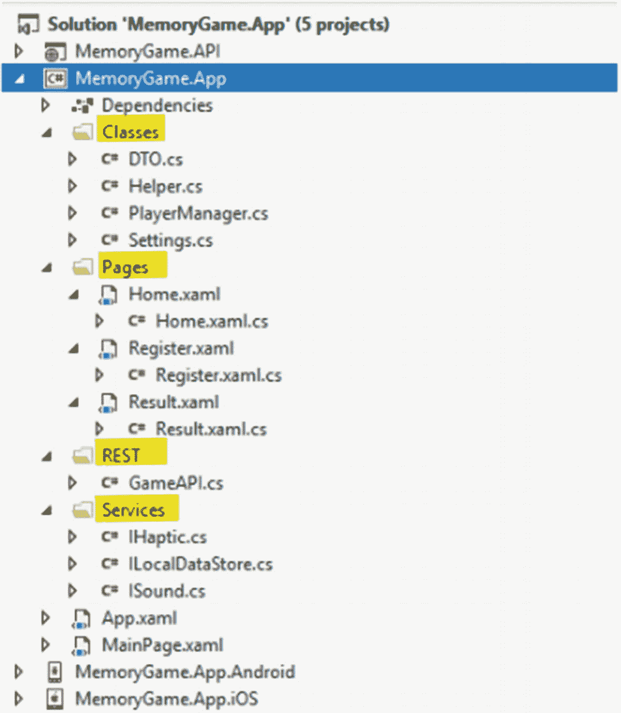

# 四、使用 XamarinForms 构建移动应用

现在我们已经准备好了 API，我们可以开始实现内存游戏移动应用，并开始使用我们刚刚在第 [3](3.html) 章中创建的 Web API。前往头部并导航至**记忆游戏。App** 项目，然后创建以下文件夹:

*   REST 这个文件夹是我们放置管理 REST API 调用的类的地方。

*   **服务**–这个文件夹是我们放置应用需要的接口的地方。

*   **类**–该文件夹存储特定于应用的类，如助手、设置和数据管理器。

*   **Pages**–该文件夹存储了应用所需的 XAML 文件。

我们这样做是为了通过查看文件夹来轻松管理文件，以便于导航和维护。

## 实现服务接口

我们将使用一个接口来定义一个其他应用可以实现它的公共方法。这是因为 Android 和 iOS 平台有不同的代码实现来处理设备振动、播放声音和存储。

接口只是方法的框架，没有实际的实现。这意味着实现接口的应用将创建一个类来执行具体的平台特定的实现。

### IHaptic 接口

让我们创建一些我们的应用需要的服务。让我们从添加 **IHaptic** 接口开始。为此，右键单击**服务**文件夹，然后选择**添加** ➤ **新项目**。在左侧窗格的 **Visual C# Items** ➤ **代码**下，选择**接口**并将其命名为“**ihatic . cs**”，如下图所示:


图 4-1

添加新的接口文件

点击**添加**，然后用下面的代码替换默认生成的代码:

```cs
namespace MemoryGame.App.Services
{
    public interface IHaptic
    {
        void ActivateHaptic();
    }
}

```

前面的代码不过是一个简单的接口定义，其中包含一个名为 **ActivateHaptic()** 的 **void** 方法。

### ILocalDataStore 接口

在 **Services** 文件夹下创建另一个接口文件。将文件命名为“ **ILocalDataSource.cs** ”，并用以下代码替换默认生成的代码:

```cs
namespace MemoryGame.App.Services
{
    public interface ILocalDataStore
    {
        void SaveSettings(string fileName, string text);
        string LoadSettings(string fileName);
    }
}

```

**ILocalDataStore** 接口包含两个主要方法: **SaveSettings()** 以文件名和文本作为参数。 **LoadSettings()** 方法将文件名作为参数，并返回一个字符串类型。

### ISound 接口

最后，创建另一个接口，并将其命名为“ **ISound.cs** ”。用以下代码替换默认生成的代码:

```cs
namespace MemoryGame.App.Services
{
    public interface ISound
    {
        bool PlayMp3File(string fileName);
        bool PlayWavFile(string fileName);
    }
}

```

**ISound** 接口包含两个主要的**布尔**方法: **PlayMp3File()** 和 **PlayWavFile()** **，**以文件名为参数。

我们创建上述服务/接口的原因是因为 iOS 和 Android 在设置设备振动和声音方面有不同的代码实现。这就是我们定义接口的原因，这样两个平台都可以继承它并实现特定于代码的逻辑。

让我们继续，在**类**文件夹中创建以下文件:

*   Helper.cs

*   设置. cs

*   PlayerManager.cs

*   内存 name . cs

## 助手类

在**类**文件夹下创建一个名为“ **Helper.cs** 的新类，然后用下面的代码替换默认生成的代码:

```cs
using Plugin.Connectivity;
namespace MemoryGame.App.Helper
{
    public static class StringExtensions
    {
        public static int ToInteger(this string numberString)
        {
            int result = 0;
            if (int.TryParse(numberString, out result))
                return result;
            return 0;
        }
    }

    public static class Utils
    {
        public static bool IsConnectedToInternet()
        {
            return CrossConnectivity.Current.IsConnected;
        }
    }
}

```

**Helper.cs** 文件由两个类组成: **StringExtension** 和 **Utils** 。 **StringExtension** 类包含一个**tointeger()**扩展方法，该方法接受一个包含有效数值的**字符串**，并将其转换为一个**整数**类型。另一方面， **Utils** 类包含一个**isconnectedpointernet()**方法来验证互联网连接。我们将在后面的应用中使用这些方法。

## 设置类

在**类**文件夹中创建另一个类，命名为“ **Settings.cs** ”。用以下代码替换默认生成的代码:

```cs
using Plugin.Settings;
using Plugin.Settings.Abstractions;
using System;
namespace MemoryGame.App.Classes
{
    public static class Settings
    {
        private static ISettings AppSettings => CrossSettings.Current;

        public static string PlayerFirstName
        {
            get => AppSettings.GetValueOrDefault(nameof(PlayerFirstName), string.Empty);
            set => AppSettings.AddOrUpdateValue(nameof(PlayerFirstName), value);
        }

        public static string PlayerLastName
        {
            get => AppSettings.GetValueOrDefault(nameof(PlayerLastName), string.Empty);
            set => AppSettings.AddOrUpdateValue(nameof(PlayerLastName), value);
        }

        public static string PlayerEmail
        {
            get => AppSettings.GetValueOrDefault(nameof(PlayerEmail), string.Empty);
            set => AppSettings.AddOrUpdateValue(nameof(PlayerEmail), value);
        }

        public static int TopScore
        {
            get => AppSettings.GetValueOrDefault(nameof(TopScore), 1);
            set => AppSettings.AddOrUpdateValue(nameof(TopScore), value);
        }

        public static DateTime DateAchieved
        {
            get => AppSettings.GetValueOrDefault(nameof(DateAchieved),
DateTime.UtcNow);
            set => AppSettings.AddOrUpdateValue(nameof(DateAchieved),
value);
        }

        public static bool IsProfileSync
        {
            get => AppSettings.GetValueOrDefault(nameof(IsProfileSync),
false);
            set => AppSettings.AddOrUpdateValue(nameof(IsProfileSync),
value);
        }

        public static int PlayerID
        {
            get => AppSettings.GetValueOrDefault(nameof(PlayerID), 0);
            set => AppSettings.AddOrUpdateValue(nameof(PlayerID), value);
        }
    }
}

```

**Settings.cs** 文件包含一些我们将在应用中使用的静态属性。它们被定义为**静态的**，这样我们在调用它们时就不需要创建类的实例；这就是助手或实用程序类的意义所在。我们在 Settings.cs 文件中定义它们是为了将它们从 Helper 类中分离出来，目的只有一个:为共享属性提供一个中心位置，可以跨所有应用访问这些属性。您可以将其视为用户数据和应用配置的本地数据存储。

让我们看一个简单的例子:

```cs
public static string PlayerFirstName
{
    get => AppSettings.GetValueOrDefault(nameof(PlayerFirstName),
string.Empty);
    set => AppSettings.AddOrUpdateValue(nameof(PlayerFirstName),
value);
}

```

**PlayerFirstName** 是一个**静态**属性，包含用于获取和设置值的**表达式主体成员**。表达式体函数是 C# 6.0 中的另一个语法简化。这些函数没有语句体。相反，您可以在函数声明后用表达式来实现它们。

以下代码是表达式体定义的一个示例:

```cs
get => AppSettings.GetValueOrDefault(nameof(PlayerFirstName), string.Empty);

```

前面的代码获取了 **PlayerFirstName** 的值，并将默认值设置为**字符串。清空**。

C# 7.0 为 setters 引入了以下语法:

```cs
set => AppSettings.AddOrUpdateValue(nameof(PlayerFirstName), value);

```

前面的代码使用分配的新值设置 **PlayerFirstName** ,并将其本地存储在设备中。

***有关表达式主体成员的更多信息，请阅读以下内容:***[***https://docs . Microsoft . com/en-us/dot net/cs harp/programming-guide/statements-expressions-operators/Expression-body-Members***](https://docs.microsoft.com/en-us/dotnet/csharp/programming-guide/statements-expressions-operators/expression-bodied-members)

设置插件将特定属性直接保存到每个平台的原生设置 APIs 中的 NSUserDefaults，Android 中的 SharedPreferences 等。).这确保了每个应用最快、最安全、最可靠的创建和编辑设置。

***关于设置插件的更多信息，请参见下面:*** [*`https://jamesmontemagno.github.io/SettingsPlugin/`*](https://jamesmontemagno.github.io/SettingsPlugin/)

## DTO 级

在**类**文件夹中创建另一个类，并将其命名为“ **DTO.cs** ”。用以下代码替换默认生成的代码:

```cs
using System;
namespace MemoryGame.App.Classes
{
    public class PlayerProfile
    {
        public string FirstName { get; set; }
        public string LastName { get; set; }
        public string Email { get; set; }
    }

    public class PlayerScore
    {
        public int ChallengerID { get; set; }
        public byte Best { get; set; }
        public DateTime DateAchieved { get; set; }
    }

    public class PlayerData
    {
        public string FirstName { get; set; }
        public string LastName { get; set; }
        public byte Best { get; set; }
        public DateTime DateAchieved { get; set; }
    }
}

```

DTO 文件包含三个主要类: **PlayerProfile** 、 **PlayerScore** 和 **PlayerData** 。我们将使用这些类作为 dto 将信息从一个地方传递到另一个地方。

## GameAPI 类

既然我们已经在前面完成了 Web API 的创建，那么是时候创建一个使用 API 端点的类了。在 **REST** 文件夹下创建一个名为“ **GameAPI.cs** 的新类，然后用下面的代码替换默认生成的代码:

```cs
using System;
using System.Text;
using System.Threading.Tasks;
using Newtonsoft.Json;
using MemoryGame.App.Classes;
using System.Net.Http;
using System.Net.Http.Headers;

namespace MemoryGame.App.REST
{
    public class GameAPI
    {

        //replace the value of APIUri with the published URI to where your API is hosted.
        //E.g http://yourdomain.com/yourappname/api/game
        private const string APIUri = "http://localhost:56393/api/game/players";
        HttpClient client;

        public GameAPI()
        {
            client = new HttpClient();
            client.MaxResponseContentBufferSize = 256000;
            client.DefaultRequestHeaders.Clear();

            //Define request data format
            client.DefaultRequestHeaders.Accept.Add(new MediaTypeWithQualityHeaderValue("application/json"));
        }

        public async Task<bool> SavePlayerProfile(PlayerProfile data, bool isNew = false)
        {
            var uri = new Uri(APIUri);
            var json = JsonConvert.SerializeObject(data);
            var content = new StringContent(json, Encoding.UTF8,"application/json");
            HttpResponseMessage response = null;

            if (isNew)
                response = await ProcessPostAsync(uri, content);

            if (response.IsSuccessStatusCode)
            {
                Settings.IsProfileSync = true;
                return true;
            }

            return false;
        }

        public async Task<bool> SavePlayerScore(PlayerScore data)
        {
            var uri = new Uri($"{APIUri}/score");
            var json = JsonConvert.SerializeObject(data);
            var content = new StringContent(json, Encoding.UTF8,"application/json");

            var response = await ProcessPostAsync(uri, content);
            if (response.IsSuccessStatusCode)
                return true;

            return false;
        }

        public async Task<int> GetPlayerID(string email)
        {
            var uri = new Uri($"{APIUri}/{email}/");
            int id = 0;

            var response = await ProcessGetAsync(uri);
            if (response.IsSuccessStatusCode)
            {
                var content = await response.Content.ReadAsStringAsync();
                id = JsonConvert.DeserializeObject<int>(content);
            }
            return id;
        }

        public async Task<PlayerData> GetPlayerData(string email)
        {
            var uri = new Uri($"{APIUri}/profile/{email}/");
            PlayerData player = null;

            var response = await ProcessGetAsync(uri);
            if (response.IsSuccessStatusCode)
            {
                player = new PlayerData();
                var content = await response.Content.ReadAsStringAsync();
                player = JsonConvert.DeserializeObject<PlayerData>(content);
            }

            return player;
        }

        private async Task<HttpResponseMessage> ProcessPostAsync(Uri uri, StringContent content)
        {
            return await client.PostAsync(uri, content);
        }

        private async Task<HttpResponseMessage> ProcessGetAsync(Uri uri)
        {
            return await client.GetAsync(uri);
        }
    }
}

```

前面的代码基本上是不言自明的，您可以通过它的方法名来猜测。该类只包含一个调用我们在上一节中创建的 API 端点的方法。如果代码现在对您没有意义，不要担心，因为我们将在本节稍后讨论它。

### 异步和等待概述

在我们深入研究 **GameAPI** 类的代码实现细节之前，让我们先快速了解一下 C# 中的**异步**和**等待**概念。

异步编程就是编写代码，允许几件事情同时发生，而不会“阻塞”，或者等待其他事情完成。这不同于同步编程，在同步编程中，所有事情都按照编写的顺序发生。为了执行异步操作，方法应该被标记为 **async:** 这告诉编译器该方法可以异步运行。 **await** 关键字与 async 关键字一起使用，告诉编译器等待**任务**，而不阻止代码执行。

**async** 关键字仅启用 **await** 关键字。 **await** 关键字是事情可以异步的地方。Await 就像一个一元操作符:它接受一个参数，一个可唤醒的**任务**或**任务< T >** (“可唤醒的”是一个异步操作)。等待检查一个请求，看它是否已经完成；如果这个方法已经完成，那么这个方法就继续运行(同步地，就像一个常规的方法一样)。

**任务**和**任务< T >** 代表可以等待的异步操作。一个**任务**不返回值，而**任务<T>T7】返回值。**

### 注意

如果一个异步方法不使用 await 操作符来标记一个暂停点，那么该方法会像同步方法一样执行，尽管有 async 修饰符。编译器会对此类方法发出警告。

下面是来自官方文档的 async 和 await 关键字的简要定义: [`https://docs.microsoft.com/en-us/dotnet/csharp/programming-guide/concepts/async/`](https://docs.microsoft.com/en-us/dotnet/csharp/programming-guide/concepts/async/)

*C # 中的 async 和 await 关键字是异步编程的核心* *。通过使用这两个关键字，您可以使用。NET 框架，。NET Core 或 Windows 运行时创建一个* *异步方法* *几乎和你创建一个* *同步方法* *一样容易。使用 async 关键字定义的异步方法称为异步方法。*

### 方法定义

既然您已经对异步编程的工作原理有了一个基本的概念，那么让我们来看看代码通过破坏它们做了什么。让我们从 **GameAPI** 构造函数代码块开始:

```cs
private const string APIUri = "http://localhost:56393/api/game/players";
HttpClient client;

public GameAPI()
{
    client = new HttpClient();
    client.MaxResponseContentBufferSize = 256000;
    client.DefaultRequestHeaders.Clear();
    //Define request data format
    client.DefaultRequestHeaders.Accept.Add(new MediaTypeWithQualityHeaderValue("application/json"));
}

```

**APIUri** 是一个**私有**变量，它保存基本 API 端点值。在本例中，它使用值`http://localhost:56393/api/game/players`，该值指向我的本地开发 IIS Express 主机。在 Visual Studio 中运行应用后，会自动为您创建值“`http://localhost:56393`”。您需要将此值更改为托管 API 的发布 URI。我们将在第 6 章中详细讨论这一点。

为了简单起见，我打算将 APIUri 的值放在 GameAPI 类中。在现实世界的应用中，建议将 APIUri 的值存储在配置文件中，这样可以很容易地修改该值。T3】

第二行声明了 **HttpClient** 对象。HttpClient 是一个面向. NET 的现代 HTTP 客户端。它提供了一个灵活的、可扩展的 API 来访问所有通过 HTTP 公开的内容。

下一行是 **GameAPI** 类构造函数。在这里，HttpClient 被初始化并配置了一些属性，用于设置**maxresponsecontenbuffersize**和 **DefaultRequestHeader** 媒体类型。

下一个代码块:

```cs
public async Task<bool> SavePlayerProfile(PlayerProfile data, bool isNew = false)
{
    var uri = new Uri(APIUri);
    var json = JsonConvert.SerializeObject(data);
    var content = new StringContent(json, Encoding.UTF8,"application/json");

    HttpResponseMessage response = null;
    if (isNew)
        response = await ProcessPostAsync(uri, content);

    if (response.IsSuccessStatusCode)
    {
        Settings.IsProfileSync = true;
        return true;
    }

    return false;
}

```

**SavePlayerProfile()** 接受一个 **PlayerProfile** 对象和一个可选的 **bool** **isNew** flag 参数。该方法通过标记为 **async** 被定义为异步，并返回一个类型为 **bool** 的**任务**。

在该方法中，我们定义了一个新的 **Uri** 对象，该对象将 **APIUri** 作为参数。然后我们使用 Newtonsoft 的 **JsonCovert 序列化数据。SerializeObject()** 方法，并将结果传递给一个 **json** 变量。数据序列化后，我们创建一个 StringContent 对象，格式为“application/json ”,编码设置为 UTF8。 **StringContent** 类创建适合 http 服务器/客户端通信的格式化文本。在客户端请求之后，服务器将使用一个 **HttpResponseMessage** 进行响应，该响应将需要一个内容；这可以用 **StringContent** 类创建。

在下一行中，我们创建了一个 **HttpResponseMessage** 对象的实例，并检查了 **isNew** 标志以进行一些验证。如果标志值为**真**，我们调用一个名为**processpostsync()**的可唤醒**任务**，并传递 **uri** 和**内容**值。然后，可确认的**任务**返回被分配给一个名为**响应**的 **HttpResponseMessage** 对象。如果响应成功，那么我们设置**设置的值。IsProfileSync** 为**真**并将**真**返回给该方法。否则，如果标志值为 **false** 或者响应不成功，我们只需将 **false** 返回给该方法。

下一个代码块:

```cs
public async Task<bool> SavePlayerScore(PlayerScore data)
{
    var uri = new Uri($"{APIUri}/score");
    var json = JsonConvert.SerializeObject(data);
    var content = new StringContent(json, Encoding.UTF8,"application/json");

    var response = await ProcessPostAsync(uri, content);
    if (response.IsSuccessStatusCode)
        return true;

    return false;
}

```

**SavePlayerScore()** 方法也是一个异步方法，它将 **PlayerScore** 对象作为参数。该方法的第一行定义了一个新的 **Uri** 对象，该对象将 **$"{APIUri}/score"** 作为参数。 **$** 字符表示一个**插值字符串**。您可以把它看作是**字符串的一种速记语法。Format** 方法，但更具可读性，也更方便。在这种情况下， *$"{APIUri}/score"* 的值将被转换为`“http://localhost:56393/api/game/players/score”`。

接下来，我们使用 Newtonsoft 的 **JsonCovert 序列化数据。SerializeObject()** 方法，并将结果传递给一个 **json** 变量。数据序列化后，我们创建一个带有特定格式的 **StringContent** 对象。然后，对于成功的响应，它返回**真**，否则返回**假**。

下一个代码块:

```cs
public async Task<int> GetPlayerID(string email)
{
    var uri = new Uri($"{APIUri}/{email}/");
    int id = 0;
    var response = await ProcessGetAsync(uri);

    if (response.IsSuccessStatusCode)
    {
        var content = await response.Content.ReadAsStringAsync();
        id = JsonConvert.DeserializeObject<int>(content);
    }

    return id;
}

```

**GetPlayerID()** 方法是一个异步方法，它将一个**字符串**作为参数，并返回一个 **int** 类型的**任务**。就像前面的异步方法一样，第一行定义了一个新的 **Uri** 对象，它接受一个插值字符串值。*$ " { API uri }/{ email }/*将被翻译成类似于"`http://localhost:56393/api/game/players/testemail.com/`"的东西。

下一行用默认值 **0** 初始化一个类型为 **int** 的变量 **id** 。然后，它调用一个名为 **ProcessGetAsync()** 的合适的**任务**，并将 **uri** 变量传递给它。如果响应成功，它将调用另一个名为 **ReadAsStringAsync()** 的可获得的**任务**，并将结果赋给一个名为 **content** 的变量。然后，它使用 Newtonsoft 的 **JsonConvert 反序列化**内容**值。反序列化 Object()** 并将结果赋给名为 **id** 的变量。最后， **id** 的值返回给方法。

下一个代码块:

```cs
public async Task<PlayerData> GetPlayerData(string email)
{
    var uri = new Uri($"{APIUri}/profile/{email}/");
    PlayerData player = null;

    var response = await ProcessGetAsync(uri);
    if (response.IsSuccessStatusCode)
    {
        player = new PlayerData();
        var content = await response.Content.ReadAsStringAsync();
        player = JsonConvert.DeserializeObject<PlayerData>(content);
    }

    return player;
}

```

前面的方法非常类似于 **GetPlayerID()** 方法，除了它返回一个**对象**而不是一个 **int** 。 **GetPlayerData()** 方法也是一个异步方法，它以**字符串**作为参数，返回类型 **PlayerData** 的**任务**。 **PlayerData** 是我们在 **DTO** 文件中定义的一个类，包含一些属性。该方法中的第一行定义了一个新的 **Uri** 对象，该对象接受一个插值字符串值。*$ " { API uri }/profile/{ email }/*值将被翻译成类似于*" http://localhost:56393/API/game/players/profile/**testemail.com**/"的内容。*

下一行初始化一个名为 **player** 的变量，类型为 **PlayerData** 。然后，它调用一个名为 **ProcessGetAsync()** 的可激活的**任务**，并将 **uri** 变量传递给它。如果响应成功，它将调用另一个可调用的**任务**，名为 **ReadAsStringAsync()** ，并将结果赋给一个名为 **content** 的变量。然后，它使用 Newtonsoft 的 **JsonConvert 反序列化**内容**值。反序列化 Object()** 并将结果赋给名为 **player** 的变量。如果响应不成功，那么它将带有空值**的**播放器**变量返回给该方法；否则，它返回带有从 API 响应分配的相关数据的 **player** 变量。**

下一个代码块:

```cs
private async Task<HttpResponseMessage> ProcessPostAsync(Uri uri, StringContent content)
{
    return await client.PostAsync(uri, content); ;
}

private async Task<HttpResponseMessage> ProcessGetAsync(Uri uri)
{
    return await client.GetAsync(uri);
}

```

前面的最后两个私有方法用于处理常见操作。**processpostsync()**是一个异步方法，它将一个 **Uri** 和 **StringContent** 作为参数，并返回一个类型为 **HttpResponseMessage 的**任务**。**这个方法主要调用 **HttpClient** 对象的 **PostAsync()** 方法。

另一方面， **ProcessGetAsync()** 只接受一个 **Uri** 作为参数，并返回一个**类型的**任务**HttpResponseMessage。**该方法调用 **HttpClient** 对象的 **GetAsync()** 方法。

***有关从. NET 客户端使用 Web API 的更多信息，请参见:***[***https://docs . Microsoft . com/en-us/aspnet/we b-API/overview/advanced/calling-a-we b-API-from-a-NET-client***](https://docs.microsoft.com/en-us/aspnet/web-api/overview/advanced/calling-a-web-api-from-a-net-client)

## PlayerManager 类

现在让我们创建管理球员数据和分数的类。在 **Classes** 文件夹下新建一个类，命名为“ **PlayerManager.cs** ”，然后复制以下代码:

```cs
using MemoryGame.App.Helper;
using System;
using System.Threading.Tasks;

namespace MemoryGame.App.Classes
{
    public static class PlayerManager
    {
        public static void Save(PlayerProfile player)
        {
            Settings.PlayerFirstName = player.FirstName;
            Settings.PlayerLastName = player.LastName;
            Settings.PlayerEmail = player.Email;
        }

        public static PlayerProfile GetPlayerProfileFromLocal()
        {
            return new PlayerProfile
            {
                FirstName = Settings.PlayerFirstName,
                LastName = Settings.PlayerLastName,
                Email = Settings.PlayerEmail
            };
        }

        public static PlayerScore GetPlayerScoreFromLocal()
        {
            return new PlayerScore
            {
                ChallengerID = Settings.PlayerID,
                Best = Convert.ToByte(Settings.TopScore),
                DateAchieved = Settings.DateAchieved
            };
        }

        public static void UpdateBest(int score)
        {
            if (Settings.TopScore < score)
            {
                Settings.TopScore = score;
                Settings.DateAchieved = DateTime.UtcNow;
            }
        }

        public static int GetBestScore(int currentLevel)
        {
            if (Settings.TopScore > currentLevel)
                return Settings.TopScore;
            else
                return currentLevel;
        }

        public async static Task<bool> Sync()
        {
            REST.GameAPI api = new REST.GameAPI();
            bool result = false;
            try
            {
                if (!Settings.IsProfileSync)
                    result = await api.SavePlayerProfile(PlayerManager.GetPlayerProfileFromLocal(),
true);

                if (Settings.PlayerID == 0)
                    Settings.PlayerID = await api.GetPlayerID(Settings.PlayerEmail);

                result = await api.SavePlayerScore(PlayerManager.GetPlayerScoreFromLocal());
                }
                catch
                {
                    return result;
                }
            return result;
        }

        public async static Task<bool> CheckScoreAndSync(int score)
        {
            if (Settings.TopScore < score)
            {
                UpdateBest(score);
                if (Utils.IsConnectedToInternet())
                {
                    var response = await Sync();
                    return response == true ? true : false;
                }
                else
                    return false;
            }
            else
                return false;
        }

        public async static Task<PlayerData> CheckExistingPlayer(string email)
        {
            REST.GameAPI api = new REST.GameAPI();
            PlayerData player = new PlayerData();
            if (Utils.IsConnectedToInternet())
            {
                player = await api.GetPlayerData(email);
            }

            return player;
        }
    }
}

```

**PlayerManager** 类由一些处理数据检索和同步的方法组成。这个类和方法用关键字**静态** **，**标记，所以我们可以直接引用它们而不用实例化对象。因为这个类不依赖于任何可以改变类本身及其成员行为的对象，所以使用 static 更有意义。注意，每个方法都调用在 **GameAPI** 类中定义的方法。我们这样做是为了将实际的代码逻辑分开，以便于维护和关注点的分离。

让我们通过将代码分成几个部分来看看我们在那里做了什么。让我们从 **Save()** 方法开始:

```cs
public static void Save(PlayerProfile player)
{
    Settings.PlayerFirstName = player.FirstName;
    Settings.PlayerLastName = player.LastName;
    Settings.PlayerEmail = player.Email;
}

```

**Save()** 方法将一个 **PlayerProfile** 对象作为参数。 **PlayerProfile** 是我们在 **DTO** 文件中定义的一个对象，其中包含一些属性。代码基本上存储了从 **PlayerProfile** 对象属性到**设置**属性的值。换句话说，这种方法将玩家的名字、姓氏和电子邮件等信息保存在设备的本地存储器中，以备将来使用。

下一个代码块:

```cs
public static PlayerProfile GetPlayerProfileFromLocal()
{
    return new PlayerProfile
    {
        FirstName = Settings.PlayerFirstName,
        LastName = Settings.PlayerLastName,
        Email = Settings.PlayerEmail
    };
}

```

**getplayerprofilefromlocial()**方法与 **Save()** 方法相反。代码从本地设备数据存储中获取玩家信息，并将它们分配给 **PlayerProfile** 对象。

下一个代码块:

```cs
public static void UpdateBest(int score)
{
    if (Settings.TopScore < score)
    {
        Settings.TopScore = score;
        Settings.DateAchieved = DateTime.UtcNow;
    }
}

```

顾名思义， **UpdateBest()** 方法更新挑战者得分。代码从本地数据存储中检查现有的最高分数，如果挑战者分数大于现有的最高分数，则用当前分数更新 **TopScore** 属性。

下一个代码块:

```cs
public static int GetBestScore(int currentLevel)
{
    if (Settings.TopScore > currentLevel)
        return Settings.TopScore;
    else
        return currentLevel;
}

```

**GetBestScore()** 方法将一个 int 作为参数。该代码基本上将当前分数/级别与来自本地数据存储的分数进行比较，并返回最高值。

下一个代码块:

```cs
public async static Task<bool> Sync()
{
    REST.GameAPI api = new REST.GameAPI();
    bool result = false;
    try
    {
        if (!Settings.IsProfileSync)
            result = await api.SavePlayerProfile(PlayerManager.GetPlayerProfileFromLocal(), true);
        if (Settings.PlayerID == 0)
            Settings.PlayerID = await api.GetPlayerID(Settings.PlayerEmail);

        result = await api.SavePlayerScore(PlayerManager.GetPlayerScoreFromLocal());
    }
    catch
    {
        return result;
    }

    return result;
}

```

**Sync()** 方法是一个异步方法，它返回类型为 **bool** 的**任务**。第一行创建了一个 **GameApi** 对象的实例。如果您还记得的话， **GameApi** 类包含了与 Web API 端点通信的代码。下一行代码在名为 **result** 的变量中初始化一个 **bool** 标志。

在 **try-block** 中，代码检查挑战者档案是否已经同步。如果没有，那么它从名为 **SavePlayerProfile()，**的 **GameApi** 类中调用一个可获得的**任务**，该任务以一个 **PlayerProfile** 对象作为参数，并以一个 **bool** 参数来指示概要文件是否是新的。下一个 **if-condition** 通过验证存储在本地数据存储器中的 **PlayerID** 属性来检查挑战者简档的存在。如果值为 0，那么它调用一个名为 **GetPlayerID()，**的可获得的**任务**，并把结果赋回**设置。普莱德里德**房产。否则，如果挑战者已经进行了同步，它就通过调用 **SavePlayerScore()** 任务来更新挑战者分数。

如果 **try-block** 中的代码失败，那么它应该转到 **catch-block** 并向该方法返回一个 **false** 值，表示同步不成功。

### 注意

在真实的应用中，建议处理特定的异常并记录下来，以便于调试和故障排除。

下一个代码块:

```cs
public async static Task<bool> CheckScoreAndSync(int score)
{
    if (Settings.TopScore < score)
    {
        UpdateBest(score);
        if (Utils.IsConnectedToInternet())
        {
            var response = await Sync();
            return response == true ? true : false;
        }
        else
            return false;
    }
    else
        return false;
}

```

**CheckScoreAndSync()** 也是一个异步方法，它将一个 **int** 作为参数，并返回一个 **bool** 类型的 **Task** 。代码基本上验证了分数；如果当前分数大于现有的最高分数，那么它用当前分数更新本地数据存储中的现有最高分数，并最终调用 **Sync()** 方法。

下一个代码块:

```cs
public async static Task<PlayerData> CheckExistingPlayer(string email)
{
    REST.GameAPI api = new REST.GameAPI();
    PlayerData player = new PlayerData();

    if (Utils.IsConnectedToInternet())
    {
        player = await api.GetPlayerData(email);
    }

    return player;
}

```

**CheckExistingPlayer()** 是一个异步方法，它将一个字符串作为参数，并返回一个 **PlayerData** 类型的**任务**。这个方法只是从 GameApi 类中调用一个名为 **GetPlayerData()** 的可激活的**任务**，并将一封电子邮件作为参数。

以下是这些方法的快速定义:

*   **Save()** 方法使用设置插件将球员信息保存在本地设备存储器中。

*   **getplayerprofilefromlocial()**方法从本地设备存储中获取播放器信息。

*   **getplayerscorefromlocial()**方法从本地设备存储中获取玩家分数细节。

*   **UpdateBest()** 方法更新本地设备存储中的玩家分数。

*   **GetBestScore()** 方法从本地设备存储中获取玩家最高分。

*   异步 **Sync()** 方法将球员档案和得分细节与数据库中的数据同步到本地数据存储中。

*   异步 **CheckScoreAndSync()** 方法将最高分更新到数据库。

*   异步 **CheckExistingPlayer()** 方法验证来自数据库的挑战者的存在。

## 添加所需的图形和声音文件

请从以下链接下载图像和文件声音:

*   图形: [`https://github.com/proudmonkey/Xamarin.MemoryGameApp/tree/master/MemoryGame.App/MemoryGame.App.Droid/Resources/drawable`](https://github.com/proudmonkey/Xamarin.MemoryGameApp/tree/master/MemoryGame.App/MemoryGame.App.Droid/Resources/drawable)

*   声音: [`https://github.com/proudmonkey/Xamarin.MemoryGameApp/tree/master/MemoryGame.App/MemoryGame.App.Droid/Resources/raw`](https://github.com/proudmonkey/Xamarin.MemoryGameApp/tree/master/MemoryGame.App/MemoryGame.App.Droid/Resources/raw)

### 机器人

对于 Xamarin。Android，在“ **Resources/drawable** ”文件夹下添加需要的图片。右击**可绘制**文件夹，然后选择**添加** ➤ **现有**项目。找到您刚刚从上一步下载的图像，然后单击**添加**。可绘制文件夹应该如下图所示:


图 4-2

添加图形文件

要添加声音文件，我们需要先创建“ **raw** 文件夹。现在，在**资源**文件夹下添加一个新文件夹，并将其命名为“ **raw** ”。如下图所示，在文件夹中添加 beep.mp3 文件:


图 4-3

添加声音文件

### ios

对于 Xamarin.iOS，在“ **Resource** ”文件夹下添加所需的图片和声音文件，如下图所示。


图 4-4

添加图形和声音文件

## 必需的 XAML 页面

在开始为应用创建所需的页面之前，让我们先了解一下 XAML 文件的结构。当我们创建记忆游戏的时候。App 项目中，一对文件被自动用以下名称命名:

*   App.xaml，xaml 文件；和

*   App.xaml.cs，一个与 xaml 文件关联的 C# 代码隐藏文件。

如果你正在使用 ASP.NET 网络表单，你会注意到 XAML 文件的概念与网络表单的 ASPX 文件非常相似。您需要单击 App.xaml 旁边的箭头来查看代码隐藏文件。 **App.xaml** 和 **App.xaml.cs** 都贡献给一个名为 **App** 的类，该类派生自**应用**。大多数其他具有 XAML 文件的类都贡献给了一个从 **ContentPage** 派生的类；这些文件使用 XAML 来定义整个页面的可视内容。

在本节中，我们将创建从 **ContentPage** 派生的以下 XAML 文件。

*   注册

*   主页

*   结果

### 注册页面

让我们开始构建注册页面。右击**页面**文件夹，然后选择**添加** ➤ **新项目**。在左侧窗格中的**visual c # items**➤**xamarin 下。表单**，选择**内容页面**，如下图所示:


图 4-5

创建新的 ContentPage 文件

将页面命名为**注册**，点击**添加**。

用以下内容替换默认生成的标记:

```cs
<?xml version="1.0" encoding="utf-8" ?>
<ContentPage xmlns:="http://xamarin.com/schemas/2014/forms"
             xmlns:x="http://schemas.microsoft.com/winfx/2009/xaml"
             x:Class="MemoryGame.App.Pages.Register">

    <StackLayout VerticalOptions="CenterAndExpand">
        <Label Text="Working Memory Game"
               FontSize="Large"
               HorizontalOptions="Center"
               VerticalOptions="CenterAndExpand" />

        <Label x:Name="lblWelcome"
               Text="Register to start the fun, or Log-on to continue the challenge!"
               FontSize="Small"
               HorizontalOptions="Center"
               VerticalOptions="CenterAndExpand" />

        <StackLayout x:Name="layoutChoose"
                     Orientation="Horizontal"
                     Spacing="5"

                     VerticalOptions="CenterAndExpand"
                     HorizontalOptions="Center">

               <Button x:Name="btnNew"
                       Text="Register"
                       FontSize="Medium"
                       HorizontalOptions="Center"
                       VerticalOptions="CenterAndExpand"
                       Clicked="OnbtnNewClicked"/>

               <Button x:Name="btnReturn"
                       Text="Log-on"

                       FontSize="Medium"
                       HorizontalOptions="Center"
                       VerticalOptions="CenterAndExpand"
                       Clicked="OnbtnReturnClicked"/>
        </StackLayout>

        <StackLayout x:Name="layoutRegister"
                     VerticalOptions="CenterAndExpand"
                     IsVisible="False">

               <Label Text="First Name" />
               <Entry x:Name="entryFirstName" />
               <Label Text="Last Name" />
               <Entry x:Name="entryLastName" />
               <Label Text="Email" />
               <Entry x:Name="entryEmail" />

               <StackLayout Orientation="Horizontal"
                            Spacing="3"
                            HorizontalOptions="Center">

                     <Button x:Name="btnRegister"
                             Text="Let's Do This!"
                             HorizontalOptions="Center"

                             VerticalOptions="CenterAndExpand"
                             Clicked="OnbtnRegisterClicked"/>

                     <Button x:Name="btnCancelRegister"
                             Text="Cancel"
                             HorizontalOptions="Center"
                             VerticalOptions="CenterAndExpand"
                             Clicked="OnbtnCancelRegisterClicked"/>

               </StackLayout>
        </StackLayout>

        <StackLayout x:Name="layoutLogin"
                     VerticalOptions="CenterAndExpand"
                     IsVisible="False">

               <Label Text="Email" />
               <Entry x:Name="entryExistingEmail" />

               <StackLayout Orientation="Horizontal" Spacing="3" HorizontalOptions="Center">

                    <Button x:Name="btnLogin"
                            Text="Let me in!"
                            HorizontalOptions="Center"

                            VerticalOptions="CenterAndExpand"
                            Clicked="OnbtnLoginClicked"/>

                    <Button x:Name="btnCancelLogin"
                            Text="Cancel"
                            HorizontalOptions="Center"
                            VerticalOptions="CenterAndExpand"
                            Clicked="OnbtnCancelLoginClicked"/>

               </StackLayout>

        </StackLayout>
    </StackLayout>
</ContentPage>

```

上述标记使用 XAML 来构建应用 UI。XAML 允许你在 Xamarin 中定义用户界面。使用标记而不是代码来形成应用。您可能已经注意到，它包含一些 **StackLayout** 元素，用于对表单中特定区域的控件进行分组。这些控件用于将表单呈现给 UI，被称为**按钮**、**条目**、**标签**等等。前面标记中的每个按钮都有一个附加的 **Clicked** 事件，用于在服务器中执行某个操作(也称为代码隐藏)。

***查马林关于 XAML 的全面文献。表单，见下面:*** [*`https://docs.microsoft.com/en-us/xamarin/xamarin-forms/xaml/xaml-basics/`*](https://docs.microsoft.com/en-us/xamarin/xamarin-forms/xaml/xaml-basics/)

现在打开 **Register.xaml.cs** 文件，用以下代码替换默认生成的代码:

```cs
using MemoryGame.App.Classes;
using MemoryGame.App.Helper;
using System;
using System.Threading.Tasks;
using Xamarin.Forms;
using Xamarin.Forms.Xaml;

namespace MemoryGame.App.Pages
{
    [XamlCompilation(XamlCompilationOptions.Compile)]
       public partial class Register : ContentPage
       {
             public Register ()
             {
                   InitializeComponent ();
             }

        enum EntryOption

        {
            Register = 0,
            Returning = 1,
            Cancel = 2
        }

        protected override void OnAppearing()
        {
            base.OnAppearing();
            NavigationPage.SetHasBackButton(this, false);

            if (!string.IsNullOrEmpty(Settings.PlayerFirstName))
                App._navPage.PushAsync(App._homePage);
        }

        async Task CheckExistingProfileAndSave(string email)
        {
             try
             {
                  PlayerData player = await PlayerManager.
                  CheckExistingPlayer(email);

                  if (string.IsNullOrEmpty(player.FirstName) && string.IsNullOrEmpty(player.LastName))
                  {
                      await App.Current.MainPage.DisplayAlert("Error", "Email does not exist.", "OK");
                  }
                  else
                  {
                      Settings.PlayerFirstName = player.FirstName.Trim();
                      Settings.PlayerLastName = player.LastName.Trim();
                      Settings.PlayerEmail = email.Trim();
                      Settings.TopScore = player.Best;
                      Settings.DateAchieved = player.DateAchieved;
                  await App._navPage.PushAsync(App._homePage);
                  }
             }
             catch
             {
                  await App.Current.MainPage.DisplayAlert("Oops", "An error occurred while connecting to the server. Please check your connection.", "OK");
             }
        }

        async Task Save()
        {
            Settings.PlayerFirstName = entryFirstName.Text.Trim();
            Settings.PlayerLastName = entryLastName.Text.Trim();
            Settings.PlayerEmail = entryEmail.Text.Trim();
            await App._navPage.PushAsync(App._homePage);
        }

        void ToggleEntryView(EntryOption option)
        {
            switch (option)
            {
                case EntryOption.Register:
                   {
                      lblWelcome.IsVisible = false;
                      layoutChoose.IsVisible = false;
                      layoutLogin.IsVisible = false;
                      layoutRegister.IsVisible = true;
                      break;
                   }
                case EntryOption.Returning:
                   {
                       lblWelcome.IsVisible = false;
                       layoutChoose.IsVisible = false;
                       layoutRegister.IsVisible = false;
                       layoutLogin.IsVisible = true;
                       break;
                       }
                case EntryOption.Cancel:
                   {
                        lblWelcome.IsVisible = true;
                         layoutChoose.IsVisible = true;
                         layoutRegister.IsVisible = false;
                         layoutLogin.IsVisible = false;
                         break;
                   }
            }
       }

       void OnbtnNewClicked(object sender, EventArgs args)
       {
            ToggleEntryView(EntryOption.Register);
       }

       void OnbtnReturnClicked(object sender, EventArgs args)
       {
            ToggleEntryView(EntryOption.Returning);
       }

       void OnbtnCancelLoginClicked(object sender, EventArgs args)
       {
            ToggleEntryView(EntryOption.Cancel);
       }

       void OnbtnCancelRegisterClicked(object sender, EventArgs args)
       {
            ToggleEntryView(EntryOption.Cancel);
       }

       async void OnbtnRegisterClicked(object sender, EventArgs args)
       {
            btnRegister.IsEnabled = false;
            if (string.IsNullOrEmpty(entryFirstName.Text)
                || string.IsNullOrEmpty(entryLastName.Text)
                || string.IsNullOrEmpty(entryEmail.Text))

                await App.Current.MainPage.DisplayAlert("Error", "Please supply the required fields.", "Got it");
            else
               await Save();

            btnRegister.IsEnabled = true;
        }

       async void OnbtnLoginClicked(object sender, EventArgs args)
       {
            if (string.IsNullOrEmpty(entryExistingEmail.Text))
                await App.Current.MainPage.DisplayAlert("Error", "Please supply your email.", "Got it");
            else
            {
                if (Utils.IsConnectedToInternet())
                {
                    btnLogin.IsEnabled = false;
                    await CheckExistingProfileAndSave(entryExistingEmail.Text);
                }
                else
                {
                    await App.Current.MainPage.DisplayAlert(“Error”, “No internet connection.”, “OK”);
                }
            }
            btnLogin.IsEnabled = true;
       }
   }
}

```

让我们通过将代码分成几个部分来看看代码实现的细节。让我们从这个开始:

```cs
using MemoryGame.App.Classes;
using MemoryGame.App.Helper;
using System;
using System.Threading.Tasks;
using Xamarin.Forms;
using Xamarin.Forms.Xaml;

```

在最顶端，你会发现一系列使用关键字的**。这种类型的关键字通常用作指令，用于为命名空间创建别名或导入在其他命名空间中定义的类型。换句话说，当您想要访问代码中的某个类时，您需要首先定义名称空间。**

下一个代码块:

```cs
[XamlCompilation(XamlCompilationOptions.Compile)]
public partial class Register : ContentPage
{
    public Register()
    {
        InitializeComponent();
    }
}

```

**寄存器**类是从**内容页面**类派生的**分部**类。在 XAML，ContentPage 是显示单个视图的页面，通常是 StackLayout 或 ScrollView 这样的容器。在类构造函数中，它调用方法 **InitializeComponent()** ，该方法初始化一个新的 **ContentPage** 实例。

下一个代码块:

```cs
enumEntryOption
{
    Register = 0,
    Returning = 1,
    Cancel = 2
}

```

前面的代码是一个枚举，用于切换页面上的按钮。

下一个代码块:

```cs
protected override void OnAppearing()
{
    base.OnAppearing();
    NavigationPage.SetHasBackButton(this, false);

    if (!string.IsNullOrEmpty(Settings.PlayerFirstName))
        App._navPage.PushAsync(App._homePage);
}

```

**OnAppearing()** 是页面的内置事件。这个事件被标记为 **virtual** ，这意味着我们可以在页面变得可见之前覆盖这个事件来定制行为。在这种情况下，我们调用 **SetHasBackButton()** 方法，在加载**注册**页面时隐藏后退按钮导航。if-condition 行检查挑战者名称的存在。如果属性 PlayerFirstName 有一个值，那么它将视图重定向到 **Home** 页面；否则，它停留在**寄存器**页面中。

***了解更多关于 Xamarin 的信息。表单导航，参见如下:*** [*`https://docs.microsoft.com/en-us/xamarin/xamarin-forms/app-fundamentals/navigation/`*](https://docs.microsoft.com/en-us/xamarin/xamarin-forms/app-fundamentals/navigation/)

下一个代码块:

```cs
async Task CheckExistingProfileAndSave(string email)
{
    try
    {
        PlayerData player = await PlayerManager.Check
        ExistingPlayer(email);

        if (string.IsNullOrEmpty(player.FirstName) && string.IsNullOrEmpty(player.LastName))
        {
            await App.Current.MainPage.DisplayAlert("Error", "Email does not exist.", "OK");
        }
        else
        {
            Settings.PlayerFirstName = player.FirstName.Trim();
            Settings.PlayerLastName = player.LastName.Trim();
            Settings.PlayerEmail = email.Trim();
            Settings.TopScore = player.Best;
            Settings.DateAchieved = player.DateAchieved;
            await App._navPage.PushAsync(App._homePage);
        }
    }
    catch
    {
        await App.Current.MainPage.DisplayAlert("Oops", "An error occurred while connecting to the server. Please check your connection.", "OK");
    }
}

```

**CheckExistingProfileAndSave()**是一个异步方法，它以一个**字符串**为参数，返回一个**任务**。try-block 中的第一行调用名为 **CheckExistingPlayer()** 的可激励**任务**，并将结果分配给一种类型的 **PlayerData** 。如果 **PlayerData** 对象的 **FirstName** 和 **LastName** 为 null 或为空，则显示一个错误，说明提供的电子邮件不存在。否则，它通过**设置**属性将挑战者信息存储在本地数据存储器中。

下一个代码块:

```cs
async Task Save()
{
    Settings.PlayerFirstName = entryFirstName.Text.Trim();
    Settings.PlayerLastName = entryLastName.Text.Trim();
    Settings.PlayerEmail = entryEmail.Text.Trim();
    await App._navPage.PushAsync(App._homePage);
}

```

**Save()** 方法存储挑战者的基本信息，如**名字**、**姓氏**和**电子邮件**，然后自动重定向到**主页**页面。

下一个代码块:

```cs
void ToggleEntryView(EntryOption option)
{
    switch (option)
    {
         case EntryOption.Register:
             {
                 lblWelcome.IsVisible = false;
                 layoutChoose.IsVisible = false;
                 layoutLogin.IsVisible = false;
                 layoutRegister.IsVisible = true;
                 break;
             }
        case EntryOption.Returning:
             {
                 lblWelcome.IsVisible = false;
                 layoutChoose.IsVisible = false;
                 layoutRegister.IsVisible = false;
                 layoutLogin.IsVisible = true;
                 break;
              }
        case EntryOption.Cancel:
             {
                 lblWelcome.IsVisible = true;
                 layoutChoose.IsVisible = true;
                 layoutRegister.IsVisible = false;
                 layoutLogin.IsVisible = false;
                 break;
             }
    }
}

```

**ToggleEntryView()** 方法将一个 **EntryOption** 枚举作为参数。该方法主要处理**注册**页面中注册和登录容器布局的切换。

下一个代码块:

```cs
void OnbtnNewClicked(object sender, EventArgs args)
{
    ToggleEntryView(EntryOption.Register);
}

void OnbtnReturnClicked(object sender, EventArgs args)
{
    ToggleEntryView(EntryOption.Returning);
}

void OnbtnCancelLoginClicked(object sender, EventArgs args)
{
    ToggleEntryView(EntryOption.Cancel);
}

void OnbtnCancelRegisterClicked(object sender, EventArgs args)
{
    ToggleEntryView(EntryOption.Cancel);
}

```

前面的代码包含调用**toggelentryview()**方法的按钮的事件处理程序。**onbtnewclicked**事件显示了带有取消按钮的**注册**视图。另一方面， **OnbtnReturnClicked** 事件显示了带有取消按钮的**登录**视图。其余的事件用于将视图恢复到原始状态。

下一个代码块:

```cs
async void OnbtnRegisterClicked(object sender, EventArgs args)
{
    btnRegister.IsEnabled = false;

    if (string.IsNullOrEmpty(entryFirstName.Text)
        || string.IsNullOrEmpty(entryLastName.Text)
        || string.IsNullOrEmpty(entryEmail.Text))
        await App.Current.MainPage.DisplayAlert("Error", "Please supply the required fields.", "Got it");
    else
        await Save();

    btnRegister.IsEnabled = true;
}

```

**OnbtnRegisterClicked** 是返回 **void** 的异步事件。如你所知，**异步**方法可以返回**任务<T>T7】、**任务**，或者 **void** 。几乎在所有情况下，你都想返回**任务<T>T13】或者**任务**，只有在不得已的情况下才返回 **void** 。为**异步事件处理程序**返回 **void** 非常棒，因为我们可以在不阻塞 UI 线程的情况下执行异步操作。****

事件中的第一行代码禁用按钮 **btnRegister** ，然后执行一些异步操作。如果**名字**、**姓氏**和**电子邮件**字段留空，则显示错误。否则，它调用 **Save()** 方法。

下一个代码块:

```cs
async void OnbtnLoginClicked(object sender, EventArgs args)
{
    if (string.IsNullOrEmpty(entryExistingEmail.Text))
        await App.Current.MainPage.DisplayAlert("Error", "Please supply your email.", "Got it");
    else
    {
        if (Utils.IsConnectedToInternet())
        {
            btnLogin.IsEnabled = false;
            await CheckExistingProfileAndSave(entryExistingEmail.Text);
        }
        else
        {
            await App.Current.MainPage.DisplayAlert("Error", "No internet connection.", "OK");
        }
    }

    btnLogin.IsEnabled = true;
}

```

**OnbtnLoginClicked** 事件也是一个异步事件，返回 **void。**该事件是验证用户凭证的地方:在本例中，是电子邮件地址值。事件处理程序中的第一行代码检查电子邮件地址值。如果它是空的，那么它显示一个错误；否则，它通过调用**CheckExistingProfileAndSave()**方法将挑战者信息保存到本地数据存储中。

### 主页

在**页面**文件夹下添加一个新的**内容页面**，命名为“**首页**”。用以下代码替换默认生成的代码:

```cs
<?xml version="1.0" encoding="utf-8" ?>
<ContentPage xmlns:="http://xamarin.com/schemas/2014/forms"
             xmlns:x="http://schemas.microsoft.com/winfx/2009/xaml"
             x:Class="MemoryGame.App.Pages.Home">

    <StackLayout Padding="2">
        <StackLayout>
            <StackLayout Orientation="Horizontal">

                <Label x:Name="lblBest"
                       FontSize="Medium"
                       HorizontalOptions="StartAndExpand" />

                <Button x:Name="btnSync"
                        Text="Sync"

                        Clicked="OnbtnSyncClicked"
                        HorizontalOptions="EndAndExpand"
                        VerticalOptions="CenterAndExpand" />

                <Button x:Name="btnLogOut"
                        Text="Logout"
                        Clicked="OnbtnLogoutClicked"
                        HorizontalOptions="EndAndExpand"
                        VerticalOptions="CenterAndExpand" />

            </StackLayout>

            <Label x:Name="lblTime"
                   FontSize="Large"
                   HorizontalOptions="Center"
                   VerticalOptions="CenterAndExpand" />
        </StackLayout>

        <Label x:Name="lblLevel"
               FontSize="Small"
               HorizontalOptions="Center"
               VerticalOptions="CenterAndExpand" />

        <StackLayout Orientation="Horizontal"
                     Spacing="2"

                     HorizontalOptions="Center"
                     BackgroundColor="White">

              <Image x:Name="imgLightOff"
                     Source="lightoff.png"
                     WidthRequest="60"
                     HeightRequest="20" />

              <Image x:Name="imgLightOff2"
                     Source="lightoff.png"
                     IsVisible="False"

                     WidthRequest="60"
                     HeightRequest="20" />

              <Image x:Name="imgLightOn"
                     Source="lighton.png"
                     IsVisible="False"
                     WidthRequest="60"
                     HeightRequest="20" />

              <Image x:Name="imgSpeaker"
                     Source="speakeron.png"
                     WidthRequest="60"
                     HeightRequest="40" />

              <Image x:Name="imgHaptic"
                     Source="vibration.png"
                     WidthRequest="60"
                     HeightRequest="20" />

        </StackLayout>

        <Label Text="The light will blink on, the speaker will beep and the device will vibrate at different times. Try to count how many times each one happens

."
               HorizontalOptions="Center"
               VerticalOptions="CenterAndExpand" />

        <Button x:Name="btnStart"
                Text="Start"
                HorizontalOptions="Center"
                VerticalOptions="CenterAndExpand"
                Clicked="OnButtonClicked"/>

    </StackLayout>

</ContentPage>

```

前面的 XAML 标记包含三个**标签**，三个**按钮**，五个**图片**。**标签**元素用于显示已保存的最高分、当前最高分以及玩游戏的说明。**按钮**元素用于将数据同步到数据库、注销和开始游戏。**图像**元素用于显示灯泡(开和关)、扬声器和触觉指示。

打开 **Home.xaml.cs** 文件，用以下代码替换默认生成的代码:

```cs
using MemoryGame.App.Classes;
using MemoryGame.App.Helper;
using MemoryGame.App.Services;
using System;
using System.Threading.Tasks;
using Xamarin.Forms;
using Xamarin.Forms.Xaml;

namespace MemoryGame.App.Pages
{
    [XamlCompilation(XamlCompilationOptions.Compile)]
    public partial class Home : ContentPage
    {
        public Home()
        {
            InitializeComponent();
        }
        enum PlayType
        {
            Blink = 0,
            Sound = 1,
            Haptic = 2
        }
        private int _cycleStartInMS = 0;
        private int _cycleMaxInMS = 10000;
        private const int _cycleIntervalInMS = 2000;
        private const int _eventTypeCount = 3;
        public statici nt CurrentGameBlinkCount { get; private set; } = 0;
        public static int CurrentGameSoundCount { get; private set; } = 0;
        public static int CurrentGameHapticCount { get; private set; } = 0;
        public static int CurrentGameLevel { get; private set; } = 1;

        protected override void OnAppearing()
        {
            base.OnAppearing();
            NavigationPage.SetHasBackButton(this, false);
            PlayerManager.UpdateBest(CurrentGameLevel);

            if (Result._answered)
                LevelUp();
            else
                ResetLevel();

            lblBest.Text = $"Best: Level {PlayerManager.GetBestScore(CurrentGameLevel)}";
            lblLevel.Text = $"Level {CurrentGameLevel}";
        }
        static void IncrementPlayCount(PlayType play)
        {
           switch (play)
           {
               case PlayType.Blink:
                  {
                       CurrentGameBlinkCount++;
                       break;
                  }
               case PlayType.Sound:
                  {
                       CurrentGameSoundCount++;
                       break;
                  }
               case PlayType.Haptic:
                  {
                       CurrentGameHapticCount++;
                       break;
                  }
            }
        }

        public static void IncrementGameLevel()
        {
            CurrentGameLevel++;
        }

        void ResetLevel()
        {
            CurrentGameLevel = 1;
            _cycleStartInMS = _cycleIntervalInMS;
            lblTime.Text = string.Empty;
            btnStart.Text = "Start";
            btnStart.IsEnabled = true;
        }

        async void StartRandomPlay()
        {
            await Task.Run(() =>
            {
                Random rnd = new Random(Guid.NewGuid().GetHashCode());
                int choice = rnd.Next(0, _eventTypeCount);

                switch (choice)
                {
                    case (int)PlayType.Blink:
                        {
                           Device.BeginInvokeOnMainThread(async () =>
                            {
                              await imgLightOff.FadeTo(0, 200);
                              imgLightOff2.IsVisible = false;
                              imgLightOff.IsVisible = true;
                              imgLightOff.Source = ImageSource.FromFile("lighton.png");
                              await imgLightOff.FadeTo(1, 200);
                            });

                            IncrementPlayCount(PlayType.Blink);
                            break;
                        }
                    case (int)PlayType.Sound:
                        {
                            DependencyService.Get<ISound>().PlayMp3File("beep.mp3");
                            IncrementPlayCount(PlayType.Sound);
                            break;
                        }
                    case (int)PlayType.Haptic:
                        {
                            DependencyService.Get<IHaptic>().ActivateHaptic();
                            IncrementPlayCount(PlayType.Haptic);
                            break;
                        }
                }
            });
        }

        void ResetGameCount()
        {
            CurrentGameBlinkCount = 0;
            CurrentGameSoundCount = 0;
            CurrentGameHapticCount = 0;
        }

        void LevelUp()
        {
            _cycleStartInMS = _cycleStartInMS - 200;
            //minus 200 ms
        }

        void Play()
        {
            int timeLapsed = 0;
            int duration = 0;

            Device.StartTimer(TimeSpan.FromSeconds(1), () =>
            {
                duration++;
                lblTime.Text = $"Timer: { TimeSpan.FromSeconds(duration).ToString("ss")}";

                if (duration < 10)
                    return true;
                else
                    return false;
            });

            Device.StartTimer(TimeSpan.FromMilliseconds(_cycleStartInMS), () => {
                timeLapsed = timeLapsed + _cycleStartInMS;

                Device.BeginInvokeOnMainThread(async () =>
                {
                    imgLightOff2.IsVisible = true;
                    imgLightOff.IsVisible = false;
                    await Task.Delay(200);
                });

                if (timeLapsed <= _cycleMaxInMS)
                {
                    StartRandomPlay();
                    return true; //continue
                }

                App._navPage.PushAsync(App._resultPage);
                    return false; //don’t continue
            });
        }

        void OnButtonClicked(object sender, EventArgs args)
        {
            btnStart.Text = "Game Started...";
            btnStart.IsEnabled = false;
            ResetGameCount();
            Play();
        }

        async void OnbtnSyncClicked(object sender, EventArgs args)
        {
            if (Utils.IsConnectedToInternet())
            {
                btnSync.Text = "Syncing...";
                btnSync.IsEnabled = false;
                btnStart.IsEnabled = false;
                var response = await PlayerManager.Sync();

                if (!response)
                    await App.Current.MainPage.DisplayAlert("Oops", "An error occurred while connecting to the server. Please check your connection.", "OK");
                else
                    await App.Current.MainPage.DisplayAlert("Sync", "Data synced!","OK");
                btnSync.Text = "Sync";
                btnSync.IsEnabled = true;
                btnStart.IsEnabled = true;
            }
            else
            {
                await App.Current.MainPage.DisplayAlert("Error", "No internet connection.", "OK");
            }
        }

        async void OnbtnLogoutClicked(object sender, EventArgs args)
        {
            if (Utils.IsConnectedToInternet())
            {
                btnLogOut.IsEnabled = false;
                var response = await PlayerManager.Sync();

                if (response)
                {
                    Settings.ClearEverything();
                    await App._navPage.PopToRootAsync();
                }
                else
                    await App.Current.MainPage.DisplayAlert("Oops","An error occurred while connecting to the server. Please check your connection.", "OK");
            }
            else
                    await App.Current.MainPage.DisplayAlert("Oops", "No internet connection. Please check your network.", "OK");

            btnLogOut.IsEnabled = true;

        }

    }
}

```

首页的代码应该很长，因为这是处理游戏逻辑的地方。我这样做是为了便于您在一个地方引用相关的代码逻辑，也是为了简单起见。在真实的场景中，您可能希望将代码分成几个类，并确定可重用的组件。

让我们通过将代码分成几个部分来看看它做了什么。让我们从类级别的定义开始:

```cs
[XamlCompilation(XamlCompilationOptions.Compile)]
public partial class Home : ContentPage
{
    public Home()
    {
        InitializeComponent();
    }
}

```

就像任何其他 XAML 页面一样， **Home** 类继承了 ContentPage 类。在类构造函数中，它调用方法 **InitializeComponent()** 来初始化一个新的 **ContentPage** 实例。

下一个代码块:

```cs
enum PlayType
{
    Blink = 0,
    Sound = 1,
    Haptic = 2
}

```

**PlayType** 是一个**枚举**，由三个主要条目组成:眨眼、声音和触觉。稍后将在代码中使用该枚举来标识所播放事件的类型。

下一个代码块:

```cs
private int _cycleStartInMS = 0;
private int _cycleMaxInMS = 10000;
private const int _cycleIntervalInMS = 2000;
private const int _eventTypeCount = 3;

```

前面的代码包含了将在类中使用的 **int** 类型的**私有**全局变量。_ cycleStartInMS 变量值以毫秒表示，默认值为 0。此变量指示应用触发新循环开始播放的时间。cycleMaxInMS 变量表示应用停止播放的最长时间。默认值为 10，000 毫秒，即 10 秒。最后两个变量被标记为**常量**，这意味着分配给它们的值不会改变。_cycleIntervalInMS 变量指示播放不同事件类型(如闪烁图像、播放声音或在设备上激活振动)之间的时间间隔。间隔值为 2000 毫秒，相当于 2 秒。eventTypeCount 变量指示事件类型的数量，在本例中其值为 3。

下一个代码块:

```cs
public static int CurrentGameBlinkCount { get; privateset; } = 0;
public static int CurrentGameSoundCount { get; privateset; } = 0;
public static int CurrentGameHapticCount { get; privateset; } = 0;
public static int CurrentGameLevel { get; privateset; } = 1;

```

前面的代码包含该类的公共属性。它们被标记为 **public** 和 **static，**，这样其他类就可以访问它们，而不必创建 **Home** 类的实例。前面的语法使用了 C# 6.0 中引入的属性初始值设定项。

CurrentGameBlinkCount 属性保存了**闪烁的次数**，默认值为 0。CurrentGameSoundCount 属性保存了**声音**计数的数量，默认值为 0。CurrentGameHapticCount 属性保存了**触觉**计数的数量，默认值为 0。最后但同样重要的是，CurrentGameLevel 保存级别/分数值。

下一个代码块:

```cs
protected override void OnAppearing()
{
    base.OnAppearing();
    NavigationPage.SetHasBackButton(this, false);
    PlayerManager.UpdateBest(CurrentGameLevel);

    if (Result._answered)
        LevelUp();
    else
        ResetLevel();

    lblBest.Text = $"Best: Level {PlayerManager.GetBestScore(CurrentGameLevel)}";
    lblLevel.Text = $"Level {CurrentGameLevel}";
}

```

在页面可见之前， **OnAppearing()** 方法触发。前面的代码禁用了应用的向后导航，然后更新挑战者最高分。if 条件从结果页面中检查 _answered 的值。如果为真，则调用 **LevelUp()** 方法，否则调用 **ResetLevel()** 。

该方法中的最后两行代码设置标签的**文本**属性，以显示最高分数和当前分数。

下一个代码块:

```cs
static void IncrementPlayCount(PlayType play)
{
    switch (play)
    {
        case PlayType.Blink:
        {
            CurrentGameBlinkCount++;
            break;
        }
        case PlayType.Sound:
            {
                CurrentGameSoundCount++;
                break;
            }
        case PlayType.Haptic:
            {
                CurrentGameHapticCount++;
                break;
            }
    }
}

```

IncrementPlayCount()方法将一个 **PlayType** 对象作为参数。这个方法基本上是根据枚举值增加每个事件类型的数量。

下一个代码块:

```cs
public static void IncrementGameLevel()
{
    CurrentGameLevel++;
}

```

IncrementGameLevel()增加等级/分值。此方法被标记为 public，以便其他类可以调用它。

下一个代码块:

```cs
void ResetLevel()
{
    CurrentGameLevel = 1;
    _cycleStartInMS = _cycleIntervalInMS;
    lblTime.Text = string.Empty;
}

```

ResetLevel()方法重置级别/分数和播放周期时间，并清除视图中显示的时间。

下一个代码块:

```cs
async void StartRandomPlay()
{
    await Task.Run(() =>
    {
        Random rnd = new Random(Guid.NewGuid().GetHashCode());
        int choice = rnd.Next(0, _eventTypeCount);
        switch (choice)
        {
            case (int)PlayType.Blink:
                {
                     Device.BeginInvokeOnMainThread(async () =>
                     {
                           await imgLightOff.FadeTo(0, 200);
                           imgLightOff2.IsVisible = false;
                           imgLightOff.IsVisible = true;
                           imgLightOff.Source = ImageSource.FromFile("lighton.png");
                           await imgLightOff.FadeTo(1, 200);
                     });

                     IncrementPlayCount(PlayType.Blink);
                     break;
                }
            case (int)PlayType.Sound:
                {
                     DependencyService.Get<ISound>().PlayMp3File("beep.mp3");
                     IncrementPlayCount(PlayType.Sound);
                     break;
                }
            case (int)PlayType.Haptic:
                {
                     DependencyService.Get<IHaptic>().ActivateHaptic();
                     IncrementPlayCount(PlayType.Haptic);
                     break;
                }
        }
    });
}

```

StartRandomPlay()是一个异步方法，它返回一个 **void** 。前面的代码是 **Home** 类的核心方法。该方法负责在随机的基础上激活不同的标准，无论是发出声音、发出振动还是仅仅闪烁图像。注意，我们已经使用了 **DependencyService** 类来注入我们在本章上一节定义的接口。这允许我们执行特定于平台的实现来播放声音或激活设备振动。

下一个代码块:

```cs
void ResetGameCount()
{
    CurrentGameBlinkCount = 0;
    CurrentGameSoundCount = 0;
    CurrentGameHapticCount = 0;
}

```

前面的代码只是将属性值重置为 0。

下一个代码块:

```cs
void LevelUp()
{
    _cycleStartInMS = _cycleStartInMS - 200; //minus 200 ms
}

```

前面的代码减少了触发新的随机事件的周期间隔。换句话说，每升一级，2 秒周期将减少 200 毫秒。这就是游戏变得令人兴奋的地方，因为你的级别/分数越高，不同事件类型被触发的速度就越快，直到你不记得发生了哪种类型的事件。

下一个代码块:

```cs
void Play()
{
    int timeLapsed = 0;
    int duration = 0;
    Device.StartTimer(TimeSpan.FromSeconds(1), () =>
    {
        duration++;
        lblTime.Text = $"Timer: { TimeSpan.FromSeconds(duration).ToString("ss")}";
        if (duration < 10)
            return true;
        else
            return false;
        });

        Device.StartTimer(TimeSpan.FromMilliseconds(_cycleStartInMS), () => {
            timeLapsed = timeLapsed + _cycleStartInMS;
            Device.BeginInvokeOnMainThread(async () =>
            {
                imgLightOff2.IsVisible = true;
                imgLightOff.IsVisible = false;
                await Task.Delay(200);
            });
            if (timeLapsed <= _cycleMaxInMS)
            {
                StartRandomPlay();
                return true; //continue
            }
            App._navPage.PushAsync(App._resultPage);
            return false; //don’t continue
        });
}

```

前面的代码调用了两个方法来启动视图上的计时器。**装置。StartTimer()** 使用设备时钟功能在 UI 线程上启动循环计时器。第一个在视图中创建一个从 10 秒到 0 的倒数计时器，并将结果实时显示给一个**标签**元素。**装置的第二次调用。StartTimer()** 方法负责根据 _ cycleMaxInMS 值的当前值触发一个新的随机事件。

下一个代码块:

```cs
void OnButtonClicked(object sender, EventArgs args)
{
    btnStart.Text = "Game Started...";
    btnStart.IsEnabled = false;

    ResetGameCount();

    Play();
}

```

通过调用 **Play()** 方法， **OnButtonClicked** 事件激活并开始游戏。

下一个代码块:

```cs
async void OnbtnSyncClicked(object sender, EventArgs args)
{
    if (Utils.IsConnectedToInternet())
    {
        btnSync.Text = "Syncing...";
        btnSync.IsEnabled = false;
        btnStart.IsEnabled = false;
        var response = await PlayerManager.Sync();

        if (!response)
            await App.Current.MainPage                  DisplayAlert("Oops"                  "An error occurred while connecting to the server. Please check your connection.", "OK");
        else
            await App.Current.MainPage.DisplayAlert("Sync", "Data synced!","OK");

        btnSync.Text = "Sync";
        btnSync.IsEnabled = true;
        btnStart.IsEnabled = true;
    }
    else
    {
        await App.Current.MainPage                  DisplayAlert("Error"                  "No internet connection."                  "OK");
    }
}

```

**onbtnsynclicked()**是一个将数据同步到数据库的异步事件处理程序。方法中的第一行代码使用实用程序检查连接。IsConnectedToInternet()方法。如果设备连接到互联网或 wifi，那么它通过从 **PlayerManager** 类中调用可获得的 **Sync()** 方法来启用数据同步。

下一个代码块:

```cs
async void OnbtnLogoutClicked(object sender, EventArgs args)
{
    if (Utils.IsConnectedToInternet())
    {
        btnLogOut.IsEnabled = false;
        var response = await PlayerManager.Sync();
        if (response)
        {
            Settings.ClearEverything();
            await App._navPage.PopToRootAsync();
        }
        else
            await App.Current.MainPage                  DisplayAlert("Oops"                  "An error occurred while connecting to the server. Please check your connection."                  "OK");
    }
    else
        await App.Current.MainPage                  DisplayAlert("Oops"                  "No internet connection. Please check your network."                  "OK");
    btnLogOut.IsEnabled = true;
}

```

OnbtnLogoutClicked 事件处理应用的注销功能。就像同步功能一样，它首先检查互联网连接。如果设备已连接，它将调用 **Sync()** 方法将数据保存在数据库中。如果同步成功，它将使用设置清除本地设备存储中的数据。ClearEverything()方法并将用户重定向回默认页面。

### 结果页面

在**页面**文件夹下添加一个新的**内容页面**，命名为“**结果**”。用以下代码替换默认生成的代码:

```cs
<?xml version="1.0" encoding="utf-8" ?>
<ContentPage xmlns:="http://xamarin.com/schemas/2014/forms"
             xmlns:x="http://schemas.microsoft.com/winfx/2009/xaml"
             x:Class="MemoryGame.App.Pages.Result">

    <StackLayout>

        <Label Text="How many times did the light blink, the speaker beep and the device vibrate?"
               HorizontalOptions="Center"
               VerticalOptions="CenterAndExpand" />

        <StackLayout Orientation="Horizontal"
             Spacing="2"
             HorizontalOptions="Center"
             BackgroundColor="White">

            <Image x:Name="imgLight"
                   Source="lightoff.png"
                   WidthRequest="60"
                   HeightRequest="20" />

            <Image x:Name="imgSpeaker"
                   Source="speakeron.png"
                   WidthRequest="60"

                   HeightRequest="20" />

            <Image x:Name="imgHaptic"
                   Source="vibration.png"
                   WidthRequest="60"
                   HeightRequest="20" />

        </StackLayout>

        <StackLayout Orientation="Horizontal"
                     HorizontalOptions="Center"
                     Spacing="5">

            <Picker x:Name="pickerLight"
                    HorizontalOptions="FillAndExpand"

                    WidthRequest="100">
                <Picker.Items>
                    <x:String>0</x:String>
                    <x:String>1</x:String>
                    <x:String>2</x:String>
                    <x:String>3</x:String>
                    <x:String>4</x:String>
                    <x:String>5</x:String>
                    <x:String>6</x:String>
                    <x:String>7</x:String>
                    <x:String>8</x:String>
                    <x:String>9</x:String>
                    <x:String>10</x:String>
                </Picker.Items>
            </Picker>

            <Picker x:Name="pickerSpeaker"
                    HorizontalOptions="FillAndExpand"
                    WidthRequest="100">
                <Picker.Items>
                    <x:String>0</x:String>
                    <x:String>1</x:String>
                    <x:String>2</x:String>
                    <x:String>3</x:String>
                    <x:String>4</x:String>
                    <x:String>5</x:String>
                    <x:String>6</x:String>
<x:String>7</x:String>
<x:String>8</x:String>
<x:String>9</x:String>
<x:String>10</x:String>
                </Picker.Items>
            </Picker>

            <Picker x:Name="pickerHaptic"

                    HorizontalOptions="FillAndExpand"
                    WidthRequest="100">
                <Picker.Items>
<x:String>0</x:String>
<x:String>1</x:String>
<x:String>2</x:String>
<x:String>3</x:String>
<x:String>4</x:String>
<x:String>5</x:String>
<x:String>6</x:String>
<x:String>7</x:String>
<x:String>8</x:String>
<x:String>9</x:String>
<x:String>10</x:String>
</Picker.Items>
</Picker>

        </StackLayout>

        <Label x:Name="lblText"

                FontSize="20"
                HorizontalOptions="Center"
                VerticalOptions="CenterAndExpand" />

        <StackLayout Orientation="Horizontal"
                     HorizontalOptions="Center"
                     Spacing="40">

            <Label x:Name="lblBlinkCount"
                   HorizontalOptions="Center"
                   VerticalOptions="CenterAndExpand" />

            <Label x:Name="lblBeepCount"
                   HorizontalOptions="Center"
                   VerticalOptions="CenterAndExpand" />

            <Label x:Name="lblHapticCount"

                   HorizontalOptions="Center"
                   VerticalOptions="CenterAndExpand" />

        </StackLayout>

        <Button x:Name="btnSubmit"
                Text="Submit"
                HorizontalOptions="Center"
                VerticalOptions="CenterAndExpand"
                Clicked="OnButtonClicked"/>

        <Button x:Name="btnRetry"
                Text="Retry"
                IsVisible="False"
                HorizontalOptions="Center"
                VerticalOptions="CenterAndExpand"
                Clicked="OnRetryButtonClicked"/>

    </StackLayout>

</ContentPage>

```

前面的 XAML 标记包含几个**标签**、**按钮、选取器**和**图像**元素。 **Picker** 元素用于存储供挑战者挑选的物品列表。**标签**元素用于显示已发生的每种事件类型的回答计数。**按钮**元素用于提交答案或导航回**主页**页面以重新开始游戏。**图像**元素用于显示灯泡、扬声器和触觉指示。

打开 **Result.xaml.cs** 文件，用以下代码替换默认生成的代码:

```cs
using MemoryGame.App.Classes;
using System;
using Xamarin.Forms;
using Xamarin.Forms.Xaml;

namespace MemoryGame.App.Pages
{
    [XamlCompilation(XamlCompilationOptions.Compile)]
        public partial class Result : ContentPage
        {
          public static bool _answered = false;
          public Result()
          {
              InitializeComponent();
              ClearResult();
          }
          protected override void OnAppearing()
          {
              base.OnAppearing();
              ClearResult();
              NavigationPage.SetHasBackButton(this, false);
          }

          void ClearResult()
          {
              lblText.Text = string.Empty;
              lblBlinkCount.Text = string.Empty;
              lblBeepCount.Text = string.Empty;
              lblHapticCount.Text = string.Empty;
              pickerLight.SelectedIndex = 0;
              pickerSpeaker.SelectedIndex = 0;
              pickerHaptic.SelectedIndex = 0;
              btnSubmit.IsVisible = true;
              btnRetry.IsVisible = false;
              _answered = false;
          }

          bool CheckAnswer(int actualAnswer, int selectedAnswer)
          {
              if (selectedAnswer == actualAnswer)
                  return true;
              else
                  return false;
          }

          void Retry()
          {
              btnSubmit.IsVisible = false;
              btnRetry.IsVisible = true;
          }

          async void OnButtonClicked(object sender, EventArgs args)
          {
              if (pickerLight.SelectedIndex >= 0 && pickerSpeaker.SelectedIndex >= 0 && pickerHaptic.SelectedIndex >= 0)
              {
                  lblText.Text = "The actual answers are:";
                  lblBlinkCount.Text = Home.CurrentGameBlinkCount.ToString();
                  lblBeepCount.Text = Home.CurrentGameSoundCount.ToString();
                  lblHapticCount.Text = Home.CurrentGameHapticCount.ToString();
                  int blinkCountAnswer = Convert.ToInt32(pickerLight.Items[pickerLight.SelectedIndex]);
                  int soundCountAnswer = Convert.ToInt32(pickerSpeaker.Items[pickerSpeaker.SelectedIndex]);
                  int hapticCountAnswer = Convert.ToInt32(pickerHaptic.Items[pickerHaptic.SelectedIndex]);

                  if (CheckAnswer(Home.CurrentGameBlinkCount, blinkCountAnswer))
                      if (CheckAnswer(Home.CurrentGameSoundCount, soundCountAnswer))
                          if (CheckAnswer(Home.CurrentGameHapticCount,hapticCountAnswer))
                          {
                              _answered = true;
                              Home.IncrementGameLevel();
                              var isSynced = PlayerManager.CheckScoreAndSync(Home.CurrentGameLevel);
                              var answer = await App.Current.MainPage.DisplayAlert("Congrats!", $"You’ve got it all right and made it to level {Home.CurrentGameLevel}. Continue?", "Yes", "No");
                              if (answer)
                              await App._navPage.PopAsync();
                          else
                              Retry();
                      }
                  if (!_answered)
                  {
                      var isSynced = PlayerManager.CheckScoreAndSync(Home.CurrentGameLevel);
                      var answer = await App.Current.MainPage.DisplayAlert("Game Over!", $"Your current best is at level{Home.CurrentGameLevel}. Retry?", "Yes", "No");
                      if (answer)
                          await App._navPage.PopAsync();
                      else
                          Retry();
                  }
              }
          }

          void OnRetryButtonClicked(object sender, EventArgs args)
          {
              App._navPage.PopAsync();
          }

    }
}

```

前面的代码处理根据每个事件类型发生的实际计数来验证答案的逻辑。如果所有的答案都是正确的，那么它会提示你一条信息，询问你是否要进行下一个级别。

## 设置页面导航

现在我们已经设置了所需的页面，让我们在 **App** 类中声明它们，以创建一个带有默认页面的简单导航。

继续打开 **App.xaml.cs** 文件，用以下代码替换现有代码:

```cs
using MemoryGame.App.Pages;
using Xamarin.Forms;
using Xamarin.Forms.Xaml;

[assembly: XamlCompilation(XamlCompilationOptions.Compile)]
namespace MemoryGame.App
{

    public partial class App : Application
    {
        public static NavigationPage _navPage;
        public static Home _homePage;
        public static Result _resultPage;
        public static Register _registerPage;

        public App()
        {
            InitializeComponent();
            _homePage = new Home();
            _resultPage = new Result();
            _registerPage = new Register();
            _navPage = new NavigationPage(_registerPage);
            MainPage = _navPage;
        }

        protected override void OnStart()
        {
            // Handle when your app starts
        }

        protected override void OnSleep()
        {
            // Handle when your app sleeps
        }

        protected override void OnResume()
        {
            // Handle when your app resumes
        }
    }
}

```

**App** 类继承了**应用**基类，它提供了以下特性:

*   一个 **MainPage** 属性，用于设置应用的初始页面。

*   持久的**属性**字典，用于存储生命周期状态变化中的简单值。

*   包含对当前应用对象的引用的静态 **Current** 属性。

app 类中的代码定义了一个公共静态 **NavigationPage** 对象和我们在上一节中创建的三个**页面**:**注册**、**主页**和**结果**。然后这些对象在类 contractor 中被初始化，默认页面被设置为寄存器页面。application 类上的 **MainPage** 属性设置应用的根页面。

***了解更多关于 Xamarin 的信息。表单 app 类，见下面:*** [*`https://docs.microsoft.com/en-us/xamarin/xamarin-forms/app-fundamentals/application-class`*](https://docs.microsoft.com/en-us/xamarin/xamarin-forms/app-fundamentals/application-class)

## 添加的文件摘要

记忆是这样的。App 项目添加完所有文件后的样子。



图 4-6

新添加文件的摘要

## 实现触觉和声音服务

现在是时候让我们提供在本章前几节中创建的每个接口的实际实现了。让我们从 Xamain.Android 开始，在**内存游戏中添加一个名为“ **Services** 的新文件夹。App.Android** 项目，然后创建以下类:

*   haptic server . cs-单一伺服器

*   声音服务. cs

### Xamarin。Android 触觉服务

打开 **HapticService.cs** 文件，用以下代码替换默认生成的代码:

```cs
using Android.Content;
using Android.OS;
using Xamarin.Forms;
using MemoryGame.App.Droid.Services;
using MemoryGame.App.Services;

[assembly: Dependency(typeof(HapticService))]
namespace MemoryGame.App.Droid.Services
{
    public class HapticService : IHaptic
    {
        public HapticService() { }
        public void ActivateHaptic()
        {
            VibrationEffect effect = VibrationEffect.CreateOneShot(100, VibrationEffect.DefaultAmplitude);
            Vibrator vibrator = (Vibrator)global::Android.App.Application.Context.GetSystemService (Context.VibratorService);
            vibrator.Vibrate(effect);
        }
    }
}

```

**HapticService** 类实现了 **IHaptic** 接口的 **ActivateHaptic()** 方法。前面的代码包含激活设备振动的 Android 特定实现。

### Xamarin。Android 声音服务

打开 **SoundService.cs** 文件，用以下代码替换默认生成的代码:

```cs
using Xamarin.Forms;
using Android.Media;
using MemoryGame.App.Droid.Services;
using MemoryGame.App.Services;

[assembly: Dependency(typeof(SoundService))]

namespace MemoryGame.App.Droid.Services
{
    public class SoundService : ISound
    {
        public SoundService() { }
        private MediaPlayer _mediaPlayer;
        public bool PlayMp3File(string fileName)
        {
            _mediaPlayer = MediaPlayer.Create(Android.App.
            Application.Context, Resource.Raw.beep);
            _mediaPlayer.Start();
            return true;
        }

        public bool PlayWavFile(string fileName)
        {
            //TO DO: Own implementation here
            return true;
        }
    }
}

```

**SoundService** 类实现了 **ISound** 接口的 **PlayMp3File()** 方法。前面的代码包含播放媒体的 Android 特定实现。

现在切换到**记忆游戏。App.iOS** 项目。添加一个名为“**服务**的新文件夹，然后创建以下类:

*   haptic server . cs-单一伺服器

*   声音服务. cs

### Xamarin.iOS 触觉服务

打开 **HapticService.cs** 文件，用以下代码替换默认生成的代码:

```cs
using Xamarin.Forms;
using AudioToolbox;
using MemoryGame.App.iOS.Services;
using MemoryGame.App.Services;

[assembly: Dependency(typeof(HapticService))]
namespace MemoryGame.App.iOS.Services
{
    public class HapticService : IHaptic
    {
        public HapticService() { }
        public void ActivateHaptic()
        {
            SystemSound.Vibrate.PlaySystemSound();
        }
    }
}

```

上述代码包含激活设备振动的 iOS 特定实现。它使用**系统声音。Vibrate.PlaySystemSound()** 在 iOS 中振动设备。

### Xamarin.iOS 声音服务

打开 **SoundService.cs** 文件，用以下代码替换默认生成的代码:

```cs
using Xamarin.Forms;
using MemoryGame.App.iOS.Services;
using System.IO;
using Foundation;
using AVFoundation;
using MemoryGame.App.Services;

[assembly: Dependency(typeof(SoundService))]

namespace MemoryGame.App.iOS.Services
{

    public class SoundService : NSObject, ISound, IAVAudioPlayerDelegate
    {
        public SoundService(){}

        public bool PlayWavFile(string fileName)
        {
            return true;
        }

        public bool PlayMp3File(string fileName)
        {
            var played = false;
            NSError error = null;
            AVAudioSession.SharedInstance().SetCategory(AVAudioSession.CategoryPlayback, out error);
            string sFilePath = NSBundle.MainBundle.PathForResource(Path.GetFileNameWithoutExtension(fileName), "mp3");
            var url = NSUrl.FromString(sFilePath);
            var _player = AVAudioPlayer.FromUrl(url);
            _player.Delegate = this;
            _player.Volume = 100f;
            played = _player.PrepareToPlay();
            _player.FinishedPlaying += (object sender, AVStatusEventArgs e) => {
            _player = null;
            };

            played = _player.Play();
            return played;
        }
    }
}

```

**SoundService** 类实现了 **ISound** 接口的 **PlayMp3File()** 方法。前面的代码包含播放媒体的 iOS 特定实现。

### 注意

对于 iOS，在资源文件夹下添加所需的图像和声音文件。

## 设置权限

### 巫师安卓系统

对于 Android，打开 AndroidManifest.xml 文件，如下图所示:


图 4-7

AndroidManifest.xml 文件

然后，添加以下配置 **:**

```cs
<uses-permission android:name="android.permission.VIBRATE" />
<uses-permission android:name="android.permission.ACCESS_NETWORK_STATE" />
<uses-permission android:name="android.permission.ACCESS_WIFI_STATE" />

<uses-permission android:name="android.permission.INTERNET" />

```

### 洗发精，快

iOS 设备不需要任何权限。在 Android 中，系统在安装应用时会寻求用户的许可。但 iOS 允许你继续安装，当用户使用需要特定权限的功能时，寻求权限。

### 注意

苹果在 iOS 10(及更高版本)中对安全性和隐私进行了多项增强，这将有助于开发者提高其应用的安全性，并确保最终用户的隐私。iOS 10 新隐私权限设置见: [`https://blog.xamarin.com/new-ios-10-privacy-permission-settings/`](https://blog.xamarin.com/new-ios-10-privacy-permission-settings/)