# 五、使用 ASP.NET SignalR 和 MVC 构建一个简单的实时排行榜 Web 应用

在我们开始实现实时功能之前，让我们先了解一下 ASP.NET 信号和 MVC 是怎么回事。虽然我们不打算完全利用 MVC 框架提供的特性，但是对 MVC 框架如何工作有一个基本的了解还是不错的。

## 什么是 ASP.NET MVC

ASP.NET MVC 是 ASP.NET 框架的一部分。下图将从高层次上展示 ASP.NET MVC 在 ASP.NET 框架中的位置。

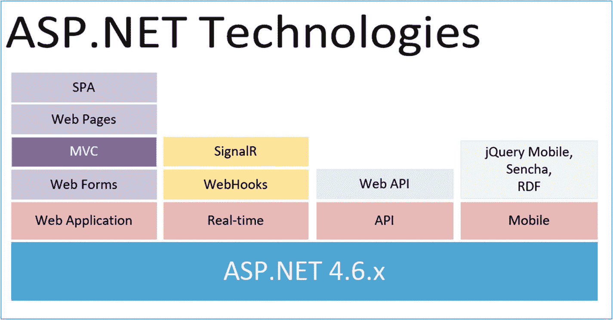

图 5-1

ASP.NET 技术公司

在上图中，你可以看到 ASP.NET MVC 位于 ASP.NET 之上。ASP.NET MVC 是一个 UI 框架，它支持清晰的关注点分离，并让你完全控制你的标记。

为了更清楚，下面是我对 MVC 高层次过程的看法:

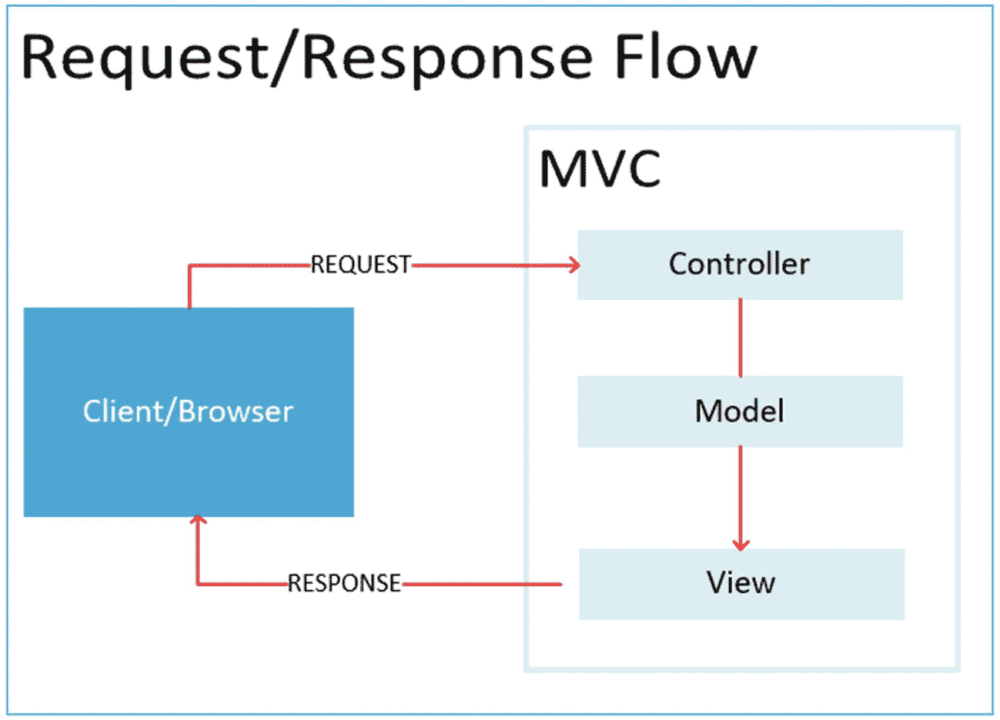

图 5-2

请求和响应流

不像在 ASP.NET web forms 中，请求直接进入页面文件(。ASPX)，在 MVC 中，当用户请求一个页面时，它会先与**控制器**对话，必要时处理数据，并向**视图**返回一个**模型**供用户查看。

### 模型

**Model** 只是一个为应用域数据实现逻辑的类。通常，模型对象在数据库中检索和存储模型状态。

### 控制器

就像模型一样，**控制器**也是一个处理用户交互的类。它将与模型一起工作，并最终选择一个视图在浏览器中呈现。

### 景色

顾名思义，**视图**是显示应用 UI 的组件；通常，这个 UI 是从模型数据中创建的。

将它们放在一起， **M** 代表模型，它通常是业务对象、业务层和数据访问层所在的地方。请注意，在典型的分层架构中，您的业务层和数据访问层应该位于不同的项目中。 **V** 是为了查看，也就是用户看到的。这可能意味着任何与 UI 和客户端相关的开发都将存在于视图中，包括 HTML、CSS 和 JavaScript。 **C** 是控制器，它编排逻辑流程。例如，如果用户单击一个指向特定 URL 的按钮，该请求将被映射到控制器操作方法，该方法负责处理为请求提供服务并返回响应所需的任何逻辑。这通常是一个新视图，或者是对现有视图的更新。

***要开始使用 ASP.NET MVC 5，我推荐你在这里阅读我的系列文章:*** [*`http://vmsdurano.com/building-web-application-using-entity-framework-and-mvc-5-part-1/`*](http://vmsdurano.com/building-web-application-using-entity-framework-and-mvc-5-part-1/)

## 什么是 ASP.NET 信号员

ASP.NET SignalR 是 ASP.NET 开发者的一个新库，它使得开发实时 web 功能变得容易。SignalR 允许服务器和客户端之间的双向通信。服务器现在可以在内容可用时立即将内容推送到连接的客户端。SignalR 支持 WebSockets，并支持其他适用于旧浏览器的兼容技术。

当用户需要刷新页面以查看最新数据时，可以使用 SignalR。它允许服务器在逻辑上将数据“推”到客户端。这通常是基于 web 的仪表板和监控工具所需要的，在这些工具中，信息需要始终保持最新，而用户不必刷新页面。SignalR 是一个强大的高级库，它抽象了许多复杂的底层技术，以便提供一种在客户机和服务器之间传输数据的简单方法。SignalR 自动管理连接，并允许使用广播或单播发送数据。

在 SignalR 中，有两种不同的模型用于实现客户端-服务器通信:

*   **持久连接**是带有 API 的基类，用于通过 HTTP 公开 SignalR 服务。当开发人员需要直接访问底层通信技术时，它们非常有用。持久连接使用类似于 WCF 的模型。

*   **Hubs** 建立在持久连接的基础上，抽象了大部分底层的复杂性，以允许开发人员在客户端和服务器端调用方法，而无需担心实现细节。使用 hub 的一个很大的好处是，您可以直接获得模型绑定和序列化。

### 传输协议选择

SignalR 的一个重要特性是，当客户端不支持 WebSockets 时，它会自动使用旧的通信方法，如下图所示:

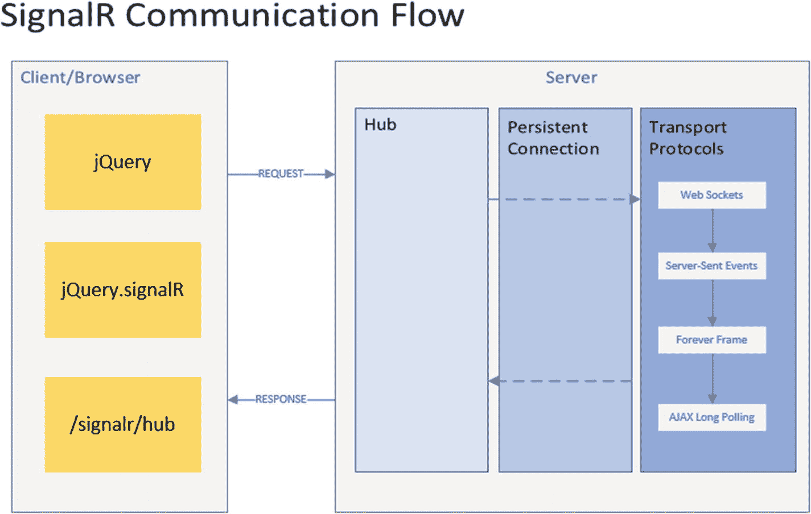

图 5-3

信号通信流程

SignalR 在支持各种传输协议方面非常灵活。它在可用时使用 WebSocket 传输，但在必要时会退回到旧的传输。WebSocket 至少需要 Windows Server 2012 或 Windows 8，以及。服务器端使用. NET Framework 4.5，客户端至少使用 IE 10。如果不满足这些要求，SignalR 将尝试使用其他传输方式进行连接。

以下是可用的传输协议:

*   求转发到

*   长轮询

*   服务器发送的事件

*   永久框架

默认的传输选择过程如下:

1.  如果客户端/服务器不支持 **WebSockets** ，那么它就退回到使用**服务器发送的事件**。

2.  如果**服务器发送的事件**不可用，则回退到**永远帧**；如果**永远帧**不可用，则退回到**长轮询**。

### 传输协议概述

WebSocket 是一种全双工协议，它在内部使用 http 握手，并允许消息流在 TCP 之上流动。支持谷歌 Chrome ( > 16)、火狐(> 11)、IE ( > 10)、Win IIS ( > 8.0)。换句话说，如果客户机和服务器都支持 WebSockets，那么这会在它们之间创建一个持久的连接，客户机或服务器可以随时使用这个连接来发送数据。因此，这种方式效率最高，占用的内存最少，并且显示出最低的延迟。这是 SignalR 应用的最佳协议。

*   **单工传播**:当一个点只是广播而另一个点只是收听而不发送消息时，它只是以一种方式传播，比如电视和广播。

*   **半双工**:一个点发送消息，此时另一个点不能发送消息，必须等待第一个点完成传输；然后它可以发送它的信息。它只是一次一个通信，例如对讲机和 HTTP 协议之类的旧无线设备。

*   **全双工**:两点可以同时收发消息；不需要等到另一个点完成它的传输。这类似于电话和 WebSocket 协议。

**服务器发送事件**(也称为事件源):这是 HTML5 中引入的另一项技术，它允许服务器在有新数据时将更新推送到客户端。当不支持 WebSocket 时，使用该技术。除了 IE 之外，大多数浏览器都支持它。

**Forever Frame** **:** 这是 Comet 模型的一部分，在浏览器中使用隐藏的 iframe，以增量方式从服务器接收数据。服务器开始以一系列块的形式发送数据，甚至不知道内容的完整长度。当接收到数据时，它在客户机上执行。

**AJAX 长轮询** **:** 这是 SignalR 中在客户端和服务器之间建立通信的最不可取的方式。还有，是最贵的！它是 Comet 模型的一部分，顾名思义，它不断轮询服务器以检查更新。发送到服务器的请求是基于 AJAX 的，以最小化资源使用并提供更好的用户体验。但它仍然很昂贵，因为它不断轮询服务器是否有任何更新。

***详见*** [*`www.asp.net/signalr`*](http://www.asp.net/signalr)

## 创建新的 Web 应用

现在，您已经了解了 SignalR 如何在客户机和服务器之间传输和持久化数据，是时候让我们来看看实际情况了。

让我们添加一个新的 ASP.NET web 应用项目。右键单击解决方案，然后选择**添加** ➤ **新项目**。在左侧窗格的 **Visual C#** ➤ **Web** 下，选择**ASP.NET web 应用(。NET Framework)** 并命名为“ **MemoryGame。Web** "如下图所示:

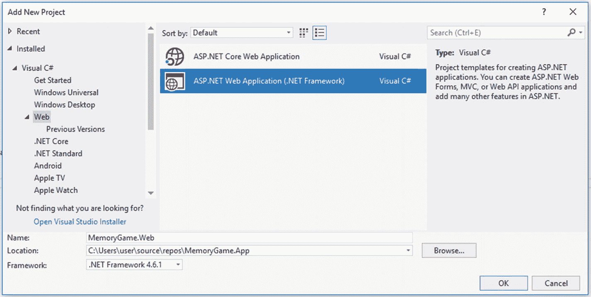

图 5-4

创建新的 ASP.NET web 应用项目

点击**确定**然后选择**清空。**勾选“添加文件夹和核心引用:”下的 MVC 选项，如下图所示:

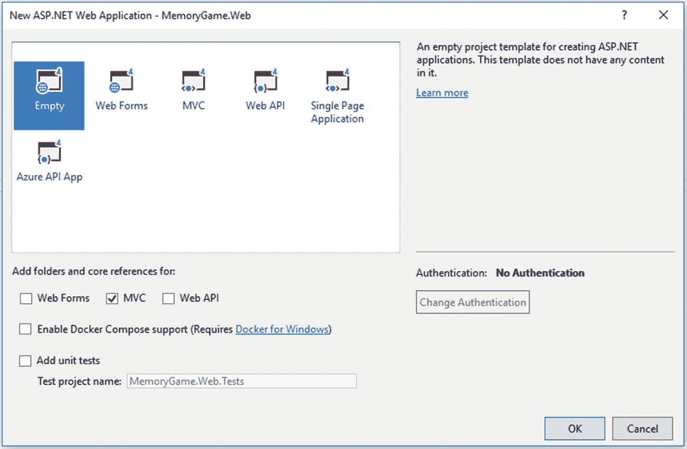

图 5-5

创建一个空的 ASP.NET MVC 项目

点击 **OK** 让 Visual Studio 为您生成项目。

## 积分 ASP.NET 信号仪

安装**微软。Asp.Net.SignalR** 在您的项目中通过 NuGet 如下图所示:

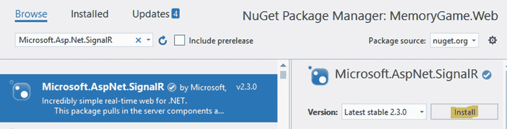

图 5-6

安装微软。获取软件包

截至本文撰写时的最新稳定版本是 **v2.3.0** 。安装后，您应该能够看到它们被添加到 references 文件夹下:

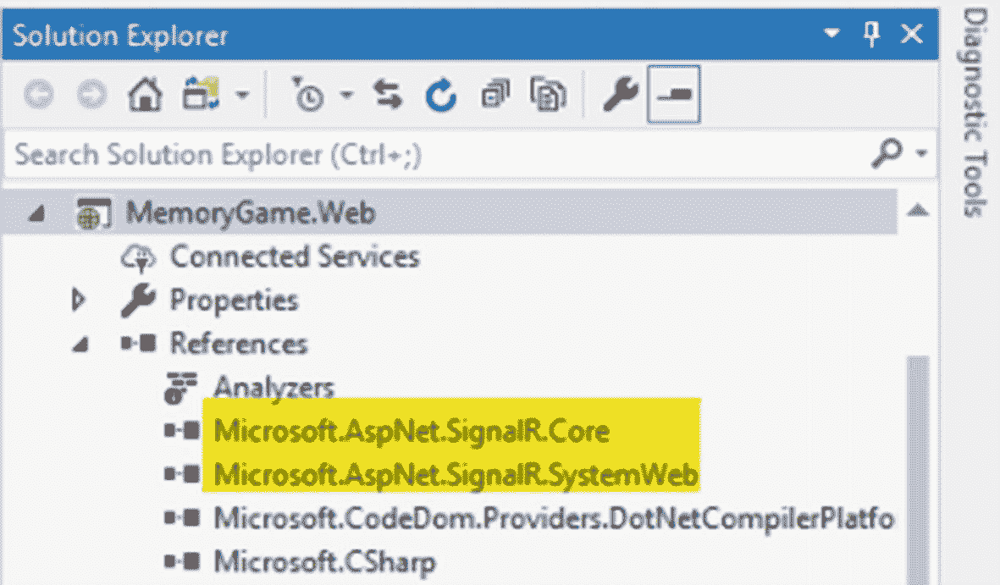

图 5-7

ASP.NET 信号参考

微软。AspNet.SignalR.Core 负责在我们的应用中使用 **SignalR** 所需的服务器组件和 **JavaScript** 客户端。**微软。AspNet.SignalR.SystemWeb** 包含在**系统上托管的应用中使用 **SignalR** 的组件。Web** 。

安装**微软。AspNet.Web.Optimization** 然后在**视图** ➤ **web.config** 下添加以下代码:

```cs
<addnamespace="System.Web.Optimization"/>

```

## 为 SignalR 添加中间件

我们需要为 SignalR 创建一个中间件，这样我们就可以通过创建一个 **IApplicationBuilder** 扩展方法来配置它。在**内存游戏的根目录下创建一个新类。Web** 项目，将其命名为“ **Startup.cs** ”，然后将生成的代码替换为以下内容:

```cs
using Microsoft.Owin;
using Owin;

[assembly: OwinStartup(typeof(MemoryGame.Web.Startup))]
namespace MemoryGame.Web
{
    public class Startup
    {
        public void Configuration(IAppBuilder app)
        {
            app.MapSignalR();
        }
    }
}

```

前面的配置将把 **SignalR** 服务添加到管道中，使我们能够在应用中使用 ASP.NET SignalR 实时功能。

## 添加集线器

下一步是增加一个 ASP.NET 信号中心。在项目的根目录下添加一个新类，并将其命名为“ **LeaderboardHub.cs** ”。用以下代码替换默认生成的代码:

```cs
using Microsoft.AspNet.SignalR;

namespace MemoryGame.Web
{
    public class LeaderboardHub : Hub
    {
        public static void Broadcast()
        {
            IHubContext context = GlobalHost
                                 .ConnectionManager
                                 .GetHubContext<LeaderboardHub>();

            context.Clients.All.displayLeaderBoard();
        }
    }
}

```

**LeaderboardHub** 继承了 Hub 类，并包含一个名为 Broadcast 的静态类。

**中枢**是**信号器**的核心。类似于 ASP.NET MVC 中的**控制器**的概念，一个**中枢**负责接收输入并向客户端生成输出。

为了更清楚，下面的类:

```cs
public class LeaderboardHub : Hub

```

将生成以下 JavaScript 客户端代理:

```cs
var hubProxy = $.connection.leaderboardHub;

```

默认情况下，JavaScript 客户端通过使用类名称的骆驼大小写版本来引用集线器。SignalR 自动进行这种更改，以便 JavaScript 代码能够符合 JavaScript 约定。前面的示例代码在 JavaScript 代码中被称为 **leaderBoardHub** 。在本章的后面，我们将看看如何从 JavaScript 代码中调用 Hub。

**Broadcas** t **()** 方法创建 IHubContext 接口的一个实例。 **IHubContext** 提供了对关于一个 **IHub** 的信息的访问，并且基本上公开了两个主要属性，即**客户端**和**组**。在本例中，一个连接的客户端可以调用 **Broadcast** 服务器方法和 **displayLeaderBoard** 客户端代理方法，当它这样做时，接收到的数据被广播给所有连接的客户端，如下图所示:

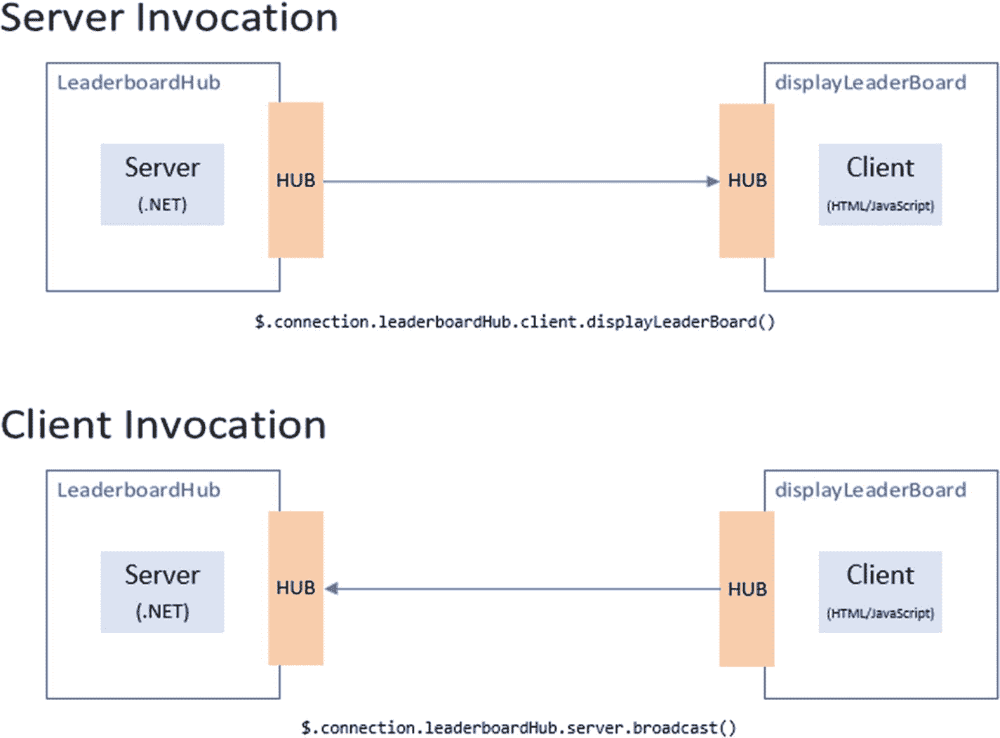

图 5-8

SignalR 客户端到服务器的调用，反之亦然

SignalR 自动处理连接管理，并让您同时向所有连接的客户端广播消息，就像一个聊天室。您还可以向特定的客户端发送消息。客户机和服务器之间的连接是持久的，不像传统的 HTTP 连接，每次通信都要重新建立连接。

SignalR 提供了一个简单的 API，用于创建从服务器端调用客户端浏览器(和其他客户端平台)中的 JavaScript 函数的服务器到客户端远程过程调用(RPC)。NET 代码。SignalR 还包括用于连接管理(例如，连接和断开事件)和分组连接的 API。

## 添加 API 端点

此时， **MemoryGame。API** Web API 服务器无法访问**中心**。从记忆游戏开始。API 应用是单独创建的，将被托管在具有不同 URL/端口的不同服务器中，然后我们需要创建一个 API 来将公共端点暴露给该服务器，以便与 SignalR 进行通信。

让我们继续添加一个新的 Web API 控制器类。右键单击**控制器**文件夹，然后选择**添加** ➤ **Web API** **控制器类** **(v2.1)** ，如下图所示:

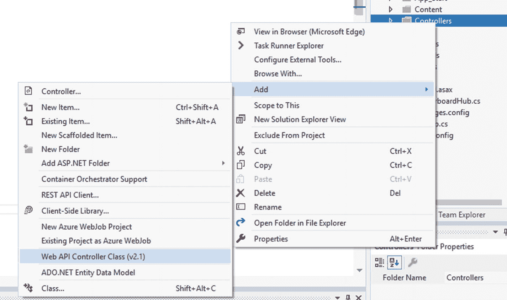

图 5-9

添加新的 Web API 控制器类

在下一个屏幕上，将该类命名为“ **LeaderBoardAppController** ”，如下图所示:

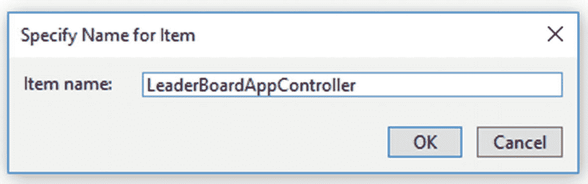

图 5-10

设置控制器名称

点击 **OK** ，然后用以下代码替换默认生成的代码:

```cs
using System.Web.Http;

namespace MemoryGame.Web.Controllers
{
    [RoutePrefix("api/ranking")]
    public class LeaderBoardAppController : ApiController
    {
        [HttpPost,Route("")]
        public void Broadcast()
        {
            LeaderboardHub.Broadcast();
        }
    }
}

```

**LeaderBoardAppController** 类派生了 **ApiController** 类，这使得它能够成为 Web API 控制器，而不是 MVC 控制器。这个类使用 **RoutePrefix** 属性来定义一个设置为“api/ranking”的公共路由前缀。

**Broadcast()** 方法类调用我们之前创建的 **LeaderboardHub** 类的静态**广播**方法。注意，这个方法是用**【http post】**和**【Route】**属性修饰的。这意味着该方法只能在 POST Http 请求上调用，并路由到“api/ranking”。如果您还记得，将 Route 属性设置为 empty(**[Route(" "]**)会自动映射到在类级别定义的基本路由。

### 注意

您还可以通过 IHubContext 在 Hub 外部定义一个客户端代理方法。例如，在您的 Web API 控制器操作中，您可以执行类似以下代码的操作:

```cs
[HttpPost, Route("")]
public void Broadcast()
{
    IHubContext context = GlobalHost
                          .ConnectionManager
                          .GetHubContext<LeaderboardHub>();

    context.Clients.All.displayLeaderBoard();
}

```

### 注意

如果您想在中为 SignalR 版本 2 使用 Hubs API。NET 客户端，如 Windows Store (WinRT)、WPF、Silverlight 和控制台应用，则参见 [`https://docs.microsoft.com/en-us/aspnet/signalr/overview/guide-to-the-api/hubs-api-guide-net-client`](https://docs.microsoft.com/en-us/aspnet/signalr/overview/guide-to-the-api/hubs-api-guide-net-client)

### 配置 Web API 路由

我们要做的下一件事是在 ASP.NET MVC 应用中配置 Web API 路由。

在**内存游戏的 **App_Start** 文件夹下添加一个新类。Web** 项目。将该类命名为“ **WebApiConfig.cs** ”，并复制以下代码:

```cs
using System.Web.Http;

public static class WebApiConfig
{
    public static void Register(HttpConfiguration config)
    {
        // Web API routes
        config.MapHttpAttributeRoutes();
    }
}

```

上述代码为 Web API 启用了基于属性的路由。

最后一步是在 Global.asax 中注册 **WebApiConfig** 类，在 **Global.asax.cs** 文件的 **Application_Start** 方法中，添加一个对 **GlobalConfiguration 的调用。Configure()** 方法；注意将其放在调用 **RouteConfig 之前。注册路由(RouteTable。**路线):

```cs
using System.Web.Http;
using System.Web.Mvc;
using System.Web.Routing;

namespace MemoryGame.Web
{
    public class MvcApplication : System.Web.HttpApplication
    {
        protected void Application_Start()
        {
            AreaRegistration.RegisterAllAreas();
            GlobalConfiguration.Configure(WebApiConfig.Register);
            RouteConfig.RegisterRoutes(RouteTable.Routes);
        }
    }
}

```

同样，请注意代码中的注册顺序，否则路由将无法正常工作，您将最终得到一个意外的行为。

## 启用 API 端点到端点通信

既然我们已经创建了调用 SignalR 通信的 API 端点，我们需要修改 **MemoryGame 中 **GameController** 类的 **UpdateScore()** 方法。API** 应用。前往**记忆游戏。API** 项目，下钻到**API**➤**game controller . cs**文件，如下图所示:

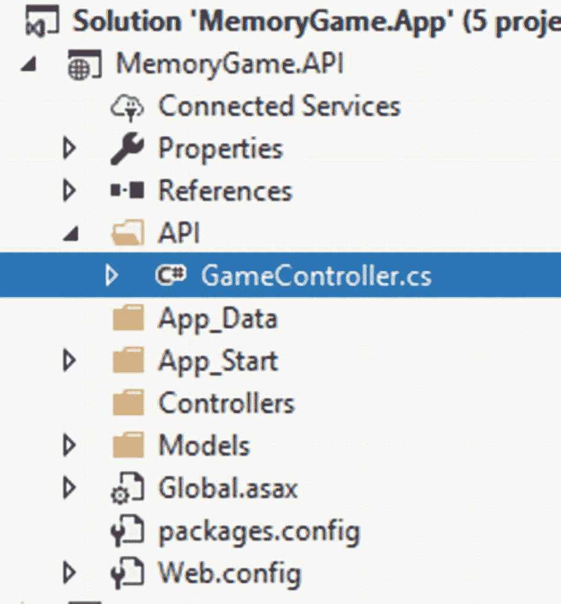

图 5-11

导航到 gamecontroller 类

双击`GameController.cs`文件将其打开，然后用以下代码替换`UpdateScore()`方法:

```cs
[HttpPost, Route("score")]
public void UpdateScore(Rank user)
{
    _gm.UpdateCurrentBest(user);

    HttpClient client = new HttpClient();
    var uri = new Uri($"http://localhost:57865/api/ranking");
    client.PostAsync(uri, null).Wait();

}

```

我们所做的是添加调用 API 端点的代码行，该端点是我们在上一节中使用 **HttpClient** 对象创建的。

前面的代码负责更新数据库中的数据，并自动向 SignalR 广播一个触发器，以在页面中显示实时的动态更新。

### 注意

您可能需要用运行应用的实际 URL 来更改 Uri 的值。对于本例，localhost:57865 是 Visual Studio 2017 在调试模式下运行应用时生成的端口号。

## 添加 MVC 控制器

让我们添加一个新的 MVC 5 控制器文件。为此，右击**控制器**文件夹，然后选择**添加** ➤ **控制器**。

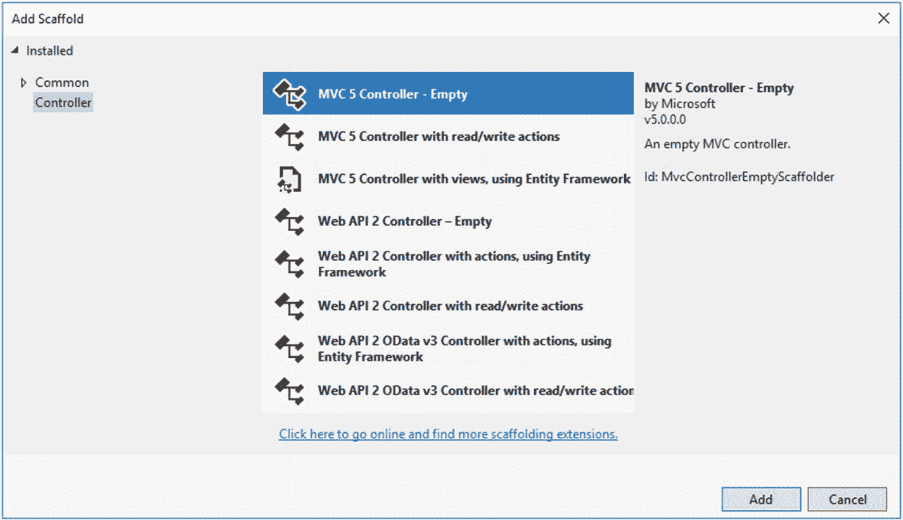

选择 **MVC 5 控制器-清空**，然后点击**添加**。

在下一个屏幕上，将名称设置为“ **HomeController** ”。点击**添加**，应该会生成如下代码:

```cs
using System.Web.Mvc;

namespace MemoryGame.Web.Controllers
{
    public class HomeController : Controller
    {
        public ActionResult Index()
        {
            return View();
        }
    }
}

```

前面的代码只是一个抛出**索引**视图的动作方法。对于这个特殊的例子，我们不需要用 Razor 在 MVC 中构建 UI，因为我们将只使用 JavaScript 和普通 HTML 来生成 UI。这里的 MVC 只是用来启动一个视图，仅此而已。

## 添加视图

在“**视图/主页**”文件夹中添加一个新的**视图**，命名为“**索引**”。用以下代码替换生成的代码:

```cs
<div id="body">
    <section class="featured">
        <div class="content-wrapper">
            <hgroup class="title">
                 <h1>Leader Board</h1>
            </hgroup>
        </div>
    </section>
    <section class="content-wrapper main-content clear-fix">
        <h1>
            <span>
                Top Challengers
                <imgsrc=img/goals_256.png"style="width:40px; height:60px;"/>
            </span>
        </h1>
        <table id="tblRank" class="table table-striped table-condensed table-hover"></table>
    </section>
</div>

@section scripts{
    @Scripts.Render("~/Scripts/jquery.signalR-2.3.0.min.js")
    @Scripts.Render("~/signalr/hubs")

    <script type="text/javascript">
        $(function () {
            var hubProxy = $.connection.leaderboardHub;

            hubProxy.client.displayLeaderBoard = function () {
                LoadResult();
            };

            $.connection.hub.start()

;
            LoadResult();
        });

        function LoadResult() {
            var $tbl = $("#tblRank");
            $.ajax({
                url: 'http://192.168.0.14:45455/api/game/players',
                type: 'GET',
                datatype: 'json',
                success: function (data) {
                    if (data.length > 0) {
                        $tbl.empty();
                        $tbl.append('<thead><tr><th>Rank</th>'
                            + '<th></th>'
                            + '<th></th>'
                            + '<th>Best</th>'
                            + '<th>Achieved</th>'
                            + '</tr></thead > ');

                        var rows = [];
                        for (var i = 0; i < data.length; i++) {
                            rows.push('<tbody><tr><td>'
                                + (i + 1).toString() + '</td><td>'
                                + data[i].FirstName + '</td><td>'
                                + data[i].LastName + '</td><td>'
                                + data[i].Best + '</td><td>'
                                + data[i].DateAchieved
                                + '</td></tr></tbody>');
                        }

                        $tbl.append(rows.join(“));
                    }
                }
            });
        }
    </script>
}

```

请注意添加客户端脚本引用的顺序:

*   框架

*   jQuery，报告

*   /信号/集线器

首先应该添加 jQuery ，然后是 **SignalR 核心 JavaScript** ，最后是 **SignalR Hub 脚本**。

对 SignalR 生成的代理的引用是动态生成的 JavaScript 代码，而不是物理文件。SignalR 动态地为代理创建 JavaScript 代码，并响应“/SignalR/hubs”URL 将其提供给客户端。

再次注意前面脚本的顺序引用；否则，SignalR 客户端将无法工作。

***详见*** [*`https://docs.microsoft.com/en-us/aspnet/signalr/overview/guide-to-the-api/hubs-api-guide-javascript-client`*](https://docs.microsoft.com/en-us/aspnet/signalr/overview/guide-to-the-api/hubs-api-guide-javascript-client)

让我们通过将代码分成几个部分来看看我们在那里做了什么。

**LoadResult()** 函数使用 jQuery AJAX 通过 AJAX **GET** 请求调用 Web API。如果响应中有任何数据，它将通过遍历这些行来生成一个 HTML。当加载页面时，或者当调用来自 **Hub** 的 **displayLeaderboard()** 客户端代理方法时，将调用 **LoadResult()** 函数。通过订阅该中心，ASP.NET 信号公司将为我们做整个复杂的管道系统，进行实时更新，而我们这边不需要做任何额外的工作。谢谢，信号员！

## 输出

下面是部署和运行项目时的最终输出:

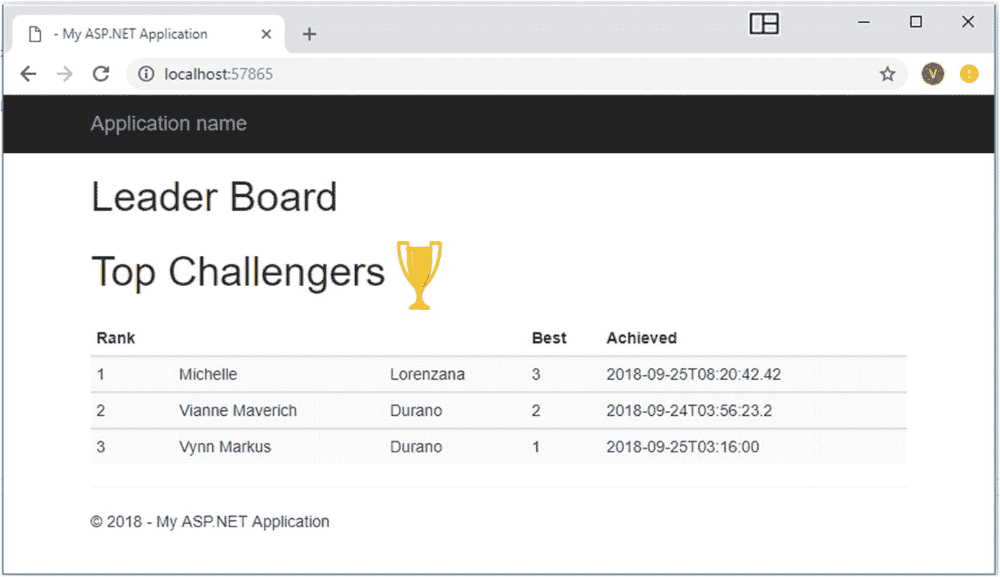

图 5-12

实时排行榜页面

前一页使用 SignalR Hub 客户端-服务器通信来自动更新数据，而无需在用户从移动应用同步其信息和分数后刷新页面。