# 六、部署和测试

本章讨论如何测试和部署我们的 Xamarin。Android 和 Xamarin.iOS 应用在特定于平台的设备仿真器中模拟该过程。在开发阶段，需要测试应用的功能。Visual Studio 2017 配备了内置的设备模拟器，可以在不需要使用真实设备的情况下测试您的应用，尽管它需要一些额外的步骤来在 Mac 中模拟您的应用。只要您的机器配置正确，在 Visual Studio 中测试您的应用应该很容易。

由于移动应用依赖 API 端点与数据库中的数据进行通信，因此 API 端点应该是可公开访问的。不幸的是，模拟器不能直接访问本地主机。这意味着您的 Web API 应用项目应该托管在面向公众的服务器或云中，例如 Azure web app，这样虚拟设备模拟器就可以使用 API 端点。然而，如果我们仍然处于开发的早期阶段，那么采用这种方法来公开托管 API 可能会浪费大量时间。这是因为在这一阶段任何类型的更改都可能发生，我们不希望总是将更改推送到面向公众的服务器，另外，一旦您的应用在不同的服务器或云上公开托管，您就没有办法调试代码并遇到断点。您可能最终会依赖应用日志来解决任何问题，这可能是一件非常耗时的事情。

为了克服这个障碍，我们将使用一个免费的插件或工具来测试应用，而不需要将它公开部署在不同的临时服务器或云上。

## 使用 Visual Studio 2017 的传送带插件

幸运的是，如上所述，有一个可用的插件，我们可以使用它从各种设备模拟器访问本地托管的 web 应用。这个插件被 Keyoti 称为 Conveyor。

### 什么是输送机？

根据文件，输送机用于

*   打开 IIS Express 以允许通过本地网络进行访问(例如，从电话、平板电脑和其他设备进行访问)。

*   将域名隧道到您的计算机，这样网上的任何人都可以通过他们的浏览器访问您的 web 开发项目。

*   修复来自 IIS Express 的大多数 400 个错误请求错误。

***关于这款酷插***-*-**的更多信息，参见*** [*`https://keyoti.com/blog/open-up-visual-studio-web-projects-for-access-over-the-internet-using-conveyor/`*](https://keyoti.com/blog/open-up-visual-studio-web-projects-for-access-over-the-internet-using-conveyor/)

### 安装输送机

让我们继续，通过导航到工具菜单➤扩展和更新安装传送带插件。在搜索栏上，键入单词“输送机”；结果将是这样的:


图 6-1

通过 Keyoti 插件安装输送机

点击**下载**。您可能需要关闭 Visual Studio 才能继续安装，因此请确保在尝试安装此插件之前保存您的工作。

一旦插件准备好安装，它将向您显示以下对话框:

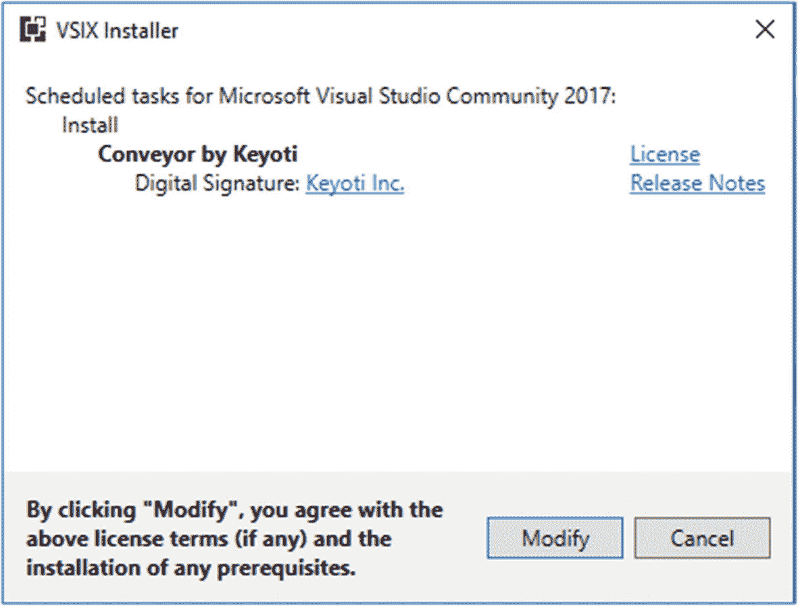

图 6-2

VSIX 安装程序许可条款协议

点击**修改**开始安装。如果出现如下图所示的提示，那么只需点击**结束任务**按钮即可关闭列出的流程。

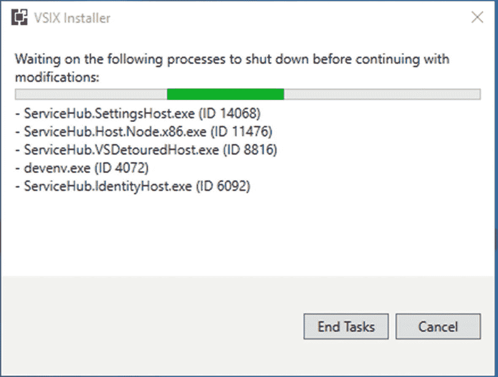

图 6-3

结束现有正在运行的任务

之后，它应该继续安装，如下图所示:

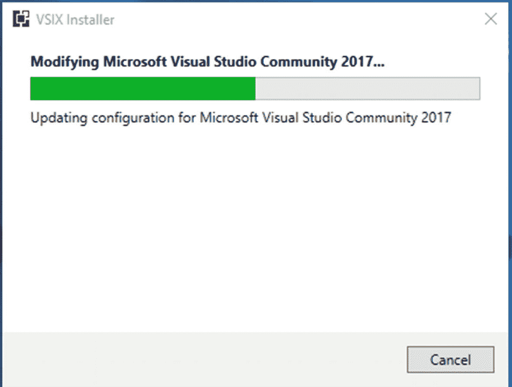

图 6-4

修改 Visual Studio 2017 配置

安装完成后，应显示以下信息:

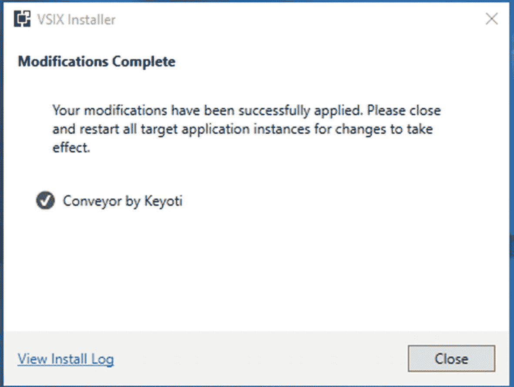

图 6-5

修改完成

点击**关闭**，然后按照以下步骤添加入站防火墙规则，允许访问远程 URL 中给定的 TCP 端口:

*   导航到 Windows **搜索**栏，输入 **WF.msc** 。

*   点击左侧窗格中的**入站规则**。

*   点击右侧窗格中的**新规则**。

*   在新建对话框中选择**端口**，然后点击**下一步**。

*   选择 **TCP** ，从“**具体本地端口**旁边的**远程 URL** 输入端口 **45455** ，然后点击“**下一个**”。

*   **下一个**，下一个**(您可能想要禁用‘Public’)，给它起个名字，比如‘Conveyor:web dev Server Access Enabled’。**

***   点击**完成**。** 

 **现在打开 Visual Studio 2017，设置 **MemoryGame。API** 作为**启动项目**。进行清理和重建，然后运行应用。它将显示**输送机**窗口，其中包含一些信息，包括远程 URL，如下图所示:

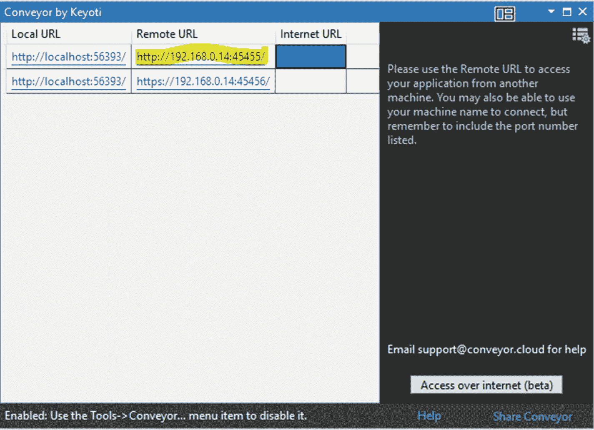

图 6-6

传送带用户界面

使用生成的远程 URL，我们现在可以很容易地从不同的设备模拟器测试移动应用的整个过程。我们现在需要做的就是用远程 URL 值替换 GameAPI 类中的 APIUri 值。

**复制**的**远程 URL** 值并停止 Visual Studio 调试。导航到**记忆游戏。App** 项目，打开 **REST** 文件夹下的 **GameAPI** 类。用您之前复制的远程 URL 的值替换 **APIUri** 变量的值。在本例中， **APIUri** 的值现在将变为:

```cs
privateconststring APIUri = "http://192.168.0.14:45455/api/game/players";

```

## 使用 SharpProxy

另一个可以用来在模拟器中测试和调试移动应用的选项是一个叫做 **SharpProxy** 的工具。下面是来自文档的定义(【https://github.com/jocull/SharpProxy】T2):

SharpProxy 是一个简单的代理服务器，旨在开发本地 ASP.NET 开发服务器。这允许您通过使用其他机器和移动设备来测试、命中断点以及进行一般的开发。只需输入您的本地端口号。NET development server，并将其与一个外部端口进行映射。T3】

基于前面的描述，似乎使用 **SharpProxy** 是测试和调试移动应用最简单的方法，而不需要做大量的配置。让我们通过以下几个步骤来看看它是如何工作的:

*   从 [`https://github.com/jocull/SharpProxy`](https://github.com/jocull/SharpProxy) 下载 **SharpProxy**

*   Unzipp the file, and then run the **SharpProxy** project; it should display the following screen:

    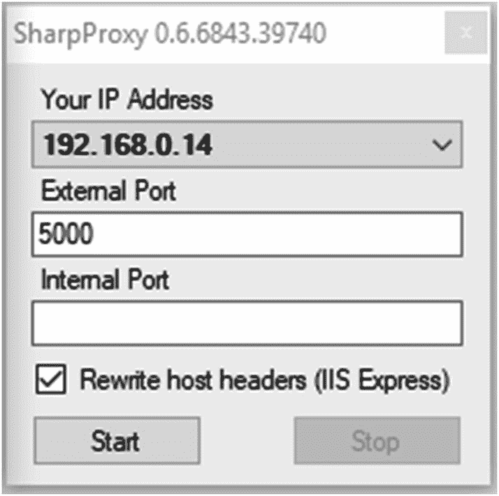

    图 6-7

    SharpProxy UI

*   Navigate to Visual Studio, right-click **MemoryGame.API** on the project, and then select Properties. Click the web item from the left pane and you should see something like this:

    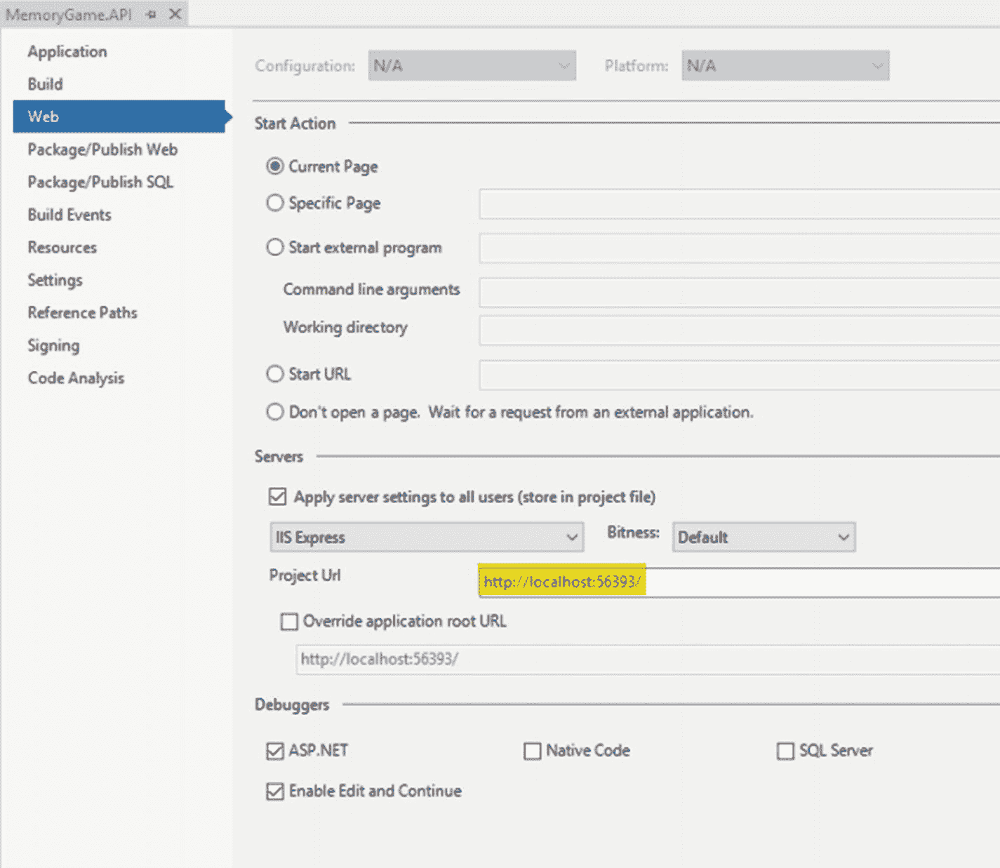

    图 6-8

    MemoryGame。API 属性配置窗口

*   上图中的**项目 Url** 字段表示 API 应该在调试模式下运行的本地 Url。从 URL 中获取 **56393** 值。

*   在 SharpProxy UI 的**内部端口**字段中输入 **56393** 端口号。

*   复制从 SharpProxy 生成的 **IP 地址**和**外部端口**号。对于本例，IP 地址的值应为 **192.168.0.14** ，外部端口的值应为 **5000** 。

*   现在，当您的 Android 或 iOS 应用在模拟器中运行时，您可以简单地引用以下 URL 来访问您的 API: `http://192.168.0.14:5000`

*   导航至**记忆游戏。App** 项目，打开 **REST** 文件夹下的 **GameAPI** 类。用以下内容替换 **APIUri** 变量的值:

    ```cs
    privateconststring APIUri = "http://192.168.0.14:5000/api/game/players"

    ```

你的 Xamarin。Android 和 Xamarin.iOS 应用现在应该可以访问 Web API 端点了。

## 模拟应用的进程

此时，我们还没有准备好在本地测试我们的应用。因为应用是由许多项目和 ASP。MVC 应用也依赖于我们的 Web API 应用，我们需要让 Web API 应用在测试实时排行榜页面时也是可访问的。现在，您可能会问自己如何同时运行它们。通常，我们会在本地 IIS web 服务器中托管或部署这两个项目，以便能够在项目之间进行连接。幸运的是，Visual Studio 2017 的一个很酷的功能是支持多个启动项目。这意味着我们可以在 Visual Studio 中同时运行 Web API 和 MVC 应用以及移动应用，并且能够立即测试它们。你需要做的就是

*   单击应用，然后单击确定

*   右键单击**解决方案**

*   选择**设置启动项目**

*   选择**多个启动项目**单选按钮

*   Select “**Start**” as the action for **MemoryGame.API**, **MemoryGame.Web**, **MemoryGame.App.Android**, and **MemoryGame.App.iOS** projects as shown in the following figure:

    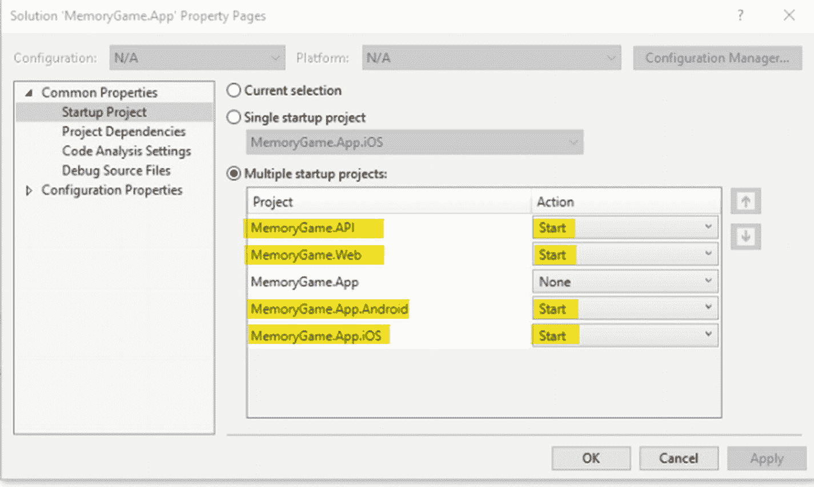

    图 6-9

    设置多个启动项目

现在**构建**并按下 **Ctrl + 5** 来同时运行所有应用。

## 机器人

以下是 Xamarin 不同视图的截图。在 Android 设备模拟器中运行 Android 应用:

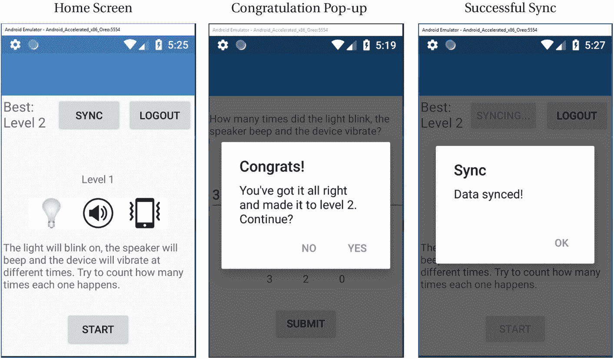

图 6-10

Android 设备模拟器输出

## ios

以下是在 iPhone 设备模拟器中运行的 Xamarin.iOS 应用的不同视图场景的屏幕截图:

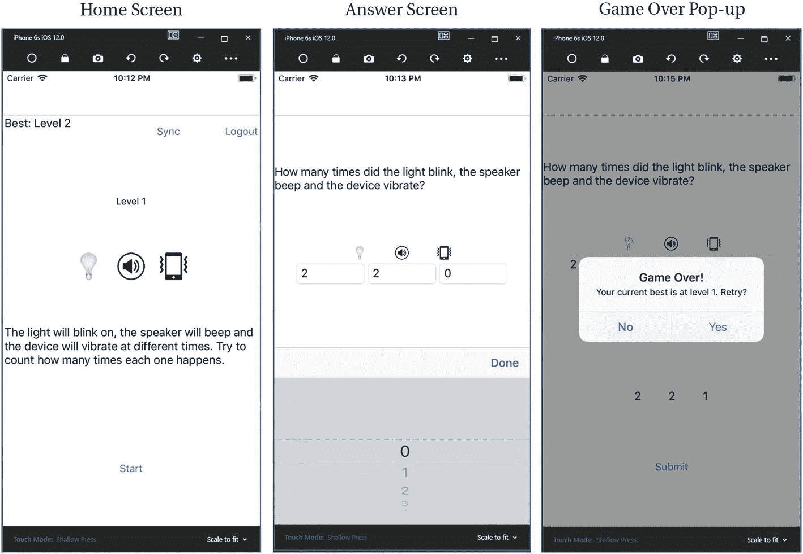

图 6-11

iPhone 设备模拟器输出

## 后续步骤

模拟器是在开发的早期阶段开始部署、测试和调试应用的好地方。然而，用户不会在模拟器中使用最终的应用，因此应该尽早并经常在真实设备上测试应用。有关 Android 和 iOS 设备供应的更多信息，请参阅以下内容:

*   [T2`https://docs.microsoft.com/en-us/xamarin/ios/get-started/installation/device-provisioning/`](https://docs.microsoft.com/en-us/xamarin/ios/get-started/installation/device-provisioning/)

*   [T2`https://docs.microsoft.com/en-us/xamarin/android/get-started/installation/set-up-device-for-development`](https://docs.microsoft.com/en-us/xamarin/android/get-started/installation/set-up-device-for-development)

## 输出

为了向您证明该应用确实可以在真实设备上运行，下面是部署和运行该应用时的实际输出:

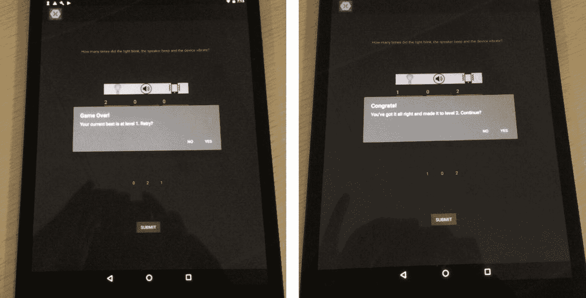

图 6-12

实时输出**