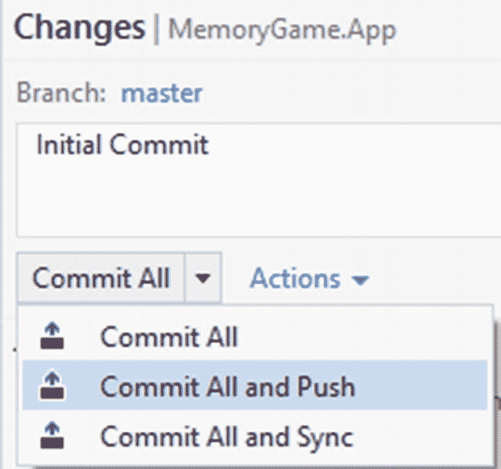

# 七、将您的代码推送到 GitHub

在软件开发中，确保代码安全始终是重中之重。您的开发机器可能会出现意想不到的情况，当然，您不想失去在构建软件应用时付出的所有努力。即使你只是在构建一个简单的原型，独自为一个项目工作，你也不知道什么时候会有更多的人加入到这个项目中来。通常，在开发应用时，有一种常见的方法:

*   你正在用一些新的代码来让它工作

*   您不想破坏现有代码，所以您将当前代码复制到另一个文件夹(文件夹 A)并继续在文件夹 B 中工作

*   如果你犯了一个错误，你只需删除文件夹 B，然后从文件夹 A 恢复

这种方法是版本控制背后的思想。版本控制是一个让您保留代码检查点的过程，以便您可以在需要时引用它们。

Git 是一个广泛使用的版本控制系统，用于管理代码。用 Git 管理的代码被称为 Git 存储库。此外，repos 允许您在不小心添加了不工作的东西时回滚。

本章讲的是如何将软件源代码推送到 GitHub。GitHub 是一个流行的源代码库(Git Repo)托管服务。下面是文档中对 GitHub 的简要定义。

GitHub Inc .是一个基于 web 的托管服务，使用 Git 进行版本控制。它主要用于计算机代码。它提供了 Git 的所有分布式版本控制和源代码管理(SCM)功能，并添加了自己的特性。它为每个项目提供了访问控制和几个协作特性，比如 bug 跟踪、特性请求、任务管理和 wikis。

微软宣布于 2018 年 6 月达成收购 GitHub 的协议，并于同年年底完成收购。

## 在 GitHub 中使用 Visual Studio 推送源代码

在 GitHub 中推送代码首先需要一个 GitHub 帐户。如果没有，那么你可以在这里注册: [`https://github.com/join?source=header`](https://github.com/join?source=header)

### 下载用于 Visual Studio 的 GitHub 扩展

在 Visual Studio 中，选择工具➤扩展和更新。单击左侧窗格中的 Online 选项卡，它应该会显示如下内容:


图 7-1

为 Visual Studio 添加 GitHub 扩展

点击**下载**。您可能需要重新启动 Visual Studio 来继续安装 GitHub 扩展。重新启动后，将出现以下屏幕提示:


图 7-2

VSIX 安装程序许可条款协议

点击**修改**。在开始修改之前，您可能还需要结束一些过程。

#### 发布您的代码

安装完成后，导航到**团队资源管理器**面板，如下图所示:


图 7-3

连接到 GitHub

点击**连接，**，您将看到 GitHub 登录屏幕:


图 7-4

GitHub 登录屏幕

请输入您的 GitHub 帐户凭证以继续。

在**解决方案浏览器**上，右键单击项目**解决方案**，选择**将解决方案添加到源代码控制**，如下图所示:


图 7-5

向源代码管理添加解决方案

这个操作创建一个本地 git 存储库。gitattributes 和。gitignore 文件，如下图所示:


**。gitignore** 忽略未被跟踪的文件——那些没有用 git add 添加的文件；**。gitattributes** 用于被跟踪的文件。也就是说，可以用**处理一个文件。gitattributes** 和另外两个可以忽略(只是一个例子)。

更多关于自定义已更改文件在 GitHub 上的显示方式的信息，请参见 [`https://help.github.com/articles/customizing-how-changed-files-appear-on-github/`](https://help.github.com/articles/customizing-how-changed-files-appear-on-github/)

切换回**团队资源管理器**窗格，您将看到添加了一个本地 Git 存储库，如下图所示:


图 7-6

本地 Git 存储库

双击**记忆游戏。App** repo，应该会出现以下画面:


图 7-7

同步代码

点击**同步**，将出现以下画面:


图 7-8

发布到 GitHub

点击**发布到 GitHub** 。在下一个屏幕上，为您的存储库输入一个**名称**和**描述**，如下图所示:


图 7-9

提交发布

点击**发布**。

成功后，它应该会创建一个空的 GitHub repo 到您的 GitHub 帐户门户，如下图所示:


图 7-10

储存库创建成功

点击**变更**项，您将看到:


图 7-11

输入提交消息

输入首次提交的消息，然后选择 **Commit All 并按下**，如下图所示。



图 7-12

提交全部和推送命令

这个命令在本地存储您的所有更改，并将它们推送到您的 GitHub 远程存储库 URL。下图显示了成功完成提交和推送的时间。


图 7-13

源代码成功推送到 GitHub

要验证您的更改是否真的被推送到您的 GitHub 存储库帐户，您可以导航到上一步生成的 GitHub 存储库 URL。对于本例，它生成以下远程 URL:

*   ```cs
    https://github.com/proudmonkey/Apress-Game-Development-Xamarin.Forms-ASPNET

    ```

下面是发布在 GitHub 上的源代码库的截图:


图 7-14

GitHub 公共源代码库

有关使用 GitHub 的更多信息，请参见 [`https://guides.github.com/activities/hello-world/`](https://guides.github.com/activities/hello-world/)

## GitHub 库和源代码

您可以在这里查看并分叉源代码: [`https://github.com/proudmonkey/Apress-Game-Development-Xamarin.Forms-ASPNET`](https://github.com/proudmonkey/Apress-Game-Development-Xamarin.Forms-ASPNET)

## 参考

请随意阅读以下参考资料，了解本书涵盖的更多主题:

*   [T2`https://en.wikipedia.org/wiki/Working_memory`](https://en.wikipedia.org/wiki/Working_memory)

*   [T2`https://docs.microsoft.com/en-us/aspnet/web-api/overview/security/enabling-cross-origin-requests-in-web-api`](https://docs.microsoft.com/en-us/aspnet/web-api/overview/security/enabling-cross-origin-requests-in-web-api)

*   [T2`https://docs.microsoft.com/en-us/aspnet/signalr/overview/guide-to-the-api/hubs-api-guide-server`](https://docs.microsoft.com/en-us/aspnet/signalr/overview/guide-to-the-api/hubs-api-guide-server)

*   [T2`https://msdn.microsoft.com/en-us/library/aa937723(v=vs.113).aspx`](https://msdn.microsoft.com/en-us/library/aa937723(v=vs.113).aspx)

*   [T2`www.asp.net/signalr`](http://www.asp.net/signalr)

*   [T2`https://docs.microsoft.com/en-us/aspnet/signalr/overview/guide-to-the-api/hubs-api-guide-javascript-client`](https://docs.microsoft.com/en-us/aspnet/signalr/overview/guide-to-the-api/hubs-api-guide-javascript-client)

*   [T2`https://docs.microsoft.com/en-us/visualstudio/install/install-visual-studio?view=vs-2017`](https://docs.microsoft.com/en-us/visualstudio/install/install-visual-studio?view=vs-2017)

*   [T2`https://en.wikipedia.org/wiki/Microsoft_SQL_Server`](https://en.wikipedia.org/wiki/Microsoft_SQL_Server)

*   [T2`https://developer.telerik.com/topics/mobile-development/what-is-xamarin-forms/`](https://developer.telerik.com/topics/mobile-development/what-is-xamarin-forms/)

*   [T2`https://docs.microsoft.com/en-us/ef/ef6/`](https://docs.microsoft.com/en-us/ef/ef6/)

*   [T2`https://msdn.microsoft.com/en-us/library/hh833994(v=vs.108).aspx`](https://msdn.microsoft.com/en-us/library/hh833994(v=vs.108).aspx)

*   [T2`https://msdn.microsoft.com/en-us/library/dd381412(v=vs.108).aspx`](https://msdn.microsoft.com/en-us/library/dd381412(v=vs.108).aspx)

*   [T2`https://blogs.msdn.microsoft.com/dotnet/2016/09/26/introducing-net-standard/`](https://blogs.msdn.microsoft.com/dotnet/2016/09/26/introducing-net-standard/)

*   [T2`https://docs.microsoft.com/en-us/xamarin/cross-platform/app-fundamentals/pcl?tabs=windows`](https://docs.microsoft.com/en-us/xamarin/cross-platform/app-fundamentals/pcl?tabs=windows)

*   [T2`https://docs.microsoft.com/en-us/sql/ssms/download-sql-server-management-studio-ssms?view=sql-server-2017`](https://docs.microsoft.com/en-us/sql/ssms/download-sql-server-management-studio-ssms?view=sql-server-2017)

*   [T2`https://montemagno.com/setting-up-vs-2017-for-xamarin-dev/`](https://montemagno.com/setting-up-vs-2017-for-xamarin-dev/)

*   [T2`https://docs.microsoft.com/en-us/xamarin/ios/get-started/installation/windows/connecting-to-mac/troubleshooting`](https://docs.microsoft.com/en-us/xamarin/ios/get-started/installation/windows/connecting-to-mac/troubleshooting)

*   [T2`https://docs.microsoft.com/en-us/xamarin/ios/get-started/installation/windows/connecting-to-mac/`](https://docs.microsoft.com/en-us/xamarin/ios/get-started/installation/windows/connecting-to-mac/)

*   [T2`https://docs.microsoft.com/en-us/visualstudio/modeling/code-generation-and-t4-text-templates?view=vs-2017`](https://docs.microsoft.com/en-us/visualstudio/modeling/code-generation-and-t4-text-templates?view=vs-2017)

*   [T2`https://docs.microsoft.com/en-us/ef/ef6/fundamentals/working-with-dbcontext`](https://docs.microsoft.com/en-us/ef/ef6/fundamentals/working-with-dbcontext)

*   [T2`https://docs.microsoft.com/en-us/dotnet/csharp/linq/`](https://docs.microsoft.com/en-us/dotnet/csharp/linq/)

*   [T2`https://docs.microsoft.com/en-us/dotnet/csharp/programming-guide/concepts/linq/basic-linq-query-operations`](https://docs.microsoft.com/en-us/dotnet/csharp/programming-guide/concepts/linq/basic-linq-query-operations)

*   [T2`https://docs.microsoft.com/en-us/xamarin/xamarin-forms/xaml/xaml-basics/`](https://docs.microsoft.com/en-us/xamarin/xamarin-forms/xaml/xaml-basics/)

*   [T2`https://docs.microsoft.com/en-us/xamarin/xamarin-forms/app-fundamentals/navigation/`](https://docs.microsoft.com/en-us/xamarin/xamarin-forms/app-fundamentals/navigation/)

*   [T2`https://docs.microsoft.com/en-us/aspnet/signalr/overview/getting-started/introduction-to-signalr`](https://docs.microsoft.com/en-us/aspnet/signalr/overview/getting-started/introduction-to-signalr)

*   [T2`https://docs.microsoft.com/en-us/aspnet/web-api/overview/web-api-routing-and-actions/attribute-routing-in-web-api-2`](https://docs.microsoft.com/en-us/aspnet/web-api/overview/web-api-routing-and-actions/attribute-routing-in-web-api-2)

*   [T2`http://vmsdurano.com/asp-net-core-and-web-api-a-custom-wrapper-for-managing-exceptions-and-consistent-responses/`](http://vmsdurano.com/asp-net-core-and-web-api-a-custom-wrapper-for-managing-exceptions-and-consistent-responses/)

*   [T2`https://docs.microsoft.com/en-us/aspnet/web-api/overview/security/enabling-cross-origin-requests-in-web-api`](https://docs.microsoft.com/en-us/aspnet/web-api/overview/security/enabling-cross-origin-requests-in-web-api)

*   [T2`https://docs.microsoft.com/en-us/dotnet/csharp/programming-guide/statements-expressions-operators/expression-bodied-members`](https://docs.microsoft.com/en-us/dotnet/csharp/programming-guide/statements-expressions-operators/expression-bodied-members)

*   [T2`https://docs.microsoft.com/en-us/aspnet/web-api/overview/advanced/calling-a-web-api-from-a-net-client`](https://docs.microsoft.com/en-us/aspnet/web-api/overview/advanced/calling-a-web-api-from-a-net-client)

*   [T2`https://docs.microsoft.com/en-us/dotnet/csharp/programming-guide/concepts/async/`](https://docs.microsoft.com/en-us/dotnet/csharp/programming-guide/concepts/async/)

*   [T2`www.infragistics.com/community/blogs/b/brijmishra/posts/building-real-time-application-with-signalr-part-1`](http://www.infragistics.com/community/blogs/b/brijmishra/posts/building-real-time-application-with-signalr-part-1)

*   [T2`www.red-gate.com/simple-talk/dotnet/asp-net/an-introduction-to-real-time-communication-with-signalr/`](https://www.red-gate.com/simple-talk/dotnet/asp-net/an-introduction-to-real-time-communication-with-signalr/)

*   [T2`https://help.github.com/articles/customizing-how-changed-files-appear-on-github/`](https://help.github.com/articles/customizing-how-changed-files-appear-on-github/)